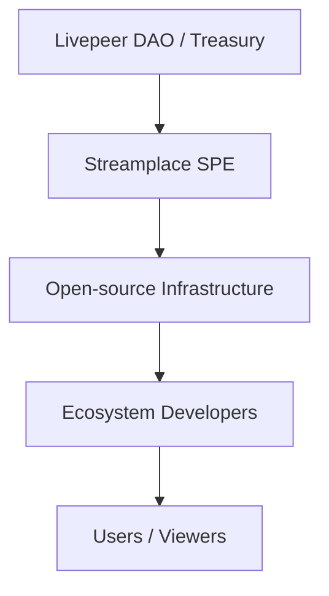

{/* codex-i18n: eyJraW5kIjoiY29kZXgtaTE4biIsInZlcnNpb24iOjEsInNvdXJjZVBhdGgiOiJ2Mi9zb2x1dGlvbnMvc3RyZWFtcGxhY2UvaW50cm9kdWN0aW9uL3N0cmVhbXBsYWNlLWZ1bmRpbmctbW9kZWwubWR4Iiwic291cmNlUm91dGUiOiJ2Mi9zb2x1dGlvbnMvc3RyZWFtcGxhY2UvaW50cm9kdWN0aW9uL3N0cmVhbXBsYWNlLWZ1bmRpbmctbW9kZWwiLCJzb3VyY2VIYXNoIjoiMWNhYWE3MTkyY2MzMTkwNzllMTMzN2IwNDliYjYyYTkzN2IxODEwMzU4MzY3YzVhY2RkZmUyMGNiODc5YmQ5ZSIsImxhbmd1YWdlIjoiZnIiLCJwcm92aWRlciI6Im9wZW5yb3V0ZXIiLCJtb2RlbCI6InF3ZW4vcXdlbi10dXJibyIsImdlbmVyYXRlZEF0IjoiMjAyNi0wMi0yN1QxODoxMToxNi42MjRaIn0= */}
---

Streamplace opère en tant qu'**Entité à Objectif Spécifique (EOS)** au sein de l'écosystème Livepeer. Les EOS sont des équipes financées publiquement chargées de construire des infrastructures**critiques, open source et de biens publics** qui renforcent et élargissent le réseau Livepeer.

Cette page explique :

- Qu'est-ce qu'un SPE ?
- Comment les fonds circulent depuis le Trésor Livepeer
- Comment Streamplace utilise ces fonds
- Pourquoi le modèle SPE existe

---

# 🏛️ Qu'est-ce qu'un SPE ?

Un **Entité à Objectif Spécifique**est une équipe d'ingénierie ou opérationnelle axée sur une mission, financée par l'écosystème Livepeer pour livrer :

- Infrastructure à long terme
- Logiciels open source
- Capacités au niveau du réseau
- Biens publics qui bénéficient aux créateurs, développeurs et opérateurs de nœuds

Streamplace est un SPE spécifiquement axé sur**l'infrastructure vidéo décentralisée, les systèmes de provenance et les SDK pour les applications sociales/Web3**.

---

# 💸 Diagramme du flux de financement

---

# 📦 Ce que Streamplace livre en tant que SPE

Le financement du trésor permet à Streamplace de maintenir et d'améliorer :

### **1. Nœud Streamplace**

- ingestion (WHIP/WHEP/RTMP)
- segmentation
- incrustation de provenance (C2PA + Ethereum)
- dispatch de transcoding

### **2. SDK & APIs**

Outils conviviaux pour les développeurs :

- diffusion en direct
- configuration des métadonnées
- intégrations de lecture
- intégration d'applications sociales

### **3. Normes des métadonnées et de la provenance**

Un schéma complet pour :

- droits
- avertissements sur le contenu
- politique de distribution
- métadonnées de diffusion et d'épisodes

### **4. Infrastructure des biens publics**

Tout ce que Streamplace construit est :

- **open-source**
- **transparent**
- **propriété de l'écosystème**
- **sans permission** pour adopter

---

# 🔥 Pourquoi le modèle SPE existe

Les SPE assurent que Livepeer peut financer de manière durable des projets complexes et à long terme sans s'appuyer sur :

- le capital de risque
- les opérateurs centralisés
- les modèles d'entreprise à code source fermé

Le modèle SPE crée :

- capacité stable pour un travail critique sur le réseau
- comptabilité transparente
- résilience de l'écosystème
- décentralisation saine

---

# 📚 Pages connexes

- [Aperçu de Streamplace](/solutions/streamplace/overview)
- [Architecture](/solutions/streamplace/introduction/streamplace-architecture)
- [Provenance & Metadata](/solutions/streamplace/introduction/streamplace-provenance)
- [Guide d'intégration pour les développeurs](/solutions/streamplace/introduction/streamplace-integration)
