import { GotoCard } from '/snippets/components/primitives/links.jsx'

## Definition

Gateways serve as the primary demand aggregation layer in the Livepeer network.
They accept video transcoding and AI inference requests from end customers, then distribute these jobs across the network of GPU-equipped Orchestrators.
In earlier Livepeer documentation, this role was referred to as a broadcaster.

**_Mental Model_**
<AccordionGroup>
  <Accordion title="From a Cloud Background?" icon="cloud" >

Running a Gateway is similar to operating an API Gateway or Load Balancer in cloud computing -
it ingests traffic, routes workloads to backend GPU nodes, and manages session flow
without doing the heavy compute itself.

```mermaid
%%{init: {'theme': 'base', 'themeVariables': { 'primaryColor': '#1a1a1a', 'primaryTextColor': '#fff', 'primaryBorderColor': '#2d9a67', 'lineColor': '#2d9a67', 'secondaryColor': '#0d0d0d', 'tertiaryColor': '#1a1a1a', 'background': '#0d0d0d', 'fontFamily': 'system-ui' }}}%%
flowchart LR
    subgraph Clients["Client / Application Layer"]
        A["Apps & SDKs<br/>• Video Ingest<br/>• AI Inference Requests<br/>• WebRTC / HTTP"]
    end

    subgraph Gateway["Gateway Layer (Livepeer Gateway)"]
        B["Gateway Node<br/><br/>Cloud Analogy:<br/>• API Gateway<br/>• L7 Load Balancer<br/>• Control Plane<br/><br/>Responsibilities:<br/>• Auth & Rate Limits<br/>• Stream Segmentation<br/>• Job Routing<br/>• Health Checks<br/>• Retry & Failover"]
    end

    subgraph Compute["Compute Layer (Supply Side)"]
        C["Orchestrators<br/>GPU Workers<br/><br/>Cloud Analogy:<br/>• Auto-scaling GPU Fleet<br/>• Managed Inference Pool"]
    end

    subgraph Settlement["Coordination & Settlement"]
        D["Ethereum + Livepeer Protocol<br/><br/>• Payments<br/>• Accounting<br/>• Slashing / Security"]
    end

    A -->|Requests| B
    B -->|Dispatch Jobs| C
    C -->|Results / Streams| B
    B -->|Responses| A
    C -->|Usage & Proof| D

    classDef default fill:#1a1a1a,color:#fff,stroke:#2d9a67,stroke-width:2px
    style Clients fill:#0d0d0d,stroke:#2d9a67,stroke-width:1px
    style Gateway fill:#0d0d0d,stroke:#2d9a67,stroke-width:1px
    style Compute fill:#0d0d0d,stroke:#2d9a67,stroke-width:1px
    style Settlement fill:#0d0d0d,stroke:#2d9a67,stroke-width:1px
```

  <ScrollableDiagram title="Gateway as Cloud Infrastructure">

  </ScrollableDiagram>
  </Accordion>
  <Accordion title="From an Ethereum Background?" icon="coin" >

Running a Gateway is **not** like running a validator on Ethereum.
Validators secure consensus whereas Gateways route workloads. It's more akin to a Sequencer on a Layer 2.
Just as a Sequencer ingests user transactions, orders them, and routes them into the rollup execution layer,
a Livepeer Gateway performs the same function for the Livepeer compute network.

```mermaid
%%{init: {'theme': 'base', 'themeVariables': { 'primaryColor': '#1a1a1a', 'primaryTextColor': '#fff', 'primaryBorderColor': '#2d9a67', 'lineColor': '#2d9a67', 'secondaryColor': '#0d0d0d', 'tertiaryColor': '#1a1a1a', 'background': '#0d0d0d', 'fontFamily': 'system-ui' }}}%%
flowchart LR
    subgraph User["User Layer"]
        A["Client<br/>Video/AI Request"]
    end

    subgraph Gateway["Gateway Layer"]
        B["Livepeer Gateway<br/>= L2 Sequencer<br/><br/>• Ingests Requests<br/>• Segments/Preprocesses<br/>• Selects Orchestrators<br/>• Routes Jobs<br/>• Returns Results"]
    end

    subgraph Compute["Compute Layer"]
        C["Orchestrators<br/>GPU Workers<br/><br/>= L2 Execution Layer"]
    end

    subgraph Settlement["Settlement Layer"]
        D["Ethereum<br/>Consensus & Payment Security"]
    end

    A --> B
    B --> C
    C --> B
    B --> A
    C --> D

    classDef default fill:#1a1a1a,color:#fff,stroke:#2d9a67,stroke-width:2px
    style User fill:#0d0d0d,stroke:#2d9a67,stroke-width:1px
    style Gateway fill:#0d0d0d,stroke:#2d9a67,stroke-width:1px
    style Compute fill:#0d0d0d,stroke:#2d9a67,stroke-width:1px
    style Settlement fill:#0d0d0d,stroke:#2d9a67,stroke-width:1px
```

  <ScrollableDiagram title="Gateways as L2 Sequencers">

  </ScrollableDiagram>
  </Accordion>
  <Accordion title="Neither? You can still run a gateway!" icon="film" >

 For the rest of us, running a Gateway is like being a film producer.
 You take a request, assemble the right specialists, manage constraints,
 and ensure the final result is delivered reliably-without doing every task yourself.

```mermaid
%%{init: {'theme': 'base', 'themeVariables': { 'primaryColor': '#1a1a1a', 'primaryTextColor': '#fff', 'primaryBorderColor': '#2d9a67', 'lineColor': '#2d9a67', 'secondaryColor': '#0d0d0d', 'tertiaryColor': '#1a1a1a', 'background': '#0d0d0d', 'fontFamily': 'system-ui' }}}%%
flowchart LR
    subgraph Persona["Persona: Gateway Operator = Film Producer"]
        P["Film Producer Mindset<br/>• Owns delivery<br/>• Sets constraints<br/>• Chooses specialists<br/>• Ensures quality"]
    end

    subgraph Request["Act I - The Pitch"]
        A["Incoming Request<br/>• Live Video Stream<br/>• AI Inference Job<br/>• Quality & Latency Requirements"]
    end

    subgraph Planning["Act II - Pre-Production"]
        B["Gateway (Producer)<br/><br/>• Interpret the request<br/>• Set budget & latency constraints<br/>• Choose specialists<br/>• Plan execution"]
    end

    subgraph Crew["Act III - Production Crew"]
        C["Orchestrators / GPU Workers<br/><br/>• Transcoding<br/>• AI Inference<br/>• Real-time Processing"]
    end

    subgraph Delivery["Act IV - Final Cut & Release"]
        D["Verified Output<br/>• Stream / AI Result<br/>• Quality checked<br/>• Delivered on time"]
    end

    subgraph Settlement["Credits & Accounting"]
        E["Onchain Settlement<br/>• Usage recorded<br/>• Payments distributed<br/>• Trust enforced"]
    end

    P --> A
    A --> B
    B --> C
    C --> B
    B --> D
    C --> E

    classDef default fill:#1a1a1a,color:#fff,stroke:#2d9a67,stroke-width:2px
    style Persona fill:#0d0d0d,stroke:#2d9a67,stroke-width:1px
    style Request fill:#0d0d0d,stroke:#2d9a67,stroke-width:1px
    style Planning fill:#0d0d0d,stroke:#2d9a67,stroke-width:1px
    style Crew fill:#0d0d0d,stroke:#2d9a67,stroke-width:1px
    style Delivery fill:#0d0d0d,stroke:#2d9a67,stroke-width:1px
    style Settlement fill:#0d0d0d,stroke:#2d9a67,stroke-width:1px
```

  <ScrollableDiagram title="Gateway as Film Producer">

  </ScrollableDiagram>
  </Accordion>
</AccordionGroup>

## What is a Gateway?

Gateways are the entry point for applications into the Livepeer compute network.
They are the coordination layer that connects real-time AI
and video workloads to the orchestrators who perform the GPU compute.

They operate as the essential technical layer between the protocol and
the distributed compute network.

A gateway is a self-operated Livepeer node that interacts directly with orchestrators, submits jobs, handles payment, and exposes direct protocol interfaces.
Hosted services like [Daydream](/v2/solutions/daydream/overview) operate as both application layers and Gateways.

A Gateway is responsible for

- validating requests
- selecting Workers
- translating requests into Worker OpenAPI calls
- aggregating results

If you are coming from an Ethereum background, Gateways could loosely be thought of as sequencers in L2 rollups.
If you are coming from a traditional cloud background, Gateways are akin to API gateways or load balancers.

Anyone that wants to build applications and services (like [Daydream](/v2/solutions/daydream/overview) and [Stream.place](/v2/solutions/streamplace/overview)) on top of the Livepeer
protocol will build their own Gateway to connect with Orchestrators and route jobs.
This enables them to offer their services to Livepeer Developers, Builders & end-users and provide
communication of their application with the Livepeer GPU network (DePIN / Orchestrators)

## What Gateways Do

Gateways handle all service-level logic required to operate a scalable, low-latency AI video network:

- **Job Intake**
 They receive workloads from applications using Livepeer APIs, PyTrickle, or BYOC integrations.

- **Capability & Model Matching**
 Gateways determine which orchestrators support the required GPU, model, or pipeline.

- **Routing & Scheduling**
 They dispatch jobs to the optimal orchestrator based on performance, availability, and pricing.

- **Marketplace Exposure**
 Gateway operators can publish the services they offer, including supported models, pipelines, and pricing structures.

Gateways do _not_ perform GPU compute. Instead, they focus on coordination and service routing.

<GotoCard
  label="Gateway Functions & Services"
  text="Learn More About Gateway Functions & Services"
  relativePath="../../gateways/about/functions.mdx"
/>

## Why Gateways Matter

As Livepeer transitions into a high-demand, real-time AI network, Gateways become essential infrastructure.

They enable:

- Low-latency workflows for Daydream, ComfyStream, and other real-time AI video tools
- Dynamic GPU routing for inference-heavy workloads
- A decentralised marketplace of compute capabilities
- Flexible integration via the BYOC pipeline model

Gateways simplify the developer experience while preserving the decentralisation, performance, and competitiveness of the Livepeer network.

## Summary

Gateways are the coordination and routing layer of the Livepeer ecosystem. They expose capabilities, price services, accept workloads,
and dispatch them to orchestrators for GPU execution. This design enables a scalable, low-latency, AI-ready decentralized compute marketplace.

This architecture enables Livepeer to scale into a global provider of real-time AI video infrastructure.

# Resources
<Accordion title="Ecosystem Content: Run a Gateway" icon="github">
  <Card href="https://github.com/videoDAC/livepeer-gateway">
    <iframe
      src="https://cdn.jsdelivr.net/gh/videoDAC/livepeer-gateway@master/README.md"
      width="100%"
      height="500px"
      frameborder="0" title="Embedded content from cdn.jsdelivr.net">
 
Your browser does not support iframes.

    </iframe>
  </Card>
</Accordion>

{/* <Accordion title="Gateway Marketplace Features" icon="comment-nodes">
  ## Key Marketplace Features

  ### 1. Capability Discovery

 Gateways and orchestrators list:

  - AI model support
  - Versioning and model weights
  - Pipeline compatibility
  - GPU type and compute class

 Applications can programmatically choose the best provider.

  ### 2. Dynamic Pricing

 Pricing can vary by:

  - GPU class
  - Model complexity
  - Latency SLA
  - Throughput requirements
  - Region

 Gateways expose pricing APIs for transparent selection.

  ### 3. Performance Competition

 Orchestrators compete on:

  - Speed
  - Reliability
  - GPU quality
  - Cost efficiency

 Gateways compete on:

  - Routing quality
  - Supported features
  - Latency
  - Developer ecosystem fit

 This creates a healthy decentralized market.

  ### 4. BYOC Integration

 Any container-based pipeline can be brought into the marketplace:

  - Run custom AI models
  - Run ML workflows
  - Execute arbitrary compute
  - Support enterprise workloads

 Gateways advertise BYOC offerings; orchestrators execute containers.

  <GotoCard
    label="Protocol Overview"
    text="Understand the Full Livepeer Network Design"
    relativePath="../../about/livepeer-protocol/livepeer-protocol/protocol-overview.mdx"
  />

  ## Marketplace Benefits

  - **Developer choice** - choose the best model, price, and performance
  - **Economic incentives** - better nodes earn more work
  - **Scalability** - network supply grows independently of demand
  - **Innovation unlock** - new models and pipelines can be added instantly
  - **Decentralization** - no single operator controls the workload flow

  ## Summary

 The Marketplace turns Livepeer into a competitive, discoverable, real-time AI compute layer.

  - Gateways expose services
  - Orchestrators execute them
  - Applications choose the best fit
  - Developers build on top of it
  - Users benefit from low-latency, high-performance AI
</Accordion> */}
