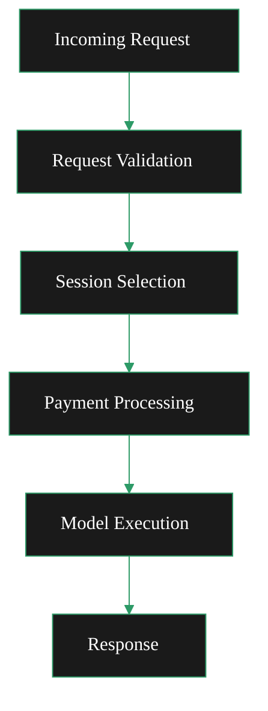

import { DoubleIconLink } from '/snippets/components/primitives/links.jsx'
import { ScrollableDiagram } from '/snippets/components/content/zoomableDiagram.jsx'

<Danger> Currently operating as a brainstorming page </Danger>

## Request Routing

**Request Processing Flow (both)**

- **Request Validation**: OpenAPI validation middleware validates request structure
- **Session Selection**: AISessionManager selects appropriate orchestrator based on model capability
- **Payment Processing**: Calculates payment based on pixel count for non-live endpoints
- **Model Execution**: Sends request to AI worker with specified model

<ScrollableDiagram title="Request Processing Flow">

</ScrollableDiagram>

#### Transcoding Requests

Traditional video transcoding requests are handled through:

- **RTMP ingest**: Port `1935` by default
- **HTTP push**: `/live/{streamKey}` endpoint when `-httpIngest` is enabled
- **HLS output**: Adaptive bitrate streams for playback

#### AI Requests

AI processing requests are routed through dedicated endpoints <DoubleIconLink label="ai_mediaserver.go" href="https://github.com/livepeer/go-livepeer/blob/5691cb48/server/ai_mediaserver.go" iconLeft="github" />

<Danger> (fixme) OpenAPI Spec is here: ai/worker/api/openapi.json </Danger>

    <ResponseField name="/text-to-image" type="json">
 Generate images from text prompts.
 Uses `jsonDecoder` for parsing
    </ResponseField>
    <ResponseField name="/image-to-image" type="multipart/form-data">
 Transform images with prompts.
 Uses `multipartDecoder` for file uploads
    </ResponseField>
    <ResponseField name="/image-to-video" type="multipart/form-data">
 Create videos from images.
 Uses `multipartDecoder` for file uploads
    </ResponseField>
    <ResponseField name="/upscale" type="multipart/form-data">
 Upscale (enhance) images to higher resolution.
 Uses `multipartDecoder` for file uploads
    </ResponseField>
    <ResponseField name="/live/video-to-video/{stream}/start" type="multipart/form-data">
 Apply transformations to a live video streamed to the returned endpoints.
 Live video endpoint has specialized handling for real-time streaming with MediaMTX integration
    </ResponseField>

## Payment Models

The dual setup handles two different payment models:

#### Transcoding Payments

Basis: Per video segment processed
Method: Payment tickets sent with each segment
Verification: Multi-orchestrator verification for quality assurance

#### AI Payments

Basis: Per pixel processed (width × height × outputs)
Method: Pixel-based payment calculation
Live Video: Interval-based payments during streaming

## Operational Considerations

#### Resource Allocation

When running dual setup, consider:

- GPU resources: Shared between transcoding and AI workloads
- Memory: AI models require significant RAM when loaded ("warm")
- Network: Bandwidth for both stream ingest and AI request/response

#### Monitoring

Monitor both workload types:

- Transcoding: Segment processing latency, success rates
- AI: Model loading times, inference latency, pixel processing rates

#### Scaling Strategies

- Horizontal: Deploy multiple gateway instances behind a load balancer
- Vertical: Allocate more GPU resources for AI model parallelism
- Specialized: Separate nodes for transcoding vs AI based on workload patterns
