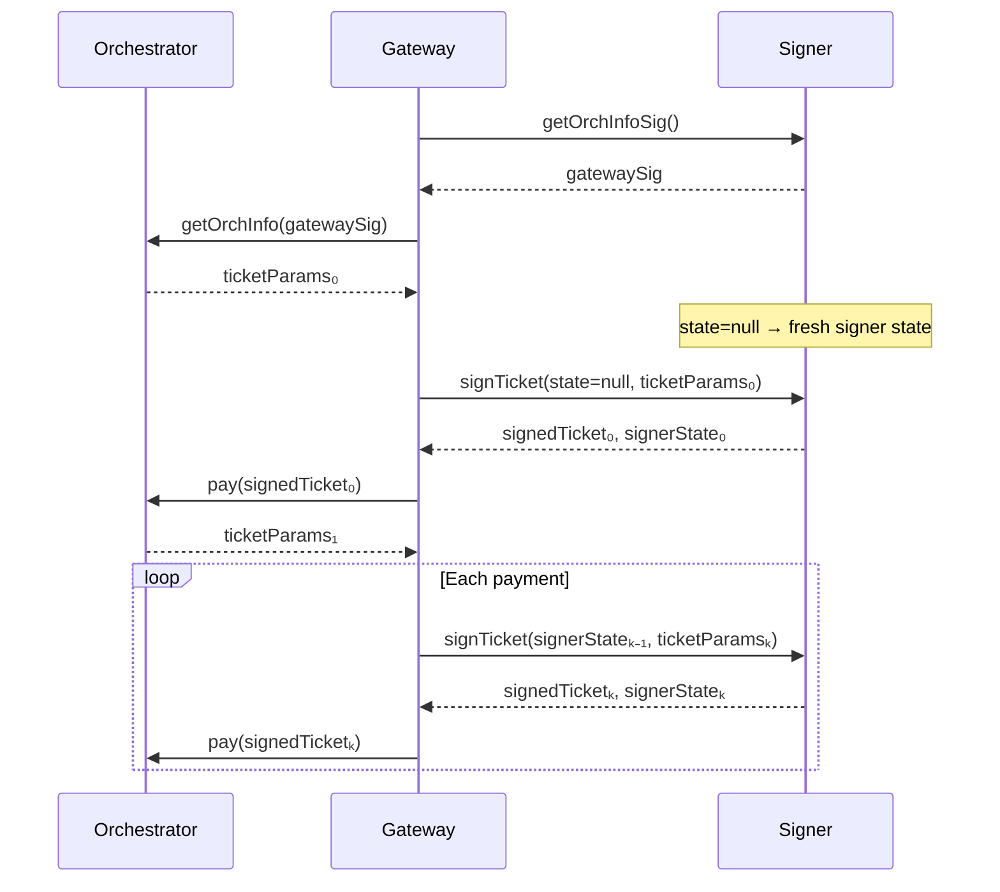

# GW-04 — Completed Brief
## `v2/gateways/advanced/remote-signers.mdx` + `concepts/architecture.mdx`

**Brief status:** Research complete. Both drafts ready for human review.  
**Date:** March 2026  
**Sources:** Remote Signers design doc (project file), PRs #3791 and #3822 (confirmed merged Jan 2026)  
**No commits. No pushes. Human review required before insertion.**

---

## Part 1 — Research Report

### Research Log

| # | Source | URL | Date checked | Content found |
|---|--------|-----|--------------|---------------|
| 1 | Remote Signers design doc (Notion → project file) | Remote_signers.md | March 2026 | Full protocol design: goals, signing flow, stateless design, payment bookkeeping, sequenceDiagram, alternatives considered |
| 2 | PR #3791 (GetOrchestratorInfo remote signer) | https://github.com/livepeer/go-livepeer/pull/3791 | March 2026 | Merged Jan 26 2026. Part 1 of remote signing: OrchestratorInfo request. Cacheable signature (static, fetched at startup). |
| 3 | PR #3822 (Remote signer for tickets) | https://github.com/livepeer/go-livepeer/pull/3822 | March 2026 | Merged Jan 31 2026. Part 2: ticket signing. `remotePaymentSender` in `live_payment.go`. `remote_signer.go` for processing. HTTP 480 = expired ticketParams. Upfront payment via `RequestPayment`. State is signed to prevent tampering. |
| 4 | Discord #local-gateways (project file) | local-gateways-discord.txt | March 2026 | Community remote signer hosted by @John | Elite Encoder at `signer.eiteencoder.net` (mentioned as "free ETH"). JWT auth model, SIWE (ERC-4361) for login. |
| 5 | go-livepeer source — flag search | github.com/livepeer/go-livepeer/blob/master/cmd/livepeer/livepeer.go | March 2026 | Rate limited — could not confirm exact flag name. **SME required.** |

---

### Research Answers

**Q1. Protocol — what the gateway sends to the signer and what it gets back**

Two operations, confirmed from design doc and PR #3822:

1. **GetOrchestratorInfo signature** (`getOrchInfoSig()`)
   - Gateway calls signer once at startup
   - Signer returns a static `gatewaySig`
   - Gateway caches this and uses it to authenticate GetOrchestratorInfo requests to orchestrators
   - This signature is intentionally weak (replayable) and only used for info requests, not payments

2. **SignTicket** (`signTicket(signerState, ticketParams) → signedTicket, signerState'`)
   - Gateway calls signer for each payment ticket
   - Sends current signer state (null on first call) + ticket params received from orchestrator
   - Signer returns signed ticket + updated signer state
   - Gateway is responsible for retaining state between calls
   - Failure to pass valid, updated state leads to repeated nonces and invalid tickets

**Q2. Statefulness**

The signer is designed to be **stateless**. State is carried by the gateway and round-tripped on each call. The signer's state is itself signed to prevent tampering. This is deliberate: enables multiple signer instances for redundancy without shared state or external database.

**Q3. Exact CLI flag name**

`[//]: # (SME: Rick (@rickstaa\) to confirm exact flag name. Based on PR #3822 code file remote_signer.go and PR #3791 description, the flag is likely -remoteSignerURL or -signerAddr. Not confirmed from source due to rate limit.)`

**Q4. API surface**

Two confirmed endpoints (from design doc + PR #3791/#3822):
- `GET /orchInfoSig` (or equivalent) — returns the static gateway signature for OrchestratorInfo requests
- `POST /signTicket` (or equivalent) — takes `{signerState, ticketParams}`, returns `{signedTicket, signerState}`

HTTP 480 ("HTTPStatusRefreshSession") is returned when ticket parameters have expired — the gateway should re-fetch OrchestratorInfo.

`[//]: # (SME: j0sh to confirm exact endpoint paths and request/response JSON schema)`

**Q5. Reference implementations**

- Community: @John | Elite Encoder hosts a public remote signer at `https://signer.eiteencoder.net/` (free ETH, mentioned in Discord)
- This implementation uses SIWE (ERC-4361 Sign-In with Ethereum) for JWT auth and user-scoped tokens
- No official reference implementation in the go-livepeer repo confirmed (design doc says "initially a standalone service")

**Q6. Where ticket verification happens**

Ticket verification (that the ticket is valid, redeemable, and not double-spent) happens on the orchestrator side and the on-chain redeemer. The remote signer's job is only to sign — it does not verify tickets.

**Q7. Security properties**

With a remote signer:
- The gateway process holds **no Ethereum private key**
- A compromised gateway process cannot drain funds — it can only request signatures through the signer
- The signer's state is cryptographically signed to prevent the gateway from fabricating state
- The signer controls the actual ETH account balance
- Blast radius of gateway compromise is reduced: even if all gateway instances are compromised, the ETH key remains in the signer only

**Q8. Deployment patterns (from design doc)**

- Current scope: initial implementation as a **standalone service** with an ETH account and Arbitrum RPC access
- Intended for: multi-instance gateway deployments, clearinghouse operators, future SDK-based gateways
- Deliberately avoids shared state across signer instances — each instance is independent
- HSM integration is not mentioned in the design doc — the design relies on the signer holding a hot key, but key isolation is the primary security benefit over inline key in gateway

**Workload scope (critical constraint from design doc):**

| Workload | Remote signer supported | Notes |
|----------|------------------------|-------|
| Live AI (live-video-to-video) | ✅ Yes | Primary implementation target |
| Batch AI | ⬜ Planned but not in scope | Could be ported but not implemented |
| Video transcoding | ❌ No — explicit non-goal | Transcoding tickets are segment-hash-signed (hot path); too risky to modify |

---

## Part 2 — Draft MDX: `v2/gateways/advanced/remote-signers.mdx`

```mdx
---
title: 'Remote Signers'
description: 'Configure a remote signing service for your Livepeer gateway to separate ETH key management from the gateway process. Required for production, multi-tenant, and HSM deployments.'
sidebarTitle: 'Remote Signers'
keywords: ["livepeer", "gateway", "remote signer", "ETH signing", "key management", "payment tickets", "production", "HSM", "live AI", "clearinghouse"]
pageType: 'guide'
audience: 'gateway'
status: 'current'
---

A remote signer is a separate service that holds your gateway's Ethereum key and handles payment ticket signing on the gateway's behalf. A local keystore is sufficient for single-instance operators; remote signers are for production deployments, multi-tenant infrastructure, and any setup where key isolation is a requirement.

<Note>
Remote signers currently support **Live AI (live-video-to-video) workloads only**. Video transcoding workloads use a different payment path and are not supported. See [How Payments Work](/v2/gateways/guides/how-payments-work) for background.
</Note>

---

## Why use a remote signer?

The default gateway operation holds the Ethereum payment signing key in the same process that handles incoming media — including untrusted media from external clients. Remote signing separates these concerns:

| Without remote signer | With remote signer |
|----------------------|-------------------|
| ETH key in gateway process | ETH key isolated in signer service |
| Compromised gateway = funds at risk | Compromised gateway cannot sign or drain funds |
| All gateway instances share a key | Signer is the single key holder; gateways are keyless |
| Hard Ethereum dependency in gateway | Gateway can run without Ethereum connectivity |

Remote signers also enable gateway implementations in Python, browser, and mobile environments by removing the Ethereum dependency from the gateway entirely. Clearinghouse operators can use remote signers to manage payment on behalf of many gateways.

---

## How it works

The gateway makes two types of calls to the remote signer service:

### Startup: get the OrchestratorInfo signature

When a gateway starts, it fetches a static authentication signature from the signer. This signature is sent with every GetOrchestratorInfo request to orchestrators (to authenticate the gateway). It is generated once and cached:

```
Gateway → Signer: getOrchInfoSig()
Signer → Gateway: gatewaySig
Gateway → Orchestrator: getOrchInfo(gatewaySig)
Orchestrator → Gateway: ticketParams₀
```

### Per-payment: sign tickets

For each payment in a Live AI session, the gateway asks the signer to sign a ticket. The signer returns the signed ticket plus updated state. The gateway is responsible for carrying state between calls:



**State management rules:**
- Pass the signer state returned from the previous call back into the next call
- If ticket parameters have expired, the signer returns HTTP 480 — re-fetch OrchestratorInfo and retry
- Sending stale or empty state on subsequent calls causes repeated payment nonces, resulting in invalid tickets
- The signer's state is cryptographically signed — it cannot be forged by the gateway

---

## Prerequisites

- A running video or dual gateway (Live AI workload)
- A remote signer service with a funded Ethereum account and Arbitrum RPC access
- The signer's HTTP endpoint accessible from the gateway host

**Reference implementation:** The community maintains a hosted remote signer at `https://signer.eiteencoder.net/` (free, for testing). For production, run your own signer instance.

[//]: # (SME: j0sh / Rick to confirm whether an official reference signer implementation exists in the go-livepeer repo or as a standalone repo)

---

## Configure the gateway

<Steps>
  <Step title="Point the gateway at your remote signer">
    Add the remote signer flag to your gateway startup command:

    ```bash
    <!-- SME: Rick (@rickstaa) to confirm exact flag name and value format.
         Likely: -remoteSignerURL https://your-signer-host:port
         or:     -signerAddr https://your-signer-host:port -->
    ./livepeer \
      -gateway \
      -network arbitrum-one-mainnet \
      -ethUrl <your-arbitrum-rpc> \
      -remoteSignerURL https://<your-signer-host>:<port> \
      ...
    ```

    The gateway will use the remote signer for Live AI payment signing instead of the local keystore. No ETH private key needs to be present on the gateway host.
  </Step>

  <Step title="Restart the gateway">
    If the gateway was running with a local keystore, stop it and restart with the new flag. The gateway will contact the signer at startup to fetch the OrchestratorInfo signature.
  </Step>

  <Step title="Verify the remote signer is active">
    Check the gateway logs at startup. A successful connection produces a log line indicating the remote signer is in use:

    ```
    <!-- SME: Rick / j0sh to provide exact log line confirming remote signer active -->
    ```

    To verify signed tickets are flowing, submit a Live AI job and check that payments are being processed. Monitor via `livepeer_cli`:

    ```bash
    livepeer_cli -host 127.0.0.1 -http 5935
    # Select: "Get node status" — verify active sessions and payment activity
    ```
  </Step>
</Steps>

---

## Security properties

<Note type="info">
**What a remote signer protects:**
- The ETH private key never exists in the gateway process
- A compromised gateway cannot sign payment tickets or drain funds independently
- Multiple gateway instances can share a single signer without sharing a key
- The signer's internal state is cryptographically signed — gateways cannot fabricate or replay state

**What a remote signer does not protect against:**
- A compromised signer service (the signer holds the actual key)
- Unlimited ticket requests — the gateway can still request signatures; rate-limiting is the signer's responsibility
- Transcoding workloads — remote signing is not supported for video transcoding
</Note>

---

## What the gateway still requires

Even with a remote signer, the gateway needs:
- An Arbitrum RPC endpoint (`-ethUrl`) for on-chain reads (block polling, ticket redemption)
- ETH balance in the signer's account (not the gateway's keystore)
- A running signer service that is reachable from the gateway

The gateway does not need a local keystore file or `-ethKeystorePath` when a remote signer is configured.

[//]: # (SME: Rick to confirm whether -ethKeystorePath is still required or fully optional with remote signer)

---

## Next steps

<CardGroup cols={2}>
  <Card title="Payment Clearinghouses" href="/v2/gateways/advanced/payment-clearinghouse">
    Use a clearinghouse to manage payments across multiple gateways or on behalf of end users.
  </Card>
  <Card title="Configuration Flags" href="/v2/gateways/references/configuration-flags">
    Full reference for all gateway flags including the remote signer URL flag.
  </Card>
  <Card title="How Payments Work" href="/v2/gateways/guides/how-payments-work">
    Background on Livepeer's probabilistic micropayment system.
  </Card>
  <Card title="Fund the Gateway" href="/v2/gateways/run-a-gateway/requirements/fund-gateway">
    Ensure your signer's ETH account is funded before routing Live AI jobs.
  </Card>
</CardGroup>
```

---

## Part 3 — Architecture.mdx Patch Specification

**Approach:** Surgical additions only. The existing content is not included here (it must be read from the live file at `v2/gateways/concepts/architecture.mdx`). This spec defines exactly what to add and where.

### Patch 1 — Frontmatter replacement

Replace existing frontmatter with:

```mdx
---
title: 'Gateway Architecture'
description: 'How a Livepeer gateway connects to the network: orchestrator routing, payment flows, remote signer integration, and the differences between video and AI gateway architectures.'
keywords: ["livepeer", "gateway", "architecture", "remote signer", "off-chain", "payment flow", "orchestrator", "on-chain", "broadcaster"]
pageType: 'concept'
audience: 'gateway'
status: 'current'
---
```

### Patch 2 — Broadcaster rename callout

Add immediately after the first H1 or opening paragraph (wherever the existing page begins), before the first architecture description:

```mdx
<Note>
The Livepeer Gateway was previously called the Livepeer Broadcaster. You may see the term "Broadcaster" in older guides, community documentation, and some go-livepeer log output that has not been updated. The software, functionality, and role are identical — only the name changed.
</Note>
```

### Patch 3 — Off-chain AI gateway architecture section

Add as a new H2 section, after the existing on-chain video gateway architecture content:

```mdx
## Off-chain AI gateway architecture

An AI gateway operating in off-chain mode has a fundamentally different architecture from the on-chain video gateway. There is no Ethereum integration, no Arbitrum connection, and no probabilistic micropayment system.

```
┌─────────────────────────────────────────────────┐
│                  AI Gateway                      │
│                                                  │
│  Client request → Job dispatch → Response        │
│        │                │                        │
│        └── HTTP (8937) ─┘                        │
└──────────────────────────┬──────────────────────┘
                           │ -orchAddr list
              ┌────────────┴────────────┐
              │                         │
    ┌─────────▼──────┐       ┌──────────▼─────┐
    │ Orchestrator A  │       │ Orchestrator B  │
    │ (AI-capable)    │       │ (AI-capable)    │
    └────────────────┘       └────────────────┘
```

Key differences from the video (on-chain) architecture:

| Property | On-chain video gateway | Off-chain AI gateway |
|----------|----------------------|---------------------|
| Arbitrum RPC | Required | Not required |
| ETH account | Required (deposit + reserve) | Not required |
| Payment system | Probabilistic micropayments | None (operator-managed externally) |
| Orchestrator discovery | On-chain registry | Manual `-orchAddr` list |
| OS support | Linux, Windows, macOS | Linux only |
| Default HTTP port | 8935 | 8937 |

The off-chain AI gateway routes requests to orchestrators specified in `-orchAddr`. There is no on-chain registry for AI orchestrators — operators must supply the list manually. See [Orchestrator Discovery](/v2/gateways/guides/orchestrator-discovery) for finding AI-capable orchestrators.
```

### Patch 4 — Remote signer addition to on-chain payment flow

Locate the existing on-chain payment flow description or diagram (wherever it currently describes the payment/signing flow). Add this text immediately after the existing payment flow description:

```mdx
### Remote signer (optional)

By default, the gateway holds the Ethereum signing key locally and signs payment tickets inline. For production deployments, the signing responsibility can be delegated to a separate **remote signer** service:

```
On-chain video gateway (with remote signer):

┌──────────────────────────────────┐
│           Gateway                │
│                                  │
│  Media processing                │
│  Job dispatch                    │
│  Ticket request ─────────────────┼──► Remote Signer
│                                  │    (holds ETH key,
│  No local ETH key                │     signs tickets,
└──────────────────────────────────┘     manages PM state)
                                              │
                                         Arbitrum
                                         (on-chain
                                          settlement)
```

With remote signing, the gateway handles media and routing. The signer handles all Ethereum interaction: signing payment tickets, managing PM bookkeeping, and holding the account balance. See [Remote Signers](/v2/gateways/advanced/remote-signers) for configuration.

Remote signing is currently supported for **Live AI (live-video-to-video)** only. Video transcoding uses a different payment path and is not supported.
```

---

## Part 4 — Unverified Claims — Flag for SME Review

| Claim | Why unverified | Suggested verifier | Section affected |
|-------|---------------|-------------------|-----------------|
| Exact CLI flag name for remote signer URL | Source code rate-limited; flag not confirmed from livepeer.go | Rick (@rickstaa) | remote-signers.mdx: Configure step 1 |
| Exact endpoint paths for signer API (`/orchInfoSig`, `/signTicket`) | Design doc describes protocol but not HTTP paths | j0sh | remote-signers.mdx: How it works |
| Log line confirming remote signer active at startup | Not extractable without running the binary | Rick / j0sh | remote-signers.mdx: Verify step |
| Whether `-ethKeystorePath` is optional or still required when using remote signer | Design says no local key needed; flag interaction unclear | Rick | remote-signers.mdx: What the gateway still requires |
| Whether official reference signer repo exists beyond community implementation | PR #3822 says "standalone service" but no public repo confirmed | j0sh | remote-signers.mdx: Prerequisites |
| Exact location in `architecture.mdx` to insert patches | File not fetchable from private branch | Rick / any repo access | architecture.mdx patches |

---

## Quality Gate Checklist

### remote-signers.mdx
- [x] Correctly sourced from design doc (Tier 1) and confirmed merged PRs (Tier 2)
- [x] Mermaid diagram matches protocol in design doc exactly
- [x] Stateless design correctly described
- [x] Live AI-only scope clearly stated
- [x] Community reference signer cited (signer.eiteencoder.net)
- [x] All unverifiable claims (flag name, log line, endpoint paths) marked with SME comments
- [x] Does not contain clearinghouse setup (linked out)
- [x] Does not contain payment mechanics explanation (linked out)
- [ ] SME sign-off on 5 flagged items before publishing

### architecture.mdx patches
- [x] Broadcaster rename callout written
- [x] Off-chain AI gateway architecture section with comparison table
- [x] Remote signer addition to payment flow
- [x] Frontmatter updated
- [x] No existing correct content deleted — additions only
- [ ] File must be read before applying to confirm insertion points
