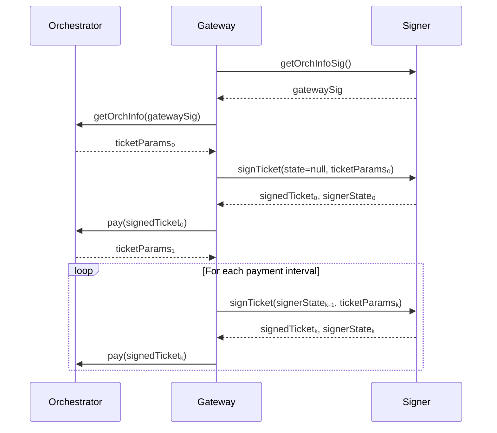

# Remote Signers

<Callout type="warning">
**Status: Active development.** Remote signer support is implemented for Live AI workloads via [PR #3791](https://github.com/livepeer/go-livepeer/pull/3791) and [PR #3822](https://github.com/livepeer/go-livepeer/pull/3822). CLI startup flags are subject to change. Refer to the go-livepeer release notes and `livepeer -help` for the most current flag names before deploying to production.
</Callout>

A **remote signer** is a standalone go-livepeer mode that handles all Ethereum-related gateway responsibilities — signing payment tickets, managing session bookkeeping, and providing GetOrchestratorInfo signatures — as a separate network service. Your gateway communicates with the signer over the network and contains no Ethereum private key.

## Why Use a Remote Signer?

### Security

By default, a gateway holds its Ethereum payment key in the same process that handles untrusted media from users. If a vulnerability in media parsing were exploited, an attacker could access the private key and drain your ETH deposit.

Remote signing eliminates this risk by isolating the key entirely. The signer runs in a hardened service with a narrow, well-defined API surface. Gateways never touch the key directly.

Beyond individual gateway security, all gateway instances behind a shared PM key share the same blast radius on compromise. Remote signers make it practical to use per-instance or per-clearinghouse keys.

### Platform Flexibility

Currently, go-livepeer is the only gateway implementation because building one requires deep familiarity with Livepeer's probabilistic micropayment (PM) mechanism. Remote signers change this:

- A Python, browser, or mobile gateway can use the remote signer without implementing PM.
- The signer handles all PM bookkeeping — fee calculation, nonce tracking, ticket generation.
- Gateway implementors interact with a simple signing RPC rather than raw Arbitrum contracts.

### Clearinghouse Support

Remote signers are the building block for [payment clearinghouses](/v2/gateways/payments/payment-clearinghouse) — third-party services that manage ETH custody on behalf of multiple gateway operators.

## Scope: Live AI Only

Remote signing is currently implemented for **Live AI (live-video-to-video)** workloads only.

- **Transcoding is explicitly unsupported.** Transcoding requires tickets to be signed with the hash of each segment, placing signing in the hot path. Any remote call there would increase latency on an already-complex code path. Transcoding is considered legacy and receives minimal new development.
- **Batch AI** is not supported in this initial implementation but may be added in future.

## Architecture

The remote signer implements two RPC endpoints corresponding to the two places where Ethereum signing occurs in a gateway:

### GetOrchestratorInfo Signature (PR #3791)

When a gateway contacts an orchestrator via the `GetOrchestratorInfo` RPC, it must provide an authentication signature. This signature never changes for a given gateway key and can be safely cached after the first request.

The signer generates this signature once at startup. The gateway fetches it, caches it, and reuses it for all subsequent orchestrator info requests.

### Payment Ticket Signing (PR #3822)

All payment handling for Live AI is encapsulated within the `LivePaymentSender` interface in go-livepeer. The signer takes over this interface entirely.

**Session state** (nonce counters, fee accumulators, ticket validity windows) is managed using a **stateless forwarding** design:



The gateway threads state forward — the signer stores nothing between calls. This avoids any shared state dependency across signer instances and means you can restart a signer without losing coordination.

<Callout type="info">
**No shared database required.** The stateless design lets you run multiple signer instances for redundancy without synchronisation infrastructure.
</Callout>

## Operational Requirements

### Run Multiple Instances

For production reliability, run two or more signer instances. They can sit behind a simple load balancer. Because no persistent state lives in the signer, failover is seamless — the gateway begins a new state chain from the next signer it contacts.

### Never Reuse Tickets

The state forwarding protocol ensures ticket nonces are unique across a session. Failure to send the latest signer state (e.g., sending a stale or empty state to a running session) results in nonce collisions and rejected tickets. Always persist and forward the `signerState` returned from each call.

### No Concurrent Signing for the Same Session

High-frequency or concurrent signing requests for the same session will produce invalid tickets due to state conflicts. A single session should have a single sequential signing call chain.

### Orchestrator Discovery

The remote signer does not handle orchestrator discovery. For off-chain Live AI gateways, discovery must be arranged separately — either by providing orchestrator URIs directly, using a discovery endpoint, or using a future clearinghouse discovery service.

## Community Remote Signer

A community-operated remote signer is available for testing and development use:

**Elite Encoder Remote Signer:** `https://signer.eliteencoder.net/`

This instance provides free ETH for testing purposes. It should not be used for production workloads without understanding the custody implications.

## CLI Startup

<Callout type="warning">
**SME confirmation required.** The CLI flags for starting go-livepeer in signer mode are subject to change as the feature matures. Consult the go-livepeer release notes or run `livepeer -help | grep signer` to confirm current flag names before deploying. The placeholder below reflects the intended interface — verify against your installed version.
</Callout>

```bash
# Start the remote signer (flag names subject to change — verify with livepeer -help)
livepeer \
  -signer \
  -network arbitrum-one-mainnet \
  -ethUrl <ARBITRUM_RPC_URL> \
  -ethKeystorePath ~/.lpData/keystore \
  -ethPassword <KEYSTORE_PASSWORD> \
  -httpAddr 0.0.0.0:7936

# Gateway connecting to remote signer instead of local key
livepeer \
  -gateway \
  -signerAddr <SIGNER_HOST>:7936 \
  -orchAddr <ORCH_1>,<ORCH_2> \
  -serviceAddr 0.0.0.0:8935
```

## Related Concepts

<CardGroup cols={2}>
  <Card title="How Payments Work" icon="credit-card" href="/v2/gateways/payments/how-payments-work">
 Understand the PM protocol your remote signer handles on your behalf.
  </Card>
  <Card title="Payment Clearinghouses" icon="building-columns" href="/v2/gateways/payments/payment-clearinghouse">
 Third-party services that bundle remote signing with account management.
  </Card>
</CardGroup>
