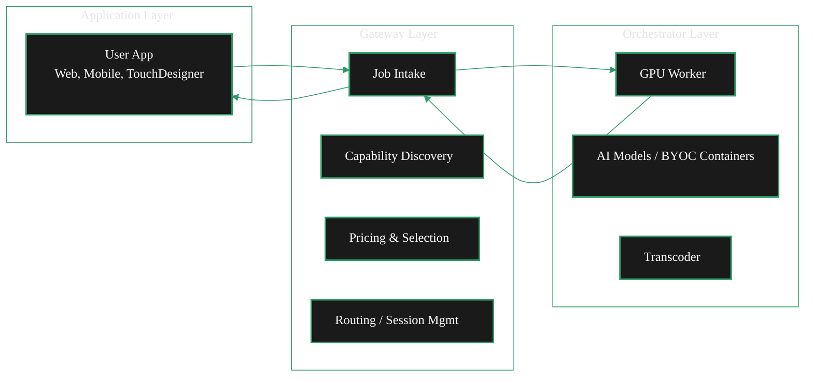
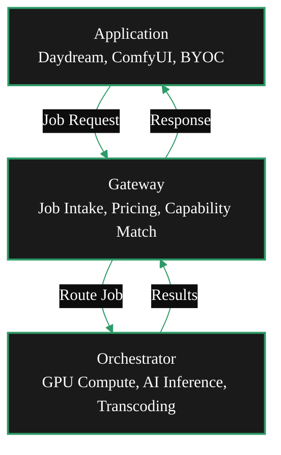

{/* TODO:
Terminology Validation:
- Ensure the terminology and definitions used in this page is consistent with the resources/glossary terminology
Verify:
- Terminology is consistent with resources/glossary
*/}

import { LinkArrow } from '/snippets/components/primitives/links.jsx'
import { StyledTable, TableRow, TableCell } from '/snippets/components/layout/tables.jsx'
import { CustomDivider } from '/snippets/components/primitives/divider.jsx'
import { ScrollableDiagram } from '/snippets/components/content/zoomableDiagram.jsx'
import { CenteredContainer, BorderedBox } from '/snippets/components/layout/containers.jsx'

This page explains where gateways sit in the Livepeer stack, how they interact with other network participants, how a request flows through the system, and the key internal components.

For what gateways *do*, see [Capabilities](/v2/gateways/concepts/capabilities). For why you would run one, see [Business Model](/v2/gateways/concepts/business-model).

---

## Gateway Layer Context

The Livepeer network has three functional layers. Gateways operate at the **application layer**, bridging end-user applications and the compute layer where orchestrators run GPU workloads.

<ScrollableDiagram title="Layered Architecture" maxHeight="600px">

</ScrollableDiagram>

| Layer | Participants | Responsibility |
|---|---|---|
| **Application** | Developers, end users, gateways | Ingest requests, route jobs, deliver results, manage pricing |
| **Compute** | Orchestrators, transcoders, AI runners | Execute video and AI work on GPUs |
| **Protocol** | Arbitrum smart contracts | Staking, payments, governance, orchestrator registry |

Gateways are the only demand-side participants that interact with both the compute layer (sending jobs to orchestrators) and the protocol layer (payment tickets, orchestrator discovery via the on-chain registry).

<CustomDivider middleText="System Interactions" />

## Gateway Interactions

A gateway interacts with four categories of actors:

### Applications

Applications are the gateway's customers. They send workloads and receive results.

- Video applications send RTMP streams (port 1935) and receive HLS/DASH output
- AI applications send HTTP requests (port 8937) and receive JSON/binary inference results
- BYOC applications send custom payloads via HTTP and receive container output

The gateway abstracts the Livepeer network entirely - applications do not need to know about orchestrators, payment tickets, or the protocol layer.

### Orchestrators

Orchestrators are the supply side. The gateway selects, negotiates with, and dispatches work to them.

- **Discovery** - on-chain gateways query the ServiceRegistry contract on Arbitrum; off-chain gateways receive orchestrator lists from the remote signer
- **Negotiation** - the gateway requests an orchestrator's capabilities and price, then establishes a session if the terms are acceptable
- **Dispatch** - video segments or AI requests are sent to the orchestrator with an attached payment ticket
- **Failover** - if an orchestrator fails, the gateway retries with the next-best option from its ranked list

### Remote Signer

In the **off-chain operational mode**, the gateway delegates all payment operations to a **remote signer** service. The remote signer:

- Holds the ETH deposit and reserve
- Generates probabilistic micropayment tickets on the gateway's behalf
- Provides orchestrator discovery (list of known orchestrators)
- Handles all on-chain interactions (ticket redemption is on the orchestrator side)

This architecture allows gateways to operate with zero crypto knowledge and zero ETH. See <LinkArrow href="/v2/gateways/payments/remote-signers" label="Remote Signers" newline={false} /> for the full protocol.

### Arbitrum Protocol

In the **on-chain operational mode**, the gateway interacts directly with Arbitrum smart contracts:

| Contract | Gateway interaction |
|---|---|
| **TicketBroker** | Fund deposit and reserve; generate payment tickets for orchestrators |
| **ServiceRegistry** | Query registered orchestrators and their service URIs |

<Note>
Unlike orchestrators, gateways do **not** interact with the BondingManager (staking), RoundsManager (reward calls), or Governance contracts. Gateways do not stake LPT, earn protocol rewards, or vote.
</Note>

<CustomDivider middleText="Internal Architecture" />

## Dual Pipeline Architecture

The gateway node (`LivepeerNode` in go-livepeer) runs two independent session managers - one for video, one for AI. This allows a single gateway to handle both workload types simultaneously without interference.

```mermaid
%%{init: {'theme': 'base', 'themeVariables': { 'primaryColor': '#1a1a1a', 'primaryTextColor': '#fff', 'primaryBorderColor': '#2d9a67', 'lineColor': '#2d9a67', 'secondaryColor': '#0d0d0d', 'tertiaryColor': '#1a1a1a', 'background': '#0d0d0d', 'fontFamily': 'system-ui' }}}%%
flowchart TB
    subgraph INPUT["Input Sources"]
        direction LR
        RTMP["RTMP Stream"]
        HTTP["HTTP Upload"]
        AI_REQ["AI Request"]
    end

    GATEWAY["Gateway Node<br/>LivepeerNode"]

    INPUT --> GATEWAY

    subgraph MANAGERS["Session Managers"]
        direction LR
        BSM["BroadcastSessionsManager<br/>Video Transcoding"]
        ASM["AISessionManager<br/>AI Processing"]
    end

    GATEWAY --> BSM
    GATEWAY --> ASM

    subgraph VIDEO["Video Pipeline"]
        SEG["Segment Processing"]
        ORCH_V["Orchestrators<br/>Transcoding"]
        HLS["HLS/DASH Output"]
    end

    subgraph AI["AI Pipeline"]
        PROC["AI Processing"]
        ORCH_AI["Orchestrators<br/>AI Models"]
        OUT_AI["AI Output<br/>Images/Video"]
    end

    BSM --> SEG --> ORCH_V --> HLS
    ASM --> PROC --> ORCH_AI --> OUT_AI

    subgraph PAYMENT["Payment"]
        direction LR
        PAY_SEG["Per Segment"]
        PAY_PIX["Per Pixel"]
    end

    ORCH_V --> PAY_SEG
    ORCH_AI --> PAY_PIX

    classDef default fill:#1a1a1a,color:#fff,stroke:#2d9a67,stroke-width:2px
    classDef video fill:#1a1a1a,color:#fff,stroke:#3b82f6,stroke-width:2px
    classDef ai fill:#1a1a1a,color:#fff,stroke:#a855f7,stroke-width:2px
    class RTMP,HTTP,BSM,SEG,ORCH_V,HLS,PAY_SEG video
    class AI_REQ,ASM,PROC,ORCH_AI,OUT_AI,PAY_PIX ai
    style INPUT fill:#0d0d0d,stroke:#2d9a67,stroke-width:1px
    style MANAGERS fill:#0d0d0d,stroke:#2d9a67,stroke-width:1px
    style VIDEO fill:#0d0d0d,stroke:#3b82f6,stroke-width:1px
    style AI fill:#0d0d0d,stroke:#a855f7,stroke-width:1px
    style PAYMENT fill:#0d0d0d,stroke:#2d9a67,stroke-width:1px
```

<ScrollableDiagram title="Dual Gateway Architecture: Video & AI Pipelines" maxHeight="800px">

</ScrollableDiagram>

### Video vs AI Pipelines

| Aspect | Video pipeline (blue) | AI pipeline (purple) |
|---|---|---|
| **Session manager** | `BroadcastSessionsManager` | `AISessionManager` |
| **Input** | RTMP stream segmented into chunks | HTTP request with prompt/image/audio |
| **Orchestrator work** | Transcode each segment to output profiles | Run inference model, return result |
| **Output** | HLS/DASH stream | JSON (text), image, video clip, or audio |
| **Payment unit** | Wei per pixel (per segment) | Wei per pixel or per millisecond |
| **Session duration** | Long-lived (entire stream) | Short-lived (single request or batch) |

Both pipelines share the same orchestrator selection logic, payment system, and failover behaviour. The separation is at the session management layer.

<CustomDivider middleText="Request Flow" />

## Job Lifecycle

This is what happens when an application sends a request to a gateway, from intake through result delivery and payment.

<ScrollableDiagram title="Gateway Request Flow" maxHeight="600px">

</ScrollableDiagram>

### Lifecycle Steps

1. **Job arrives** - An application sends a video segment (RTMP) or AI request (HTTP) to the gateway.
2. **Pipeline routing** - The gateway routes the request to the appropriate session manager (`BroadcastSessionsManager` for video, `AISessionManager` for AI).
3. **Orchestrator selection** - The session manager selects the best orchestrator from its pool based on capability, price, latency, and performance history.
4. **Payment ticket generation** - The gateway (or remote signer in off-chain operational mode) generates a probabilistic micropayment ticket and attaches it to the job.
5. **Work dispatch** - The job + ticket are sent to the orchestrator over HTTP.
6. **Execution** - The orchestrator routes the work to its GPU worker (transcoder for video, AI Runner for inference) and returns the result.
7. **Result delivery** - The gateway sends the processed output back to the application.
8. **Payment settlement** - The orchestrator accumulates payment tickets and periodically redeems winning tickets on Arbitrum for ETH.

<CustomDivider middleText="Key Components" />

## Software Components

### go-livepeer

The core node software. When started in gateway mode (`-gateway`), it runs as the gateway controller. Handles:

- Job intake (RTMP server + HTTP API server)
- Orchestrator discovery and session management
- Payment ticket generation (on-chain operational mode) or remote signer communication (off-chain operational mode)
- Prometheus metrics (port 7935)

Source: [github.com/livepeer/go-livepeer](https://github.com/livepeer/go-livepeer) - specifically [core/livepeernode.go](https://github.com/livepeer/go-livepeer/blob/5691cb48/core/livepeernode.go)

<Note>
The gateway was previously called the **broadcaster**. Legacy CLI flags still use `-broadcaster` in some contexts. The `-gateway` flag is the current standard.
</Note>

### livepeer_cli

A command-line tool that connects to a running go-livepeer node. Used for:

- Setting broadcast configuration (max price, transcoding profiles)
- Funding the on-chain deposit and reserve
- Viewing node status and connected orchestrators

### Remote Signer (off-chain)

A separate service that handles ETH custody and payment ticket signing on behalf of off-chain gateways. Not part of go-livepeer itself - it runs as a sidecar or external service.

See <LinkArrow href="/v2/gateways/payments/remote-signers" label="Remote Signers" newline={false} /> for architecture and configuration.

### Arbitrum Contracts (on-chain)

| Contract | Gateway use |
|---|---|
| **TicketBroker** | Deposit ETH, manage reserve, generate payment tickets |
| **ServiceRegistry** | Discover registered orchestrators |

See <LinkArrow href="/v2/orchestrators/resources/technical/x-contract-addresses" label="Contract Addresses" newline={false} /> for deployed addresses.

<CustomDivider />

## Related Pages

<CardGroup cols={2}>
  <Card title="Gateway Role" icon="user-gear" href="/v2/gateways/concepts/role" arrow horizontal>
    What gateways are and how the role has evolved.
  </Card>
  <Card title="Gateway Capabilities" icon="gears" href="/v2/gateways/concepts/capabilities" arrow horizontal>
    Workload types, orchestrator selection, and session management.
  </Card>
  <Card title="Gateway Business Model" icon="chart-line" href="/v2/gateways/concepts/business-model" arrow horizontal>
    Revenue models, cost structures, and pricing.
  </Card>
  <Card title="Payment System" icon="credit-card" href="/v2/gateways/payments/overview" arrow horizontal>
    How probabilistic micropayments work.
  </Card>
</CardGroup>
