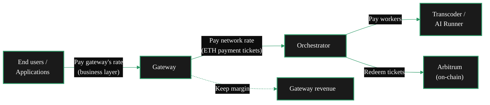

{/* TODO:
Terminology Validation:
- Ensure the terminology and definitions used in this page is consistent with the resources/glossary terminology
Verify:
- Terminology is consistent with resources/glossary
*/}


import { LinkArrow } from '/snippets/components/primitives/links.jsx'
import { StyledTable, TableRow, TableCell } from '/snippets/components/layout/tables.jsx'
import { CustomDivider } from '/snippets/components/primitives/divider.jsx'
import { ScrollableDiagram } from '/snippets/components/content/zoomableDiagram.jsx'
import { CenteredContainer, BorderedBox } from '/snippets/components/layout/containers.jsx'

<CenteredContainer style={{ width: '90%' }}>
  <Tip>Gateways are application service routers which earn at the business layer. The protocol controls what you pay orchestrators; you control what you charge customers. </Tip>
</CenteredContainer>

<CustomDivider middleText="Payment Flow" style={{margin: "0 0 -1rem 0"}}/>

## Payments Flow

Gateways are **consumers** of compute services. They pay orchestrators to do work on behalf of their application customers.



The payment chain:

1. **End users pay the gateway** at whatever rate the operator sets (business layer - not in the protocol)
2. **The gateway pays orchestrators** via probabilistic micropayment tickets (ETH on Arbitrum)
3. **Orchestrators pay their workers** (transcoders, AI runners) and redeem winning tickets on-chain
4. **The gateway keeps the difference** between what customers pay and what orchestrators charge

<CustomDivider middleText="Who Earns What" style={{margin: "0 0 -1rem 0"}} />

## Gateway Earnings

Gateways do not earn protocol rewards. They pay for services.

<StyledTable variant="bordered">
  <thead>
    <TableRow header>
      <TableCell header>Participant</TableCell>
      <TableCell header>Earns at protocol level?</TableCell>
      <TableCell header>How</TableCell>
    </TableRow>
  </thead>
  <tbody>
    <TableRow>
      <TableCell>**Orchestrator**</TableCell>
      <TableCell>Yes</TableCell>
      <TableCell>LPT rewards (staking) + ETH fees (payment tickets from gateways)</TableCell>
    </TableRow>
    <TableRow>
      <TableCell>**Transcoder / AI Worker**</TableCell>
      <TableCell>Yes</TableCell>
      <TableCell>Paid by orchestrators for GPU compute work</TableCell>
    </TableRow>
    <TableRow>
      <TableCell>**Redeemer**</TableCell>
      <TableCell>Yes</TableCell>
      <TableCell>Fees for redeeming winning payment tickets on-chain</TableCell>
    </TableRow>
    <TableRow>
      <TableCell>**Gateway**</TableCell>
      <TableCell>**No**</TableCell>
      <TableCell>Pays for services (earns at business layer only)</TableCell>
    </TableRow>
  </tbody>
</StyledTable>

<CustomDivider middleText="Gateway Costs" style={{margin: "0 0 -1rem 0"}} />

## Gateway Costs

Gateway costs are determined by the work you route and the orchestrator prices on the network.

| Cost type | Pricing unit | Description |
|---|---|---|
| **Video transcoding** | Wei per pixel per segment | Width x height x frames of output video |
| **AI inference** | Wei per pixel or per millisecond | Varies by pipeline (image = per pixel, audio = per ms) |
| **Real-time AI** | Interval-based | Payments during the duration of a live stream |

### Currency

Gateways pay in **ETH** (on Arbitrum), not LPT. LPT is used for staking and governance by orchestrators - gateways never need LPT.

<StyledTable variant="bordered">
  <thead>
    <TableRow header>
      <TableCell header>Currency</TableCell>
      <TableCell header>Purpose</TableCell>
      <TableCell header>Used by</TableCell>
    </TableRow>
  </thead>
  <tbody>
    <TableRow>
      <TableCell>**ETH / Wei**</TableCell>
      <TableCell>Service payments (transcoding, AI)</TableCell>
      <TableCell>Gateways pay orchestrators</TableCell>
    </TableRow>
    <TableRow>
      <TableCell>**LPT**</TableCell>
      <TableCell>Staking, governance, rewards</TableCell>
      <TableCell>Orchestrators, delegators</TableCell>
    </TableRow>
  </tbody>
</StyledTable>

ETH handles service payments while LPT handles protocol governance and staking. This keeps service costs denominated in a stable currency while LPT serves its governance function.

<CustomDivider middleText="Why Run a Gateway" style={{margin: "0 0 -1rem 0"}}/>

## Gateway Operator Models

Gateways earn at the **business layer**, not the protocol layer. Four operator models demonstrate why:

<AccordionGroup>
  <Accordion title="Self-hosted gateway (cost savings)" icon="server">
    Running your own gateway means you do not pay a fee to route through another party's gateway. If you are already building an application on Livepeer, self-hosting eliminates the middleman markup.

    **Who:** App developers scaling past hosted APIs (Daydream, Livepeer.Cloud)

    **Revenue model:** Cost reduction, not direct revenue. You save the margin that a third-party gateway would charge.
  </Accordion>
  <Accordion title="Service provider (arbitrage)" icon="store">
    Charge end users more than you pay orchestrators. The difference is your margin. This is the classic gateway business model.

    **Who:** Livepeer.Cloud SPE, LLM SPE, Streamplace

    **Revenue model:** Per-request, per-minute, or subscription pricing to customers. Pay orchestrators at network rates.
  </Accordion>
  <Accordion title="Platform builder (NaaP)" icon="building">
    Build a full platform on top of the gateway layer - API key management, multi-tenancy, billing, SLA monitoring, orchestrator tiering.

    **Who:** NaaP (Network as a Platform), enterprise integrators

    **Revenue model:** SaaS pricing with usage-based billing. The gateway is the infrastructure layer of a larger product.
  </Accordion>
  <Accordion title="Content provider (SLA control)" icon="video">
    Run a gateway to ensure SLA guarantees on your orchestrators. Control orchestrator selection, failover, and pricing for your specific content.

    **Who:** Streaming platforms, media companies, live event producers

    **Revenue model:** The gateway is a cost centre that enables the core business (streaming, content delivery).
  </Accordion>
</AccordionGroup>

<CustomDivider middleText="Fee Structure" style={{margin: "0 0 -1rem 0"}}/>

## Pricing and Fees

As a gateway operator, you set pricing at two levels:

### Protocol-level costs (what you pay)

You control your maximum cost per job using CLI flags:

```bash
# Maximum you'll pay per pixel for transcoding
-maxPricePerUnit=1000

# Maximum you'll pay per AI capability/model
-maxPricePerCapability='{"capabilities_prices": [{"pipeline": "text-to-image", "model_id": "stabilityai/sd-turbo", "price_per_unit": 1000}]}'
```

These flags set an upper bound. The gateway will only route to orchestrators whose prices are at or below your maximum. Lower maximums mean fewer available orchestrators; higher maximums mean more options but higher costs.

### Business Layer Pricing

Your fees to end users are set entirely at the application layer, outside the Livepeer protocol. Common approaches:

1. **Per-request pricing** - charge per API call to your gateway
2. **Usage-based pricing** - charge per minute of video or per AI generation
3. **Subscription models** - monthly fees for access to your gateway services

```go
// Your application code (not in Livepeer protocol)
func calculateUserPrice(requestType string, pixels int64) float64 {
    basePrice := getYourBusinessPrice(requestType)
    yourCost := getOrchestratorCost(pixels)
    profitMargin := 0.20 // 20% margin

    return basePrice + yourCost*profitMargin
}
```

### Price Discovery

Use the CLI to discover current orchestrator market rates:

```bash
livepeer_cli
# Select "Set broadcast config" to see current market rates
# Then set your max prices accordingly
```

Your margin = what customers pay you - what you pay orchestrators.

<CustomDivider middleText="Case Studies" style={{margin: "0 0 -1rem 0"}}/>

## Gateways in production

**[Streamplace](/v2/solutions/streamplace/overview)** operates a gateway providing video processing services to content creators. Creators pay Streamplace; Streamplace pays orchestrators. The margin is Streamplace's revenue.

**[Daydream](/v2/solutions/daydream/overview)** operates a gateway providing AI video processing. Builders and creators pay Daydream; Daydream pays orchestrators. The margin is Daydream's revenue.

Both demonstrate the arbitrage model: the gateway sits between application demand and network supply, adding value through routing quality, developer experience, and service reliability.

<CustomDivider style={{margin: "0 0 -1rem 0"}} />

## Related Pages

<CardGroup cols={2}>
  <Card title="Gateway Role" icon="user-gear" href="/v2/gateways/concepts/role" arrow horizontal>
    What gateways are and how the role has evolved.
  </Card>
  <Card title="Gateway Capabilities" icon="gears" href="/v2/gateways/concepts/capabilities" arrow horizontal>
    Workload types, orchestrator selection, and session management.
  </Card>
  <Card title="Payment System" icon="credit-card" href="/v2/gateways/payments/overview" arrow horizontal>
    How probabilistic micropayments work.
  </Card>
  <Card title="Orchestrator Incentives" icon="coins" href="/v2/orchestrators/concepts/rcs-incentives" arrow horizontal>
    How the supply side (orchestrators) earns - for comparison.
  </Card>
</CardGroup>
