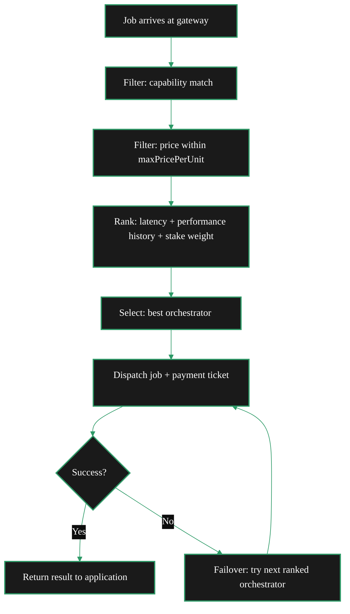

import { LinkArrow } from '/snippets/components/primitives/links.jsx'
import { StyledTable, TableRow, TableCell } from '/snippets/components/layout/tables.jsx'
import { CustomDivider } from '/snippets/components/primitives/divider.jsx'
import { CenteredContainer } from '/snippets/components/layout/containers.jsx'

<CenteredContainer maxWidth="960px">
  <Tip>Gateways route work to orchestrators; they do not perform the compute themselves. Orchestrators run the GPU workload, while the gateway selects the route, enforces the price ceiling, and manages the session.</Tip>
</CenteredContainer>

<CustomDivider middleText="Core Functions" />

## Gateway Functions

A gateway performs five core functions for every job it processes:

1. **Job intake** - accept requests from applications via RTMP (video) or HTTP API (AI, video, BYOC)
2. **Orchestrator selection** - match each job to the best available orchestrator based on capability, price, latency, and performance history
3. **Session management** - maintain persistent connections to orchestrators for the duration of a stream or job batch
4. **Payment handling** - generate probabilistic micropayment tickets per job segment (on-chain operational mode) or delegate payment to a remote signer (off-chain operational mode)
5. **Result delivery** - return transcoded video (HLS/DASH), inference output (JSON/binary), or stream results to the calling application

<Note>
Orchestrators perform GPU compute, run AI models, transcode video, and execute containers. Compute providers should see <LinkArrow href="/v2/orchestrators/concepts/role" label="Orchestrator Role" newline={false} />.
</Note>

<CustomDivider middleText="Workload Types" />

## Workload Types

Gateways route four categories of work into the Livepeer network. Operational mode sets the eligible categories.

<StyledTable variant="bordered">
  <thead>
    <TableRow header>
      <TableCell header>Workload</TableCell>
      <TableCell header>What it does</TableCell>
      <TableCell header>Ingest protocol</TableCell>
      <TableCell header>On-chain</TableCell>
      <TableCell header>Off-chain</TableCell>
    </TableRow>
  </thead>
  <tbody>
    <TableRow>
      <TableCell>**Video transcoding**</TableCell>
      <TableCell>Convert live video streams into multiple resolutions and formats</TableCell>
      <TableCell>RTMP (port 1935)</TableCell>
      <TableCell>Yes</TableCell>
      <TableCell>No</TableCell>
    </TableRow>
    <TableRow>
      <TableCell>**Batch AI inference**</TableCell>
      <TableCell>Single-request AI jobs: text-to-image, image-to-video, audio-to-text, captioning, segmentation</TableCell>
      <TableCell>HTTP API (port 8935)</TableCell>
      <TableCell>Yes</TableCell>
      <TableCell>Yes</TableCell>
    </TableRow>
    <TableRow>
      <TableCell>**Real-time AI (Cascade)**</TableCell>
      <TableCell>Continuous AI processing on a live video stream - style transfer, avatars, real-time agents</TableCell>
      <TableCell>HTTP API (port 8935)</TableCell>
      <TableCell>Yes</TableCell>
      <TableCell>Yes</TableCell>
    </TableRow>
    <TableRow>
      <TableCell>**LLM inference**</TableCell>
      <TableCell>Text generation, chat, instruction-following via large language models</TableCell>
      <TableCell>HTTP API (port 8935)</TableCell>
      <TableCell>Yes</TableCell>
      <TableCell>Yes</TableCell>
    </TableRow>
  </tbody>
</StyledTable>

<Warning>
Video transcoding uses RTMP ingest and on-chain payment. Route video transcoding through an on-chain gateway.
</Warning>

### BYOC (Bring Your Own Container)

BYOC pipelines allow applications to define custom container-based workloads that orchestrators execute. The gateway routes BYOC requests through the same HTTP API it uses for AI inference, and the orchestrator runs an application-defined container instead of a standard AI model.

BYOC enables use cases like custom ML workflows, enterprise-specific processing, and novel applications (e.g. <LinkArrow href="/v2/solutions/embody" label="Embody AI avatars" newline={false} />).

See <LinkArrow href="/v2/developers/build/byoc" label="BYOC pipelines" newline={false} /> for the developer-side setup.

<CustomDivider middleText="Orchestrator Selection" />

## Orchestrator Selection

When a job arrives, the gateway must decide which orchestrator to send it to. This is the gateway's most important function - it directly affects cost, latency, and reliability for end users.

The selection algorithm considers:

<StyledTable variant="bordered">
  <thead>
    <TableRow header>
      <TableCell header>Factor</TableCell>
      <TableCell header>What it means</TableCell>
    </TableRow>
  </thead>
  <tbody>
    <TableRow>
      <TableCell>**Capability**</TableCell>
      <TableCell>Does the orchestrator support the requested pipeline, model, or transcoding profile?</TableCell>
    </TableRow>
    <TableRow>
      <TableCell>**Price**</TableCell>
      <TableCell>Is the orchestrator's advertised price within the gateway's configured `maxPricePerUnit`?</TableCell>
    </TableRow>
    <TableRow>
      <TableCell>**Latency**</TableCell>
      <TableCell>How fast has this orchestrator responded to recent jobs?</TableCell>
    </TableRow>
    <TableRow>
      <TableCell>**Performance history**</TableCell>
      <TableCell>What is the orchestrator's success rate and error rate over recent sessions?</TableCell>
    </TableRow>
    <TableRow>
      <TableCell>**Stake weight**</TableCell>
      <TableCell>How much LPT is staked to this orchestrator? Higher stake implies greater economic commitment to good behaviour</TableCell>
    </TableRow>
  </tbody>
</StyledTable>

### Discovery Methods

Gateway discovery follows the operational mode:

<Tabs>
  <Tab title="On-chain gateway" icon="link">
    Queries the **on-chain orchestrator registry** (ServiceRegistry contract on Arbitrum). All registered orchestrators are discoverable automatically. The gateway refreshes this list periodically.

    This is the default discovery method and requires no additional configuration.
  </Tab>
  <Tab title="Off-chain gateway" icon="cloud">
    Off-chain gateways do not query the on-chain registry directly. Orchestrator discovery is handled via:

    - **Orchestrator list from the remote signer** - the signer provides a set of known orchestrators
    - **Manual configuration** - the operator provides an explicit orchestrator list

    See the <LinkArrow href="/v2/gateways/guides/payments-and-pricing/remote-signers" label="Remote Signers" newline={false} /> page for how discovery works in off-chain operational mode.
  </Tab>
</Tabs>

<CustomDivider middleText="Session Management" />

## Sessions and Failover

Gateways maintain **sessions** with orchestrators for the duration of a workload. For video transcoding, a session covers an entire livestream. For AI inference, a session usually covers a single request or batch.

Key session behaviours:

- **Session reuse** - the gateway reuses an existing session with an orchestrator when a new segment of the same stream arrives, avoiding repeated orchestrator selection overhead
- **Automatic failover** - when an orchestrator fails mid-session (timeout, error, disconnect), the gateway selects the next-best orchestrator and retries the segment
- **Session managers** - the gateway runs separate session managers for video (`BroadcastSessionsManager`) and AI (`AISessionManager`), allowing dual-workload operation from a single node
- **Price negotiation** - session setup includes price agreement. A mid-session price change triggers renegotiation or a switch

<Note>
Running both video and AI workloads from a single gateway node is called **dual-workload configuration**. The gateway handles this through separate session managers - no special setup required beyond enabling both ingest protocols. See <LinkArrow href="/v2/gateways/concepts/architecture" label="Gateway Architecture" newline={false} /> for the internal pipeline view.
</Note>

<CustomDivider middleText="Marketplace" />

## Gateway Marketplace Role

Gateways participate in the Livepeer marketplace as the **demand side**. They create competition among orchestrators by routing jobs based on price, performance, and capability.

This means:
- **Better orchestrators earn more work** - gateways naturally route to faster, cheaper, more reliable nodes
- **Gateways compete on routing quality** - application developers choose gateways based on supported features, latency, developer experience, and pricing
- **New capabilities are instantly routable** - when an orchestrator adds a new AI model or pipeline, gateways discover it and route to it without code changes

The marketplace emerges from gateways and orchestrators advertising capabilities and prices, with the selection algorithm matching supply to demand.

See <LinkArrow href="/v2/gateways/concepts/business-model" label="Gateway Business Model" newline={false} /> for how gateway operators set pricing and earn margins within this marketplace.

<CustomDivider />

## Related Pages

<CardGroup cols={2}>
  <Card title="Gateway Role" icon="user-gear" href="/v2/gateways/concepts/role" arrow horizontal>
    What gateways are and how the role has evolved.
  </Card>
  <Card title="Gateway Architecture" icon="diagram-project" href="/v2/gateways/concepts/architecture" arrow horizontal>
    Internal components, request flow, and system interactions.
  </Card>
  <Card title="Gateway Business Model" icon="chart-line" href="/v2/gateways/concepts/business-model" arrow horizontal>
    Revenue models, cost structures, and pricing.
  </Card>
  <Card title="Navigator" icon="compass" href="/v2/gateways/navigator" arrow horizontal>
    Find the right setup path for your goals.
  </Card>
</CardGroup>
