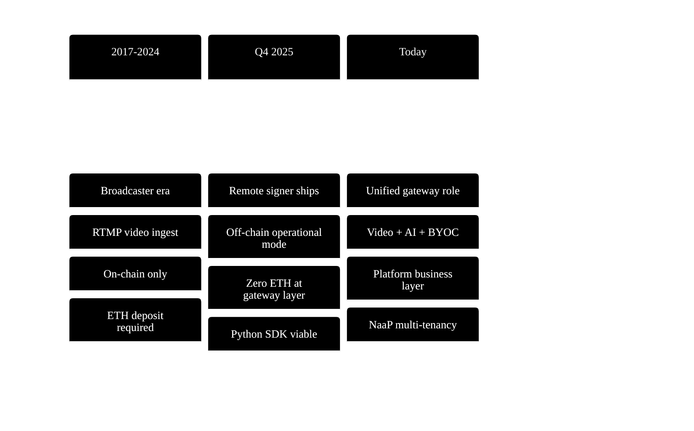
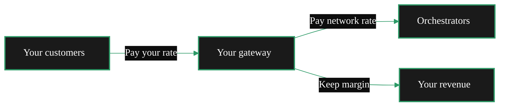

import { LinkArrow } from '/snippets/components/primitives/links.jsx'
import { CustomDivider } from '/snippets/components/primitives/divider.jsx'
import { ScrollableDiagram } from '/snippets/components/content/zoomableDiagram.jsx'
import { CenteredContainer } from '/snippets/components/layout/containers.jsx'

<CenteredContainer maxWidth="1100px">
    <AccordionGroup>
        <Accordion title="From a Cloud Background?" icon="cloud">
            A gateway fills the same role as a cloud API gateway or L7 load balancer.
            It ingests traffic, routes workloads to backend GPU nodes, and manages
            session flow while orchestrators perform the compute.

            <ScrollableDiagram title="Gateway as Cloud Infrastructure">

        ```mermaid
        %%{init: {'theme': 'base', 'themeVariables': { 'primaryColor': '#1a1a1a', 'primaryTextColor': '#fff', 'primaryBorderColor': '#2d9a67', 'lineColor': '#2d9a67', 'secondaryColor': '#0d0d0d', 'tertiaryColor': '#1a1a1a', 'background': '#0d0d0d', 'fontFamily': 'system-ui' }}}%%
        flowchart LR
            subgraph Clients["Client / Application Layer"]
                A["Apps & SDKs<br/>• Video Ingest<br/>• AI Inference Requests<br/>• WebRTC / HTTP"]
            end

            subgraph Gateway["Gateway Layer (Livepeer Gateway)"]
                B["Gateway Node<br/><br/>Cloud Analogy:<br/>• API Gateway<br/>• L7 Load Balancer<br/>• Control Plane<br/><br/>Responsibilities:<br/>• Auth & Rate Limits<br/>• Stream Segmentation<br/>• Job Routing<br/>• Health Checks<br/>• Retry & Failover"]
            end

            subgraph Compute["Compute Layer (Supply Side)"]
                C["Orchestrators<br/>GPU Workers<br/><br/>Cloud Analogy:<br/>• Auto-scaling GPU Fleet<br/>• Managed Inference Pool"]
            end

            subgraph Settlement["Coordination & Settlement"]
                D["Ethereum + Livepeer Protocol<br/><br/>• Payments<br/>• Accounting<br/>• Slashing / Security"]
            end

            A -->|Requests| B
            B -->|Dispatch Jobs| C
            C -->|Results / Streams| B
            B -->|Responses| A
            C -->|Usage & Proof| D

            classDef default fill:#1a1a1a,color:#fff,stroke:#2d9a67,stroke-width:2px
            style Clients fill:#0d0d0d,stroke:#2d9a67,stroke-width:1px
            style Gateway fill:#0d0d0d,stroke:#2d9a67,stroke-width:1px
            style Compute fill:#0d0d0d,stroke:#2d9a67,stroke-width:1px
            style Settlement fill:#0d0d0d,stroke:#2d9a67,stroke-width:1px
        ```

            </ScrollableDiagram>
        </Accordion>
        <Accordion title="From an Ethereum Background?" icon="coin">
            A gateway plays the workload-routing role in the network.
            The closest Ethereum analogue is an L2 sequencer: it ingests requests,
            orders execution, selects orchestrators, and forwards jobs into the compute layer.

            <ScrollableDiagram title="Gateways as L2 Sequencers">

        ```mermaid
        %%{init: {'theme': 'base', 'themeVariables': { 'primaryColor': '#1a1a1a', 'primaryTextColor': '#fff', 'primaryBorderColor': '#2d9a67', 'lineColor': '#2d9a67', 'secondaryColor': '#0d0d0d', 'tertiaryColor': '#1a1a1a', 'background': '#0d0d0d', 'fontFamily': 'system-ui' }}}%%
        flowchart LR
            subgraph User["User Layer"]
                A["Client<br/>Video/AI Request"]
            end

            subgraph Gateway["Gateway Layer"]
                B["Livepeer Gateway<br/>= L2 Sequencer<br/><br/>• Ingests Requests<br/>• Segments/Preprocesses<br/>• Selects Orchestrators<br/>• Routes Jobs<br/>• Returns Results"]
            end

            subgraph Compute["Compute Layer"]
                C["Orchestrators<br/>GPU Workers<br/><br/>= L2 Execution Layer"]
            end

            subgraph Settlement["Settlement Layer"]
                D["Ethereum<br/>Consensus & Payment Security"]
            end

            A --> B
            B --> C
            C --> B
            B --> A
            C --> D

            classDef default fill:#1a1a1a,color:#fff,stroke:#2d9a67,stroke-width:2px
            style User fill:#0d0d0d,stroke:#2d9a67,stroke-width:1px
            style Gateway fill:#0d0d0d,stroke:#2d9a67,stroke-width:1px
            style Compute fill:#0d0d0d,stroke:#2d9a67,stroke-width:1px
            style Settlement fill:#0d0d0d,stroke:#2d9a67,stroke-width:1px
        ```

            </ScrollableDiagram>
        </Accordion>
        <Accordion title="Neither? You can still run a gateway!" icon="film">
            A gateway operator plays the producer role for a compute job.
            The gateway takes the request, selects the specialists, manages constraints,
            and delivers the result on time.

            <ScrollableDiagram title="Gateway as Film Producer">

        ```mermaid
        %%{init: {'theme': 'base', 'themeVariables': { 'primaryColor': '#1a1a1a', 'primaryTextColor': '#fff', 'primaryBorderColor': '#2d9a67', 'lineColor': '#2d9a67', 'secondaryColor': '#0d0d0d', 'tertiaryColor': '#1a1a1a', 'background': '#0d0d0d', 'fontFamily': 'system-ui' }}}%%
        flowchart LR
            subgraph Persona["Persona: Gateway Operator = Film Producer"]
                P["Film Producer Mindset<br/>• Owns delivery<br/>• Sets constraints<br/>• Chooses specialists<br/>• Ensures quality"]
            end

            subgraph Request["Act I - The Pitch"]
                A["Incoming Request<br/>• Live Video Stream<br/>• AI Inference Job<br/>• Quality & Latency Requirements"]
            end

            subgraph Planning["Act II - Pre-Production"]
                B["Gateway (Producer)<br/><br/>• Interpret the request<br/>• Set budget & latency constraints<br/>• Choose specialists<br/>• Plan execution"]
            end

            subgraph Crew["Act III - Production Crew"]
                C["Orchestrators / GPU Workers<br/><br/>• Transcoding<br/>• AI Inference<br/>• Real-time Processing"]
            end

            subgraph Delivery["Act IV - Final Cut & Release"]
                D["Verified Output<br/>• Stream / AI Result<br/>• Quality checked<br/>• Delivered on time"]
            end

            subgraph Settlement["Credits & Accounting"]
                E["Onchain Settlement<br/>• Usage recorded<br/>• Payments distributed<br/>• Trust enforced"]
            end

            P --> A
            A --> B
            B --> C
            C --> B
            B --> D
            C --> E

            classDef default fill:#1a1a1a,color:#fff,stroke:#2d9a67,stroke-width:2px
            style Persona fill:#0d0d0d,stroke:#2d9a67,stroke-width:1px
            style Request fill:#0d0d0d,stroke:#2d9a67,stroke-width:1px
            style Planning fill:#0d0d0d,stroke:#2d9a67,stroke-width:1px
            style Crew fill:#0d0d0d,stroke:#2d9a67,stroke-width:1px
            style Delivery fill:#0d0d0d,stroke:#2d9a67,stroke-width:1px
            style Settlement fill:#0d0d0d,stroke:#2d9a67,stroke-width:1px
        ```

            </ScrollableDiagram>
        </Accordion>
    </AccordionGroup>
</CenteredContainer>

<CenteredContainer maxWidth="960px">
  <Tip>Gateways sit between applications and orchestrators. They are the demand side of the network, and application developers connect through the gateway layer for video, AI inference, and real-time AI workloads.</Tip>
</CenteredContainer>

<CustomDivider middleText="Role Evolution" />
In the early days of Livepeer, gateways (then called **broadcasters**) had a single job: send video streams to orchestrators for transcoding.

Today, with the off-chain gateway operational mode shipped in Q4 2025, the role has expanded dramatically. Gateways now route AI inference, live video AI, LLM requests, and custom BYOC workloads - often with **zero ETH required**. The gateway is where business logic, customer relationships, and service margins live.

<ScrollableDiagram title="Gateway Role Evolution" maxHeight="420px">
{/* Note: Mermaid cannot use color variables. */}

</ScrollableDiagram>

<CustomDivider middleText="Role Functions" />

## Technical Role

A gateway is a **demand aggregation and routing layer**. It accepts workloads from applications, selects the best orchestrator for each job, handles payment, and returns results while orchestrators perform GPU compute.

Core responsibilities:
- **Job intake**  - receive video streams (RTMP) or AI inference requests (HTTP API)
- **Orchestrator selection**  - match jobs to capable orchestrators by capability, price, and latency
- **Payment handling**  - generate probabilistic micropayment tickets (or delegate to a remote signer)
- **Result delivery**  - return transcoded video (HLS) or inference results to the application

See <LinkArrow href="/v2/gateways/concepts/capabilities" label="Gateway Capabilities" newline={false} /> for the workload matrix and routing details.

<CustomDivider />

## Business Role

Gateways earn at the **business layer**. The gateway operator sets customer pricing, the protocol constrains orchestrator payments, and the difference becomes the operator's margin.

This makes gateways uniquely positioned as the product layer of the Livepeer network:

- **Pricing control**  - set your own rates independently of network pricing
- **Customer relationships**  - API keys, auth, SLAs, support  - all at the gateway layer
- **Middleware and product logic**  - billing, rate limiting, orchestrator tiering, custom routing
- **Platform building**  - the NaaP (Network as a Platform) model wraps Livepeer as a managed service



See <LinkArrow href="/v2/gateways/concepts/business-model" label="Gateway Business Model" newline={false} /> for revenue models, cost structures, and the four operator models.

<CustomDivider />

## Network Role

Gateways are the **demand side** of the Livepeer marketplace. Where orchestrators provide compute supply, gateways aggregate application demand and broker access to that supply.

- **Capability discovery**  - query the network for orchestrators that support specific pipelines, models, or GPU types
- **Marketplace participation**  - select orchestrators based on price, performance, and reliability
- **Application bridge**  - translate application-level requests into protocol-level operations
- **Ecosystem growth**  - every new gateway adds demand capacity to the network

<Note>
Gateways participate in the network as demand-side actors. Orchestrators handle staking, protocol rewards, and governance.
</Note>

See <LinkArrow href="/v2/gateways/concepts/architecture" label="Gateway Architecture" newline={false} /> for how gateways connect to the protocol and orchestrator network.

<CustomDivider />


## Operational Mode

On-chain and off-chain describe your gateway's **operational mode**: how it handles payment operations and orchestrator discovery. All workloads run on orchestrator GPU hardware. The distinction is between local ticket signing and delegated remote signing.

<Tabs>
  <Tab title="On-chain gateway" icon="link">
    Your gateway holds ETH on Arbitrum and generates probabilistic micropayment tickets directly. This is the original operational mode. Required for video transcoding; also supports AI inference.

    - **Payment:** Gateway signs tickets locally using its own ETH deposit + reserve
    - **ETH required:** Yes - deposit (~0.065 ETH) + reserve (~0.03 ETH) on Arbitrum
    - **Crypto knowledge:** Wallet, keystore, Arbitrum bridging
    - **OS support:** Linux, Windows, macOS
    - **Setup time:** Hours (wallet setup, bridging, funding)
    - **Workloads:** Video transcoding, AI inference, or both
  </Tab>
  <Tab title="Off-chain gateway" icon="cloud">
    Shipped Q4 2025 via remote signing (PRs #3791, #3822). Your gateway holds no ETH - a remote signer handles all payment operations on your behalf.

    - **Payment:** Remote signer generates tickets; your gateway sends no on-chain transactions
    - **ETH required:** No - zero at the gateway layer
    - **Crypto knowledge:** None required
    - **OS support:** Linux only
    - **Setup time:** Minutes (Docker command, point at remote signer)
    - **Workloads:** AI inference, LLM, live AI, audio, BYOC
  </Tab>
</Tabs>

<Note>
An on-chain gateway can run video, AI, or both workloads. Dual-workload configuration runs both from a single on-chain gateway node; it is not a third operational mode. See <LinkArrow href="/v2/gateways/setup/configure/dual-configuration" label="Dual gateway configuration" newline={false} /> for setup details.
</Note>

<StyledTable variant="bordered">
  <thead>
    <TableRow header>
      <TableCell header>Factor</TableCell>
      <TableCell header>On-chain gateway</TableCell>
      <TableCell header>Off-chain gateway</TableCell>
    </TableRow>
  </thead>
  <tbody>
    <TableRow>
      <TableCell>**Payment method**</TableCell>
      <TableCell>Gateway signs tickets locally</TableCell>
      <TableCell>Remote signer handles payments</TableCell>
    </TableRow>
    <TableRow>
      <TableCell>**ETH required**</TableCell>
      <TableCell>~0.095 ETH on Arbitrum</TableCell>
      <TableCell>None</TableCell>
    </TableRow>
    <TableRow>
      <TableCell>**Crypto knowledge**</TableCell>
      <TableCell>Wallet, keystore, bridging</TableCell>
      <TableCell>None required</TableCell>
    </TableRow>
    <TableRow>
      <TableCell>**OS**</TableCell>
      <TableCell>Linux, Windows, macOS</TableCell>
      <TableCell>Linux only</TableCell>
    </TableRow>
    <TableRow>
      <TableCell>**Ingest protocol**</TableCell>
      <TableCell>RTMP (port 1935) and/or HTTP API (port 8935)</TableCell>
      <TableCell>HTTP API (port 8935)</TableCell>
    </TableRow>
    <TableRow>
      <TableCell>**Time to first job**</TableCell>
      <TableCell>Hours</TableCell>
      <TableCell>Minutes</TableCell>
    </TableRow>
  </tbody>
</StyledTable>

## Related Pages

<CardGroup cols={2}>
  <Card title="Gateway Capabilities" icon="gears" href="/v2/gateways/concepts/capabilities" arrow horizontal>
    Workload types, supported pipelines, and what gateways can route.
  </Card>
  <Card title="Gateway Architecture" icon="diagram-project" href="/v2/gateways/concepts/architecture" arrow horizontal>
    How gateways connect to orchestrators and the protocol layer.
  </Card>
  <Card title="Gateway Business Model" icon="chart-line" href="/v2/gateways/concepts/business-model" arrow horizontal>
    Revenue models, cost structures, and the four operator models.
  </Card>
  <Card title="Navigator" icon="compass" href="/v2/gateways/navigator" arrow horizontal>
    Find the right path for your goals and experience level.
  </Card>
</CardGroup>
