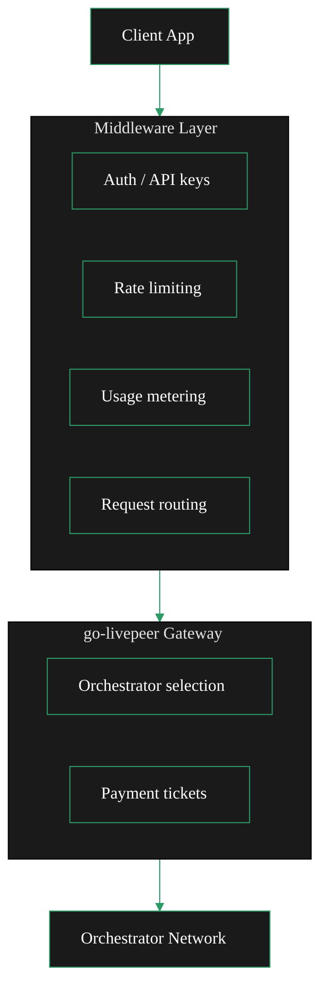

{/* TODO:
Terminology Validation:
- Ensure the terminology and definitions used in this page is consistent with the resources/glossary terminology
Verify:
- Mermaid diagrams use theme colours
- Fontawesome icons are used on accordions and tabs
- Tables use StyledTable component
- No em-dashes are used (instead use standard -)
- UK spelling is used
- Headers are concise and technical
- CustomDivider is used
- Placeholders for Media & Video Resources are in comments with a TODO for a human. (N/A)
- REVIEW flags are in JSX flags for a human.
Human:
- Port 8937 → 8935 in proxy examples
- Mermaid JSX component → standard code fence
- Markdown tables → StyledTable
- Voice converted to entity-led
- Em dashes removed
- production-hardening card already replaced
*/}

import { CustomDivider } from "/snippets/components/primitives/divider.jsx"
import { LinkArrow } from '/snippets/components/primitives/links.jsx'
import { StyledTable, TableRow, TableCell } from '/snippets/components/layout/tables.jsx'
import { BorderedBox } from "/snippets/components/layout/containers.jsx"
import { ScrollableDiagram } from "/snippets/components/content/zoomableDiagram.jsx"
import { StyledSteps, StyledStep } from "/snippets/components/layout/steps.jsx"

<Tip>
    This page covers the **request pipeline** - the layer between clients and the Gateway.
    <br />The **payment pipeline** (how the Gateway settles with Orchestrators) is covered in <LinkArrow href="/v2/gateways/guides/payments-and-pricing/clearinghouse-guide" label="Clearinghouses" newline={false} />.
</Tip>

<CustomDivider style={{margin: "-1rem 0 -1rem 0"}} />

The `go-livepeer` binary is a routing and payment engine. It does not authenticate users, meter usage, or route premium customers to different Orchestrators.
<br/> Those concerns belong to a middleware layer sitting between clients and the Gateway process.


## Responsibilities

<ScrollableDiagram title="Middleware Architecture" maxHeight="500px">



</ScrollableDiagram>

The middleware handles the customer-facing interface. The Gateway handles the network interface.

<StyledTable>
  <TableRow header>
    <TableCell header>Concern</TableCell>
    <TableCell header>Middleware</TableCell>
    <TableCell header>go-livepeer</TableCell>
  </TableRow>
  <TableRow>
    <TableCell>API key validation</TableCell>
    <TableCell>Yes</TableCell>
    <TableCell>No</TableCell>
  </TableRow>
  <TableRow>
    <TableCell>JWT / OAuth verification</TableCell>
    <TableCell>Yes</TableCell>
    <TableCell>No</TableCell>
  </TableRow>
  <TableRow>
    <TableCell>Per-customer rate limits</TableCell>
    <TableCell>Yes</TableCell>
    <TableCell>No</TableCell>
  </TableRow>
  <TableRow>
    <TableCell>Usage tracking and billing</TableCell>
    <TableCell>Yes</TableCell>
    <TableCell>No</TableCell>
  </TableRow>
  <TableRow>
    <TableCell>Customer-to-tier routing</TableCell>
    <TableCell>Yes</TableCell>
    <TableCell>No</TableCell>
  </TableRow>
  <TableRow>
    <TableCell>Orchestrator selection</TableCell>
    <TableCell>No</TableCell>
    <TableCell>Yes</TableCell>
  </TableRow>
  <TableRow>
    <TableCell>Probabilistic micropayments</TableCell>
    <TableCell>No</TableCell>
    <TableCell>Yes</TableCell>
  </TableRow>
  <TableRow>
    <TableCell>On-chain settlement</TableCell>
    <TableCell>No</TableCell>
    <TableCell>Yes</TableCell>
  </TableRow>
</StyledTable>

<CustomDivider style={{margin: "0 0 -2rem 0"}} />

## Architecture

Three deployment patterns cover most middleware use cases.

<BorderedBox>
    <Tabs>
        <Tab title="Reverse Proxy" icon="shield-halved">
            The simplest and most maintainable pattern: an existing reverse proxy handles TLS, auth, and rate limiting before passing requests to the Gateway.

            **Caddy with API key auth** (simplest):

            ```caddyfile icon="terminal" Caddy File
            ai-gateway.yourdomain.com {
                @authenticated {
                    header Authorization "Bearer {$VALID_API_KEY}"
                }
                handle @authenticated {
                    reverse_proxy localhost:8935
                }
                respond 401
            }
            ```

            **Nginx with external auth** (more flexible - delegates auth to a backend):

            ```nginx icon="terminal" NGINX
            server {
                listen 443 ssl;
                server_name ai-gateway.yourdomain.com;

                location / {
                    auth_request /auth;
                    proxy_pass http://127.0.0.1:8935;
                }

                location = /auth {
                    proxy_pass http://127.0.0.1:3000/verify-token;
                    proxy_pass_request_body off;
                    proxy_set_header Content-Length "";
                    proxy_set_header X-Original-URI $request_uri;
                }
            }
            ```

            The `/verify-token` endpoint returns `200` to allow or `401` to deny. It can also return headers that nginx forwards to the Gateway, such as customer ID or tier.
        </Tab>
        <Tab title="API Gateway" icon="layer-group">
            For multi-tenant deployments where per-customer rate limits, quota enforcement, and usage analytics are needed, a dedicated API gateway layer fits well.

            **Kong** (open source, self-hosted):

            ```yaml icon="terminal" Kong
            # kong.yml - declarative config
            services:
            - name: livepeer-gateway
                url: http://livepeer-gateway:8935
                routes:
                - name: ai-inference
                    paths:
                    - /
                plugins:
                - name: key-auth
                - name: rate-limiting
                    config:
                    minute: 60
                    policy: local
                - name: request-termination
                    config:
                    status_code: 429
                    message: "Rate limit exceeded"
            ```

            **Traefik** (Docker-native, automatic service discovery):

            ```yaml icon="terminal" Traefik
            # docker-compose.yml
            services:
            traefik:
                image: traefik:v3
                command:
                - "--providers.docker=true"
                - "--entrypoints.websecure.address=:443"

            livepeer-gateway:
                image: livepeer/go-livepeer:master
                labels:
                - "traefik.http.routers.livepeer.rule=Host(`ai-gateway.yourdomain.com`)"
                - "traefik.http.routers.livepeer.middlewares=auth@docker"
                - "traefik.http.middlewares.auth.basicauth.users=user:$$apr1$$..."
            ```
        </Tab>
        <Tab title="Custom Proxy" icon="code">
        For operators who need full control over routing logic, a lightweight custom proxy in Node.js, Go, or Python sits in front of the Gateway.

        **Node.js example** (Express + http-proxy-middleware):

        ```javascript icon="code"  Custom Proxy
        const express = require('express');
        const { createProxyMiddleware } = require('http-proxy-middleware');
        const app = express();

        // Auth middleware
        app.use(async (req, res, next) => {
        const apiKey = req.headers['x-api-key'];
        const customer = await validateApiKey(apiKey);
        if (!customer) return res.status(401).json({ error: 'Invalid API key' });
        req.customer = customer;
        next();
        });

        // Usage metering
        app.use((req, res, next) => {
        const start = Date.now();
        res.on('finish', () => {
            recordUsage(req.customer.id, req.path, Date.now() - start);
        });
        next();
        });

        // Route to Gateway
        app.use('/', createProxyMiddleware({
        target: 'http://localhost:8935',
        changeOrigin: true,
        }));

        app.listen(3000);
        ```
    </Tab>
    </Tabs>
</BorderedBox>

<CustomDivider style={{margin: "0 0 -2rem 0"}} />

## Authentication

<AccordionGroup>
  <Accordion title="API keys" icon="key">
    The simplest approach. Issue each customer a unique API key, validate it on every request, and store it hashed in a database.

    ```
    Request: X-Api-Key: sk_live_abc123...
    Middleware: hash(sk_live_abc123...) -> look up in DB -> get customer record
    ```

    API keys are easy to rotate without requiring customers to re-authenticate. They are appropriate for server-to-server integrations where the key is stored securely on the client side.
  </Accordion>
  <Accordion title="JWT tokens" icon="id-badge">
    For consumer-facing applications where users authenticate via OAuth (Google, GitHub, etc.), issue short-lived JWT access tokens after authentication. Validate the JWT signature on every request without a database lookup.

    ```javascript
    const jwt = require('jsonwebtoken');

    function verifyToken(req, res, next) {
      const token = req.headers.authorization?.replace('Bearer ', '');
      try {
        const payload = jwt.verify(token, process.env.JWT_SECRET);
        req.customer = { id: payload.sub, tier: payload.tier };
        next();
      } catch {
        res.status(401).json({ error: 'Invalid token' });
      }
    }
    ```

    JWTs are appropriate for Gateways that serve end-users directly through a web or mobile application.
  </Accordion>
  <Accordion title="Live AI webhook auth" icon="webhook">
    For Live AI (video-to-video) workloads, go-livepeer supports webhook-based RTMP authentication. The Gateway calls the webhook when an RTMP stream connects, and the webhook returns allow or deny.

    ```bash
    -liveAIAuthWebhookUrl https://auth-service.example.com/rtmp-auth
    -liveAIAuthApiKey <internal-api-key-for-webhook>
    ```

    The webhook receives the stream key and can validate it against a customer database before allowing the stream through.

    {/* REVIEW: Confirm `-liveAIAuthWebhookUrl` and `-liveAIAuthApiKey` are the correct flags and describe current webhook auth behaviour in go-livepeer - Rick or j0sh to verify */}
  </Accordion>
</AccordionGroup>

<CustomDivider style={{margin: "0 0 -2rem 0"}} />

## Settings
<StyledSteps>
    <StyledStep icon="integral">
        ### Rate Limiting

        Rate limiting protects the Gateway from abuse and enforces fair usage across customers. Implement it in the middleware layer, not in go-livepeer.

        The appropriate limits depend on the Orchestrator pool capacity and customer agreements. A reasonable starting point for an AI inference Gateway:

        <StyledTable>
        <TableRow header>
            <TableCell header>Tier</TableCell>
            <TableCell header>Requests per minute</TableCell>
            <TableCell header>Concurrent sessions</TableCell>
        </TableRow>
        <TableRow>
            <TableCell>Free</TableCell>
            <TableCell>10</TableCell>
            <TableCell>1</TableCell>
        </TableRow>
        <TableRow>
            <TableCell>Standard</TableCell>
            <TableCell>60</TableCell>
            <TableCell>5</TableCell>
        </TableRow>
        <TableRow>
            <TableCell>Premium</TableCell>
            <TableCell>300</TableCell>
            <TableCell>20</TableCell>
        </TableRow>
        </StyledTable>

        Track limits in Redis for shared-memory rate limiting across multiple middleware instances:

        ```javascript icon="code" Redis
        const rateLimit = require('express-rate-limit');
        const RedisStore = require('rate-limit-redis');

        const limiter = rateLimit({
        windowMs: 60 * 1000,
        max: (req) => req.customer.tier === 'premium' ? 300 : 60,
        store: new RedisStore({ client: redisClient }),
        keyGenerator: (req) => req.customer.id,
        });
        ```
        <CustomDivider style={{margin: "-2.5rem auto -2rem auto", width: "50%"}} />
    </StyledStep>
    <StyledStep icon="route">
        ### Custom Routing

        The most powerful use of middleware is routing different customers or job types to different Gateway instances, each configured with a distinct Orchestrator pool.

        ```javascript
        // Route premium customers to high-performance Orchestrators
        app.use('/process', async (req, res) => {
        const target = req.customer.tier === 'premium'
            ? 'http://localhost:8935'   // Gateway A: premium orch list, high price cap
            : 'http://localhost:8936';  // Gateway B: standard orch list, lower price cap

        proxyRequest(req, res, target);
        });
        ```

        This pattern, combined with <LinkArrow href="/v2/gateways/guides/advanced-operations/orchestrator-selection#tiering-strategy" label="tiered Orchestrator selection" newline={false} />, allows delivering different SLA levels from one middleware deployment.
        <CustomDivider style={{margin: "-2.5rem auto -2rem auto", width: "50%"}} />
    </StyledStep>
    <StyledStep icon="gauge-high">
        ### Usage Metering

        go-livepeer does not track how much each customer has consumed - it only tracks what the Gateway owes Orchestrators. Customer usage must be metered in the middleware.

        What to track per request:
        - Customer ID
        - Pipeline type (text-to-image, video transcoding, etc.)
        - Input parameters (resolution, number of outputs, duration)
        - Response time
        - Success or failure

        Store events in a time-series database or event queue, then aggregate for invoicing.

        ```javascript icon="code" Usage Metering
        res.on('finish', () => {
        usageQueue.push({
            customerId: req.customer.id,
            pipeline: extractPipeline(req.path),
            durationMs: Date.now() - startTime,
            statusCode: res.statusCode,
            timestamp: new Date().toISOString(),
        });
        });
        ```
        <CustomDivider style={{margin: "-2.5rem auto -2rem auto", width: "50%"}} />
    </StyledStep>
</StyledSteps>

{/* <CustomDivider style={{margin: "-1rem 0 -2rem 0"}} /> */}

## Middleware vs Clearinghouse

A clearinghouse combines middleware concerns with payment pipeline concerns into a single managed service:

<StyledTable>
  <TableRow header>
    <TableCell header>Concern</TableCell>
    <TableCell header>Custom middleware</TableCell>
    <TableCell header>Clearinghouse</TableCell>
  </TableRow>
  <TableRow>
    <TableCell>Customer auth</TableCell>
    <TableCell>Operator manages</TableCell>
    <TableCell>Managed</TableCell>
  </TableRow>
  <TableRow>
    <TableCell>Usage billing</TableCell>
    <TableCell>Operator manages</TableCell>
    <TableCell>Managed</TableCell>
  </TableRow>
  <TableRow>
    <TableCell>ETH key custody</TableCell>
    <TableCell>Not in scope</TableCell>
    <TableCell>Managed</TableCell>
  </TableRow>
  <TableRow>
    <TableCell>Orchestrator payments</TableCell>
    <TableCell>go-livepeer handles</TableCell>
    <TableCell>Managed</TableCell>
  </TableRow>
  <TableRow>
    <TableCell>Multi-tenant isolation</TableCell>
    <TableCell>Operator builds</TableCell>
    <TableCell>Built in</TableCell>
  </TableRow>
  <TableRow>
    <TableCell>Fiat settlement</TableCell>
    <TableCell>Operator builds</TableCell>
    <TableCell>Built in</TableCell>
  </TableRow>
</StyledTable>

To avoid building the payment side, see <LinkArrow href="/v2/gateways/guides/payments-and-pricing/clearinghouse-guide" label="Clearinghouses" newline={false} /> for delegating ETH custody and payment accounting while keeping custom middleware for auth and routing.

<CustomDivider style={{margin: "0 0 -2rem 0"}} />

## Related Pages

<CardGroup cols={2}>
  <Card title="Scaling" icon="arrow-up-right-dots" href="/v2/gateways/guides/advanced-operations/scaling">
    Scale middleware and Gateway instances together.
  </Card>
  <Card title="Publishing a Gateway" icon="globe" href="/v2/gateways/guides/advanced-operations/gateway-discoverability">
    Make the Gateway discoverable to external developers.
  </Card>
  <Card title="Clearinghouses" icon="building-columns" href="/v2/gateways/guides/payments-and-pricing/clearinghouse-guide">
    Delegate payment handling to a clearinghouse service.
  </Card>
  <Card title="Orchestrator Selection" icon="server" href="/v2/gateways/guides/advanced-operations/orchestrator-selection">
    Tiering, scoring, and failover for Orchestrator selection.
  </Card>
</CardGroup>

{/*
  PURPOSE:
  Journey step: "Custom middleware and integrations"
  Guide for operators building a middleware layer around their gateway.
  Covers auth, rate limiting, request transformation, and custom routing.

  SECTION HOME: Guides > Advanced Operations

  JOURNEY POSITION:
  1. Orchestrator Selection - "Choose the best orchestrators"
  2. Scaling & Resource Management - "When and how to scale"
  3. Gateway Middleware (this page) - "Custom middleware and integrations"
  4. Publishing Your Gateway - "Make your gateway discoverable"

  CROSS-REFS:
  - Payments & Pricing > Clearinghouse Guide - middleware handles request pipeline, clearinghouse handles payment pipeline
  - AI & Job Pipelines > BYOC Pipelines - BYOC routing can be customised via middleware
  - Resources > AI API Reference - endpoints that middleware wraps
*/}
