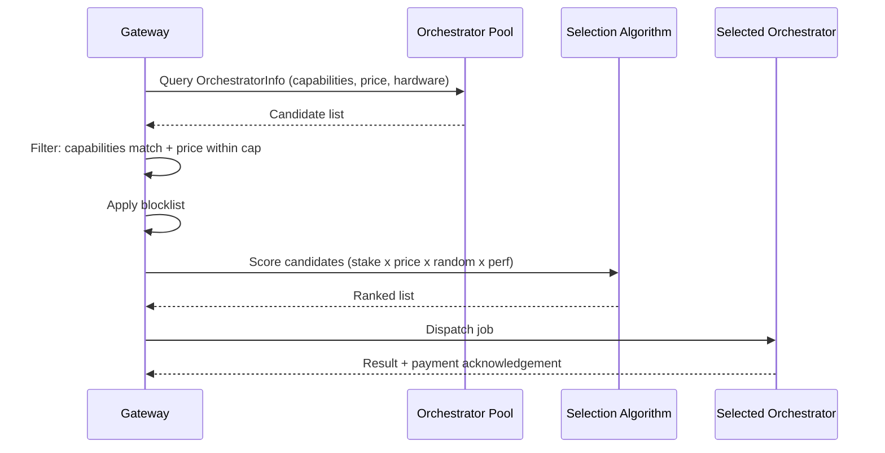

{/* TODO:
Terminology Validation:
- Ensure the terminology and definitions used in this page is consistent with the resources/glossary terminology
Verify:
- ~~Mermaid diagrams use theme colours~~
- ~~Fontawesome icons are used on accordions and tabs~~
- ~~Tables use StyledTable component~~
- ~~No em-dashes are used (instead use standard -)~~
- UK spelling is used
- ~~Headers are concise and technical~~
- ~~CustomDivider is used~~
- Placeholders for Media & Video Resources are in comments with a TODO for a human. (N/A)
- ~~REVIEW flags are in JSX flags for a human.~~
Human:
- Mermaid JSX component → standard code fence
- Markdown tables → StyledTable
- Voice converted to entity-led
- production-hardening references removed
*/}

import { CustomDivider } from "/snippets/components/primitives/divider.jsx"
import { LinkArrow } from '/snippets/components/primitives/links.jsx'
import { StyledTable, TableRow, TableCell } from '/snippets/components/layout/tables.jsx'
import { BorderedBox } from "/snippets/components/layout/containers.jsx"

<CustomDivider style={{margin: "-1rem 0 -1rem 0"}} />

The Gateway's default Orchestrator selection works out of the box: it discovers available Orchestrators, filters by price, and routes jobs.
<br/> For production workloads, operators often need more control. This guide covers manual selection, quality tiering, and failover configuration.


## Selection Algorithm

Before tuning selection, it helps to understand what the Gateway does by default.



The scoring algorithm is a weighted combination of four factors, each adjustable via flags:

<StyledTable>
  <TableRow header>
    <TableCell header>Factor</TableCell>
    <TableCell header>Flag</TableCell>
    <TableCell header>Default behaviour</TableCell>
  </TableRow>
  <TableRow>
    <TableCell>Randomness</TableCell>
    <TableCell>`-selectRandFreq`</TableCell>
    <TableCell>Prevents all traffic concentrating on one Orchestrator</TableCell>
  </TableRow>
  <TableRow>
    <TableCell>LPT stake</TableCell>
    <TableCell>`-selectStakeWeight`</TableCell>
    <TableCell>Favours Orchestrators with more stake</TableCell>
  </TableRow>
  <TableRow>
    <TableCell>Price</TableCell>
    <TableCell>`-selectPriceWeight`</TableCell>
    <TableCell>Favours lower-priced Orchestrators</TableCell>
  </TableRow>
  <TableRow>
    <TableCell>Price sensitivity</TableCell>
    <TableCell>`-selectPriceExpFactor`</TableCell>
    <TableCell>Controls how much small price differences matter</TableCell>
  </TableRow>
</StyledTable>

For AI Gateways using an explicit Orchestrator list (`-orchAddr`), the selection algorithm is simpler: the Gateway round-robins across the listed Orchestrators while respecting capability and price filters.

<CustomDivider style={{margin: "-1rem 0 -2rem 0"}} />

## Workload Criteria

Different workloads have different priorities:

<StyledTable>
  <TableRow header>
    <TableCell header>Criterion</TableCell>
    <TableCell header><Badge color="blue">Video</Badge></TableCell>
    <TableCell header><Badge color="purple">AI</Badge></TableCell>
    <TableCell header><Badge color="green">Dual</Badge></TableCell>
  </TableRow>
  <TableRow>
    <TableCell>Latency</TableCell>
    <TableCell>Critical for real-time</TableCell>
    <TableCell>Important for UX</TableCell>
    <TableCell>Both</TableCell>
  </TableRow>
  <TableRow>
    <TableCell>Price</TableCell>
    <TableCell>Important</TableCell>
    <TableCell>Important</TableCell>
    <TableCell>Both</TableCell>
  </TableRow>
  <TableRow>
    <TableCell>Codec capability</TableCell>
    <TableCell>Required</TableCell>
    <TableCell>Not applicable</TableCell>
    <TableCell>Video path</TableCell>
  </TableRow>
  <TableRow>
    <TableCell>AI model / pipeline</TableCell>
    <TableCell>Not applicable</TableCell>
    <TableCell>Required</TableCell>
    <TableCell>AI path</TableCell>
  </TableRow>
  <TableRow>
    <TableCell>GPU type</TableCell>
    <TableCell>Less critical</TableCell>
    <TableCell>Critical (VRAM)</TableCell>
    <TableCell>Critical</TableCell>
  </TableRow>
  <TableRow>
    <TableCell>Historical performance</TableCell>
    <TableCell>High weight</TableCell>
    <TableCell>Medium weight</TableCell>
    <TableCell>Both</TableCell>
  </TableRow>
  <TableRow>
    <TableCell>Minimum version</TableCell>
    <TableCell>`-orchMinLivepeerVersion`</TableCell>
    <TableCell>Optional</TableCell>
    <TableCell>Optional</TableCell>
  </TableRow>
</StyledTable>

<CustomDivider style={{margin: "0 0 -2rem 0"}} />

## Orchestrator Settings

<BorderedBox variant="accent">
    <Tabs>
        <Tab title="Pinning Orchestrators" icon="thumbtack">
            ### Pinning Orchestrators

            For off-chain AI Gateways, the most reliable approach is to maintain an explicit list of known-good Orchestrators. The Gateway round-robins across this list and does not discover others.

            ```bash icon="terminal" -orchAddr
            -orchAddr https://orch1.example.com:8935,https://orch2.example.com:8935,https://orch3.example.com:8935
            ```

            This trades network-wide discovery flexibility for predictability: the operator knows exactly which Orchestrators handle jobs and can vet each one before adding it. This is the recommended approach for production AI workloads.

            To find AI-capable Orchestrators:
            - [Livepeer Explorer](https://explorer.livepeer.org) AI leaderboard {/* REVIEW: Confirm AI leaderboard is live on Explorer and what metrics it shows - Rick to verify */}
            - [tools.livepeer.cloud](https://tools.livepeer.cloud) - community tool suite with Orchestrator performance data
            - The `/getNetworkCapabilities` endpoint on the Gateway, filtered by pipeline and model
        </Tab>
        <Tab title="Dynamic Discovery" icon="search">
            ### Dynamic Discovery

            For video Gateways and on-chain AI Gateways that draw from the full network, use webhook-based discovery instead of a static list.

            ```bash icon="terminal" -orchWebhookUrl
            -orchWebhookUrl https://discovery-service.example.com/orchestrators
            ```

            The webhook endpoint returns a JSON array of Orchestrator URIs. The Gateway calls this URL at session start to get a fresh candidate list, then applies its scoring algorithm. This allows maintaining a curated Orchestrator pool externally, with the Gateway fetching updates dynamically.

            <Tip>
            A simple webhook can be a static JSON file served by a web server. Update it when adding or removing Orchestrators from the preferred pool.
            </Tip>
        </Tab>
        <Tab title="Performance Scoring" icon="arrow-trend-up">
            ### Performance Scoring

            Beyond the built-in selection weights, the Gateway can use an external performance scoring service to influence Orchestrator selection.

            ```bash icon="terminal" -orchPerfStatsUrl -minPerfScore
            -orchPerfStatsUrl https://leaderboard.livepeer.org/api/aggregated_stats
            -minPerfScore 0.8
            ```

            {/* REVIEW: Confirm the leaderboard API endpoint URL and response format - Rick to verify current URL is `https://leaderboard.livepeer.org/api/aggregated_stats` */}

            `-orchPerfStatsUrl` points to a service that returns per-Orchestrator performance statistics. The Livepeer community leaderboard provides this data. `-minPerfScore` sets a minimum acceptable score; Orchestrators below this threshold are excluded regardless of price.

            Performance scores are calculated from real transcoding tests run by the leaderboard against each registered Orchestrator. Scores range from 0 to 1, where 1 represents consistently correct transcoding output within latency targets. For production video transcoding, a minimum score of 0.8 or higher is recommended.
        </Tab>
        <Tab title="Blocklisting" icon="circle-xmark">
            ### Blocklisting

            To exclude an Orchestrator producing incorrect results, charging unexpected prices, or behaving maliciously:

            ```bash icon="terminal" -orchBlocklist
            -orchBlocklist 0xAbCd1234...,0xEfGh5678...
            ```

            Blocklisted Orchestrators are excluded from all selection regardless of price or capability. Pass Ethereum addresses as a comma-separated list. This flag takes effect at process start; to update it, restart the Gateway.

            <Note>
            The blocklist is a last resort, not a tier management tool. For tiering, use the performance score threshold and price caps instead.
            </Note>
        </Tab>
    </Tabs>
</BorderedBox>

<CustomDivider style={{margin: "-1rem 0 -2rem 0"}} />

## Tiering Strategy

Operators running a gateway-as-service with SLA commitments route different customer tiers to different Orchestrator quality levels. Since go-livepeer does not natively support named tiers, the pattern is to run separate Gateway instances per tier, each with a different configuration.

```
Tier 1 (premium) -> Gateway instance A
    -orchAddr <premium-orch-list>
    -maxPricePerUnit 5000         # Higher cap = access to better Orchestrators
    -minPerfScore 0.95

Tier 2 (standard) -> Gateway instance B
    -orchAddr <standard-orch-list>
    -maxPricePerUnit 2000
    -minPerfScore 0.8

Tier 3 (budget) -> Gateway instance C
    -maxPricePerUnit 500
    # No minPerfScore - accepts wider range
```

The middleware layer (see <LinkArrow href="/v2/gateways/guides/advanced-operations/gateway-middleware" label="Gateway Middleware" newline={false} />) routes incoming requests to the correct Gateway instance based on the customer's tier.

<CustomDivider style={{margin: "-1rem 0 -2rem 0"}} />

## Failover Behaviour

<AccordionGroup>
  <Accordion title="Automatic swaps" icon="arrows-rotate">
    When an Orchestrator fails mid-job, the Gateway automatically swaps to the next candidate in its selection pool. For video transcoding, the stream continues on a new Orchestrator with segments re-attempted. For AI inference, the request is retried on a different Orchestrator.

    The number of retry attempts before the job fails is controlled by `-maxAttempts` (video transcoding). For AI jobs, the retry behaviour depends on the pipeline.

    {/* REVIEW: Confirm `-maxAttempts` applies to gateway retry on orchestrator failure, not just transcoding attempts - Rick to verify. Also confirm AI inference retry count/flag */}
  </Accordion>
  <Accordion title="Reducing swaps" icon="chart-line-down">
    High Orchestrator swap rates indicate instability in the Orchestrator pool, such as under-resourced machines or network issues. To reduce swaps:

    - Increase `-minPerfScore` to exclude poorly-performing Orchestrators proactively
    - Add `-orchMinLivepeerVersion` to exclude outdated nodes
    - Review `-maxPricePerUnit` or `-maxPricePerCapability` ceiling: if it is too low, the Gateway may be cycling through marginal Orchestrators

    Monitor the `livepeer_orchestrator_swaps` Prometheus counter to track swap frequency over time.

    {/* REVIEW: Confirm Prometheus metric name is `livepeer_orchestrator_swaps` - Rick to verify */}
  </Accordion>
  <Accordion title="Discovery timeout" icon="clock">
    If the Gateway cannot find a suitable Orchestrator within the discovery window, the job fails. The timeout is configurable:

    ```bash
    -discoveryTimeout 10s
    ```

    Increase this if jobs fail because no Orchestrator was found, particularly at startup or after a blocklist change. Decrease it for faster failure detection in latency-sensitive applications.
  </Accordion>
</AccordionGroup>

<CustomDivider style={{margin: "0 0 -2rem 0"}} />

## AI Capability Matching

For AI Gateways, Orchestrator selection is driven by capability matching before any price or performance scoring applies. The Gateway only considers Orchestrators that declare support for the requested pipeline and model.

Capability information is returned by `/getNetworkCapabilities`. To inspect which Orchestrators support a specific model:

```bash icon="terminal" /getNetworkCapabilities
curl http://localhost:8935/getNetworkCapabilities | \
  jq '.orchestrators[] | select(.capabilities_prices[].model_id == "black-forest-labs/FLUX.1-dev")'
```

Set per-capability price caps to control costs per pipeline:

```bash icon="terminal" -maxPricePerCapability
-maxPricePerCapability '[{"pipeline":"text-to-image","model_id":"black-forest-labs/FLUX.1-dev","price_per_unit":100,"pixels_per_unit":1000000}]'
```

If no Orchestrator in the pool meets both the capability requirement and the price cap, the job fails. To relax the price cap rather than fail the job:

```bash icon="terminal" -ignoreMaxPriceIfNeeded
-ignoreMaxPriceIfNeeded
```

<CustomDivider style={{margin: "-1rem 0 -2rem 0"}} />

## Monitoring Selection

Track selection health in production:

<StyledTable>
  <TableRow header>
    <TableCell header>Signal</TableCell>
    <TableCell header>Source</TableCell>
    <TableCell header>What to watch</TableCell>
  </TableRow>
  <TableRow>
    <TableCell>Swap rate</TableCell>
    <TableCell>Prometheus `livepeer_orchestrator_swaps`</TableCell>
    <TableCell>Rising trend = instability</TableCell>
  </TableRow>
  <TableRow>
    <TableCell>Success rate</TableCell>
    <TableCell>Prometheus (calculated)</TableCell>
    <TableCell>Below 0.95 = investigate</TableCell>
  </TableRow>
  <TableRow>
    <TableCell>Connected Orchestrators</TableCell>
    <TableCell>`/getNetworkCapabilities`</TableCell>
    <TableCell>Fewer than expected = discovery issue</TableCell>
  </TableRow>
  <TableRow>
    <TableCell>Orchestrator status</TableCell>
    <TableCell>`livepeer_cli` Option 1</TableCell>
    <TableCell>Active connection and pricing</TableCell>
  </TableRow>
  <TableRow>
    <TableCell>Performance scores</TableCell>
    <TableCell>leaderboard.livepeer.org</TableCell>
    <TableCell>Comparison vs network</TableCell>
  </TableRow>
</StyledTable>

{/* REVIEW: Confirm Prometheus metric names `livepeer_success_rate` - Rick to verify exact metric names in current go-livepeer */}

<CustomDivider style={{margin: "0 0 -2rem 0"}} />

## Related Pages

<CardGroup cols={2}>
  <Card title="Monitoring Setup" icon="chart-line" href="/v2/gateways/guides/monitoring-and-tooling/monitoring-setup">
    Prometheus metrics for tracking Orchestrator swap rates and selection health.
  </Card>
  <Card title="Scaling" icon="arrow-up-right-dots" href="/v2/gateways/guides/advanced-operations/scaling">
    Session limits and when to scale horizontally.
  </Card>
  <Card title="Orchestrator Offerings" icon="book" href="/v2/gateways/resources/technical/orchestrator-offerings">
    Full OrchestratorInfo data structure and discovery API reference.
  </Card>
  <Card title="Configuration Flags" icon="sliders" href="/v2/gateways/resources/technical/configuration-flags">
    All selection and scoring flags in one place.
  </Card>
</CardGroup>

{/*
  PURPOSE:
  Journey step: "Choose the best orchestrators for my workloads"
  Guide for operators who need to go beyond default orchestrator selection.
  Covers performance-based selection, tiering, failover, and manual control.

  SECTION HOME: Guides > Advanced Operations

  JOURNEY POSITION:
  1. Orchestrator Selection (this page) - "Choose the best orchestrators"
  2. Scaling & Resource Management - "When and how to scale"
  3. Gateway Middleware - "Custom middleware and integrations"
  4. Publishing Your Gateway - "Make your gateway discoverable"

  CROSS-REFS:
  - AI & Job Pipelines > Pipeline Overview - routing fundamentals
  - Setup > Network Connect > Discover Offerings - initial orchestrator discovery
  - Resources > Orchestrator Offerings - full data model reference
  - Monitoring > Tools & Dashboards - tools for evaluating orchestrators
*/}
