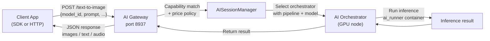

{/* TODO:
Terminology Validation:
- Ensure the terminology and definitions used in this page is consistent with the resources/glossary terminology
Verify:
- Mermaid diagrams use theme colours (but must be hardcoded - see snippets/components/page-structure/mermaid-colours.jsx)
- Fontawesome icons are used on accordions and tabs
- Tables use StyledTable component
- No em-dashes are used (instead use standard -)
- UK spelling is used
- Headers are concise and technical - no long headers or questions (aim for max 3 words)
- CustomDivider is used with <CustomDivider style={{margin: "-1rem 0 -1rem 0"}} /> for all --- separator breaks
- Placeholders for Media & Video Resources are in comments with a TODO for a human.
- REVIEW flags are in JSX flags for a human.
*/}

Your AI gateway receives HTTP inference requests, matches each one to a capable orchestrator, and returns the result to the client. No ETH deposit is required for standard off-chain AI operation. The pipeline differs fundamentally from video transcoding — requests are discrete HTTP calls, not streaming segments, and routing is by pipeline and model capability rather than by pixel throughput.

<Note>
  This page covers how AI jobs flow through your gateway. For initial setup and startup commands, see Setup → AI Gateway Quickstart. For custom container workloads, see BYOC Pipelines.
</Note>

{/* ============================================================
    1. REQUEST FLOW
    ============================================================ */}

## Request flow



The `AISessionManager` is the gateway component responsible for session tracking, capability matching, and failover. It is the AI equivalent of the video pipeline's `BroadcastSessionsManager`.

<Card
  title="Source reference: AISessionManager"
  icon="github"
  href="https://github.com/livepeer/go-livepeer/blob/master/server/ai_http.go"
  horizontal
  arrow
>
  go-livepeer/server/ai_http.go
</Card>

{/* ============================================================
    2. KEY DIFFERENCE FROM VIDEO
    ============================================================ */}

## How AI inference differs from video transcoding

| Aspect | Video transcoding | AI inference |
|---|---|---|
| Payment model | On-chain PM tickets (ETH deposit required) | Off-chain (no ETH required) |
| Ingest format | RTMP stream or HTTP segment push | Discrete HTTP POST per job |
| Output | Streaming HLS manifest | JSON response (images, text, audio) |
| Session type | Long-running streaming session | Short request/response |
| Orchestrator selection | Price + latency + segment history | Pipeline capability + model availability + price |
| GPU requirement on orchestrator | Optional (CPU mode exists) | Required |

{/* ============================================================
    3. PIPELINE TYPES
    ============================================================ */}

## Available pipeline types

Livepeer AI inference routes across three integration patterns. As a gateway operator, you do not build or implement these — you configure which orchestrators you connect to and which pipeline endpoints you expose.

<AccordionGroup>
  <Accordion title="Standard API pipelines" icon="code">
    Pre-built, well-defined inference endpoints. Each pipeline has a fixed URL path and request/response schema. Your gateway routes requests to orchestrators advertising the matching pipeline and model.

    | Pipeline | Endpoint | Output | Pricing unit |
    |---|---|---|---|
    | Text to image | `/text-to-image` | Image (PNG/JPEG) | Pixels |
    | Image to image | `/image-to-image` | Image | Pixels |
    | Image to video | `/image-to-video` | Video | Pixels |
    | Upscale | `/upscale` | Image | Pixels |
    | Audio to text | `/audio-to-text` | Transcript JSON | Audio milliseconds |
    | Image to text | `/image-to-text` | Text | Pixels |
    | Text to speech | `/text-to-speech` | Audio | Audio milliseconds |
    | Segment Anything 2 | `/segment-anything-2` | Segmentation mask | Pixels |
    | Live video to video | `/live-video-to-video` | Transformed stream | Interval-based |
    | LLM | `/llm` | Text | Per-request or per-token |

    To call a pipeline from your application:

    {/* REVIEW: confirm pricing unit for text-to-speech with j0sh/Peter. */}
    {/* REVIEW: confirm per-token vs per-request pricing for LLM with j0sh. */}

    ```bash
    curl -X POST http://localhost:8937/text-to-image \
      -H "Content-Type: application/json" \
      -d '{
        "model_id": "SG161222/RealVisXL_V4.0_Lightning",
        "prompt": "a photograph of a coastal village at dusk",
        "width": 1024,
        "height": 1024,
        "num_inference_steps": 6,
        "guidance_scale": 1.5
      }'
    ```

    <Tip>
      Lightning-suffix models (such as `RealVisXL_V4.0_Lightning`) use fewer inference steps (4–8) and a lower guidance scale (1.0–2.0). Standard SDXL models need 20–50 steps and guidance 7.0–9.0. Use the correct parameters for the model family or image quality will degrade.
    </Tip>
  </Accordion>

  <Accordion title="ComfyStream (real-time video AI)" icon="video">
    ComfyStream integrates ComfyUI workflows with the Livepeer gateway protocol to process live video frames in real time. Each frame is sent to a ComfyStream worker, transformed by a ComfyUI graph (style transfer, depth estimation, face animation), and reassembled into an output stream. TensorRT-accelerated models target 15–30 FPS throughput.

    **Use ComfyStream for:**
    - Real-time style transfer on live streams
    - Per-frame AI effects (depth estimation, face animation, overlays)
    - Interactive AI art with webcam or live video input

    From a gateway operator perspective, ComfyStream workers appear as AI-capable orchestrators. You connect to them via `-orchAddr` the same way as standard AI orchestrators. The pipeline capability they advertise distinguishes them.

    <Card
      title="ComfyStream repository"
      icon="github"
      href="https://github.com/livepeer/comfystream"
      horizontal
      arrow
    >
      livepeer/comfystream
    </Card>
  </Accordion>

  <Accordion title="BYOC (custom containers)" icon="box">
    BYOC lets orchestrators run custom Docker inference containers and advertise them as capabilities. Your gateway routes by capability descriptor (for example, `image-to-image` or `depth`) rather than by model name. The orchestrator handles everything inside the container.

    BYOC from the gateway side is covered in full on the BYOC Pipelines page. The key operator responsibilities are routing by capability, tracking health per capability, and configuring retry policy for cold-start delays.
  </Accordion>
</AccordionGroup>

{/* ============================================================
    4. ORCHESTRATOR DISCOVERY
    ============================================================ */}

## Orchestrator discovery

AI gateways operating off-chain do not use the on-chain registry. You specify orchestrators directly.

```bash
-orchAddr https://orch1.example.com:8935,https://orch2.example.com:8935
```

The format is `scheme://host:port`. All orchestrators must be running `ai-runner` containers and advertising the pipelines you intend to route. If an orchestrator does not support a requested pipeline, the job fails or falls back to the next orchestrator if one is available.

<Warning>
  There is no unified AI model registry. You cannot query the network for a list of all available models across all orchestrators. This is a known gap in the current architecture. To discover what models and pipelines a specific orchestrator supports, query their info endpoint directly — {/* REVIEW: confirm exact endpoint path with Rick/j0sh */} typically at `https://orch1.example.com:8935/getOrchestratorInfo`.
</Warning>

**Current discovery methods:**

- Query orchestrator info endpoints directly
- Check `tools.livepeer.cloud/ai/network-capabilities` for a community view of warm models across the public network
- Join Discord `#local-gateways` — SPE operators post their offerings and available models
- Check Livepeer Explorer for registered orchestrators

<Tip>
  Check [tools.livepeer.cloud/ai/network-capabilities](https://tools.livepeer.cloud/ai/network-capabilities) before selecting a model ID. Models already loaded in GPU memory (warm models) return results significantly faster than cold models that must load from disk first.
</Tip>

{/* ============================================================
    5. MODEL MATCHING
    ============================================================ */}

## Capability and model matching

When a request arrives at your gateway, the `AISessionManager` matches it to an orchestrator based on two criteria:

1. **Pipeline:** does the orchestrator advertise this pipeline type? (e.g., `text-to-image`)
2. **Model:** does the orchestrator have the requested `model_id` available?

If no orchestrator matches both criteria, the request fails with an error. If multiple orchestrators match, the manager routes to the best-performing one based on latency history and current load.

**Warm vs cold models:**

Orchestrators load models into GPU memory. A model loaded and ready to serve immediately is "warm". A model that must be downloaded or loaded from disk before it can serve is "cold". Cold starts add seconds to minutes of latency for the first request. Warm models respond in milliseconds.

During the current beta phase, orchestrators support one warm model per GPU. {/* REVIEW: confirm whether warm-per-GPU limit has changed since beta — check v1--models-config.mdx for current status */}

{/* ============================================================
    6. GATEWAY COMPONENTS (AI-SPECIFIC)
    ============================================================ */}

## Gateway components for AI

<Card
  title="Source reference: ai_mediaserver.go"
  icon="github"
  href="https://github.com/livepeer/go-livepeer/blob/master/server/ai_mediaserver.go"
  horizontal
  arrow
/>

The AI pipeline uses several components that do not exist in the video pipeline:

<AccordionGroup>
  <Accordion title="AISessionManager" icon="gear">
    Manages AI processing sessions and selects orchestrators with matching AI capabilities. Tracks performance per orchestrator per pipeline. Handles retry and failover when an orchestrator fails mid-request. Defined in `server/ai_http.go`.
  </Accordion>
  <Accordion title="MediaMTX integration" icon="stream">
    Handles media streaming for real-time AI pipelines (ComfyStream and live-video-to-video). MediaMTX manages the stream lifecycle and frame routing between the gateway and the AI worker.
  </Accordion>
  <Accordion title="Trickle protocol" icon="droplet">
    Enables efficient low-latency streaming for real-time AI video pipelines. The Trickle protocol incrementally delivers video frames to the AI worker rather than buffering full segments, keeping end-to-end latency low for live AI effects.
  </Accordion>
  <Accordion title="ai_process.go workflow" icon="diagram-project">
    The `server/ai_process.go` file defines the core AI job workflow: authenticate the request, select a capable orchestrator, process the payment (off-chain for standard AI), and manage the live AI pipeline session. This is where per-pixel pricing calculations happen for image pipelines.
  </Accordion>
</AccordionGroup>

{/* ============================================================
    7. RETRY LOGIC
    ============================================================ */}

## Retry logic

If an orchestrator fails to return a result (timeout, model not loaded, GPU error), the `AISessionManager` retries the request with the next best orchestrator.

The retry timeout is controlled by:

```bash
-aiProcessingRetryTimeout 30s
```

The value accepts Go duration format: `30s`, `1m`, `2m30s`. For pipelines that use slow-loading models (cold starts), increase this value — otherwise the gateway will retry before the orchestrator has had time to load the model.

{/* ============================================================
    8. OFF-CHAIN VS ON-CHAIN AI
    ============================================================ */}

## Off-chain vs on-chain AI

<Tabs>
  <Tab title="Off-chain AI (standard)">
    The default AI gateway mode. No ETH deposit, no TicketBroker interaction, no Arbitrum RPC required.

    The gateway connects directly to orchestrators via `-orchAddr`. Payment is handled outside the Livepeer PM system — typically via direct billing arrangement with orchestrator operators, or by running your own orchestrator.

    Start command (minimum flags):

    ```bash
    livepeer \
      -gateway \
      -orchAddr https://orch1.example.com:8935 \
      -httpAddr 0.0.0.0:8937 \
      -httpIngest \
      -v 6
    ```
  </Tab>
  <Tab title="On-chain AI (dual gateway)">
    When running a dual gateway (AI + video, on-chain), the PM payment system applies to AI jobs as well. ETH deposit and reserve are required. The gateway uses the same ticket-based payment mechanism as video transcoding.

    Additional flags required for on-chain AI:

    ```bash
    -network arbitrum-one-mainnet
    -ethUrl https://arb1.arbitrum.io/rpc    # replace with your own RPC
    -ethKeystorePath /root/.lpData/arbitrum-one-mainnet/keystore
    -ethAcctAddr <YOUR_ETH_ADDRESS>
    -ethPassword /root/.lpData/.eth_secret
    ```

    {/* REVIEW: confirm whether -aiServiceRegistry flag is still required for on-chain AI — check with Rick */}

    See Dual Gateway Configuration for the complete on-chain AI setup guide.
  </Tab>
</Tabs>

{/* ============================================================
    9. PLATFORM LIMITATIONS
    ============================================================ */}

## Platform limitations

<Warning>
  The Livepeer AI binary is Linux-only. Windows and macOS builds are not available. This constraint affects orchestrators, not gateways — but it limits your testing options if you do not have a Linux machine available.
</Warning>

The AI inference stack requires a CUDA/GPU toolchain that is only available on Linux. The limitation applies to `ai-runner` containers running on orchestrators.

| Platform | Video gateway | AI gateway (go-livepeer) | AI binary (orchestrator) |
|---|---|---|---|
| Linux | Yes | Yes | Yes |
| macOS | Yes | Yes | No (GPU toolchain unavailable) |
| Windows | Yes | Yes | No (GPU toolchain unavailable) |

**Workaround for Windows/macOS testing:** Run the `ai-runner` Docker container on a Linux machine or cloud instance. Docker on Linux is the standard production deployment method.

```bash
# Docker on Linux — standard AI gateway deployment
docker run \
  --name livepeer_ai_gateway \
  -v ~/.lpData2/:/root/.lpData2 \
  -p 8937:8937 \
  --network host \
  livepeer/go-livepeer:master \
  -datadir ~/.lpData2 \
  -gateway \
  -orchAddr https://orch1.example.com:8935 \
  -httpAddr 0.0.0.0:8937 \
  -httpIngest \
  -v 6
```

{/* ============================================================
    10. KNOWN GAP: NO UNIFIED MODEL REGISTRY
    ============================================================ */}

## Known gap: no unified AI model registry

There is currently no on-chain or off-chain registry that lets operators query all available models and pipelines across the network in one place. Discovery is fragmented across tools and community channels.

Community-maintained resources that partially fill this gap:

| Resource | What it shows | URL |
|---|---|---|
| Livepeer Tools | Warm models on public AI network | [tools.livepeer.cloud/ai/network-capabilities](https://tools.livepeer.cloud/ai/network-capabilities) |
| Discord #local-gateways | SPE operator offerings | [discord.gg/livepeer](https://discord.gg/livepeer) |
| Orchestrator info endpoint | What a specific orchestrator supports | `https://orch.example.com:8935/getOrchestratorInfo` |

A unified AI capability registry is an active area of community discussion. Contribute to the conversation on the [Livepeer Forum](https://forum.livepeer.org).

{/* ============================================================
    11. NEXT STEPS
    ============================================================ */}

## Next steps

<CardGroup cols={2}>
  <Card title="BYOC Pipelines" icon="box" href="./byoc-pipelines">
    Route custom container workloads by capability — operator responsibilities, model fit, and health tracking.
  </Card>
  <Card title="Pipeline Configuration" icon="sliders" href="./pipeline-configuration">
    AI routing flags, retry timeouts, and per-pipeline pricing reference.
  </Card>
  <Card title="Monitoring Setup" icon="chart-line" href="../monitoring-and-tooling/monitoring-setup">
    AI-specific Prometheus metrics, discovery error tracking, and session capacity monitoring.
  </Card>
  <Card title="AI API Reference" icon="code" href="/v2/gateways/resources/technical/api-reference/AI-API/text-to-image">
    Full endpoint reference for all AI pipelines.
  </Card>
</CardGroup>


{/* ---
title: 'AI Inference Pipeline'
description: 'How AI jobs flow through your gateway — HTTP requests, orchestrator discovery, model routing, retry logic, and available pipeline types (Standard API, ComfyStream, BYOC).'
sidebarTitle: 'AI Inference'
pageType: 'guide'
audience: 'gateway'
status: 'stub'
--- */}

{/*
  PURPOSE:
  Journey step: "How do AI jobs flow through my gateway?"
  Gateway-side AI pipeline guide. Covers: request flow, model/pipeline discovery,
  orchestrator capability matching, retry/failover, and what pipeline types are
  available.

  NOT: running AI models (that's orchestrator-side). NOT: BYOC details (separate page).
  This is the AI equivalent of the video-transcoding page.

  SECTION HOME: Guides → AI and Job Pipelines

  JOURNEY POSITION:
  1. Pipeline Overview — "What workloads can my gateway route?"
  2. Video Transcoding Pipeline — "How do video jobs flow?"
  3. AI Inference Pipeline (this page) — "How do AI jobs flow?"
  4. BYOC Pipelines — "Custom containers on the network"
  5. Pipeline Configuration — "Configure transcoding profiles and AI routing"

  RELATED FILES (draw from):
  - all-resources/ctx-gwnew--ai-configuration.mdx            — PRIMARY (90%): 196 lines. Comprehensive AI gateway config: flag audit, orchAddr, HTTP ingest, Docker examples, verification steps, on-chain mode flags.
  - all-resources/ctx-new--ai-configuration.mdx               — PRIMARY (85%): 190 lines. AI deployment walkthrough: off-chain vs on-chain, Docker/binary, component descriptions (AISessionManager, MediaMTX, Trickle Protocol, ai_process.go).
  - all-resources/v2-dev--ai-pipelines-overview.mdx            — PRIMARY (70%): 262 lines. 3 integration patterns (Standard API, ComfyStream, BYOC). Developer-focused but describes pipeline types.
  - all-resources/v1--ai-worker.mdx                            — SECONDARY (40%): 139 lines. Remote AI worker setup. Helps explain what orchestrators expose.
  - all-resources/v1--models-config.mdx                        — SECONDARY (40%): 172 lines. aiModels.json format, pricing. Helps explain what models are available.
  - all-resources/v1--ai-builders-gateways.mdx                 — SECONDARY (20%): 723 lines. AI gateway ecosystem overview. Context for available gateways.
  - all-resources/v2-dev--ai-pipelines-model-support.mdx       — SECONDARY (30%): 250 lines. Model compatibility matrix. Useful for "what models work" section.

  CROSS-REFS:
  - Setup → AI Configuration — initial setup vs this guide's pipeline understanding
  - BYOC Pipelines (this section) — custom container details
  - Payments & Pricing → Pricing Strategy — AI pricing model (no on-chain cost for off-chain AI)
  - Monitoring → Health Checks — AI pipeline health (/health on port 8937)
  - Resources → AI API Reference — full endpoint documentation
  - FAQ — "How do I find which AI models/pipelines are available?"
*/}
{/*
# AI Inference Pipeline

<Note>This page is a stub. Content to be developed from the sources listed above.</Note>

## Proposed Structure

### 1. AI Pipeline Architecture
Request flow diagram:
```
Client HTTP request (port 8937) → Gateway receives →
Orchestrator discovery (orchAddr / network query) →
Capability matching (pipeline + model) → Route to orchestrator →
Inference execution → Response to client
```

Key difference from video: AI is off-chain (no ETH deposit), request/response (not streaming),
and model-dependent.

### 2. Available Pipeline Types
| Type | Description | Example | Gateway role |
|------|------------|---------|-------------|
| Standard API | Pre-built pipelines (text-to-image, LLM, etc.) | `/text-to-image` | Route to capable orchestrator |
| ComfyStream | Real-time video frame processing | Live video AI effects | Route stream frames to ComfyUI worker |
| BYOC | Custom inference containers | Custom diffusion, vision | Route by capability contract |

Brief intro to each — detailed BYOC coverage in next page.

### 3. Orchestrator Discovery
- `-orchAddr` flag: direct orchestrator specification
- Network discovery: `/getNetworkCapabilities` endpoint
- **Known gap**: No unified model/pipeline registry exists
- Current discovery methods:
  - Query orchestrator `/getOrchestratorInfo`
  - Discord #local-gateways channel
  - Livepeer Tools dashboard
  - Community-maintained lists

### 4. Model & Pipeline Matching
- How the gateway matches requests to orchestrator capabilities
- Pipeline ID matching (e.g., `text-to-image`, `audio-to-text`)
- Model ID matching within pipelines
- What happens when no capable orchestrator is found

### 5. Request Routing & Retry
- AISessionManager: session management for AI jobs
- Retry logic: `-aiSessionTimeout` flag
- Failover between orchestrators
- Load balancing across multiple capable orchestrators

### 6. Gateway Components (AI-specific)
From source: AISessionManager, MediaMTX (real-time), Trickle Protocol, ai_process.go workflow.
- What each component does in the AI pipeline
- How they interact during a request

### 7. Off-Chain vs On-Chain AI
- Off-chain (default): no ETH required, no TicketBroker interaction
- On-chain AI: possible with dual gateway, uses same PM payment system as video
- When to use which mode

### 8. Platform Limitations
- AI binary: Linux only (CUDA/GPU toolchain requirement)
- Docker on Linux as the standard deployment
- Windows/macOS: standard video binary works, AI binary does not

### 9. Next Steps
Cards: BYOC Pipelines, Pipeline Configuration, AI API Reference, FAQ */}
