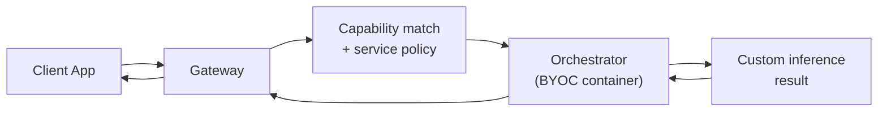

BYOC (Bring Your Own Container) extends what AI workloads your gateway can route by allowing orchestrators to run custom Docker inference containers and advertise them as capabilities. From your perspective as a gateway operator, BYOC is a routing and policy problem, not a model hosting problem. You configure how requests reach BYOC-capable orchestrators; the orchestrators handle everything inside the container.

<Note>
  This page covers the gateway operator perspective on BYOC. For the orchestrator and developer side — building containers, registering capabilities, and deploying inference servers — see the Developer BYOC guide.
</Note>

{/* ============================================================
    1. WHAT BYOC IS FROM A GATEWAY PERSPECTIVE
    ============================================================ */}

## What BYOC means for gateway operators

BYOC orchestrators advertise custom capabilities using the same protocol as standard AI orchestrators. The difference is that instead of running a managed `ai-runner` container for a known pipeline (such as `text-to-image`), they run a custom Docker container that exposes any inference API they choose.

Your gateway routes to them using the same `-orchAddr` flag and the same `AISessionManager` used for standard AI pipelines. The distinction is in how you think about the routing contract.



{/* ============================================================
    2. RESPONSIBILITIES SPLIT
    ============================================================ */}

## Responsibilities: what you do and what you don't

<CardGroup cols={2}>
  <Card title="What you do" icon="check">
    Route requests by capability and service policy. Monitor per-capability health and error rates. Configure retry policy for BYOC-specific failure modes (cold starts, model loading). Set price ceilings per capability. Maintain failover to alternative orchestrators when a BYOC node degrades.
  </Card>
  <Card title="What you don't do" icon="xmark">
    Run model containers. Host model weights. Expose orchestrator-internal model identifiers as public API contracts. Manage GPU allocation. Control what runs inside the BYOC container.
  </Card>
</CardGroup>

<Warning>
  Poor-fit batch workloads (large LLMs, multi-minute jobs, stateful pipelines) behind BYOC will degrade routing quality and increase latency for all jobs on the same orchestrator. Prioritise real-time, GPU-bound, frame-based capabilities when selecting BYOC orchestrators to connect to.
</Warning>

{/* ============================================================
    3. CAPABILITIES AS API CONTRACTS
    ============================================================ */}

## Capabilities as API contracts

The most important mental model for BYOC routing: treat capabilities as stable API contracts, not model names.

Livepeer deliberately avoids model-branded APIs. Orchestrators advertise capability descriptors:

- `image-to-image`
- `video-to-video`
- `depth`
- `segmentation`
- `style-transfer`

Your gateway routes on the capability. The orchestrator decides which model or container implementation serves that capability. This separation means:

- Orchestrators can update models without breaking your routing configuration
- Multiple orchestrators can compete to serve the same capability
- Your application never needs direct knowledge of which model runs its job
- Performance-based routing automatically favours faster or cheaper implementations

**Do not couple your routing to model names.** If you are making routing decisions based on `SG161222/RealVisXL_V4.0_Lightning` rather than `image-to-image`, you are working against the architecture.

{/* ============================================================
    4. MODEL AND WORKLOAD FIT
    ============================================================ */}

## Model and workload fit

Not every model or workload type is a good fit for BYOC on Livepeer. The network is optimised for low-latency, GPU-bound, real-time inference — especially for video and vision workloads. Models that violate these assumptions result in poor routing priority and reduced job assignment.

| Fit | Workload types |
|---|---|
| Best fit | Diffusion models (SD, SDXL, StreamDiffusion), image-to-image, video-to-video, ControlNet and IP-Adapter pipelines, vision models (depth, pose, segmentation), frame-by-frame video transforms, pipelines with persistent GPU residency |
| Conditional | Small-to-medium multimodal models (vision-heavy), audio-visual models with tight latency budgets, lightweight LLMs used as helpers (prompt routing, metadata, control signals) |
| Poor fit | Large LLMs for batch text inference, long-running training or fine-tuning jobs, workloads requiring large persistent state, high-latency multi-minute jobs |

**Rule of thumb:** if the workload is frame-based or stream-based, it fits well. If it requires maintaining long-lived state across many requests or takes more than a few seconds per request, it does not.

{/* ============================================================
    5. IMPLEMENTATION PATTERNS
    ============================================================ */}

## BYOC implementation patterns

BYOC orchestrators on the network tend to follow three patterns. Understanding these helps you set appropriate retry timeouts, latency expectations, and price ceilings when routing to them.

<AccordionGroup>
  <Accordion title="Pattern A: real-time diffusion" icon="images">
    **Best for:** style transfer, image-to-image, live video effects.

    The orchestrator runs StreamDiffusion or a ComfyUI-style pipeline with persistent GPU residency. Frames arrive and are processed with sub-second latency. Models are pre-loaded (warm) and never unloaded during operation.

    **Routing considerations:** low retry timeout (5–10s is fine), low price ceiling acceptable, latency should be stable — high variance indicates GPU contention or model churn.
  </Accordion>

  <Accordion title="Pattern B: vision utility node" icon="eye">
    **Best for:** depth estimation, segmentation, pose detection, object detection — typically as sub-tasks feeding into a larger pipeline.

    Inference is fast per frame (milliseconds) but may have a cold-start cost when the model first loads. Once warm, throughput is high.

    **Routing considerations:** slightly higher retry timeout to account for cold starts, expect very low per-request cost relative to diffusion, monitor for latency spikes indicating model eviction.
  </Accordion>

  <Accordion title="Pattern C: hybrid pipeline" icon="diagram-project">
    **Best for:** differentiated orchestrator offerings that chain multiple capabilities.

    A vision model feeds conditioning output into a diffusion model — for example, DepthAnything feeds depth maps into a ControlNet-guided diffusion step. This chains Pattern A and Pattern B in sequence on the same orchestrator.

    **Routing considerations:** higher latency per request than either pattern alone, higher VRAM requirement, price ceiling must account for the combined compute. Expect these orchestrators to advertise higher per-pixel rates.
  </Accordion>
</AccordionGroup>

{/* ============================================================
    6. HARD CONSTRAINTS ON BYOC ORCHESTRATORS
    ============================================================ */}

## Hard constraints that affect routing

Gateway routing priority is influenced by orchestrator behaviour. BYOC orchestrators that violate these constraints will receive fewer job assignments as gateways deprioritise them.

<AccordionGroup>
  <Accordion title="Cold start penalty" icon="snowflake">
    Orchestrators with containers that take more than 10 seconds to serve their first inference will be deprioritised by gateways tracking per-orchestrator latency. Prefer orchestrators that keep models warm. When evaluating a new BYOC orchestrator, send a test request and measure cold-start latency before committing to high-traffic routing.
  </Accordion>
  <Accordion title="VRAM contention" icon="memory">
    Containers that use excessive VRAM reduce the orchestrator's ability to serve concurrent jobs. High VRAM usage limits the parallelism gateways can exploit. For real-time pipelines, prefer fp16 or quantised models — they use less VRAM with minimal quality loss.
  </Accordion>
  <Accordion title="Stateful job semantics" icon="database">
    The network assumes short, repeatable, stateless units of work. BYOC containers that maintain long-lived state between requests break retry and failover semantics. If a request fails and the gateway retries on a different orchestrator, a stateful container will produce inconsistent results. BYOC containers should be designed stateless.
  </Accordion>
</AccordionGroup>

{/* ============================================================
    7. HEALTH AND ROUTING CONFIGURATION
    ============================================================ */}

## Health tracking and retry configuration

BYOC routing requires per-capability health tracking rather than per-orchestrator tracking. An orchestrator may serve `image-to-image` perfectly while its `depth` capability is degraded. Track them independently.

**Retry timeout for BYOC:**

BYOC containers may have longer cold-start times than standard `ai-runner` pipelines. Set a higher retry timeout when routing to BYOC-heavy orchestrators:

```bash
-aiProcessingRetryTimeout 60s
```

{/* REVIEW: confirm whether aiProcessingRetryTimeout applies identically to BYOC as to standard AI — verify with Rick/j0sh */}

**Failure modes specific to BYOC:**

- Cold-start delays: container loading model from disk for the first time
- GPU out-of-memory: container allocated too much VRAM, evicting other models
- Container crash: Docker container exited, orchestrator not yet restarting it
- API mismatch: container endpoint returns unexpected schema

For each failure mode, the `AISessionManager` will attempt to route to an alternative orchestrator. If no alternative is available, the request fails with an error returned to the client.

{/* ============================================================
    8. DISCOVERING BYOC CAPABILITIES
    ============================================================ */}

## Discovering BYOC capabilities

There is no formal BYOC capability registry. The same discovery gap that applies to standard AI models applies to BYOC — you cannot query the network for "all orchestrators with a `depth` capability." Discovery is manual.

**Current methods:**

- Query orchestrator info endpoints directly: {/* REVIEW: confirm exact BYOC capability discovery endpoint */} `https://orch.example.com:8935/getOrchestratorInfo`
- Check `tools.livepeer.cloud/ai/network-capabilities` for publicly advertising orchestrators
- Discord `#local-gateways` — SPE operators post BYOC capability offerings

When you identify a BYOC-capable orchestrator, add them to your `-orchAddr` list. The `AISessionManager` will route BYOC requests to them when their advertised capability matches the request.

{/* ============================================================
    9. DEVELOPER HANDOFF
    ============================================================ */}

## Developer handoff

If you are a gateway operator receiving BYOC traffic from developers building custom inference services, share the following constraints with them so their containers are routable:

1. The container must expose an HTTP endpoint implementing the Livepeer AI worker API
2. Requests must be stateless — retries from different orchestrators must produce valid results
3. Cold-start time should be under 10 seconds for priority routing
4. The container should manage VRAM efficiently (prefer fp16 or quantised weights)
5. The capability descriptor advertised must match what the container can actually serve

<Card title="Developer BYOC guide" icon="code" href="/v2/developers/build/byoc" horizontal arrow>
  Full architecture, container requirements, and setup for teams building BYOC inference services.
</Card>

{/* ============================================================
    10. NEXT STEPS
    ============================================================ */}

## Next steps

<CardGroup cols={2}>
  <Card title="Pipeline Configuration" icon="sliders" href="./pipeline-configuration">
    Retry timeouts, AI routing flags, and per-capability price ceiling configuration.
  </Card>
  <Card title="AI Inference Pipeline" icon="brain" href="./ai-inference">
    Standard AI pipeline routing, orchestrator discovery, and AISessionManager details.
  </Card>
  <Card title="Monitoring Setup" icon="chart-line" href="../monitoring-and-troubleshooting/monitoring-setup">
    Per-capability health tracking, discovery error metrics, and alert configuration for AI workloads.
  </Card>
  <Card title="Troubleshooting" icon="wrench" href="../monitoring-and-troubleshooting/troubleshooting">
    Diagnosing BYOC routing failures, cold-start issues, and capability mismatch errors.
  </Card>
</CardGroup>


{/* ---
title: 'BYOC Pipelines'
description: 'Run custom inference containers on the Livepeer network — capability-based routing, operator responsibilities, model fit, and the BYOC gateway workflow.'
sidebarTitle: 'BYOC Pipelines'
pageType: 'guide'
audience: 'gateway'
status: 'stub'
--- */}

{/*
  PURPOSE:
  Journey step: "Custom containers on the network"
  Gateway-operator guide for BYOC (Bring Your Own Container) routing and service policy.
  Focuses on what the gateway operator needs to know and do — NOT how to build BYOC
  containers (that's developer/orchestrator territory).

  Key framing: capabilities as API contracts, not model names. The gateway routes by
  capability; the orchestrator runs the container.

  SECTION HOME: Guides → AI and Job Pipelines

  JOURNEY POSITION:
  1. Pipeline Overview — "What workloads can my gateway route?"
  2. Video Transcoding Pipeline — "How do video jobs flow?"
  3. AI Inference Pipeline — "How do AI jobs flow?"
  4. BYOC Pipelines (this page) — "Custom containers on the network"
  5. Pipeline Configuration — "Configure transcoding profiles and AI routing"

  RELATED FILES (draw from):
  - all-resources/v2-guidesres--byoc.mdx                      — PRIMARY (95%): 68 lines. Gateway-operator BYOC guide. Routing by capability/policy, health monitoring, retry config. Capability-as-contract framing.
  - all-resources/v2-dev--ai-pipelines-byoc.mdx                — PRIMARY (80%): 256 lines. Detailed BYOC implementation: what BYOC is/isn't, model fit matrix, capability routing philosophy, 3 implementation patterns (real-time diffusion, vision utility, etc.).
  - all-resources/v2-dev--ai-pipelines-model-support.mdx       — SECONDARY (60%): 250 lines. Model compatibility matrix: diffusion, control/conditioning, vision models. Three-tier ratings (green/yellow/red).
  - all-resources/v2-dev--ai-pipelines-overview.mdx            — SECONDARY (30%): 262 lines. BYOC as one of 3 integration patterns. Context for where BYOC fits.

  CROSS-REFS:
  - AI Inference Pipeline (this section) — BYOC is a pipeline type within AI inference
  - Advanced Operations → Gateway Middleware — middleware can add custom routing for BYOC
  - Setup → AI Configuration — base AI config that BYOC builds on
  - Resources → AI API Reference — endpoints used for BYOC requests
*/}
{/*
# BYOC Pipelines

<Note>This page is a stub. Content to be developed from the sources listed above.</Note>

## Proposed Structure

### 1. What Is BYOC?
Bring Your Own Container: orchestrators run custom inference containers and advertise
capabilities on the network. Your gateway routes requests to capable orchestrators.

Key distinction:
- **Orchestrator responsibility**: Run the container, expose capabilities, host weights
- **Gateway responsibility**: Route by capability, monitor health, configure retries
- **NOT your responsibility**: Running model containers, hosting weights, exposing model IDs

### 2. Capabilities as API Contracts
BYOC routing is capability-based, NOT model-name-based.
- Orchestrators advertise capabilities (e.g., "real-time-diffusion", "vision-utility")
- Your gateway matches request capabilities to orchestrator advertisements
- Treat capabilities as stable API contracts

Why this matters:
- Same capability can be served by different models/containers
- Your gateway doesn't need to know implementation details
- Resilient to orchestrator model changes

### 3. Gateway Operator Responsibilities
What you must do:
1. Route by capability + service policy
2. Maintain per-capability health tracking
3. Configure retry logic for BYOC-specific failures
4. Monitor response quality/latency per capability

What you don't do:
1. Run model containers
2. Host model weights
3. Expose model IDs
4. Manage GPU allocation

### 4. Model & Workload Fit
From the model-support compatibility matrix:

| Category | Fit | Notes |
|----------|-----|-------|
| Diffusion Models | ✅ Good | Real-time capable, standard pipeline |
| Control/Conditioning Models | ⚠️ Conditional | Depends on GPU requirements |
| Vision Models | ⚠️ Conditional | Some too heavy for real-time |
| LLMs | ❌ Usually not | Better served by standard pipeline endpoints |

### 5. BYOC Implementation Patterns
Three patterns from developer docs (gateway operator needs to understand what's coming):
1. **Real-time diffusion** — frame-by-frame processing, low-latency requirement
2. **Vision utility node** — single-frame processing, higher latency tolerance
3. **Batch processing** — queue-based, highest latency tolerance

### 6. Discovering BYOC Capabilities
- How to find orchestrators with BYOC capabilities
- `/getNetworkCapabilities` for BYOC capability discovery
- Current limitations: no formal BYOC pipeline registration in docs (gap identified)

### 7. Health & Routing for BYOC
- Per-capability health tracking (vs per-orchestrator)
- BYOC-specific failure modes: cold-start delays, model loading, GPU OOM
- Retry configuration for longer inference times

### 8. Next Steps
Cards: Pipeline Configuration, AI Inference Pipeline, Advanced Operations → Gateway Middleware */}
