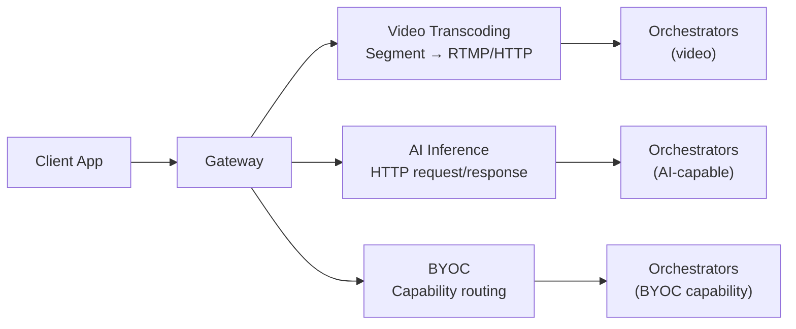

{/* TODO:
Verify:
- Mermaid diagrams use theme colours (but must be hardcoded - see snippets/components/page-structure/mermaid-colours.jsx)
- Fontawesome icons are used on accordions and tabs
- Tables use StyledTable component
- No em-dashes are used (instead use standard -)
- UK spelling is used
- Headers are concise and technical - no long headers or questions (aim for max 3 words)
- CustomDivider is used with <CustomDivider style={{margin: "-1rem 0 -1rem 0"}} /> for all --- separator breaks
- Placeholders for Media & Video Resources are in comments with a TODO for a human.
- REVIEW flags are in JSX flags for a human.
*/}

A gateway pipeline is the control-plane path between an application request and orchestrator execution.
A gateway does not run compute — it accepts requests, selects compatible orchestrators, enforces routing policy, and returns results. Understanding which pipeline type matches your workload shapes every other configuration decision you make.

<Note>
  This section covers how pipelines work from the gateway operator's perspective. For orchestrator-side configuration (running AI workers, hosting models), see the Orchestrators section.
</Note>

{/* ============================================================
    1. GATEWAY VS ORCHESTRATOR
    ============================================================ */}

## Gateway Role

<CardGroup cols={2}>
  <Card title="Gateway responsibilities" icon="server">
    Accepts requests, matches orchestrator capabilities, enforces price and latency policy, handles retries and failover, returns outputs to the client.
  </Card>
  <Card title="Orchestrator responsibilities" icon="microchip">
    Runs GPU inference or transcoding, hosts model weights, executes compute, returns results to the gateway.
  </Card>
</CardGroup>

The separation matters: your gateway is a routing and policy layer, not a compute node. Scaling compute means adding orchestrators, not upgrading your gateway host.

{/* ============================================================
    2. THREE PIPELINE TYPES
    ============================================================ */}

## The three pipeline types

Livepeer supports three categories of job that a gateway can route. Each has different ingest patterns, payment models, and orchestrator requirements.

### Video transcoding

The gateway ingests a live or recorded video stream via RTMP or HTTP, segments it, and distributes transcoding work to orchestrators. Orchestrators return multiple encoded renditions, which the gateway assembles for HLS delivery.

On-chain video gateways use the Livepeer probabilistic micropayment (PM) system: each segment carries a payment ticket redeemed on Arbitrum One. An ETH deposit and reserve balance on the TicketBroker contract are required.

**Ports:** RTMP ingest on `:1935`, HTTP ingest and API on `:8935`, CLI on `:5935`.

### AI inference

The gateway accepts HTTP requests for AI pipelines (text-to-image, audio-to-text, LLM, and others), routes each request to an orchestrator advertising the requested pipeline and model, and returns the inference result.

Standard off-chain AI gateways require no ETH deposit — there is no on-chain payment flow. The gateway targets orchestrators directly via `-orchAddr`. For on-chain AI (dual gateway mode), the PM system applies.

**Port:** HTTP API on `:8937`.

### BYOC (Bring Your Own Container)

BYOC extends AI inference by letting orchestrators advertise and run custom Docker containers. The gateway routes by capability descriptor (`image-to-image`, `depth`, `segmentation`) rather than by model name. You configure routing policy and health tracking per capability; the orchestrator handles everything inside the container.

BYOC follows the same off-chain AI payment model as standard AI inference.

{/* ============================================================
    3. PIPELINE × GATEWAY TYPE
    ============================================================ */}

## Pipeline selection by gateway type

Not all pipeline types are available on every gateway configuration. Use this table to confirm which pipelines apply to your setup.

| Pipeline | Video gateway | AI gateway | Dual gateway | On-chain ETH required |
|---|---|---|---|---|
| Video transcoding | Yes | No | Yes | Yes |
| AI inference (standard) | No | Yes | Yes | No |
| BYOC | No | Yes | Yes | No |
| Live video AI (live-video-to-video) | No | Yes | Yes | No (off-chain) / Yes (dual on-chain) |

<Tip>
  Running both video and AI workloads from a single node is possible with a dual gateway, but GPU and memory contention can degrade both workloads. Read the dual gateway resource allocation guidance in Pipeline Configuration before combining them.
</Tip>

{/* REVIEW: confirm on-chain payment applies when run via dual gateway with Rick/j0sh. */}

{/* ============================================================
    4. JOB CATEGORIES (ORCHESTRATOR VIEW)
    ============================================================ */}

## How orchestrators categorise jobs

Orchestrators classify incoming work into three compute categories. Understanding these helps you match your gateway configuration to the right orchestrator supply.

<AccordionGroup>
  <Accordion title="Transcoding jobs" icon="film">
    Video transcoding converts streams between formats, bitrates, and resolutions. GPU acceleration is optional (CPU mode is available but slower). No additional software is required beyond go-livepeer. Typical workloads: live streaming and VOD transcoding.
  </Accordion>
  <Accordion title="Realtime AI jobs" icon="bolt">
    Realtime AI pipelines process live video through models with strict latency targets. GPU is required. Additional software such as MediaMTX handles stream handling. Typical workloads: live video effects, interactive AI video, and ComfyStream workflows. Realtime AI setup is more involved than transcoding — review [go-livepeer/box/box.md](https://github.com/livepeer/go-livepeer/blob/master/box/box.md) before planning deployment.
  </Accordion>
  <Accordion title="Batch AI jobs" icon="layer-group">
    Batch AI handles asynchronous inference without realtime latency constraints. GPU is required. Typical workloads: offline image generation, audio transcription, and post-production AI processing. Batch jobs are request/response — the gateway sends a request and waits for the result rather than managing a streaming session.
  </Accordion>
</AccordionGroup>

{/* ============================================================
    5. NEXT STEPS
    ============================================================ */}

## Next steps

<CardGroup cols={2}>
  <Card title="Video Transcoding Pipeline" icon="film" href="./video-transcoding">
    How video jobs flow through your gateway — ingest, segmentation, orchestrator selection, and payment.
  </Card>
  <Card title="AI Inference Pipeline" icon="brain" href="./ai-inference">
    How AI inference requests are routed — orchestrator discovery, model matching, pipeline types, and platform limits.
  </Card>
  <Card title="BYOC Pipelines" icon="box" href="./byoc-pipelines">
    Routing custom container workloads by capability — operator responsibilities, model fit, and health tracking.
  </Card>
  <Card title="Pipeline Configuration" icon="sliders" href="./pipeline-configuration">
    Transcoding profiles, AI routing flags, and per-pipeline tuning.
  </Card>
</CardGroup>

{/* ---
title: 'Pipeline Overview'
description: 'Understand the three gateway job pipeline types — video transcoding, AI inference, and BYOC — and how your gateway routes work to orchestrators.'
sidebarTitle: 'Pipeline Overview'
pageType: 'overview'
audience: 'gateway'
status: 'stub'
--- */}

{/*
  PURPOSE:
  Journey step: "What workloads can my gateway route?"
  Entry point for the AI & Job Pipelines guide section. Explains what a job pipeline
  IS from the gateway operator's perspective: the control-plane path between an app
  request and orchestrator execution.

  Covers the three pipeline types (video, AI, BYOC), the gateway's role in each
  (routing, auth, pricing policy, QoS, retries, failover), and how pipeline choice
  maps to gateway type (video-only, AI-only, dual).

  SECTION HOME: Guides → AI and Job Pipelines

  JOURNEY POSITION:
  1. Pipeline Overview (this page) — "What workloads can my gateway route?"
  2. Video Transcoding Pipeline — "How do video jobs flow?"
  3. AI Inference Pipeline — "How do AI jobs flow?"
  4. BYOC Pipelines — "Custom containers on the network"
  5. Pipeline Configuration — "Configure transcoding profiles and AI routing"

  RELATED FILES (draw from):
  - all-resources/v2-guidesres--overview.mdx                — PRIMARY (95%): Existing pipeline overview. 67 lines, complete. Job pipeline responsibilities, 3 pipeline types, gateway vs orchestrator roles.
  - all-resources/v2-orch--job-types.mdx                    — PRIMARY (80%): 3 job categories from orchestrator POV (Transcoding, Realtime AI, Batch AI). Reframe for gateway operator.
  - all-resources/v2-dev--ai-pipelines-overview.mdx          — SECONDARY (40%): 3 integration patterns (Standard API, ComfyStream, BYOC). Developer-focused but useful for pattern descriptions.
  - all-resources/v2-run--transcoding.mdx                    — Placeholder (5%): Reserved page, planned structure only.

  CROSS-REFS:
  - Setup → Configuration (video, AI, dual) — "how to set up" vs this section's "how it works"
  - Concepts → Capabilities — high-level capability overview
  - Concepts → Architecture — network architecture context
  - Resources → Technical Architecture — architecture diagrams
*/}

{/* # Pipeline Overview

<Note>This page is a stub. Content to be developed from the sources listed above.</Note>

## Proposed Structure

### 1. What Is a Job Pipeline?
The control-plane path between your application's request and orchestrator execution.
Gateway responsibilities: routing, authentication, pricing policy, QoS enforcement,
retries, failover.

Gateway ≠ compute. Your gateway routes work; orchestrators execute it.

### 2. Three Pipeline Types

| Pipeline | What it does | Gateway type | On-chain? |
|----------|-------------|-------------|-----------|
| Video Transcoding | Ingest → segment → transcode → output | Video, Dual | Yes (ETH deposit) |
| AI Inference | HTTP request → model routing → inference → response | AI, Dual | No (off-chain) |
| BYOC | Custom container routing via capability matching | AI, Dual | No (off-chain) |

### 3. Gateway Role per Pipeline
- **Video**: Segment source video, select orchestrator by price/latency, verify output quality
- **AI**: Match request to capable orchestrator, route by model/pipeline, handle retries
- **BYOC**: Route by capability contract (not model name), maintain per-capability health

### 4. Pipeline Selection by Gateway Type
Decision tree:
- Video-only gateway → video transcoding pipeline only
- AI-only gateway → AI inference + BYOC pipelines
- Dual gateway → all three, with resource allocation concerns

### 5. Next Steps
Cards: Video Transcoding Pipeline, AI Inference Pipeline, BYOC Pipelines, Pipeline Configuration */}
