{/* TODO:
Verify:
- Mermaid diagrams use theme colours (but must be hardcoded - see snippets/components/page-structure/mermaid-colours.jsx)
- Fontawesome icons are used on accordions and tabs
- Tables use StyledTable component
- No em-dashes are used (instead use standard -)
- UK spelling is used
- Headers are concise and technical - no long headers or questions (aim for max 3 words)
- CustomDivider is used with <CustomDivider style={{margin: "-1rem 0 -1rem 0"}} /> for all --- separator breaks
- Placeholders for Media & Video Resources are in comments with a TODO for a human.
- REVIEW flags are in JSX flags for a human.
*/}

The video transcoding pipeline moves a stream from ingest to playback-ready HLS in three stages: the gateway segments incoming video, dispatches each segment to a selected orchestrator with a payment ticket, and assembles the transcoded renditions for delivery. This page explains what happens at each stage and how to tune it.

<Note>
  This is a conceptual and tuning guide, not a setup guide. For initial installation and startup, see Setup → Video Gateway Quickstart. For transcoding profile JSON and flag reference, see Pipeline Configuration.
</Note>

{/* ============================================================
    1. ARCHITECTURE DIAGRAM
    ============================================================ */}

## Architecture

```mermaid
%%{init: {'theme': 'base', 'themeVariables': { 'primaryColor': '#1a1a1a', 'primaryTextColor': '#fff', 'primaryBorderColor': '#2d9a67', 'lineColor': '#2d9a67', 'secondaryColor': '#0d0d0d', 'tertiaryColor': '#1a1a1a', 'background': '#0d0d0d', 'fontFamily': 'system-ui' }}}%%
flowchart TB
    subgraph INPUT["Video Input"]
        direction LR
        RTMP["RTMP Stream\n:1935"]
        HTTP["HTTP Upload\n:8935"]
    end

    GW["Gateway Node\n-gateway mode"]
    INPUT --> GW

    subgraph SESSION["BroadcastSessionsManager"]
        BSM["Select orchestrators\nby price, latency, capability"]
    end

    GW --> BSM

    subgraph PROC["Processing Pipeline"]
        direction TB
        SEG["Segment source video\n(per GOP or fixed interval)"]
        PAY["Generate payment ticket\n(per segment, wei per pixel)"]
        ORCH["Orchestrators\nTranscode each segment"]
        RCV["Receive transcoded segments\nVerify quality"]
    end

    BSM --> SEG --> PAY --> ORCH --> RCV

    subgraph OUT["Output and Delivery"]
        direction LR
        HLS["HLS Manifest\n.m3u8"]
        REND["Renditions\n240p / 360p / 720p / 1080p"]
    end

    RCV --> HLS --> REND

    subgraph STORE["Storage (optional)"]
        OBJ["Object store\nS3 / IPFS"]
    end
    REND -.-> OBJ

    classDef default fill:#1a1a1a,color:#fff,stroke:#2d9a67,stroke-width:2px
    classDef video fill:#1a1a1a,color:#fff,stroke:#3b82f6,stroke-width:2px
    classDef payment fill:#1a1a1a,color:#fff,stroke:#fbbf24,stroke-width:2px
    class RTMP,HTTP,BSM,SEG,ORCH,RCV,HLS,REND video
    class PAY payment
    style INPUT fill:#0d0d0d,stroke:#2d9a67,stroke-width:1px
    style SESSION fill:#0d0d0d,stroke:#3b82f6,stroke-width:1px
    style PROC fill:#0d0d0d,stroke:#3b82f6,stroke-width:1px
    style OUT fill:#0d0d0d,stroke:#3b82f6,stroke-width:1px
    style PAYMENT fill:#0d0d0d,stroke:#fbbf24,stroke-width:1px
    style STORE fill:#0d0d0d,stroke:#2d9a67,stroke-width:1px,stroke-dasharray: 5 5
```



<Card
  title="Source reference: BroadcastSessionsManager"
  icon="github"
  href="https://github.com/livepeer/go-livepeer/blob/master/core/broadcast.go"
  horizontal
  arrow
>
  go-livepeer/core/broadcast.go
</Card>

{/* ============================================================
    2. INGEST
    ============================================================ */}

## Stage 1: Ingest

The gateway accepts incoming video through two protocols. Which one you use depends on your publishing client.

<Tabs>
  <Tab title="RTMP (live streaming)">
    RTMP is the standard ingest protocol for live streaming. Encoders such as OBS, ffmpeg, and hardware encoders push streams to the gateway's RTMP server.

    **Default listen address:** `127.0.0.1:1935`

    To accept external connections, bind to all interfaces:

    ```bash
    -rtmpAddr 0.0.0.0:1935
    ```

    The ingest URL format is:
    ```
    rtmp://<gateway-host>:1935/<stream-key>
    ```

    The gateway reads the incoming RTMP stream, extracts GOP (Group of Pictures) boundaries, and slices the video into segments for distribution.
  </Tab>
  <Tab title="HTTP (segment push)">
    HTTP ingest accepts video segments pushed directly over HTTP. This is the path used when integrating programmatically or when using the Livepeer SDK to push pre-segmented content.

    **Default listen address:** `127.0.0.1:8935`

    To accept external connections:

    ```bash
    -httpAddr 0.0.0.0:8935
    ```

    The gateway accepts the pushed segments and routes them to orchestrators in the same way as RTMP-ingest segments.
  </Tab>
</Tabs>

{/* ============================================================
    3. ORCHESTRATOR SELECTION
    ============================================================ */}

## Stage 2: Orchestrator selection

Once the stream is ingested, the `BroadcastSessionsManager` selects which orchestrators will transcode each segment. Selection is not random — the manager evaluates orchestrators against several criteria simultaneously.

<AccordionGroup>
  <Accordion title="Price ceiling" icon="tag">
    The `-maxPricePerUnit` flag sets the maximum number of wei per pixel your gateway will pay. Orchestrators advertising prices above this ceiling are excluded. Setting this too low will result in no available orchestrators; setting it too high means you may overpay.

    The unit of measurement is wei per pixel. A common starting value for production is `1000` wei per pixel, though competitive market rates vary. Use the Livepeer Explorer and `livepeer_cli → Option 9` to see what orchestrators are currently advertising.
  </Accordion>
  <Accordion title="Latency and performance history" icon="gauge">
    The manager tracks round-trip latency and success rate for each orchestrator per session. Orchestrators with degraded latency or high failure rates are deprioritised. This is entirely automatic — you do not need to configure individual orchestrator scoring.
  </Accordion>
  <Accordion title="Session continuity and mid-stream swaps" icon="arrows-rotate">
    Transcoding sessions are maintained across segments. If an orchestrator fails mid-stream (network drop, timeout, GPU OOM), the manager performs a mid-stream swap: it selects the next best orchestrator and continues from the next segment. The output is seamless to the viewer because the renditions continue — there is no restart.

    The `livepeer_orchestrator_swaps` Prometheus metric tracks swap frequency. A high swap rate indicates orchestrator instability or an overly aggressive price ceiling.
  </Accordion>
  <Accordion title="Off-chain vs on-chain discovery" icon="network-wired">
    **Off-chain:** specify orchestrators directly via `-orchAddr` as a comma-separated list. The gateway connects to exactly those addresses.

    **On-chain:** the gateway queries the Livepeer on-chain registry (Arbitrum One) for registered orchestrators that meet your price ceiling. Discovery is automatic; you do not need to list addresses manually.

    ```bash
    # Off-chain: direct address list
    -orchAddr http://192.168.1.100:8935,http://192.168.1.101:8935

    # On-chain: registry discovery (set network and ETH credentials)
    -network arbitrum-one-mainnet
    ```
  </Accordion>
</AccordionGroup>

{/* ============================================================
    4. TRANSCODING
    ============================================================ */}

## Stage 3: Transcoding

Each segment is sent to the selected orchestrator along with a payment ticket. The orchestrator transcodes the segment into the renditions your profile specifies and returns them to the gateway.

The gateway verifies each returned segment before assembling the output. If a segment fails verification (wrong duration, corrupt data, wrong resolution), the manager retries with a different orchestrator up to `-maxAttempts` times (default: 3).

### Built-in rendition presets

If you do not specify a custom transcoding profile, the gateway uses a comma-separated list of named presets:

```bash
-transcodingOptions P240p30fps16x9,P360p30fps16x9
```

Available built-in presets follow the pattern `P<height>p<fps>fps<aspect>`. Common values: `P240p30fps16x9`, `P360p30fps16x9`, `P720p30fps16x9`, `P1080p30fps16x9`.

### Custom JSON profiles

For production deployments, a custom `transcodingOptions.json` file gives you precise control over the encoding ladder. The full JSON format and per-platform setup are in the Pipeline Configuration page.

```json
[
  {
    "name": "720p",
    "width": 1280,
    "height": 720,
    "bitrate": 3000000,
    "fps": 0,
    "profile": "h264constrainedhigh",
    "gop": "1"
  },
  {
    "name": "480p",
    "width": 854,
    "height": 480,
    "bitrate": 1600000,
    "fps": 0,
    "profile": "h264constrainedhigh",
    "gop": "1"
  }
]
```

Reference this file at startup:

```bash
-transcodingOptions /path/to/transcodingOptions.json
```

{/* ============================================================
    5. ON-CHAIN PAYMENT FLOW
    ============================================================ */}

## On-chain payment flow (video and dual gateways)

On-chain video gateways use Livepeer's probabilistic micropayment (PM) system. Every segment sent to an orchestrator carries a payment ticket. Most tickets are losing lottery draws; winning tickets are redeemed on the Arbitrum One TicketBroker contract against your ETH deposit.

<Warning>
  You must have a non-zero ETH deposit and reserve on the TicketBroker contract before your gateway can route video jobs on-chain. Orchestrators will reject jobs from a gateway with an empty deposit. See Fund Your Gateway for the deposit steps.
</Warning>

The per-segment cost depends on two factors:

- **Pixels transcoded:** width × height × number of renditions
- **Price per pixel:** the orchestrator's advertised rate in wei per pixel

**Example cost estimate:**

A 720p segment (1280 × 720 pixels) transcoded to three renditions (720p, 480p, 240p) at 1000 wei/pixel:

```
Total pixels per segment = (1280×720) + (854×480) + (426×240)
                         = 921,600 + 409,920 + 102,240
                         = 1,433,760 pixels

Cost per segment = 1,433,760 × 1000 wei = 1.43376 × 10⁹ wei = ~0.0000014 ETH
```

For a 1-hour stream at 30fps with 2-second segments (1800 segments):

```
1800 × 1.43376 × 10⁹ wei ≈ 2.58 × 10¹² wei ≈ 0.00258 ETH
```

Monitor your deposit balance via `livepeer_cli → Option 1` or the `livepeer_gateway_deposit` Prometheus metric. Top up before the deposit approaches zero.

{/* ============================================================
    6. OUTPUT AND DELIVERY
    ============================================================ */}

## Output and delivery

The gateway assembles transcoded segments into an HLS manifest (`.m3u8`) with one variant stream per rendition. Your application or CDN pulls this manifest to serve adaptive bitrate playback.

**HLS manifest endpoint:** `http://<gateway-host>:8935/<stream-key>.m3u8`

**Current manifest shortcut:** if `-currentManifest` is enabled, the most recently active stream is accessible at `/stream/current.m3u8` — useful for single-stream setups.

For persistent storage, the `-objectStore` flag pushes segments and manifests to an S3-compatible bucket or IPFS, so streams survive a gateway restart.

{/* ============================================================
    7. KEY METRICS
    ============================================================ */}

## Key metrics to watch

| Metric | What it tells you | Action threshold |
|---|---|---|
| `livepeer_success_rate` | Transcoded segments / source segments | Alert when below 0.95 |
| `livepeer_transcode_overall_latency_seconds` | End-to-end transcoding latency | Alert when p95 exceeds 5s |
| `livepeer_segment_transcode_failed_total` | Failed transcode count | Alert on rate increase |
| `livepeer_orchestrator_swaps` | Mid-stream orchestrator changes | Investigate above 1 per 10 minutes |
| `livepeer_gateway_deposit` | Remaining ETH deposit (wei) | Alert when below 0.01 ETH |
| `livepeer_ticket_value_sent` | ETH being spent on tickets | Budget monitoring |

For Prometheus setup and alert YAML, see Monitoring Setup.

{/* ============================================================
    8. TUNING REFERENCE
    ============================================================ */}

## Tuning your pipeline

<AccordionGroup>
  <Accordion title="Increasing orchestrator availability" icon="plus">
    If jobs are failing because no orchestrators are available under your price ceiling, either raise `-maxPricePerUnit` or switch to on-chain mode for access to the full orchestrator pool. Use `livepeer_cli → Option 9` to see available orchestrators and their advertised rates.
  </Accordion>
  <Accordion title="Reducing latency for live streaming" icon="clock">
    Lower GOP size in your transcoding profile reduces segment duration and therefore end-to-end latency. Set `"gop": "1"` for keyframe-aligned segments. Use a lower `-maxAttempts` value if retries on failed orchestrators are adding unacceptable delay — but ensure you have redundant orchestrators before reducing retry tolerance.
  </Accordion>
  <Accordion title="Managing concurrent streams" icon="list">
    The `-maxSessions` flag (default: 10) caps concurrent active streams. Increase it for high-throughput deployments. The gateway does not enforce per-stream quality independently — all streams share the orchestrator pool you have connected.
  </Accordion>
  <Accordion title="Authenticating ingest streams" icon="lock">
    Use `-authWebhookUrl` to point to an HTTPS endpoint that validates stream keys before the gateway begins transcoding. The webhook receives the stream key and returns allow/deny. This prevents unauthorised streams from consuming your orchestrator budget.
  </Accordion>
</AccordionGroup>

{/* ============================================================
    9. NEXT STEPS
    ============================================================ */}

## Next steps

<CardGroup cols={2}>
  <Card title="Pipeline Configuration" icon="sliders" href="./pipeline-configuration">
    Full JSON transcoding profile reference, per-platform setup (Docker, Linux, Windows), and AI routing parameters.
  </Card>
  <Card title="Pricing Strategy" icon="tag" href="../payments-and-pricing/pricing-strategy">
    How to set -maxPricePerUnit, estimate costs, and position competitively against orchestrator rates.
  </Card>
  <Card title="Monitoring Setup" icon="chart-line" href="../monitoring-and-tooling/monitoring-setup">
    Prometheus metrics, Grafana dashboards, and alert configuration for video workloads.
  </Card>
  <Card title="AI Inference Pipeline" icon="brain" href="./ai-inference">
    How AI inference jobs flow through your gateway — request routing, orchestrator discovery, and platform limits.
  </Card>
</CardGroup>

{/* ---
title: 'Video Transcoding Pipeline'
description: 'How video jobs flow through your gateway — RTMP/HTTP ingest, segmentation, orchestrator selection, transcoding profiles, and output delivery.'
sidebarTitle: 'Video Transcoding'
pageType: 'guide'
audience: 'gateway'
status: 'stub'
--- */}

{/*
  PURPOSE:
  Journey step: "How do video jobs flow through my gateway?"
  Gateway-side video pipeline guide. NOT a setup guide (that's in Setup → Configuration).
  This is "understand and tune your video pipeline" — how data flows, what happens at
  each stage, how to configure transcoding profiles, and how to optimise.

  SECTION HOME: Guides → AI and Job Pipelines

  JOURNEY POSITION:
  1. Pipeline Overview — "What workloads can my gateway route?"
  2. Video Transcoding Pipeline (this page) — "How do video jobs flow?"
  3. AI Inference Pipeline — "How do AI jobs flow?"
  4. BYOC Pipelines — "Custom containers on the network"
  5. Pipeline Configuration — "Configure transcoding profiles and AI routing"

  RELATED FILES (draw from):
  - all-resources/ctx-new--video-configuration.mdx           — PRIMARY (90%): 745 lines. Comprehensive video config with Mermaid architecture diagram, essential flags, transcoding options JSON, Docker/CLI/binary examples, production considerations.
  - all-resources/v1--transcoding-options.mdx                 — PRIMARY (80%): 93 lines. V1 transcoding config guide: JSON template, platform-specific instructions (Docker, Linux, Windows).
  - all-resources/v2-setup--transcoding-options.mdx            — PRIMARY (80%): 109 lines. V2 copy of transcoding options with platform-specific config.
  - all-resources/ctx-new--video-configuration-view.mdx       — SECONDARY (30%): 193 lines. Tabbed view alternative with Mermaid diagram, quickstart, config flags.
  - all-resources/v2-run--video-configuration.mdx              — SECONDARY (40%): Run-a-gateway video configuration (if different from _contextData_ version).
  - all-resources/v2-run--transcoding.mdx                      — Placeholder (5%): 38 lines. Reserved page, planned structure only.

  CROSS-REFS:
  - Setup → Video Configuration — initial setup vs this guide's "how it works and how to tune"
  - Payments & Pricing → Pricing Strategy — per-pixel pricing for video transcoding
  - Monitoring → Health Checks — video pipeline health verification
  - Resources → Configuration Flags — full flag reference for video flags
  - Resources → Prometheus Metrics — video-specific metrics (success_rate, transcode_latency)
*/}

{/* # Video Transcoding Pipeline

<Note>This page is a stub. Content to be developed from the sources listed above.</Note>

## Proposed Structure

### 1. Video Pipeline Architecture
Mermaid diagram showing the flow:
```
Client → RTMP/HTTP ingest (port 1935/8935) → Gateway segments source →
Orchestrator selection (price, latency, capability) → Transcoding →
Output segments → Playback delivery
```

### 2. Ingest
- RTMP ingest on port 1935 (standard streaming)
- HTTP ingest on port 8935 (segment push)
- Source segmentation: how the gateway splits video into segments

### 3. Orchestrator Selection for Video
- Selection criteria: `-maxPricePerUnit`, latency, success history
- Mid-stream orchestrator swaps (when original fails)
- Session management: how sessions are maintained across segments

### 4. Transcoding Profiles
JSON configuration for output renditions:
```json
[
  { "name": "720p",  "width": 1280, "height": 720,  "bitrate": 2000000 },
  { "name": "480p",  "width": 854,  "height": 480,  "bitrate": 1000000 },
  { "name": "360p",  "width": 640,  "height": 360,  "bitrate": 500000  }
]
```
- Resolution/bitrate configuration
- Per-platform setup (Docker, Linux, Windows)
- Custom profiles vs defaults

### 5. Output & Quality
- Transcoded segment verification
- Success rate monitoring (`livepeer_success_rate` metric)
- Latency expectations (`livepeer_transcode_overall_latency_seconds`)

### 6. On-Chain Payment Flow
- Per-segment ticket generation
- Deposit/reserve consumption per transcoded segment
- Cost estimation: wei per pixel × resolution × segments

### 7. Tuning Your Video Pipeline
- When to adjust `-maxPricePerUnit`
- Handling high-latency orchestrators
- Session limit implications for video workloads

### 8. Next Steps
Cards: Pipeline Configuration (transcoding profiles), Pricing Strategy, Monitoring Setup */}
