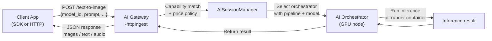

{/* TODO:
Terminology Validation:
- Ensure the terminology and definitions used in this page is consistent with the resources/glossary terminology
Verify:
- Mermaid diagrams use theme colours (but must be hardcoded - see snippets/components/page-structure/mermaidColours.jsx)
- ~~Fontawesome icons are used on accordions and tabs~~
- ~~Tables use StyledTable component~~
- ~~No em-dashes are used (instead use standard -)~~
- UK spelling is used
- ~~Headers are concise and technical - no long headers or questions (aim for max 3 words)~~
- ~~CustomDivider is used with <CustomDivider style={{margin: "-1rem 0 -1rem 0"}} /> for all --- separator breaks~~
- Placeholders for Media & Video Resources are in comments with a TODO for a human. (N/A)
- ~~REVIEW flags are in JSX flags for a human.~~
Human
- Review REVIEW items
*/}

import { CustomDivider } from "/snippets/components/primitives/divider.jsx"
import { StyledTable, TableRow, TableCell } from '/snippets/components/layout/tables.jsx'
import { LinkArrow } from '/snippets/components/primitives/links.jsx'

<CustomDivider style={{margin: "-1rem 0 -1rem 0"}} />

AI Gateways receive HTTP inference requests, match each one to a capable orchestrator, and return the result to the client.
No ETH deposit is required for standard off-chain AI operation.

The pipeline differs fundamentally from video transcoding:
- requests are discrete HTTP calls, not streaming segments, and
- routing and pricing is by pipeline and model capability instead of by pixel throughput.

<Note>
  This page covers how AI jobs flow through your gateway. For initial setup and startup commands, see Setup → AI Gateway Quickstart. For custom container workloads, see BYOC Pipelines.
</Note>

<CustomDivider style={{margin: "-1rem 0 -2rem 0"}} />
{/* ============================================================
    1. REQUEST FLOW
    ============================================================ */}

## Request flow
<Badge color="grey"> `AISessionManager` </Badge>

<br/>
<br/>



The `AISessionManager` is the gateway component responsible for session tracking, capability matching, and failover. It is the AI equivalent of the video pipeline's `BroadcastSessionsManager`.

<Card
  title="Source reference: AISessionManager"
  icon="github"
  href="https://github.com/livepeer/go-livepeer/blob/master/server/ai_http.go"
  horizontal
  arrow
>
  go-livepeer/server/ai_http.go
</Card>

<CustomDivider style={{margin: "0 0 -2rem 0"}} />
{/* ============================================================
    2. KEY DIFFERENCE FROM VIDEO
    ============================================================ */}

## AI vs Video Comparison

<StyledTable variant="bordered">
  <thead>
    <TableRow header>
      <TableCell header>Aspect</TableCell>
      <TableCell header>Video Transcoding</TableCell>
      <TableCell header>AI Inference</TableCell>
    </TableRow>
  </thead>
  <tbody>
    <TableRow>
      <TableCell>Payment model</TableCell>
      <TableCell>On-chain PM tickets (ETH deposit required)</TableCell>
      <TableCell>Off-chain (no ETH required)</TableCell>
    </TableRow>
    <TableRow>
      <TableCell>Ingest format</TableCell>
      <TableCell>RTMP stream or HTTP segment push</TableCell>
      <TableCell>Discrete HTTP POST per job</TableCell>
    </TableRow>
    <TableRow>
      <TableCell>Output</TableCell>
      <TableCell>Streaming HLS manifest</TableCell>
      <TableCell>JSON response (images, text, audio)</TableCell>
    </TableRow>
    <TableRow>
      <TableCell>Session type</TableCell>
      <TableCell>Long-running streaming session</TableCell>
      <TableCell>Short request/response</TableCell>
    </TableRow>
    <TableRow>
      <TableCell>Orchestrator selection</TableCell>
      <TableCell>Price + latency + segment history</TableCell>
      <TableCell>Pipeline capability + model availability + price</TableCell>
    </TableRow>
    <TableRow>
      <TableCell>GPU requirement on orchestrator</TableCell>
      <TableCell>Optional (CPU mode exists)</TableCell>
      <TableCell>Required</TableCell>
    </TableRow>
  </tbody>
</StyledTable>

{/* ============================================================
    3. PIPELINE TYPES
    ============================================================ */}

<CustomDivider style={{margin: "0 0 -2rem 0"}} />
## Available Pipelines

Livepeer AI inference routes across three integration patterns. As a gateway operator, you do not build or implement these - you configure which orchestrators you connect to and which pipeline endpoints you expose. This page covers batch AI (Standard API). For real-time and custom container pipelines, see the links below.

### Standard API Pipelines

Pre-built, well-defined inference endpoints. Each pipeline has a fixed URL path and request/response schema. Your gateway routes requests to orchestrators advertising the matching pipeline and model.

<StyledTable variant="bordered">
  <thead>
    <TableRow header>
      <TableCell header>Pipeline</TableCell>
      <TableCell header>Endpoint</TableCell>
      <TableCell header>Output</TableCell>
      <TableCell header>Pricing Unit</TableCell>
    </TableRow>
  </thead>
  <tbody>
    <TableRow>
      <TableCell>Text to image</TableCell>
      <TableCell>`/text-to-image`</TableCell>
      <TableCell>Image (PNG/JPEG)</TableCell>
      <TableCell>Pixels</TableCell>
    </TableRow>
    <TableRow>
      <TableCell>Image to image</TableCell>
      <TableCell>`/image-to-image`</TableCell>
      <TableCell>Image</TableCell>
      <TableCell>Pixels</TableCell>
    </TableRow>
    <TableRow>
      <TableCell>Image to video</TableCell>
      <TableCell>`/image-to-video`</TableCell>
      <TableCell>Video</TableCell>
      <TableCell>Pixels</TableCell>
    </TableRow>
    <TableRow>
      <TableCell>Upscale</TableCell>
      <TableCell>`/upscale`</TableCell>
      <TableCell>Image</TableCell>
      <TableCell>Pixels</TableCell>
    </TableRow>
    <TableRow>
      <TableCell>Audio to text</TableCell>
      <TableCell>`/audio-to-text`</TableCell>
      <TableCell>Transcript JSON</TableCell>
      <TableCell>Audio milliseconds</TableCell>
    </TableRow>
    <TableRow>
      <TableCell>Image to text</TableCell>
      <TableCell>`/image-to-text`</TableCell>
      <TableCell>Text</TableCell>
      <TableCell>Pixels</TableCell>
    </TableRow>
    <TableRow>
      <TableCell>Text to speech</TableCell>
      <TableCell>`/text-to-speech`</TableCell>
      <TableCell>Audio</TableCell>
      <TableCell>Audio milliseconds</TableCell>
    </TableRow>
    <TableRow>
      <TableCell>Segment Anything 2</TableCell>
      <TableCell>`/segment-anything-2`</TableCell>
      <TableCell>Segmentation mask</TableCell>
      <TableCell>Pixels</TableCell>
    </TableRow>
    <TableRow>
      <TableCell>LLM</TableCell>
      <TableCell>`/llm`</TableCell>
      <TableCell>Text</TableCell>
      <TableCell>Per-request or per-token</TableCell>
    </TableRow>
  </tbody>
</StyledTable>

Example request:

```bash icon="terminal"
curl -X POST http://localhost:8935/text-to-image \
  -H "Content-Type: application/json" \
  -d '{
    "model_id": "SG161222/RealVisXL_V4.0_Lightning",
    "prompt": "a photograph of a coastal village at dusk",
    "width": 1024,
    "height": 1024,
    "num_inference_steps": 6,
    "guidance_scale": 1.5
  }'
```

<Tip>
  Lightning-suffix models (such as `RealVisXL_V4.0_Lightning`) use fewer inference steps (4-8) and a lower guidance scale (1.0-2.0). Standard SDXL models need 20-50 steps and guidance 7.0-9.0. Use the correct parameters for the model family or image quality will degrade.
</Tip>

### Pricing Control

Use `-maxPricePerCapability` to set per-pipeline, per-model price caps. Pass a path to a JSON file or a JSON string directly.

```bash icon="terminal"
livepeer \
  -gateway \
  -orchAddr https://orch1.example.com:8935 \
  -maxPricePerCapability /path/to/aiPricing.json
```

The JSON uses the `capabilities_prices` array format:

```json icon="terminal"
{
  "capabilities_prices": [
    {
      "pipeline": "text-to-image",
      "model_id": "SG161222/RealVisXL_V4.0_Lightning",
      "price_per_unit": 4768371,
      "pixels_per_unit": 1
    }
  ]
}
```

Use `"model_id": "default"` to set a fallback cap for all models in a pipeline. Specific model entries take precedence over the default. Without this flag, the gateway accepts any price the orchestrator advertises. For full pricing details, see <LinkArrow href="../payments-and-pricing/pricing-strategy" label="Pricing Strategy" newline={false} />.

### Other Pipelines

<Note>
  The `live-video-to-video` pipeline (real-time AI via ComfyStream) uses the trickle streaming protocol, not the REST API described above. From a gateway operator perspective, ComfyStream workers appear as AI-capable orchestrators connected via `-orchAddr`. See <LinkArrow href="./guide" label="Pipelines Guide" newline={false} /> for how real-time AI fits into the pipeline taxonomy.
</Note>

<CardGroup cols={2}>
  <Card title="ComfyStream" icon="wand-magic-sparkles" href="/v2/developers/build/comfystream">
    Build real-time AI video workflows with ComfyUI nodes.
  </Card>
  <Card title="BYOC Pipelines" icon="box" href="./byoc-pipelines">
    Route custom container workloads by capability - operator responsibilities, model fit, and health tracking.
  </Card>
</CardGroup>

<CustomDivider style={{margin: "0 0 -2rem 0"}} />
{/* ============================================================
    4. ORCHESTRATOR DISCOVERY
    ============================================================ */}

## Orchestrator Discovery

How your AI gateway finds orchestrators depends on your operational mode.

<AccordionGroup>
  <Accordion title="Direct configuration (-orchAddr)" icon="server">
    The standard method for off-chain AI gateways. Specify orchestrator addresses directly:

    ```bash icon="terminal"
    -orchAddr https://orch1.example.com:8935,https://orch2.example.com:8935
    ```

    The format is `scheme://host:port`. All orchestrators must be running `ai-runner` containers and advertising the pipelines you intend to route. If an orchestrator does not support a requested pipeline, the job fails or falls back to the next orchestrator if one is available.

    Most production gateways use this pattern. Operators build relationships with specific orchestrators who run the models and capabilities their applications need.
  </Accordion>
  <Accordion title="Webhook discovery (-orchWebhookUrl)" icon="webhook">
    Gateways can call an external service to receive a dynamic orchestrator list:

    ```bash icon="terminal"
    -orchWebhookUrl https://your-service.example.com/orchestrators
    ```

    The webhook returns a JSON array of orchestrator addresses. This enables custom filtering, whitelisting, or load balancing without modifying the gateway itself. Used by platform builders (NaaP) and operators with orchestrator tiering or geographic routing requirements.
  </Accordion>
  <Accordion title="On-chain discovery (-aiServiceRegistry)" icon="link">
    On-chain AI Gateways use the AI service registry for automatic Orchestrator discovery:

    ```bash icon="terminal"
    -aiServiceRegistry
    ```

    This is a boolean flag (no argument required). When set, the Gateway registers with the [`AIServiceRegistry`](https://arbiscan.io/address/0x04C0b249740175999E5BF5c9ac1dA92431EF34C5) contract on Arbitrum Mainnet and discovers AI-capable Orchestrators on-chain. The contract address is hardcoded in go-livepeer. Requires on-chain operational mode (`-network=arbitrum-one-mainnet`, `-ethUrl`, funded ETH account).

    The Gateway's `/getNetworkCapabilities` endpoint exposes the aggregated capability data from discovered Orchestrators.
  </Accordion>
</AccordionGroup>

<Tip>
  Check [tools.livepeer.cloud/ai/network-capabilities](https://tools.livepeer.cloud/ai/network-capabilities) before selecting a model ID. Models already loaded in GPU memory (warm models) return results significantly faster than cold models that must load from disk first.
</Tip>

<CustomDivider style={{margin: "0 0 -2rem 0"}} />
{/* ============================================================
    5. MODEL MATCHING
    ============================================================ */}

## Capability Matching

When a request arrives at your gateway, the `AISessionManager` matches it to an orchestrator based on two criteria:

1. **Pipeline:** does the orchestrator advertise this pipeline type? (e.g., `text-to-image`)
2. **Model:** does the orchestrator have the requested `model_id` available?

If no orchestrator matches both criteria, the request fails with an error. If multiple orchestrators match, the manager routes to the best-performing one based on latency history and current load.

**Warm vs cold models:**

Orchestrators load models into GPU memory. A model loaded and ready to serve immediately is "warm". A model that must be downloaded or loaded from disk before it can serve is "cold". Cold starts add seconds to minutes of latency for the first request. Warm models respond in milliseconds.

During the current beta phase, orchestrators support one warm model per GPU.
<CustomDivider style={{margin: "-1rem 0 -2rem 0"}} />
{/* ============================================================
    6. GATEWAY COMPONENTS (AI-SPECIFIC)
    ============================================================ */}

## AI Gateway Mechanisms

<Card
  title="Source reference: ai_mediaserver.go"
  icon="github"
  href="https://github.com/livepeer/go-livepeer/blob/master/server/ai_mediaserver.go"
  horizontal
  arrow
/>

The AI pipeline uses multiple components that do not exist in the video pipeline:

<AccordionGroup>
  <Accordion title="AISessionManager" icon="gear">
    Manages AI processing sessions and selects orchestrators with matching AI capabilities. Tracks performance per orchestrator per pipeline. Handles retry and failover when an orchestrator fails mid-request. Defined in `server/ai_http.go`.
  </Accordion>
  <Accordion title="MediaMTX integration" icon="stream">
    Handles media streaming for real-time AI pipelines (ComfyStream and live-video-to-video). MediaMTX manages the stream lifecycle and frame routing between the gateway and the AI worker.
  </Accordion>
  <Accordion title="Trickle protocol" icon="droplet">
 Enables efficient low-latency streaming for real-time AI video pipelines. The Trickle protocol incrementally delivers video frames to the AI worker instead of buffering full segments, keeping end-to-end latency low for live AI effects.
  </Accordion>
  <Accordion title="ai_process.go workflow" icon="diagram-project">
    The `server/ai_process.go` file defines the core AI job workflow: authenticate the request, select a capable orchestrator, process the payment (off-chain for standard AI), and manage the live AI pipeline session. This is where per-pixel pricing calculations happen for image pipelines.
  </Accordion>
</AccordionGroup>

<CustomDivider style={{margin: "-1rem 0 -2rem 0"}} />
{/* ============================================================
    7. RETRY LOGIC
    ============================================================ */}

## Retry Logic

If an orchestrator fails to return a result (timeout, model not loaded, GPU error), the `AISessionManager` retries the request with the next best orchestrator.

The retry timeout is controlled by:

```bash icon="terminal"
-aiProcessingRetryTimeout 30s
```

The value accepts Go duration format: `30s`, `1m`, `2m30s`. For pipelines that use slow-loading models (cold starts), increase this value - otherwise the gateway will retry before the orchestrator has had time to load the model.

<CustomDivider style={{margin: "-1rem 0 -2rem 0"}} />
{/* ============================================================
    8. OFF-CHAIN VS ON-CHAIN AI
    ============================================================ */}

## Off-chain vs On-chain AI

<Tabs>
  <Tab title="Off-chain AI (standard)" icon="cloud">
    The default AI gateway mode. No ETH deposit, no TicketBroker interaction, no Arbitrum RPC required.

    The gateway connects directly to orchestrators via `-orchAddr`. Payment works in two ways:

    - **Remote signer with PM tickets (primary):** The gateway uses the Livepeer probabilistic micropayment system with an off-chain remote signer. This is the standard production path for SPE operators.
    - **Direct billing (alternative):** Payment is handled entirely outside the Livepeer PM system - typically via a direct billing arrangement with orchestrator operators, or by running your own orchestrator.
Start command (minimum flags for direct billing):

    ```bash icon="terminal"
    livepeer \
      -gateway \
      -orchAddr https://orch1.example.com:8935 \
      -httpAddr 0.0.0.0:8935 \
      -httpIngest \
      -v 6
    ```
  </Tab>
  <Tab title="On-chain AI (dual gateway)" icon="link">
    When running a dual gateway (AI + video, on-chain), the PM payment system applies to AI jobs as well. ETH deposit and reserve are required. The gateway uses the same ticket-based payment mechanism as video transcoding.

    Additional flags required for on-chain AI:

    ```bash icon="terminal"
    -network arbitrum-one-mainnet
    -ethUrl https://arb1.arbitrum.io/rpc    # replace with your own RPC
    -ethKeystorePath /root/.lpData/arbitrum-one-mainnet/keystore
    -ethAcctAddr <YOUR_ETH_ADDRESS>
    -ethPassword /root/.lpData/.eth_secret
    ```
See Dual Gateway Configuration for the complete on-chain AI setup guide.
  </Tab>
</Tabs>

 <CustomDivider style={{margin: "0 0 -2rem 0"}} />
{/* ============================================================
    9. PLATFORM LIMITATIONS
    ============================================================ */}

## Platform Constraints

<Warning>
  The Livepeer AI binary is Linux-only. Windows and macOS builds are not available. This constraint affects orchestrators, not gateways - but it limits your testing options if you do not have a Linux machine available.
</Warning>

The AI inference stack requires a CUDA/GPU toolchain that is only available on Linux. The limitation applies to `ai-runner` containers running on orchestrators.

<StyledTable variant="bordered">
  <thead>
    <TableRow header>
      <TableCell header>Platform</TableCell>
      <TableCell header>Video Gateway</TableCell>
      <TableCell header>AI Gateway (go-livepeer)</TableCell>
      <TableCell header>AI Binary (Orchestrator)</TableCell>
    </TableRow>
  </thead>
  <tbody>
    <TableRow>
      <TableCell>Linux</TableCell>
      <TableCell>Yes</TableCell>
      <TableCell>Yes</TableCell>
      <TableCell>Yes</TableCell>
    </TableRow>
    <TableRow>
      <TableCell>macOS</TableCell>
      <TableCell>Yes</TableCell>
      <TableCell>Yes</TableCell>
      <TableCell>No (GPU toolchain unavailable)</TableCell>
    </TableRow>
    <TableRow>
      <TableCell>Windows</TableCell>
      <TableCell>Yes</TableCell>
      <TableCell>Yes</TableCell>
      <TableCell>No (GPU toolchain unavailable)</TableCell>
    </TableRow>
  </tbody>
</StyledTable>

**Workaround for Windows/macOS testing:** Run the `ai-runner` Docker container on a Linux machine or cloud instance. Docker on Linux is the standard production deployment method.

```bash icon="terminal"
# Docker on Linux - standard AI gateway deployment
docker run \
  --name livepeer_ai_gateway \
  -v ~/.lpData2/:/root/.lpData2 \
  -p 8935:8935 \
  --network host \
  livepeer/go-livepeer:master \
  -datadir ~/.lpData2 \
  -gateway \
  -orchAddr https://orch1.example.com:8935 \
  -httpAddr 0.0.0.0:8935 \
  -httpIngest \
  -v 6
```

<CustomDivider style={{margin: "0 0 -2rem 0"}} />
{/* ============================================================
    10. KNOWN GAP: NO UNIFIED MODEL REGISTRY
    ============================================================ */}

## Finding AI Models

There is no single registry that lets operators query all available models and pipelines across the entire network in one place. The `-aiServiceRegistry` flag (see [Orchestrator Discovery](#orchestrator-discovery)) provides on-chain capability data for registered orchestrators, and the gateway's `/getNetworkCapabilities` endpoint exposes this data. For off-chain gateways, discovery relies on direct communication and community tools.

<StyledTable variant="bordered">
  <thead>
    <TableRow header>
      <TableCell header>Resource</TableCell>
      <TableCell header>What It Shows</TableCell>
    </TableRow>
  </thead>
  <tbody>
    <TableRow>
      <TableCell>[tools.livepeer.cloud/ai/network-capabilities](https://tools.livepeer.cloud/ai/network-capabilities)</TableCell>
      <TableCell>Warm models on the public AI network</TableCell>
    </TableRow>
    <TableRow>
      <TableCell>`/getNetworkCapabilities` (gateway endpoint)</TableCell>
      <TableCell>Aggregated capabilities from discovered orchestrators</TableCell>
    </TableRow>
    <TableRow>
      <TableCell>`/getOrchestratorInfo` (orchestrator endpoint)</TableCell>
      <TableCell>What a specific orchestrator supports</TableCell>
    </TableRow>
    <TableRow>
      <TableCell>[Discord #local-gateways](https://discord.gg/livepeer)</TableCell>
      <TableCell>SPE operator offerings and available models</TableCell>
    </TableRow>
  </tbody>
</StyledTable>
<CustomDivider style={{margin: "-1rem 0 -2rem 0"}} />

## Related Pages

<CardGroup cols={2}>
  <Card title="Pipelines Guide" icon="diagram-project" href="./guide">
    Pipeline taxonomy - video, batch AI, real-time AI, and BYOC.
  </Card>
  <Card title="BYOC Pipelines" icon="box" href="./byoc-pipelines">
    Route custom container workloads by capability - operator responsibilities, model fit, and health tracking.
  </Card>
  <Card title="Pipeline Configuration" icon="sliders" href="./pipeline-configuration">
    AI routing flags, retry timeouts, and per-pipeline pricing reference.
  </Card>
  <Card title="Model Support" icon="microchip-ai" href="/v2/developers/build/model-support">
    Full compatibility matrix - supported pipeline types, model architectures, and VRAM requirements.
  </Card>
  <Card title="Workload Fit" icon="bullseye" href="/v2/developers/build/workload-fit">
    Decision framework for evaluating whether your AI workload belongs on Livepeer.
  </Card>
  <Card title="AI API Reference" icon="code" href="/v2/gateways/resources/technical/api-reference/AI-API/text-to-image">
    Full endpoint reference for all AI pipelines.
  </Card>
</CardGroup>

{/* ---
title: 'AI Inference Pipeline'
description: 'How AI jobs flow through your gateway — HTTP requests, orchestrator discovery, model routing, retry logic, and available pipeline types (Standard API, ComfyStream, BYOC).'
sidebarTitle: 'AI Inference'
pageType: 'guide'
audience: 'gateway'
status: 'stub'
--- */}

{/*
  PURPOSE:
  Journey step: "How do AI jobs flow through my gateway?"
  Gateway-side AI pipeline guide. Covers: request flow, model/pipeline discovery,
  orchestrator capability matching, retry/failover, and what pipeline types are
  available.

  NOT: running AI models (that's orchestrator-side). NOT: BYOC details (separate page).
  This is the AI equivalent of the video-transcoding page.

  SECTION HOME: Guides → AI and Job Pipelines

  JOURNEY POSITION:
  1. Pipeline Overview — "What workloads can my gateway route?"
  2. Video Transcoding Pipeline — "How do video jobs flow?"
  3. AI Inference Pipeline (this page) — "How do AI jobs flow?"
  4. BYOC Pipelines — "Custom containers on the network"
  5. Pipeline Configuration — "Configure transcoding profiles and AI routing"

  RELATED FILES (draw from):
  - all-resources/ctx-gwnew--ai-configuration.mdx            — PRIMARY (90%): 196 lines. Comprehensive AI gateway config: flag audit, orchAddr, HTTP ingest, Docker examples, verification steps, on-chain mode flags.
  - all-resources/ctx-new--ai-configuration.mdx               — PRIMARY (85%): 190 lines. AI deployment walkthrough: off-chain vs on-chain, Docker/binary, component descriptions (AISessionManager, MediaMTX, Trickle Protocol, ai_process.go).
  - all-resources/v2-dev--ai-pipelines-overview.mdx            — PRIMARY (70%): 262 lines. 3 integration patterns (Standard API, ComfyStream, BYOC). Developer-focused but describes pipeline types.
  - all-resources/v1--ai-worker.mdx                            — SECONDARY (40%): 139 lines. Remote AI worker setup. Helps explain what orchestrators expose.
  - all-resources/v1--models-config.mdx                        — SECONDARY (40%): 172 lines. aiModels.json format, pricing. Helps explain what models are available.
  - all-resources/v1--ai-builders-gateways.mdx                 — SECONDARY (20%): 723 lines. AI gateway ecosystem overview. Context for available gateways.
  - all-resources/v2-dev--ai-pipelines-model-support.mdx       — SECONDARY (30%): 250 lines. Model compatibility matrix. Useful for "what models work" section.

  CROSS-REFS:
  - Setup → AI Configuration — initial setup vs this guide's pipeline understanding
  - BYOC Pipelines (this section) — custom container details
  - Payments & Pricing → Pricing Strategy — AI pricing model (no on-chain cost for off-chain AI)
  - Monitoring → Health Checks — AI pipeline health (/health on port 8935)
  - Resources → AI API Reference — full endpoint documentation
  - FAQ — "How do I find which AI models/pipelines are available?"
*/}
{/*
# AI Inference Pipeline

<Note>This page is a stub. Content to be developed from the sources listed above.</Note>

## Proposed Structure

### 1. AI Pipeline Architecture
Request flow diagram:
```
Client HTTP request (port 8935) → Gateway receives →
Orchestrator discovery (orchAddr / network query) →
Capability matching (pipeline + model) → Route to orchestrator →
Inference execution → Response to client
```

Key difference from video: AI is off-chain (no ETH deposit), request/response (not streaming),
and model-dependent.

### 2. Available Pipeline Types
| Type | Description | Example | Gateway role |
|------|------------|---------|-------------|
| Standard API | Pre-built pipelines (text-to-image, LLM, etc.) | `/text-to-image` | Route to capable orchestrator |
| ComfyStream | Real-time video frame processing | Live video AI effects | Route stream frames to ComfyUI worker |
| BYOC | Custom inference containers | Custom diffusion, vision | Route by capability contract |

Brief intro to each — detailed BYOC coverage in next page.

### 3. Orchestrator Discovery
- `-orchAddr` flag: direct orchestrator specification
- Network discovery: `/getNetworkCapabilities` endpoint
- **Known gap**: No unified model/pipeline registry exists
- Current discovery methods:
  - Query orchestrator `/getOrchestratorInfo`
  - Discord #local-gateways channel
  - Livepeer Tools dashboard
  - Community-maintained lists

### 4. Model & Pipeline Matching
- How the gateway matches requests to orchestrator capabilities
- Pipeline ID matching (e.g., `text-to-image`, `audio-to-text`)
- Model ID matching within pipelines
- What happens when no capable orchestrator is found

### 5. Request Routing & Retry
- AISessionManager: session management for AI jobs
- Retry logic: `-aiSessionTimeout` flag
- Failover between orchestrators
- Load balancing across multiple capable orchestrators

### 6. Gateway Components (AI-specific)
From source: AISessionManager, MediaMTX (real-time), Trickle Protocol, ai_process.go workflow.
- What each component does in the AI pipeline
- How they interact during a request

### 7. Off-Chain vs On-Chain AI
- Off-chain (default): no ETH required, no TicketBroker interaction
- On-chain AI: possible with dual gateway, uses same PM payment system as video
- When to use which mode

### 8. Platform Limitations
- AI binary: Linux only (CUDA/GPU toolchain requirement)
- Docker on Linux as the standard deployment
- Windows/macOS: standard video binary works, AI binary does not

### 9. Next Steps
Cards: BYOC Pipelines, Pipeline Configuration, AI API Reference, FAQ */}
