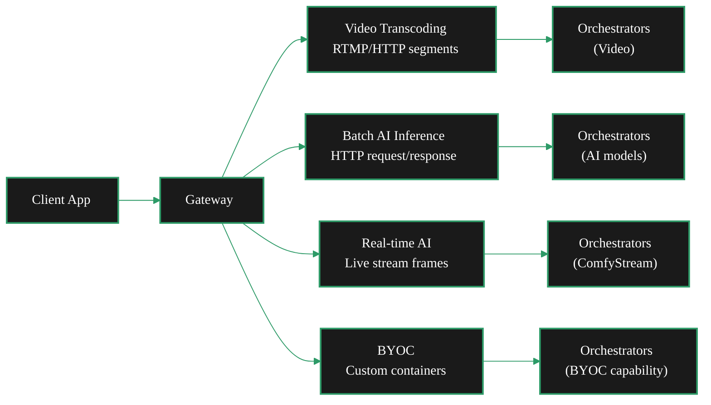

{/* TODO:
Terminology Validation:
- ~~Ensure the terminology and definitions used in this page is consistent with the resources/glossary terminology~~
Verify:
- ~~Mermaid diagrams use theme colours (but must be hardcoded - see snippets/components/page-structure/mermaid-colours.jsx)~~
- ~~Fontawesome icons are used on accordions and tabs~~
- ~~Tables use StyledTable component~~
- ~~No em-dashes are used (instead use standard -)~~
- ~~UK spelling is used~~
- ~~Headers are concise and technical - no long headers or questions (aim for max 3 words)~~
- ~~CustomDivider is used with <CustomDivider style={{margin: "-1rem 0 -1rem 0"}} /> for all --- separator breaks~~
- ~~Placeholders for Media & Video Resources are in comments with a TODO for a human.~~ (N/A)
- ~~REVIEW flags are in JSX flags for a human.~~
Human
- Review REVIEW items
*/}

import { CustomDivider } from "/snippets/components/primitives/divider.jsx"
import { StyledTable, TableRow, TableCell } from '/snippets/components/layout/tables.jsx'
import { LinkArrow } from '/snippets/components/primitives/links.jsx'

<CustomDivider style={{margin: "-1rem 0 -1rem 0"}} />

A gateway's **node type** determines which workloads it can route:
- <Badge color="blue">Video</Badge> transcoding,
- <Badge color="purple">AI</Badge> inference (batch and real-time), or
- <Badge color="green">Dual</Badge> (both pipelines on a single node).

Each pipeline is the control-plane path between an application request and orchestrator execution.

{/* ============================================================
    1. GATEWAY VS ORCHESTRATOR
    ============================================================ */}

## Gateway Role

<Note>
  This section covers how pipelines work from the gateway operator's perspective. For orchestrator-side configuration (running AI workers, hosting models), see the Orchestrators section.
</Note>

<CardGroup cols={2}>
  <Card title="Gateway responsibilities" icon="server">
    Accepts requests, matches orchestrator capabilities, enforces price and latency policy, handles retries and failover, returns outputs to the client.
  </Card>
  <Card title="Orchestrator responsibilities" icon="microchip">
    Runs GPU inference or transcoding, hosts model weights, executes compute, returns results to the gateway.
  </Card>
</CardGroup>

<CustomDivider style={{margin: "0 0 -2rem 0"}} />

{/* ============================================================
    2. PIPELINE TYPES
    ============================================================ */}

## Node Types
<Badge color="blue">Video</Badge> <Badge color="purple">AI</Badge> <Badge color="green">Dual</Badge>

Livepeer gateways route four categories of work. Each has different ingest patterns, payment models, and orchestrator requirements. A <Badge color="green">Dual</Badge> node runs both video and AI pipelines on a single node.

### Video Transcoding

The gateway ingests a live or recorded video stream via RTMP or HTTP, segments it, and distributes transcoding work to orchestrators. Orchestrators return multiple encoded renditions, which the gateway assembles for HLS delivery.

On-chain video gateways use the Livepeer probabilistic micropayment (PM) system: each segment carries a payment ticket redeemed on Arbitrum One. An ETH deposit and reserve balance on the TicketBroker contract are required.

**Ports:** RTMP ingest on `:1935`, HTTP ingest and API on `:8935`, CLI on `:5935`.

### Batch AI Inference

The gateway accepts HTTP requests for AI pipelines (text-to-image, audio-to-text, LLM, and others), routes each request to an orchestrator advertising the requested pipeline and model, and returns the inference result. This is a request/response pattern - the gateway sends a request and waits for the result.

Off-chain AI gateways require no ETH deposit. The gateway targets orchestrators directly via `-orchAddr`. For on-chain AI (dual node type), the PM system applies.

**Port:** HTTP API on `:8937`.

See <LinkArrow href="/v2/developers/build/model-support" label="Model Support" newline={false} /> for all supported batch AI pipeline types and model architectures.

### Real-time AI

Real-time AI processes live video streams frame-by-frame through AI models with strict latency targets. Unlike batch inference (request/response), real-time AI maintains a persistent stream connection - frames flow in continuously and transformed frames flow out.

The primary framework is **ComfyStream**, an open-source ComfyUI plugin that enables developers to build real-time AI video workflows (style transfer, avatars, live effects, real-time agents). **Daydream** is the hosted reference implementation - developers can use it without running their own gateway.

Real-time AI runs on <Badge color="purple">AI</Badge> or <Badge color="green">Dual</Badge> nodes. It uses the `live-video-to-video` pipeline type and the trickle streaming protocol (not the REST AI Jobs API). Billing is per-second rather than per-pixel.

**Port:** HTTP API on `:8937`.

{/* REVIEW: Real-time AI accounts for ~72% of current network fees - confirm this figure is still current. */}

<CardGroup cols={2}>
  <Card title="ComfyStream" icon="wand-magic-sparkles" href="/v2/developers/build/comfystream">
    Build real-time AI video workflows with ComfyUI nodes.
  </Card>
  <Card title="Daydream" icon="cloud" href="/v2/solutions/daydream/overview">
    Hosted real-time AI video - no gateway required.
  </Card>
</CardGroup>

### BYOC Pipelines

BYOC (Bring Your Own Container) allows any workload that can be containerised to run on Livepeer orchestrators. The gateway routes by capability descriptor (`image-to-image`, `depth`, `segmentation`) rather than by model name.

BYOC supports **both GPU and CPU** containers. GPU workloads (diffusion models, vision models, video-to-video) are the primary use case, but CPU-only deployments are also supported - see the BYOC CPU tutorial for a passthrough pipeline example.

**What fits well:** frame-based or stream-based workloads, custom ML models, enterprise-specific processing, novel applications (e.g. Embody AI avatars).

**What does not fit:** long-running training or fine-tuning jobs, workloads requiring large persistent state, high-latency multi-minute jobs. The network assumes short, stateless, repeatable units of work. Containers that maintain long-lived state between requests break retry and failover semantics.

<Note>
BYOC requires a gateway - applications cannot interact with orchestrators directly. The gateway handles discovery, capability matching, and payment; the orchestrator runs your container.
</Note>

BYOC follows the same payment model as AI inference.

See <LinkArrow href="/v2/developers/build/workload-fit" label="Workload Fit" newline={false} /> to evaluate whether your workload belongs on Livepeer.

<CustomDivider style={{margin: "-1rem 0 -2rem 0"}} />

{/* ============================================================
    3. PIPELINE × GATEWAY TYPE
    ============================================================ */}

## Pipeline Matrix

Not all pipeline types are available on every node type. Use this table to confirm which pipelines apply to your setup.

<StyledTable variant="bordered">
  <thead>
    <TableRow header>
      <TableCell header>Pipeline</TableCell>
      <TableCell header><Badge color="blue">Video</Badge></TableCell>
      <TableCell header><Badge color="purple">AI</Badge></TableCell>
      <TableCell header><Badge color="green">Dual</Badge></TableCell>
      <TableCell header>On-chain ETH required</TableCell>
    </TableRow>
  </thead>
  <tbody>
    <TableRow>
      <TableCell>Video transcoding</TableCell>
      <TableCell>Yes</TableCell>
      <TableCell>No</TableCell>
      <TableCell>Yes</TableCell>
      <TableCell>Yes</TableCell>
    </TableRow>
    <TableRow>
      <TableCell>Batch AI inference</TableCell>
      <TableCell>No</TableCell>
      <TableCell>Yes</TableCell>
      <TableCell>Yes</TableCell>
      <TableCell>No</TableCell>
    </TableRow>
    <TableRow>
      <TableCell>Real-time AI (live-video-to-video)</TableCell>
      <TableCell>No</TableCell>
      <TableCell>Yes</TableCell>
      <TableCell>Yes</TableCell>
      <TableCell>No (off-chain) / Yes (dual on-chain)</TableCell>
    </TableRow>
    <TableRow>
      <TableCell>BYOC</TableCell>
      <TableCell>No</TableCell>
      <TableCell>Yes</TableCell>
      <TableCell>Yes</TableCell>
      <TableCell>No</TableCell>
    </TableRow>
  </tbody>
</StyledTable>

{/* REVIEW: confirm on-chain payment applies to real-time AI when run via dual gateway with Rick/j0sh. */}

<Tip>
  Running both video and AI workloads from a single node is possible with a <Badge color="green">Dual</Badge> gateway. The gateway itself does not need a GPU - orchestrators provide the compute. However, dual nodes manage two independent session managers simultaneously, which increases operational complexity.
</Tip>

<CustomDivider style={{margin: "0 0 -2rem 0"}} />

{/* ============================================================
    4. ORCHESTRATOR DISCOVERY
    ============================================================ */}

## Orchestrator Discovery

How your gateway finds orchestrators depends on your operational mode and business model. There is no single discovery pattern - most production gateways use direct relationships rather than automatic pooled discovery.

<AccordionGroup>
  <Accordion title="On-chain discovery (automatic)" icon="link">
    On-chain gateways query the Livepeer subgraph on Arbitrum for registered, active orchestrators. The gateway refreshes this list periodically and selects orchestrators based on capability, price, latency, and stake weight.

    This is the default for on-chain gateways and requires no manual orchestrator configuration. Best suited for public gateways routing to the open network pool.
  </Accordion>
  <Accordion title="Direct configuration (-orchAddr)" icon="server">
    Off-chain gateways (and some on-chain gateways) specify orchestrator addresses directly using the `-orchAddr` flag. This bypasses on-chain discovery entirely.

    Most production gateways use this pattern. Operators build relationships with specific orchestrators who run the models and capabilities their applications need. This gives predictable performance, pricing, and availability.
  </Accordion>
  <Accordion title="Webhook discovery" icon="webhook">
    Gateways can call an external service via `-orchWebhookUrl` to receive a dynamic orchestrator list. This enables custom filtering, whitelisting, or load balancing without modifying the gateway itself.

    Used by platform builders (NaaP) and operators with orchestrator tiering or geographic routing requirements.
  </Accordion>
  <Accordion title="Own orchestrators" icon="microchip">
    Some operators run their own orchestrators alongside their gateway. The gateway points to these dedicated orchestrators via `-orchAddr`. This provides full control over compute, models, and pricing.

    Common for enterprise integrators, content providers with SLA requirements, and operators running custom BYOC or real-time AI workloads.
  </Accordion>
</AccordionGroup>

<Note>
  Automatic on-chain discovery selects from the public orchestrator pool based on capability, price, latency, and performance history. For AI workloads - especially real-time AI and BYOC - direct orchestrator relationships are more common because applications need specific models, GPU configurations, or custom containers that not all orchestrators provide.
</Note>

<CustomDivider style={{margin: "-1rem 0 -1rem 0"}} />
{/* ============================================================
    5. NEXT STEPS
    ============================================================ */}

## Related Resources

<CardGroup cols={2}>
  <Card title="Video Transcoding Pipeline" icon="film" href="./video-transcoding">
    How video jobs flow through your gateway - ingest, segmentation, orchestrator selection, and payment.
  </Card>
  <Card title="AI Inference Pipeline" icon="brain" href="./ai-inference">
    How AI inference requests are routed - orchestrator discovery, model matching, pipeline types, and platform limits.
  </Card>
  <Card title="BYOC Pipelines" icon="box" href="./byoc-pipelines">
    Routing custom container workloads by capability - operator responsibilities, model fit, and health tracking.
  </Card>
  <Card title="Pipeline Configuration" icon="sliders" href="./pipeline-configuration">
    Transcoding profiles, AI routing flags, and per-pipeline tuning.
  </Card>
  <Card title="Workload Fit" icon="bullseye" href="/v2/developers/build/workload-fit">
    Decision framework for evaluating whether your AI workload belongs on Livepeer.
  </Card>
  <Card title="Model Support" icon="microchip-ai" href="/v2/developers/build/model-support">
    Full compatibility matrix - supported pipeline types, model architectures, and VRAM requirements.
  </Card>
</CardGroup>

{/* ---
title: 'Pipeline Overview'
description: 'Understand the three gateway job pipeline types — video transcoding, AI inference, and BYOC — and how your gateway routes work to orchestrators.'
sidebarTitle: 'Pipeline Overview'
pageType: 'overview'
audience: 'gateway'
status: 'stub'
--- */}

{/*
  PURPOSE:
  Journey step: "What workloads can my gateway route?"
  Entry point for the AI & Job Pipelines guide section. Explains what a job pipeline
  IS from the gateway operator's perspective: the control-plane path between an app
  request and orchestrator execution.

  Covers the three pipeline types (video, AI, BYOC), the gateway's role in each
  (routing, auth, pricing policy, QoS, retries, failover), and how pipeline choice
  maps to gateway type (video-only, AI-only, dual).

  SECTION HOME: Guides → AI and Job Pipelines

  JOURNEY POSITION:
  1. Pipeline Overview (this page) — "What workloads can my gateway route?"
  2. Video Transcoding Pipeline — "How do video jobs flow?"
  3. AI Inference Pipeline — "How do AI jobs flow?"
  4. BYOC Pipelines — "Custom containers on the network"
  5. Pipeline Configuration — "Configure transcoding profiles and AI routing"

  RELATED FILES (draw from):
  - all-resources/v2-guidesres--overview.mdx                — PRIMARY (95%): Existing pipeline overview. 67 lines, complete. Job pipeline responsibilities, 3 pipeline types, gateway vs orchestrator roles.
  - all-resources/v2-orch--job-types.mdx                    — PRIMARY (80%): 3 job categories from orchestrator POV (Transcoding, Realtime AI, Batch AI). Reframe for gateway operator.
  - all-resources/v2-dev--ai-pipelines-overview.mdx          — SECONDARY (40%): 3 integration patterns (Standard API, ComfyStream, BYOC). Developer-focused but useful for pattern descriptions.
  - all-resources/v2-run--transcoding.mdx                    — Placeholder (5%): Reserved page, planned structure only.

  CROSS-REFS:
  - Setup → Configuration (video, AI, dual) — "how to set up" vs this section's "how it works"
  - Concepts → Capabilities — high-level capability overview
  - Concepts → Architecture — network architecture context
  - Resources → Technical Architecture — architecture diagrams
*/}

{/* # Pipeline Overview

<Note>This page is a stub. Content to be developed from the sources listed above.</Note>

## Proposed Structure

### 1. What Is a Job Pipeline?
The control-plane path between your application's request and orchestrator execution.
Gateway responsibilities: routing, authentication, pricing policy, QoS enforcement,
retries, failover.

Gateway ≠ compute. Your gateway routes work; orchestrators execute it.

### 2. Three Pipeline Types

| Pipeline | What it does | Gateway type | On-chain? |
|----------|-------------|-------------|-----------|
| Video Transcoding | Ingest → segment → transcode → output | Video, Dual | Yes (ETH deposit) |
| AI Inference | HTTP request → model routing → inference → response | AI, Dual | No (off-chain) |
| BYOC | Custom container routing via capability matching | AI, Dual | No (off-chain) |

### 3. Gateway Role per Pipeline
- **Video**: Segment source video, select orchestrator by price/latency, verify output quality
- **AI**: Match request to capable orchestrator, route by model/pipeline, handle retries
- **BYOC**: Route by capability contract (not model name), maintain per-capability health

### 4. Pipeline Selection by Gateway Type
Decision tree:
- Video-only gateway → video transcoding pipeline only
- AI-only gateway → AI inference + BYOC pipelines
- Dual gateway → all three, with resource allocation concerns

### 5. Next Steps
Cards: Video Transcoding Pipeline, AI Inference Pipeline, BYOC Pipelines, Pipeline Configuration */}
