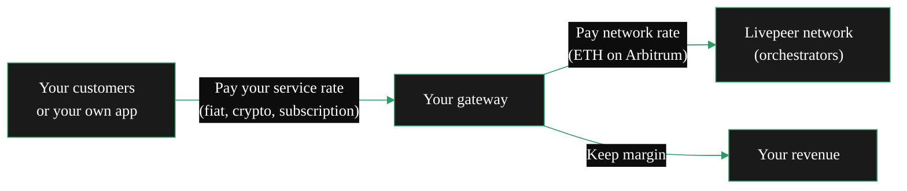

{/* TODO:
Terminology Validation:
- Ensure the terminology and definitions used in this page is consistent with the resources/glossary terminology
Verify:
- Mermaid diagrams use theme colours (but must be hardcoded - see snippets/components/page-structure/mermaidColours.jsx)
- Fontawesome icons are used on accordions and tabs
- Tables use StyledTable component
- No em-dashes are used (instead use standard -)
- UK spelling is used
- Headers are concise and technical - no long headers or questions (aim for max 3 words)
- CustomDivider is used with <CustomDivider style={{margin: "-1rem 0 -1rem 0"}} /> for all --- separator breaks
- Placeholders for Media & Video Resources are in comments with a TODO for a human.
- REVIEW flags are in JSX flags for a human.
*/}

import { StyledTable, TableRow, TableCell } from '/snippets/components/layout/tables.jsx'
import { BorderedBox, CenteredContainer } from '/snippets/components/layout/containers.jsx'
import { CustomDivider } from '/snippets/components/primitives/divider.jsx'

<CenteredContainer style={{ width: "80%", minWidth: "fit-content"}}>
    <Tip> Gateways are Application Layers built on the Livepeer Protocol. They provide access to services for downstream developers and users. </Tip>
</CenteredContainer>
A Livepeer gateway is the access point between your application and the Livepeer compute network. It receives jobs, selects an orchestrator (a GPU operator), handles payment, and returns results. The gateway holds no GPU - all compute happens on orchestrators.

Running your own gateway is not a technical requirement for using Livepeer. You can point at a hosted gateway and start building in minutes. The question is whether the control, cost savings, and capabilities of owning that layer are worth it for your situation.

<CustomDivider style={{margin: "-1rem 0 -1rem 0"}} />

## Hosted vs Self-Hosted

<BorderedBox>
    <Tabs>
        <Tab title="Use a hosted gateway" icon="clapperboard-play">
            <CenteredContainer style={{width: "70%", minWidth: "fit-content"}}>
                <Tip>
                    **Best for**: developers looking to integrate services.
                    <CenteredContainer style={{width: "90%", minWidth: "fit-content", marginRight: "2rem"}}>
                        <Card horizontal arrow title="Gateway Providers" icon="merge" href="/v2/gateways/guides/operator-considerations/production-gateways" />
                    </CenteredContainer>
                </Tip>
            </CenteredContainer>

            A hosted gateway like [Daydream API](/v2/solutions/daydream/overview), [Livepeer Studio](/v2/solutions/livepeer-studio/overview), or [Livepeer Cloud](https://livepeer.cloud) handles all infrastructure for you and provides an application layer for service integrations.
            You send requests; they handle routing, payment, and uptime.

            **Best when:**
            - You are building and experimenting
            - Volume is low to moderate
            - You do not need custom orchestrator routing or SLA policies
            - Crypto infrastructure is not something you want to manage

            **Limitations at scale:**
            - You pay a service margin on every request
            - You depend on the provider's uptime, pricing, and feature roadmap
            - You cannot customise routing, pricing caps, or access policies
            - You have no visibility into orchestrator selection or failure patterns
        </Tab>
        <Tab title="Run your own gateway" icon="torii-gate">
            <CenteredContainer style={{width: "70%", minWidth: "fit-content"}}>
                <Tip>**Best for**: application developers or businesses providing their own services.</Tip>
            </CenteredContainer>

            Running your own gateway gives you direct access to the Livepeer compute network. You set your own policies, connect directly to orchestrators, and capture the margin between what you charge customers and what you pay for compute.

            **Best when:**
            - You are processing high volume and want to reduce per-request costs
            - You need custom routing, SLA policies, or geographic preferences
            - You want to build a product or service layer on top of Livepeer
            - You are embedding AI or video capabilities directly in your infrastructure

            **What it requires:**
            - A Linux server (for <Badge color="purple">AI</Badge> or <Badge color="green">Dual</Badge> node types; <Badge color="blue">Video</Badge> also supports Windows)
            - No ETH required in off-chain operational mode
            - On-chain operational mode requires an ETH deposit on Arbitrum
        </Tab>
    </Tabs>
</BorderedBox>

<CustomDivider style={{margin: "0 0 -1rem 0"}} />

## Business Model

Gateways are Product routers. They earn at the **business layer**, not at the protocol level. Orchestrators earn protocol fees. Gateways earn the margin between what they charge customers and what they pay for compute.

<Note>
For AI gateways running in off-chain operational mode, your gateway node itself holds no ETH. A remote signer handles all on-chain payment operations. Your gateway operator costs are whatever you pay the signer - which can be zero if using a community-hosted signer.
</Note>

<CustomDivider style={{margin: "-1rem 0 -1rem 0"}} />

## Actor Earnings

<StyledTable variant="bordered">
  <thead>
    <TableRow header>
      <TableCell header>Role</TableCell>
      <TableCell header>Earns from</TableCell>
      <TableCell header>Currency</TableCell>
    </TableRow>
  </thead>
  <tbody>
    <TableRow>
      <TableCell>**Orchestrator**</TableCell>
      <TableCell>Receives payment from gateways for routing and coordinating compute work</TableCell>
      <TableCell>ETH (Arbitrum)</TableCell>
    </TableRow>
    <TableRow>
      <TableCell>**Transcoder / AI Worker**</TableCell>
      <TableCell>Receives payment from orchestrators for performing actual work</TableCell>
      <TableCell>ETH (Arbitrum)</TableCell>
    </TableRow>
    <TableRow>
      <TableCell>**Redeemer**</TableCell>
      <TableCell>Earns fees for redeeming winning payment tickets on-chain</TableCell>
      <TableCell>ETH (Arbitrum)</TableCell>
    </TableRow>
    <TableRow>
      <TableCell>**Gateway**</TableCell>
      <TableCell>**Pays** for compute. Earns at the business layer from customers.</TableCell>
      <TableCell>Pays ETH out; charges customers in any currency</TableCell>
    </TableRow>
  </tbody>
</StyledTable>

<CustomDivider style={{margin: "-1rem 0 -1rem 0"}} />

## Operator Models

<Tabs>
  <Tab title="Route your own workloads">
    You are building a product and currently using a hosted gateway such as Daydream, Livepeer Studio, or Livepeer Cloud. You pay their service rate on every request. Running your own gateway removes that cost entirely - you pay orchestrators directly at network rates.

    **What you capture:** The service margin you were previously paying to a third-party operator.

    **What this requires:**
    - A Linux server (for AI workloads; video also supports Windows)
    - No ETH for off-chain operational mode; ETH deposit for on-chain operational mode
    - The same application code - only the endpoint changes

    **Who is doing this:** App developers who scaled past the point where hosted gateway costs exceeded the operational cost of self-hosting.
  </Tab>
  <Tab title="Build an inference API">
    You operate a gateway and offer AI inference access to other developers. They send API requests; you route them to Livepeer AI workers and return results. You charge per request, per generation, or via subscription. You pay orchestrators and keep the margin.

    **What you capture:** Service margin on every job routed through your gateway. Your differentiation is reliability, model availability, pricing, and support.

    **What this requires:**
    - A production Linux server with stable uptime
    - An auth layer (API keys, rate limiting) built on top of the go-livepeer gateway
    - Billing integration outside the Livepeer protocol - the protocol only controls what you pay orchestrators, not what you charge customers

    **Who is doing this:** Livepeer Cloud SPE (free public inference gateway), Daydream, LLM SPE (LLM inference routing).
  </Tab>
  <Tab title="Embed in your platform">
    Your gateway is internal infrastructure - not exposed to users directly, but routing every AI or video request your platform makes. You charge customers for your product; the gateway is the cost layer underneath.

    **What you capture:** Your product margin. The gateway keeps compute costs below what you would pay a hosted inference provider (Replicate, Fal, Mux, AWS) while giving you full routing control.

    **What this requires:**
    - For AI: off-chain operational mode, Linux, no ETH
    - The same infrastructure as an inference API minus the external-facing billing layer

    **Who is doing this:** Daydream (real-time AI video for creators), Embody Avatars, AI Video Startup Programme participants.
  </Tab>
  <Tab title="Build a gateway platform (NaaP)">
    <Warning> NaaP is in active design consideration and listed here as a possible future project only </Warning>
    You operate a gateway platform that handles all crypto complexity on behalf of your users. Users sign up, receive API keys, and pay in fiat or standard crypto. Your platform converts that into ETH micropayments to orchestrators.

    This is the Network as a Platform (NaaP) pattern. The NaaP dashboard (`github.com/livepeer/naap`) is the reference implementation: JWT-based auth, Developer API Keys, and usage metering built on top of go-livepeer.

    From the Discord discussion that defined this model:
    > "The user never interacts with Livepeer contracts. The signer uses incoming USDC revenue to keep its hot wallet funded for PM ticket generation. The two payment layers are fully independent."

    **What you capture:** Full product margin plus ownership of the user relationship. Crypto is completely invisible to your users.

    **Status:** NaaP is in active development. The demo is operational; production API is not yet stable.

    [//]: # (REVIEW: Confirm the NaaP dashboard URL and production timeline.)
  </Tab>
</Tabs>

<CustomDivider style={{margin: "-1rem 0 -1rem 0"}} />

## Mode Economics

The economic model differs between the two operational modes.

<StyledTable variant="bordered">
  <thead>
    <TableRow header>
      <TableCell header>Factor</TableCell>
      <TableCell header>Off-chain</TableCell>
      <TableCell header>On-chain</TableCell>
    </TableRow>
  </thead>
  <tbody>
    <TableRow>
      <TableCell>**Startup cost**</TableCell>
      <TableCell>Zero - community-hosted signer is free</TableCell>
      <TableCell>ETH deposit required (~0.065 ETH + 0.03 reserve on Arbitrum)</TableCell>
    </TableRow>
    <TableRow>
      <TableCell>**Ongoing ETH management**</TableCell>
      <TableCell>None - remote signer handles it</TableCell>
      <TableCell>Monitor deposit balance; top up as it depletes</TableCell>
    </TableRow>
    <TableRow>
      <TableCell>**ETH price exposure**</TableCell>
      <TableCell>None - abstracted by signer or clearinghouse</TableCell>
      <TableCell>Yes - volatile ETH price affects your effective compute cost</TableCell>
    </TableRow>
    <TableRow>
      <TableCell>**Crypto knowledge required**</TableCell>
      <TableCell>No - none required at the gateway layer</TableCell>
      <TableCell>Yes - wallet, keystore, Arbitrum RPC, bridging</TableCell>
    </TableRow>
    <TableRow>
      <TableCell>**Time to first job**</TableCell>
      <TableCell>Minutes (Docker command, point at remote signer)</TableCell>
      <TableCell>Hours (wallet setup, bridging, funding deposit)</TableCell>
    </TableRow>
  </tbody>
</StyledTable>

[//]: # (REVIEW: Confirm the current ETH deposit and reserve amounts for on-chain gateways.)

<CustomDivider style={{margin: "-1rem 0 -1rem 0"}} />

## Profit Margins

Your pricing to customers is entirely at the application layer - the Livepeer protocol has no concept of "gateway fees". You decide what to charge; the protocol only controls what you **pay** orchestrators.

<StyledTable variant="bordered">
  <thead>
    <TableRow header>
      <TableCell header>Pricing model</TableCell>
      <TableCell header>Description</TableCell>
      <TableCell header>Used by</TableCell>
    </TableRow>
  </thead>
  <tbody>
    <TableRow>
      <TableCell>**Per-request**</TableCell>
      <TableCell>Charge per API call or per inference job</TableCell>
      <TableCell>API providers, Daydream</TableCell>
    </TableRow>
    <TableRow>
      <TableCell>**Per-minute**</TableCell>
      <TableCell>Charge per minute of video transcoded or live AI processed</TableCell>
      <TableCell>Livepeer Studio</TableCell>
    </TableRow>
    <TableRow>
      <TableCell>**Subscription**</TableCell>
      <TableCell>Monthly access fee regardless of usage</TableCell>
      <TableCell>SaaS gateway products</TableCell>
    </TableRow>
    <TableRow>
      <TableCell>**Usage-based**</TableCell>
      <TableCell>Charge per unit (per pixel, per generation, per token)</TableCell>
      <TableCell>Direct API products</TableCell>
    </TableRow>
    <TableRow>
      <TableCell>**Free + SPE-funded**</TableCell>
      <TableCell>No charge to users; costs covered by treasury grant</TableCell>
      <TableCell>Livepeer Cloud SPE</TableCell>
    </TableRow>
  </tbody>
</StyledTable>

Your revenue is the difference between what customers pay you and what you pay orchestrators. Pricing discovery - understanding what orchestrators charge on the current network - is available through `livepeer_cli` and the [Livepeer Explorer](https://explorer.livepeer.org).

<CustomDivider style={{margin: "-1rem 0 -1rem 0"}} />

## Core Reasons

### Cost and margin

<AccordionGroup>
  <Accordion title="Avoid hosted gateway fees at scale">
    Hosted gateways charge a service margin on every request. As your volume grows, that margin compounds significantly. Running your own gateway eliminates that third-party cost - you pay orchestrators directly at network rates.

    For video transcoding, community estimates suggest Livepeer can be 10-50x cheaper than cloud providers like Mux or AWS MediaLive at comparable volumes. The exact saving depends on your transcoding profiles and orchestrator selection.

    [//]: # (REVIEW: Replace this cost comparison with a published benchmark or remove it.)
  </Accordion>
  <Accordion title="Free to start with off-chain operational mode">
    AI gateways in off-chain operational mode require no ETH deposit and no Arbitrum wallet. You point at a community-hosted remote signer (which handles the payment layer for you), connect to orchestrators, and start routing inference requests immediately with no upfront crypto cost.

    This is a clear contrast to on-chain operational mode, which requires bridging ETH to Arbitrum before you can process a single job.
  </Accordion>
</AccordionGroup>

### Control and reliability

<AccordionGroup>
  <Accordion title="Own your routing and SLA policy">
    A hosted gateway selects orchestrators on your behalf, using its own policy. You have no visibility into that selection and no ability to change it.

    Running your own gateway means you control which orchestrators receive your jobs, at what price caps, with what retry behaviour, and with what failover logic. For production workloads where quality and latency matter, this control is material.
  </Accordion>
  <Accordion title="Geographic request steering">
    You can configure your gateway to prefer orchestrators in specific regions. This reduces latency for your users and can improve transcoding or inference quality by keeping traffic local.
  </Accordion>
  <Accordion title="No dependency on a third party">
    If a hosted gateway goes down, changes pricing, or drops support for a capability you rely on, your production service goes with it. Your own gateway removes that dependency.
  </Accordion>
</AccordionGroup>

### Product differentiation

<AccordionGroup>
  <Accordion title="Stable API surface above the protocol">
    The Livepeer protocol evolves. Orchestrators come and go. Flag names change (the gateway was previously called "the broadcaster").

    Your gateway is the abstraction layer that shields your customers from all of that. You version your API independently, handle protocol changes internally, and expose a stable interface to your users.
  </Accordion>
  <Accordion title="Auth, billing, and enterprise controls">
    The go-livepeer gateway binary does not include built-in auth, rate limiting, or billing. Running your own gateway means you can wrap it with middleware that handles API key management, per-user rate limits, cost allocation, and audit logging - standard requirements for any production service.

    The NaaP (Network as a Platform) project is developing a reference implementation for exactly this.
  </Accordion>
  <Accordion title="Embed gateway functionality in your product">
    Some operators embed gateway logic directly in their application instead of running it as a separate service. This is the use case for the remote signer architecture: your application can route Livepeer jobs natively, delegating the payment complexity to a sidecar remote signer process.

    The Python gateway SDK (`livepeer-python-gateway`) is the primary reference for this pattern.
  </Accordion>
</AccordionGroup>

<CustomDivider style={{margin: "-1rem 0 -1rem 0"}} />

## Gateway Primitives

Beyond routing your own workloads, the go-livepeer gateway is a platform primitive. It exposes everything needed to build:

<AccordionGroup>
  <Accordion title="API key management and auth">
    Wrap the gateway HTTP interface with standard auth middleware. The gateway itself has no built-in auth - this is intentional; it lives in your application layer. The NaaP project provides a reference implementation using JWT tokens issued via SIWE (Sign-In with Ethereum), but any standard auth pattern works.
  </Accordion>
  <Accordion title="Custom orchestrator routing">
    `-orchAddr` lets you specify exactly which orchestrators receive your jobs. Build orchestrator tiers, geographic routing, or capability-specific pools. `-maxPricePerCapability` accepts a JSON configuration with per-pipeline, per-model price caps - route different job types to different orchestrator tiers with different pricing policies.
  </Accordion>
  <Accordion title="Billing and usage metering">
    The gateway exposes per-job result data. Build usage accounting outside the protocol and charge customers however your product requires - per generation, per minute of video, subscription, or credits.
  </Accordion>
  <Accordion title="Alternative gateway implementations">
    The remote signer architecture means you are not required to use the Go binary. Python, browser, and mobile gateway clients are possible - the signer handles Ethereum complexity. The `livepeer-python-gateway` SDK (`github.com/j0sh/livepeer-python-gateway`) is the reference Python implementation.
  </Accordion>
</AccordionGroup>

<CustomDivider style={{margin: "-1rem 0 -1rem 0"}} />

## Decision Tree

<StyledTable variant="bordered">
  <thead>
    <TableRow header>
      <TableCell header>Question</TableCell>
      <TableCell header>Lean towards self-hosting if...</TableCell>
    </TableRow>
  </thead>
  <tbody>
    <TableRow>
      <TableCell>How much volume are you processing?</TableCell>
      <TableCell>Monthly spend on hosted API exceeds the effort of setup</TableCell>
    </TableRow>
    <TableRow>
      <TableCell>Do you need custom routing or SLA policies?</TableCell>
      <TableCell>Yes, especially regional preferences or quality thresholds</TableCell>
    </TableRow>
    <TableRow>
      <TableCell>Are you building a product for other users?</TableCell>
      <TableCell>Yes - you need a service layer to charge customers</TableCell>
    </TableRow>
    <TableRow>
      <TableCell>Do you have Linux server access?</TableCell>
      <TableCell>Yes (required for AI and dual node types)</TableCell>
    </TableRow>
    <TableRow>
      <TableCell>Do you need AI inference specifically?</TableCell>
      <TableCell>Yes - off-chain operational mode makes this low-friction</TableCell>
    </TableRow>
    <TableRow>
      <TableCell>Are you comfortable with Docker or Go binaries?</TableCell>
      <TableCell>Yes - installation is straightforward on Linux</TableCell>
    </TableRow>
  </tbody>
</StyledTable>

If most of your answers align with self-hosting, continue to requirements and setup.

<CustomDivider style={{margin: "-1rem 0 -1rem 0"}} />

## Related Pages

<CardGroup cols={3}>
  <Card title="Gateways in Practice" icon="building" href="/v2/gateways/guides/roadmap-and-funding/gateway-showcase">
    Production products and community projects built on Livepeer gateways.
  </Card>
  <Card title="Requirements" icon="clipboard-check" href="/v2/gateways/guides/deployment-details/setup-requirements">
    Hardware, OS, network, and operational mode requirements.
  </Card>
  <Card title="Deployment Options" icon="arrow-right" href="/v2/gateways/guides/deployment-details/setup-options">
    Choose your setup type and node type.
  </Card>
</CardGroup>
