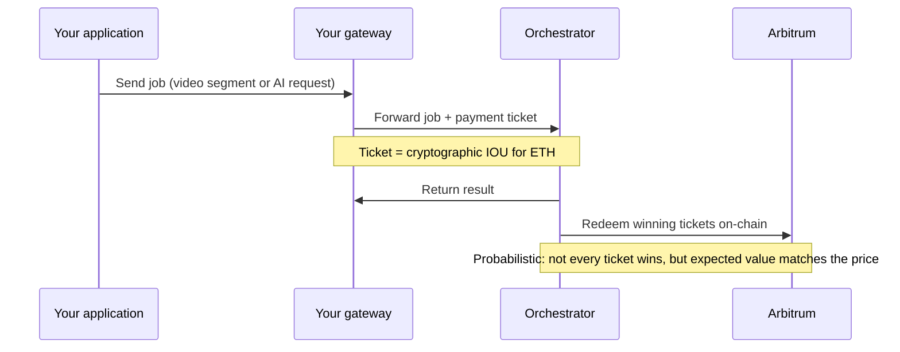

{/* TODO:
Verify:
- Mermaid diagrams use theme colours (but must be hardcoded - see snippets/components/page-structure/mermaid-colours.jsx)
- Fontawesome icons are used on accordions and tabs
- Tables use StyledTable component
- No em-dashes are used (instead use standard -)
- UK spelling is used
- Headers are concise and technical - no long headers or questions (aim for max 3 words)
- CustomDivider is used with <CustomDivider style={{margin: "-1rem 0 -1rem 0"}} /> for all --- separator breaks
- Placeholders for Media & Video Resources are in comments with a TODO for a human.
- REVIEW flags are in JSX flags for a human.
*/}

import { StyledTable, TableRow, TableCell } from '/snippets/components/layout/tables.jsx'
import { CustomDivider } from '/snippets/components/primitives/divider.jsx'

<CustomDivider style={{margin: "0 0 -1rem 0"}} />

Livepeer gateways are consumers of compute services, not earners of protocol fees. Orchestrators earn fees from gateways; gateways earn at the **business layer** — the margin between what they charge customers and what they pay the network.

This page explains how gateway payments work at the protocol level, what costs you control, and how the revenue side works.

## Actor Earnings

<StyledTable variant="bordered">
  <thead>
    <TableRow header>
      <TableCell header>Role</TableCell>
      <TableCell header>Earns from</TableCell>
      <TableCell header>Currency</TableCell>
    </TableRow>
  </thead>
  <tbody>
    <TableRow>
      <TableCell>**Orchestrator**</TableCell>
      <TableCell>Receives payment from gateways for routing and coordinating compute work</TableCell>
      <TableCell>ETH (Arbitrum)</TableCell>
    </TableRow>
    <TableRow>
      <TableCell>**Transcoder / AI Worker**</TableCell>
      <TableCell>Receives payment from orchestrators for performing actual work</TableCell>
      <TableCell>ETH (Arbitrum)</TableCell>
    </TableRow>
    <TableRow>
      <TableCell>**Redeemer**</TableCell>
      <TableCell>Earns fees for redeeming winning payment tickets on-chain</TableCell>
      <TableCell>ETH (Arbitrum)</TableCell>
    </TableRow>
    <TableRow>
      <TableCell>**Gateway**</TableCell>
      <TableCell>**Pays** for compute. Earns at the business layer from customers.</TableCell>
      <TableCell>Pays ETH out; charges customers in any currency</TableCell>
    </TableRow>
  </tbody>
</StyledTable>

<CustomDivider style={{margin: "0 0 -1rem 0"}} />

## Payment Mechanics

Livepeer uses **probabilistic micropayments (PM)** — a system designed for high-frequency, low-value payments without the gas cost of settling every transaction on-chain.



**Tickets:**
- Your gateway generates signed payment tickets for each unit of work
- Tickets have a face value and a winning probability — most tickets lose, but winners pay out the full face value
- The expected value of all tickets equals the price agreed for the work
- Orchestrators redeem winning tickets on Arbitrum to receive ETH
- This means most work has zero on-chain cost, while the economic model remains sound

<Note>
The gateway's ETH deposit and reserve funds are what back these tickets. If your deposit runs low, orchestrators may reject your jobs. Monitor your deposit balance in production.
</Note>

<CustomDivider style={{margin: "0 0 -1rem 0"}} />

## Gateway Service Fees

Payment costs differ significantly between workload types.

<Tabs>
  <Tab title="Video transcoding">
    Video transcoding costs are calculated per pixel processed:

    ```
    Cost = pixels_in_segment × price_per_unit
    ```

    Where `pixels_in_segment = width × height × frames_per_second × segment_duration`.

    You control your maximum price with:

    ```bash
    -maxPricePerUnit=1000  # Maximum you'll pay per pixel, in wei
    -pixelsPerUnit=1       # Pixels per pricing unit (denominator)
    ```

    **Price format:** Accepts wei (integer) or USD shorthand: `-maxPricePerUnit=0.50USD` (uses Chainlink ETH/USD price feed).

    If no orchestrator meets your price, the job fails. Use `-ignoreMaxPriceIfNeeded=true` to allow the gateway to exceed your max price rather than fail the job.
  </Tab>
  <Tab title="AI inference (batch)">
    Batch AI inference (text-to-image, image-to-image, image-to-video, etc.) is charged per output pixel:

    ```
    Cost = width × height × number_of_outputs × price_per_unit
    ```

    You control your maximum price per AI pipeline and model with `-maxPricePerCapability`:

    ```bash
    -maxPricePerCapability='{
      "capabilities_prices": [
        {
          "pipeline": "text-to-image",
          "model_id": "black-forest-labs/FLUX.1-dev",
          "price_per_unit": 1000,
          "pixels_per_unit": 1
        },
        {
          "pipeline": "image-to-video",
          "model_id": "stabilityai/stable-video-diffusion-img2vid-xt-1-1",
          "price_per_unit": 2000,
          "pixels_per_unit": 1
        }
      ]
    }'
    ```

    Or pass a path to a JSON file: `-maxPricePerCapability=/path/to/pricing.json`
  </Tab>
  <Tab title="Live AI (LV2V)">
    Live video-to-video AI (real-time AI processing of a live stream) uses interval-based payments rather than per-pixel costs:

    ```bash
    -livePaymentInterval=5s  # Pay every 5 seconds of live processing (default)
    ```

    Cost accumulates over time rather than per output pixel. This reflects the continuous compute cost of running a model on a live stream.

    {/* REVIEW: Confirm current default for -livePaymentInterval and exact payment unit for LV2V. Source: from research context, value of 5s and interval-based model is verified from Remote Signers design doc but unit cost calculation needs confirming with Peter (AI SPE Lead). */}
  </Tab>
</Tabs>

<CustomDivider style={{margin: "0 0 -1rem 0"}} />

## Payment Currency

Gateway payments use ETH on Arbitrum, not LPT. This is a common point of confusion.

<StyledTable variant="bordered">
  <thead>
    <TableRow header>
      <TableCell header>Currency</TableCell>
      <TableCell header>Used for</TableCell>
      <TableCell header>Who uses it</TableCell>
    </TableRow>
  </thead>
  <tbody>
    <TableRow>
      <TableCell>**ETH** (Arbitrum One)</TableCell>
      <TableCell>Service payments — transcoding and AI inference</TableCell>
      <TableCell>Gateways pay orchestrators</TableCell>
    </TableRow>
    <TableRow>
      <TableCell>**LPT**</TableCell>
      <TableCell>Staking, governance, protocol rewards</TableCell>
      <TableCell>Orchestrators, delegators</TableCell>
    </TableRow>
  </tbody>
</StyledTable>

You do not need LPT to run a gateway. LPT is the orchestrator staking token; ETH is the payment token.

<CustomDivider style={{margin: "0 0 -1rem 0"}} />

## Deployment Mode Economics

The economic model differs significantly between the two gateway operation modes.

<Tabs>
  <Tab title="On-chain (video gateway)">
    **What you hold:** ETH on Arbitrum — split into deposit and reserve.

    ```
    Deposit: funds used to back payment tickets (consumed as you use the network)
    Reserve: held as insurance; released when jobs complete
    ```

    **Upfront cost:**
    - Minimum for testing: 0.1 ETH on Arbitrum
    - Recommended production: ~0.065 ETH deposit + 0.03 ETH reserve

    {/* REVIEW: Confirm exact deposit/reserve amounts with Mehrdad/Rick. These figures are from fund-gateway.mdx. Issue open to reduce reserve requirement: github.com/livepeer/go-livepeer/issues/3744 */}

    **Operational cost:** ETH consumed as you pay for transcoding. Monitor and top up your deposit as it depletes.

    **ETH price risk:** Volatile ETH price affects the effective USD cost of transcoding. Daydream's experience with price volatility is documented as a motivation for the remote signer architecture.
  </Tab>
  <Tab title="Off-chain (AI gateway)">
    **What you hold:** Nothing on-chain at the gateway node. The remote signer holds ETH on behalf of your gateway.

    **Upfront cost:** Zero ETH required for the gateway operator. The remote signer operator holds the ETH.

    **Operational cost:** You pay your remote signer provider (or maintain your own signer's ETH balance if self-hosted).

    **Community option:** The `signer.eliteencoder.net` community remote signer provides free ETH for off-chain gateway testing and early production use.

    {/* REVIEW: Confirm signer.eliteencoder.net remains free and operational. Verify in #local-gateways Discord. */}

    **ETH price risk:** Abstracted away if you are using a clearinghouse. Your costs from the gateway operator perspective are whatever the clearinghouse charges you (fiat, API credit, or crypto at a fixed rate).
  </Tab>
</Tabs>

<CustomDivider style={{margin: "0 0 -1rem 0"}} />

## Gateway Profit Margins

Your pricing to customers is entirely at the application layer — the Livepeer protocol has no concept of "gateway fees". You decide what to charge; the protocol only controls what you **pay** orchestrators.

Common pricing models used by current gateway operators:

| Model | Description | Used by |
|-------|-------------|---------|
| Per-request | Charge per API call or per inference job | API providers, Daydream |
| Per-minute | Charge per minute of video transcoded or live AI processed | Livepeer Studio |
| Subscription | Monthly access fee regardless of usage | SaaS gateway products |
| Usage-based | Charge per unit (per pixel, per generation, per token) | Direct API products |
| Free + SPE-funded | No charge to users; costs covered by treasury grant | Livepeer Cloud SPE |

Your revenue is the difference between what customers pay you and what you pay orchestrators. Pricing discovery — understanding what orchestrators charge on the current network — is available through `livepeer_cli` and the [Livepeer Explorer](https://explorer.livepeer.org).

<CustomDivider style={{margin: "0 0 -1rem 0"}} />

## Cost Monitoring

Key metrics to watch in production:

```bash
# Check gateway financial status via CLI
livepeer_cli --host=localhost --http=7935
# Option 1: Get node status — shows current deposit and reserve balances
```

For a running gateway, these are the critical numbers:

| Metric | What it tells you |
|--------|------------------|
| **Deposit balance** | ETH available to back new payment tickets. If this drops to zero, jobs fail. |
| **Reserve balance** | Insurance pool; released after jobs complete. |
| **Ticket redemption rate** | Percentage of tickets winning on-chain. Very low = misconfigured ticket parameters. |
| **Max price rejections** | Jobs rejected because no orchestrator met your price cap. Consider raising `maxPricePerUnit`. |

<CustomDivider style={{margin: "0 0 -1rem 0"}} />

## Related pages

<CardGroup cols={3}>
  <Card title="How payments work" icon="circle-dollar-to-slot" href="/v2/gateways/guides/payments-and-pricing/related/how-payments-work">
    Full PM ticket lifecycle, ETH fee flow, and probabilistic payment model.
  </Card>
  <Card title="Pricing configuration" icon="sliders" href="/v2/gateways/setup/configure/pricing-configuration">
    Configure maxPricePerUnit, maxPricePerCapability, and AI pricing JSON.
  </Card>
  <Card title="Fund your gateway" icon="ethereum" href="/v2/gateways/setup/requirements/on-chain%20setup/fund-gateway">
    Bridge ETH to Arbitrum and allocate deposit and reserve funds.
  </Card>
</CardGroup>
