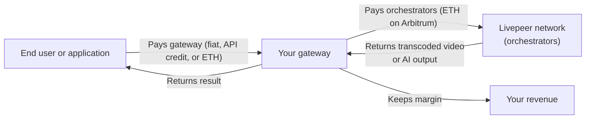

import { BorderedBox } from '/snippets/components/layout/containers.jsx'
import { StyledTable, TableRow, TableCell } from '/snippets/components/layout/tables.jsx'

Gateways occupy the demand side of the Livepeer network. They are the control point between applications and the GPU compute supply — handling routing, payments, service-level logic, and customer relationships.

This page covers the concrete business and revenue patterns that gateway operators use today, where the opportunity space is growing, and how the Foundation supports new operators.

---

## The business model in one diagram

The gateway is not a passive router. It is the commercial layer: it sets pricing, enforces quality policy, manages customer relationships, and captures the difference between what it charges customers and what it pays for compute.

<Note>
Gateways do not earn fees at the Livepeer protocol level. Orchestrators earn protocol fees. Gateway revenue comes from the service layer — charging customers more than the cost of compute, or avoiding third-party gateway fees by routing your own workloads directly.
</Note>

---

## Revenue patterns

### 1. Eliminate third-party gateway fees (self-hosted)

The simplest case: you are already using a hosted gateway (Daydream API, Livepeer Studio, Livepeer Cloud) and your volume has grown to where the service margin is meaningful. You run your own gateway and pay orchestrators directly.

**Who this suits:** App developers scaling up (Persona A), video infrastructure operators who already use OBS/RTMP.

**What you capture:** The service margin you were previously paying to a third-party gateway operator.

---

### 2. Charge for managed access (gateway-as-service)

You operate a public gateway and charge developers to use it. They pay you via API credit, subscription, or per-request pricing. You pay orchestrators on their behalf and keep the difference.

**Who this suits:** Infrastructure businesses (Persona B), teams building compute-layer products.

**What you capture:** Service margin on every request routed through your gateway. Your value add is reliability, SLA guarantees, custom orchestrator selection, and support.

**Example:** Livepeer Cloud SPE operates public gateways funded by treasury SPE grant. Developers connect to the Cloud gateway for free today; the commercial path is charging for premium SLA and capability tiers.

---

### 3. Power a commercial AI product (embedded gateway)

Your gateway is internal infrastructure — not exposed to users directly, but routing every AI inference request in your product. You charge customers for your product; the gateway is the cost layer below.

**Who this suits:** AI platform operators (Persona E), builders on the Livepeer AI SDK.

**What you capture:** Your product margin. The gateway keeps your compute costs below what you would pay for hosted inference (Replicate, Fal, etc.) while giving you full control over model routing and quality.

**Example:** Daydream runs its own gateway to power real-time AI video generation for creators. Daydream charges customers for AI video access; the gateway routes requests to the Livepeer network and handles all payment.

---

### 4. Build a network-as-a-platform (NaaP)

A clearinghouse model: your gateway handles crypto completely on behalf of your users. Users sign in, receive API keys, and pay in fiat or standard crypto. Your gateway converts that into ETH micropayments to orchestrators.

This is the NaaP (Network as a Platform) pattern currently in development by the Livepeer community. The NaaP dashboard (`github.com/livepeer/naap`) provides JWT-based auth and Developer API Keys as a reference implementation.

**Who this suits:** Platform builders (Persona E), anyone building multi-tenant gateway access with billing.

**What you capture:** Full product margin plus control over the entire payment stack. You abstract crypto entirely from your users.

{/* REVIEW: NaaP dashboard public URL and current availability. Confirm with Qiang Han. */}

---

## Who is running gateways today

<StyledTable variant="bordered">
  <thead>
    <TableRow header>
      <TableCell header>Operator</TableCell>
      <TableCell header>Type</TableCell>
      <TableCell header>Focus</TableCell>
      <TableCell header>Model</TableCell>
    </TableRow>
  </thead>
  <tbody>
    <TableRow>
      <TableCell>**Livepeer Studio**</TableCell>
      <TableCell>Commercial product</TableCell>
      <TableCell>Video streaming and VOD API for developers</TableCell>
      <TableCell>Charges per minute; pays orchestrators</TableCell>
    </TableRow>
    <TableRow>
      <TableCell>**Daydream**</TableCell>
      <TableCell>Commercial product</TableCell>
      <TableCell>Real-time AI video for creators and builders</TableCell>
      <TableCell>Product subscription; AI inference via gateway</TableCell>
    </TableRow>
    <TableRow>
      <TableCell>**Livepeer Cloud SPE**</TableCell>
      <TableCell>Treasury-funded public gateway</TableCell>
      <TableCell>Free AI and RTMP gateways, ecosystem adoption</TableCell>
      <TableCell>SPE grant-funded; expanding to commercial tiers</TableCell>
    </TableRow>
    <TableRow>
      <TableCell>**LLM SPE**</TableCell>
      <TableCell>Treasury-funded specialised gateway</TableCell>
      <TableCell>LLM inference routing on Livepeer network</TableCell>
      <TableCell>SPE grant-funded; LLM workload focus</TableCell>
    </TableRow>
    <TableRow>
      <TableCell>**NaaP (in development)**</TableCell>
      <TableCell>Platform / clearinghouse</TableCell>
      <TableCell>Multi-tenant gateway with API key auth and billing</TableCell>
      <TableCell>Fiat/crypto-in, ETH micropayments out</TableCell>
    </TableRow>
    <TableRow>
      <TableCell>**Self-hosted operators**</TableCell>
      <TableCell>Internal / private</TableCell>
      <TableCell>Routing own video and AI workloads</TableCell>
      <TableCell>Cost elimination; no margin charged externally</TableCell>
    </TableRow>
  </tbody>
</StyledTable>

---

## Foundation support for gateway operators

The Livepeer Foundation actively supports new gateway operators through several programmes.

<AccordionGroup>
  <Accordion title="AI Video Startup Programme">
    The Foundation runs an AI Video Startup Programme for teams building AI-powered video products on Livepeer. Accepted teams receive access to Livepeer network resources, technical support from Foundation engineers, and introductions to investors and partners.

    Running your own AI gateway is the natural operational model for teams in this programme — you route inference directly rather than paying a third-party gateway margin.

    {/* REVIEW: Confirm current programme name, eligibility criteria, and application URL with Foundation BD team. */}
  </Accordion>
  <Accordion title="SPE treasury grants">
    Special Purpose Entities (SPEs) are funded organisations that contribute to the Livepeer ecosystem through treasury proposals. Several gateway operators are SPE-funded: Livepeer Cloud SPE (public gateways, ecosystem adoption), LLM SPE (LLM inference routing), and others.

    If your gateway serves the broader ecosystem — public access, new capabilities, or expanded network demand — a treasury proposal is a concrete path to operational funding.

    SPE proposals are submitted to the Livepeer governance process. Review existing SPE proposals on the [Livepeer Forum](https://forum.livepeer.org) to understand the format and scope expected.
  </Accordion>
  <Accordion title="Community and technical support">
    The `#local-gateways` Discord channel is the primary technical channel for gateway operators. Foundation engineers (including j0sh, the primary remote signer author) are active there and responsive to operational questions.

    The Livepeer Foundation also provides direct BD engagement for teams building commercial gateway services. Reach out to the Foundation directly if you are building a significant gateway product.
  </Accordion>
</AccordionGroup>

---

## The opportunity landscape

The AI inference routing market is early. Today, most AI inference runs through centralised API providers: Replicate, Fal, OpenAI, Anthropic. Livepeer offers a decentralised alternative with a meaningful cost advantage on specific workload types (video generation, image generation, live video AI).

The gateway layer is where that advantage gets packaged into products developers actually buy. As Livepeer's AI network matures, the opportunity for gateway operators is:

| Opportunity | Horizon | Who can capture it |
|-------------|---------|-------------------|
| Replace hosted gateway costs at scale | Now | App developers with growing volume |
| Build AI inference API on Livepeer | Now | Infrastructure and API companies |
| Network-as-a-Platform clearinghouse | 2026 | Platform builders with auth/billing capability |
| Enterprise video transcoding | Now | Video infrastructure operators |
| Public gateway-as-service | Now with SPE support | Community infrastructure operators |

---

## Next steps

<CardGroup cols={3}>
  <Card title="Gateway requirements" icon="clipboard-check" href="/v2/gateways/guides/gateway-requirements">
    Confirm what hardware, OS, and skills your gateway setup requires.
  </Card>
  <Card title="Gateway economics" icon="hand-holding-dollar" href="/v2/gateways/guides/gateway-economics">
    How gateway payments and business pricing work in detail.
  </Card>
  <Card title="Choose your setup path" icon="arrow-right" href="/v2/gateways/get-started/gateway-setup-paths">
    Find the right quickstart for your gateway type.
  </Card>
</CardGroup>
