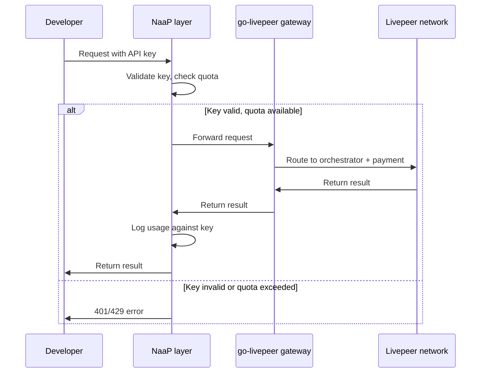

{/*
  PURPOSE:
  Journey step: "How do I build a multi-tenant platform?"
  Deep-dive on the Network-as-a-Platform (NaaP) model  - the most advanced
  gateway business model. Covers multi-tenant architecture, auth, billing,
  and tenant isolation.

  SECTION HOME: Guides → Opportunities

  JOURNEY POSITION:
  1. Operator Opportunities Overview  - "Why is this an opportunity?"
  2. NaaP & Multi-Tenancy (this page)  - "The platform business model"
  3. SPE & Grant Models  - "Treasury-funded gateways"
  4. Community Projects & Ecosystem  - "What others have built"

  RELATED FILES (draw from):
  - all-resources/v2-opcons--operator-opportunities.mdx        - PRIMARY (70%): 228 lines. NaaP as fourth operator model, business model table.
  - all-resources/ctx-gwnew--content-brief-gwe-clearinghouse-middleware.md  - PRIMARY (60%): 939 lines. Clearinghouse + middleware brief  - NaaP architecture, auth, billing integration.
  - all-resources/v2-opcons--business-case.mdx                 - SECONDARY (40%): 295 lines. Cost structures for NaaP model.
  - all-resources/ctx-gwnew--content-brief-gwd-addendum-composable.md  - SECONDARY (30%): 291 lines. Composable architecture addendum  - multi-tenant patterns.

  CROSS-REFS:
  - Opportunities Overview (this section)  - NaaP as one of four operator models
  - Advanced Operations → Gateway Middleware  - middleware layer that enables NaaP
  - Payments & Pricing → Clearinghouse Guide  - payment pipeline for multi-tenant billing
  - Concepts → Architecture  - gateway architecture that NaaP builds on
*/}

import { StyledTable, TableRow, TableCell } from '/snippets/components/layout/tables.jsx'
import { BorderedBox } from '/snippets/components/layout/containers.jsx'

The Network as a Platform (NaaP) model is the most advanced gateway operator pattern: build a multi-tenant platform that wraps Livepeer compute as a managed service for your customers. Users sign up, receive API keys, and pay in fiat or standard crypto. Your platform handles all crypto complexity internally  - users never interact with Livepeer contracts.

This page explains the NaaP architecture, how the reference implementation works, and what you need to build a multi-tenant gateway platform.

---

## What NaaP solves

The go-livepeer gateway binary routes jobs and handles payments. It does not handle:

- User authentication or API keys
- Per-customer rate limiting or quotas
- Usage tracking or billing
- Multi-tenant isolation

NaaP is the product layer that sits on top of the gateway and handles all of these. It turns a single-operator gateway into a platform that can serve many customers independently.

```
Your customers
      │
      │  API key + request
      ▼
NaaP product layer  ←── auth, billing, usage metering
      │
      │  authenticated request
      ▼
go-livepeer gateway  ←── orchestrator selection, payment
      │
      │  job + payment ticket
      ▼
Livepeer network (orchestrators)
```

From the Discord discussion that defined this model:
> "The user never interacts with Livepeer contracts. The signer uses incoming USDC revenue to keep its hot wallet funded for PM ticket generation. The two payment layers are fully independent."

---

## Two independent payment layers

The core architectural insight behind NaaP: your customer-facing payments and the network-facing payments are completely separate.

<StyledTable variant="bordered">
  <thead>
    <TableRow header>
      <TableCell header>Layer</TableCell>
      <TableCell header>Who pays</TableCell>
      <TableCell header>Currency</TableCell>
      <TableCell header>Mechanism</TableCell>
    </TableRow>
  </thead>
  <tbody>
    <TableRow>
      <TableCell>**Customer → You**</TableCell>
      <TableCell>Your customers</TableCell>
      <TableCell>Fiat, USDC, credit card  - whatever you choose</TableCell>
      <TableCell>Your billing system (Stripe, custom, usage credits)</TableCell>
    </TableRow>
    <TableRow>
      <TableCell>**You → Network**</TableCell>
      <TableCell>Your gateway (via remote signer)</TableCell>
      <TableCell>ETH on Arbitrum (probabilistic micropayments)</TableCell>
      <TableCell>Remote signer + clearinghouse handles this automatically</TableCell>
    </TableRow>
  </tbody>
</StyledTable>

Your margin is the difference between what customers pay you and what the network charges. The customer never sees ETH, Arbitrum, or payment tickets. The protocol is invisible to them.

---

## Reference implementation: the NaaP dashboard

The NaaP dashboard ([github.com/livepeer/naap](https://github.com/livepeer/naap)) is the reference implementation for multi-tenant gateway access. It provides:

- **JWT-based authentication** via SIWE (Sign-In with Ethereum)  - developers sign in, receive a JWT, and use it for all API calls
- **Developer API Keys**  - per-customer keys with configurable rate limits
- **Usage metering**  - per-key request counting, pixel tracking, inference counting
- **Dashboard UI**  - self-service portal for API key management and usage monitoring

<Warning>
NaaP is in active development. The demo is operational but the production API is not yet stable. Build against it with the expectation that breaking changes will occur.
</Warning>

{/* REVIEW: Confirm NaaP public URL, demo availability, and production timeline with Qiang Han. */}

---

## Multi-tenant architecture

### Authentication flow



### Tenant isolation

Each customer (tenant) operates within boundaries set by their API key:

| Isolation concern | How NaaP handles it |
|-------------------|-------------------|
| **Request quotas** | Per-key rate limits (requests/minute, requests/day) |
| **Usage caps** | Per-key maximum usage (pixels, inferences, minutes) |
| **Billing separation** | Per-key usage tracking for independent invoicing |
| **Failure isolation** | One customer exceeding quota does not affect others |
| **Data separation** | Per-key logs and metrics |

### Orchestrator affinity

For premium tenants, you can configure orchestrator routing preferences:

- Route premium customers to high-tier orchestrators (lower latency, higher reliability)
- Route budget customers to standard orchestrators
- Route specific workload types to capability-matched orchestrators

This is configured at the middleware layer using `-orchAddr` or `-maxPricePerCapability` per request path. The NaaP layer passes routing hints to the gateway based on the customer's tier.

---

## Building the product layer

### Option 1: Use the NaaP reference implementation

The fastest path. Clone the NaaP dashboard, configure it for your gateway, and customise the billing and branding.

What you get out of the box:
- JWT auth via SIWE
- API key generation and management
- Usage tracking per key
- Dashboard UI

What you still need to build:
- Payment integration (Stripe, crypto billing, etc.)
- Custom pricing tiers
- Customer onboarding flow
- Production monitoring and alerting

### Option 2: Build your own product layer

If your platform has specific requirements that NaaP does not cover, build your own using standard middleware patterns.

**Architecture:**

```
Customer request
      ↓
[Auth middleware]       - validate API key / JWT
      ↓
[Rate limiter]          - per-key request throttling
      ↓
[Usage tracker]         - log request for billing
      ↓
[Routing middleware]    - select orchestrator tier based on customer
      ↓
[go-livepeer gateway]   - route job and handle payment
      ↓
[Response middleware]    - log result, update usage counters
      ↓
Customer response
```

Standard tools for each layer:
- **Auth:** Express.js middleware, FastAPI middleware, nginx auth_request
- **Rate limiting:** Redis-backed counters, nginx rate_limit
- **Usage tracking:** PostgreSQL or TimescaleDB for per-key metrics
- **Routing:** Custom proxy logic or Kong/Traefik API gateway

See [Gateway Middleware](/v2/gateways/guides/advanced-operations/gateway-middleware) for detailed middleware architecture patterns.

---

## Billing integration

### What to meter

| Workload type | Metering unit | How to capture |
|---------------|---------------|----------------|
| Video transcoding | Minutes of transcoded video | Gateway result metadata |
| Batch AI (text-to-image, etc.) | Output pixels or number of generations | Gateway result metadata |
| Live AI (LV2V) | Seconds of processed stream | Session duration tracking |
| LLM | Output tokens | Gateway result metadata |
| Audio-to-text | Seconds of input audio | Request metadata |

### Pricing models

| Model | Description | Used by |
|-------|-------------|---------|
| **Per-request** | Charge per API call or per inference job | API providers, Daydream |
| **Per-minute** | Charge per minute of video transcoded or live AI processed | Livepeer Studio |
| **Subscription** | Monthly access fee regardless of usage | SaaS gateway products |
| **Usage-based** | Charge per unit (per pixel, per generation, per token) | Direct API products |
| **Free + SPE-funded** | No charge to users; costs covered by treasury grant | Livepeer Cloud SPE |
| **Credits** | Pre-purchased credits debited per job | Hybrid platforms |

Your margin is the difference between what you charge customers and what you pay orchestrators. Use `-maxPricePerUnit` and `-maxPricePerCapability` to control your network costs; set your customer prices independently.

---

## Clearinghouse: the payment bridge

The clearinghouse is the component that bridges your customer-facing payment layer with the network-facing ETH payment layer. It:

1. **Receives customer payments** in your chosen currency (fiat, USDC, credits)
2. **Maintains an ETH hot wallet** funded from customer revenue
3. **Acts as the remote signer** for your gateway  - generating payment tickets backed by the ETH balance
4. **Settles with orchestrators** via probabilistic micropayments

The clearinghouse means your gateway node holds no ETH and has no direct Ethereum dependency. The clearinghouse operator (you, or a hosted service) manages the on-chain side.

For the full clearinghouse design and implementation, see [Clearinghouse Guide](/v2/gateways/guides/payments-and-pricing/clearinghouse) (Payments & Pricing section).

---

## Who is building NaaP platforms

<StyledTable variant="bordered">
  <thead>
    <TableRow header>
      <TableCell header>Project</TableCell>
      <TableCell header>Model</TableCell>
      <TableCell header>Status</TableCell>
    </TableRow>
  </thead>
  <tbody>
    <TableRow>
      <TableCell>**NaaP dashboard**</TableCell>
      <TableCell>Reference implementation  - JWT auth, API keys, usage metering</TableCell>
      <TableCell>Demo operational; production API in development</TableCell>
    </TableRow>
    <TableRow>
      <TableCell>**Livepeer Studio**</TableCell>
      <TableCell>Video API platform  - developer dashboard, per-minute billing</TableCell>
      <TableCell>Production</TableCell>
    </TableRow>
    <TableRow>
      <TableCell>**Daydream**</TableCell>
      <TableCell>AI video platform  - subscription and per-use billing</TableCell>
      <TableCell>Production</TableCell>
    </TableRow>
  </tbody>
</StyledTable>

---

## Next steps

<CardGroup cols={3}>
  <Card title="Gateway Middleware" icon="layer-group" href="/v2/gateways/guides/advanced-operations/gateway-middleware">
    Middleware architecture patterns for auth, rate limiting, and request transformation.
  </Card>
  <Card title="Opportunities Overview" icon="chart-line" href="/v2/gateways/guides/opportunities/overview">
    All four operator models and the business case for running a gateway.
  </Card>
  <Card title="SPE Grant Model" icon="coins" href="/v2/gateways/guides/opportunities/spe-grant-model">
    How to get treasury funding for a gateway platform that serves the ecosystem.
  </Card>
</CardGroup>
