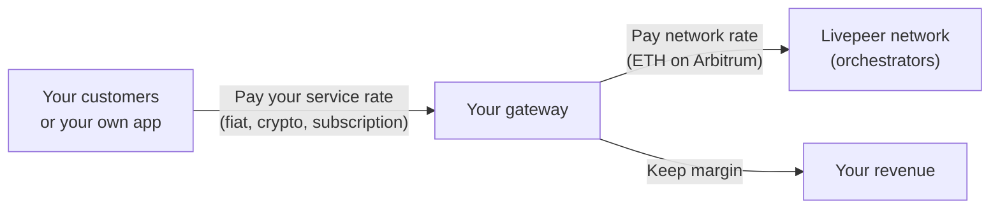

{/* TODO:
Verify:
- Mermaid diagrams use theme colours (but must be hardcoded - see snippets/components/page-structure/mermaid-colours.jsx)
- Fontawesome icons are used on accordions and tabs
- Tables use StyledTable component
- No em-dashes are used (instead use standard -)
- UK spelling is used
- Headers are concise and technical - no long headers or questions (aim for max 3 words)
- CustomDivider is used with <CustomDivider style={{margin: "-1rem 0 -1rem 0"}} /> for all --- separator breaks
- Placeholders for Media & Video Resources are in comments with a TODO for a human.
- REVIEW flags are in JSX flags for a human.
*/}

{/*
  PURPOSE:
  Journey step: "Why is running a gateway an opportunity?"
  Overview of all gateway business models, revenue paths, and market positioning.
  Entry point to the Opportunities subsection  - introduces the four operator models
  and links to deep-dive pages.

  SECTION HOME: Guides → Opportunities

  JOURNEY POSITION:
  1. Operator Opportunities Overview (this page)  - "Why is this an opportunity?"
  2. NaaP & Multi-Tenancy  - "The platform business model"
  3. SPE & Grant Models  - "Treasury-funded gateways"
  4. Community Projects & Ecosystem  - "What others have built"

  RELATED FILES (draw from):
  - all-resources/v2-opcons--operator-opportunities.mdx        - PRIMARY (90%): 228 lines. Four operator models, core business model, Mermaid diagram.
  - all-resources/v2-opcons--business-case.mdx                 - PRIMARY (80%): 295 lines. Detailed cost structures, payment models, revenue models.
  - all-resources/v2-opcons--why-run-a-gateway.mdx             - SECONDARY (40%): 216 lines. Motivations and entry points.
  - all-resources/biz--video-transcoding-opportunity.mdx       - SECONDARY (30%): 178 lines. Video transcoding business path.
  - all-resources/biz--ai-builder-opportunity.mdx              - SECONDARY (30%): 234 lines. AI builder business path.
  - all-resources/biz--sdk-builder-opportunity.mdx             - SECONDARY (30%): 213 lines. SDK/custom gateway business path.
  - all-resources/opportunities--research-sources.md           - REFERENCE: 144 lines. Master source document with REVIEW flags.

  CROSS-REFS:
  - Concepts → Business Model  - conceptual foundation; this is the practical guide
  - Operator Considerations → Why Run a Gateway  - motivations; this covers revenue specifics
  - Payments & Pricing → Gateway Economics  - cost side; this covers revenue side
  - NaaP & Multi-Tenancy (this section)  - deep-dive on the platform model
  - SPE & Grant Models (this section)  - treasury-funded path
*/}

import { BorderedBox } from '/snippets/components/layout/containers.jsx'
import { StyledTable, TableRow, TableCell } from '/snippets/components/layout/tables.jsx'

Running a Livepeer gateway puts you between application demand and compute supply. Whether you are routing your own workloads or building a service on top of the network, the gateway is where business logic, margins, and customer relationships live.

This page is for application developers and infrastructure builders evaluating the gateway model.

---

## The core business model

Gateways earn at the **business layer**, not at the protocol level. Orchestrators earn protocol fees. Gateways earn the margin between what they charge customers and what they pay for compute.



<Note>
For gateways running in off-chain mode, your gateway node itself holds no ETH. A remote signer handles all payment operations. Your gateway operator costs are whatever you pay the signer - which can be zero if using a community-hosted signer.
</Note>

---

## Four operator models

<Tabs>
  <Tab title="Route your own workloads">
    You are building a product and currently using a hosted gateway such as Daydream, Livepeer Studio, or Livepeer Cloud. You pay their service rate on every request. Running your own gateway removes that cost entirely  - you pay orchestrators directly at network rates.

    **What you capture:** The service margin you were previously paying to a third-party operator.

    **What this requires:**
    - A Linux server (for AI workloads; video also supports Windows)
    - No ETH for AI off-chain mode; ETH deposit for video transcoding
    - The same application code  - only the endpoint changes

    **Who is doing this:** App developers who scaled past the point where hosted gateway costs exceeded the operational cost of self-hosting.
  </Tab>
  <Tab title="Build an inference API">
    You operate a gateway and offer AI inference access to other developers. They send API requests; you route them to Livepeer AI workers and return results. You charge per request, per generation, or via subscription. You pay orchestrators and keep the margin.

    **What you capture:** Service margin on every job routed through your gateway. Your differentiation is reliability, model availability, pricing, and support.

    **What this requires:**
    - A production Linux server with stable uptime
    - An auth layer (API keys, rate limiting) built on top of the go-livepeer gateway
    - Billing integration outside the Livepeer protocol  - the protocol only controls what you pay orchestrators, not what you charge customers

    **Who is doing this:** Livepeer Cloud SPE (free public inference gateway), Daydream, LLM SPE (LLM inference routing).
  </Tab>
  <Tab title="Embed a gateway in your platform">
    Your gateway is internal infrastructure  - not exposed to users directly, but routing every AI or video request your platform makes. You charge customers for your product; the gateway is the cost layer underneath.

    **What you capture:** Your product margin. The gateway keeps compute costs below what you would pay a hosted inference provider (Replicate, Fal, Mux, AWS) while giving you full routing control.

    **What this requires:**
    - For AI: off-chain mode, Linux, no ETH
    - The same infrastructure as an inference API minus the external-facing billing layer

    **Who is doing this:** Daydream (real-time AI video for creators), Embody Avatars, AI Video Startup Programme participants.
  </Tab>
  <Tab title="Build a gateway platform (NaaP)">
    You operate a gateway platform that handles all crypto complexity on behalf of your users. Users sign up, receive API keys, and pay in fiat or standard crypto. Your platform converts that into ETH micropayments to orchestrators.

    This is the Network as a Platform (NaaP) pattern. The NaaP dashboard (`github.com/livepeer/naap`) is the reference implementation: JWT-based auth, Developer API Keys, and usage metering built on top of go-livepeer.

    From the Discord discussion that defined this model:
    > "The user never interacts with Livepeer contracts. The signer uses incoming USDC revenue to keep its hot wallet funded for PM ticket generation. The two payment layers are fully independent."

    **What you capture:** Full product margin plus ownership of the user relationship. Crypto is completely invisible to your users.

    **Status:** NaaP is in active development. The demo is operational; production API is not yet stable.

    {/* REVIEW: Confirm NaaP dashboard public URL and production timeline with Qiang Han. */}

    For a deep-dive on the NaaP model, see [NaaP & Multi-Tenancy](/v2/gateways/guides/opportunities/naap-multi-tenancy).
  </Tab>
</Tabs>

---

## Why now: the off-chain payment mode changes the economics

Before Q4 2025, every gateway required an Ethereum account funded on Arbitrum. The off-chain gateway mode via remote signing (PRs #3791 and #3822) removes all of this from the gateway operator's responsibilities.

<StyledTable variant="bordered">
  <thead>
    <TableRow header>
      <TableCell header>Factor</TableCell>
      <TableCell header>On-chain gateway (video)</TableCell>
      <TableCell header>Off-chain gateway</TableCell>
    </TableRow>
  </thead>
  <tbody>
    <TableRow>
      <TableCell>**Startup cost**</TableCell>
      <TableCell>ETH deposit required (~0.065 ETH + 0.03 reserve on Arbitrum)</TableCell>
      <TableCell>Zero  - community-hosted signer is free</TableCell>
    </TableRow>
    <TableRow>
      <TableCell>**Ongoing ETH management**</TableCell>
      <TableCell>Monitor deposit balance; top up as it depletes</TableCell>
      <TableCell>None  - remote signer handles it</TableCell>
    </TableRow>
    <TableRow>
      <TableCell>**ETH price exposure**</TableCell>
      <TableCell>Yes  - volatile ETH price affects your effective compute cost</TableCell>
      <TableCell>None  - abstracted by signer or clearinghouse</TableCell>
    </TableRow>
    <TableRow>
      <TableCell>**Crypto knowledge required**</TableCell>
      <TableCell>Yes  - wallet, keystore, Arbitrum RPC, bridging</TableCell>
      <TableCell>No  - none required at the gateway layer</TableCell>
    </TableRow>
    <TableRow>
      <TableCell>**Time to first job**</TableCell>
      <TableCell>Hours (wallet setup, bridging, funding deposit)</TableCell>
      <TableCell>Minutes (Docker command, point at remote signer)</TableCell>
    </TableRow>
  </tbody>
</StyledTable>

{/* REVIEW: Confirm current ETH deposit/reserve amounts with Mehrdad/Rick. ~0.065 + 0.03 from fund-gateway.mdx. Issue open to reduce reserve: github.com/livepeer/go-livepeer/issues/3744 */}

---

## Opportunity paths by gateway type

<Tabs>
  <Tab title="Video transcoding">
    Replace cloud video transcoding services (Mux, AWS MediaLive, Wowza) with the Livepeer network at significantly lower per-minute cost. Your encoder (OBS, FFmpeg, hardware) connects via RTMP. Transcoded HLS output returns to your CDN.

    **What you need:** Linux server, public IP, ETH on Arbitrum (~0.065 + 0.03 ETH), port 1935 (RTMP) and 8935 (HTTP) open.

    **Tested setups:** Owncast + Livepeer, OBS direct-to-gateway.

    {/* REVIEW: Get specific cost comparison figures from Foundation or Cloud SPE. */}
  </Tab>
  <Tab title="AI inference">
    Build AI products on Livepeer's decentralised GPU network  - text-to-image, image-to-video, live video AI, LLM inference, audio transcription. Zero ETH required in off-chain mode.

    **Supported pipelines:** text-to-image, image-to-image, image-to-video, live-video-to-video, LLM, audio-to-text, upscale, segment-anything-2, image-to-text, text-to-speech.

    **Getting started:**
    ```bash
    docker run -d \
      --name livepeer-ai-gateway \
      -p 8935:8935 -p 8937:8937 \
      livepeer/go-livepeer:master \
        -gateway -httpIngest \
        -orchAddr="ORCHESTRATOR_ADDRESS" \
        -remoteSignerAddr="https://signer.eliteencoder.net"
    ```

    {/* REVIEW: Confirm Docker image tag (master vs pinned release) with Rick. */}
  </Tab>
  <Tab title="SDK and custom gateways">
    Build Livepeer gateway clients in Python, browsers, mobile, or embedded systems using the remote signer architecture. Your implementation handles orchestrator discovery and job routing; the signer handles all Ethereum complexity.

    **Reference implementation:** `livepeer-python-gateway` ([github.com/j0sh/livepeer-python-gateway](https://github.com/j0sh/livepeer-python-gateway)).

    **Best for:** Live AI (LV2V)  - the remote signer was designed for this workload first. Batch AI is in scope. Video transcoding is explicitly excluded from alternative implementations.
  </Tab>
</Tabs>

---

## What you can build with a gateway

Beyond routing your own workloads, the go-livepeer gateway is a platform primitive. It exposes everything needed to build:

<AccordionGroup>
  <Accordion title="API key management and auth">
    Wrap the gateway HTTP interface with standard auth middleware. The gateway itself has no built-in auth  - this is intentional; it lives in your application layer. The NaaP project provides a reference implementation using JWT tokens issued via SIWE (Sign-In with Ethereum), but any standard auth pattern works.
  </Accordion>
  <Accordion title="Custom orchestrator routing">
    `-orchAddr` lets you specify exactly which orchestrators receive your jobs. Build orchestrator tiers, geographic routing, or capability-specific pools. `-maxPricePerCapability` accepts a JSON configuration with per-pipeline, per-model price caps  - route different job types to different orchestrator tiers with different pricing policies.
  </Accordion>
  <Accordion title="Billing and usage metering">
    The gateway exposes per-job result data. Build usage accounting outside the protocol and charge customers however your product requires  - per generation, per minute of video, subscription, or credits.
  </Accordion>
  <Accordion title="Alternative gateway implementations">
    The remote signer architecture means you are not required to use the Go binary. Python, browser, and mobile gateway clients are possible  - the signer handles Ethereum complexity. The `livepeer-python-gateway` SDK ([github.com/j0sh/livepeer-python-gateway](https://github.com/j0sh/livepeer-python-gateway)) is the reference Python implementation.
  </Accordion>
</AccordionGroup>

---

## Who is operating gateways today

<StyledTable variant="bordered">
  <thead>
    <TableRow header>
      <TableCell header>Operator</TableCell>
      <TableCell header>Model</TableCell>
      <TableCell header>Gateway type</TableCell>
    </TableRow>
  </thead>
  <tbody>
    <TableRow>
      <TableCell>**Daydream**</TableCell>
      <TableCell>Commercial AI video product; subscription and per-use pricing</TableCell>
      <TableCell>AI gateway embedded in product</TableCell>
    </TableRow>
    <TableRow>
      <TableCell>**Livepeer Studio**</TableCell>
      <TableCell>Video API for developers; per-minute pricing</TableCell>
      <TableCell>On-chain gateway (video)</TableCell>
    </TableRow>
    <TableRow>
      <TableCell>**Livepeer Cloud SPE**</TableCell>
      <TableCell>Free public gateways funded by treasury SPE grant</TableCell>
      <TableCell>AI and video</TableCell>
    </TableRow>
    <TableRow>
      <TableCell>**LLM SPE**</TableCell>
      <TableCell>LLM inference routing on Livepeer network</TableCell>
      <TableCell>AI gateway (LLM-focused)</TableCell>
    </TableRow>
    <TableRow>
      <TableCell>**Self-hosted developers**</TableCell>
      <TableCell>Route own AI or video workloads; eliminate hosted gateway fees</TableCell>
      <TableCell>AI or video depending on workload</TableCell>
    </TableRow>
  </tbody>
</StyledTable>

---

## Next steps

<CardGroup cols={3}>
  <Card title="NaaP & Multi-Tenancy" icon="users" href="/v2/gateways/guides/opportunities/naap-multi-tenancy">
    Build a multi-tenant platform with API keys, billing, and user management on top of your gateway.
  </Card>
  <Card title="SPE grant model" icon="coins" href="/v2/gateways/guides/opportunities/spe-grant-model">
    How to get treasury funding for a gateway that serves the broader ecosystem.
  </Card>
  <Card title="Community & Ecosystem" icon="globe" href="/v2/gateways/guides/opportunities/community-ecosystem">
    Real projects, tools, and Foundation programmes built on Livepeer gateways.
  </Card>
</CardGroup>
