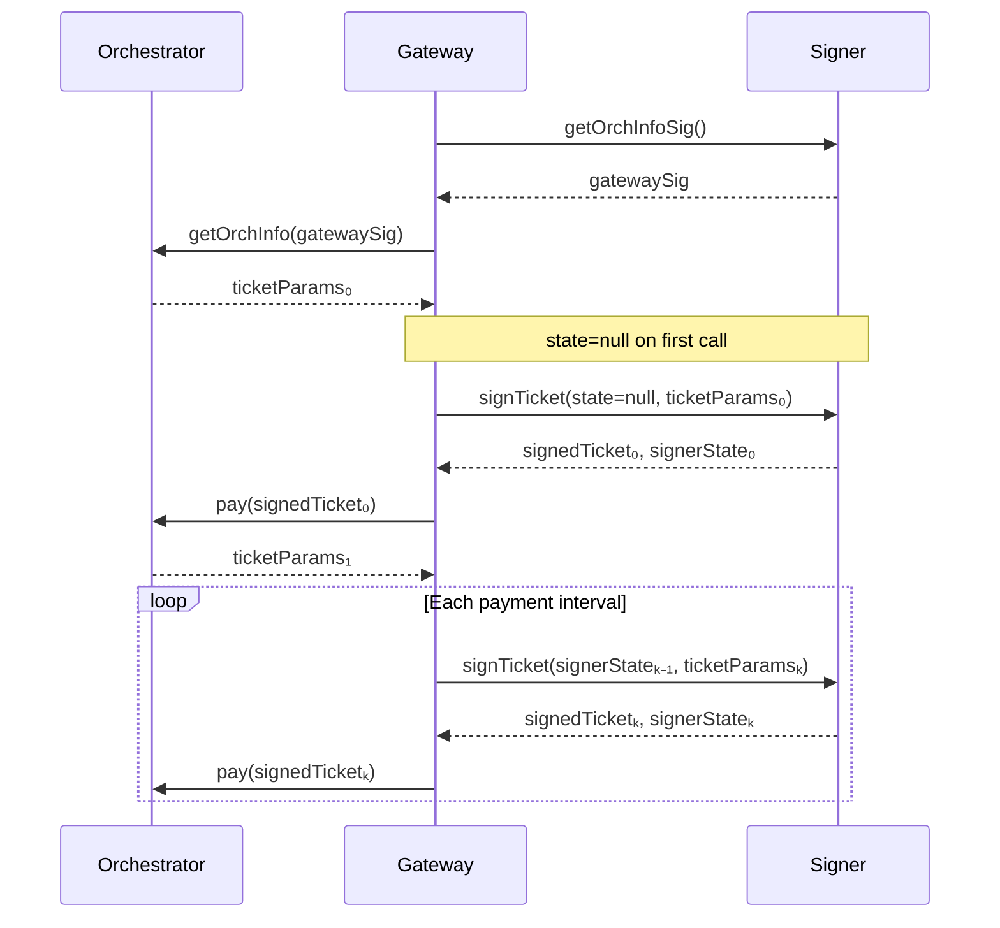

{/* TODO:
Verify:
- Mermaid diagrams use theme colours (but must be hardcoded - see snippets/components/page-structure/mermaid-colours.jsx)
- Fontawesome icons are used on accordions and tabs
- Tables use StyledTable component
- No em-dashes are used (instead use standard -)
- UK spelling is used
- Headers are concise and technical - no long headers or questions (aim for max 3 words)
- CustomDivider is used with <CustomDivider style={{margin: "-1rem 0 -1rem 0"}} /> for all --- separator breaks
- Placeholders for Media & Video Resources are in comments with a TODO for a human.
- REVIEW flags are in JSX flags for a human.
*/}

# Remote Signers

A **remote signer** is a standalone `go-livepeer` mode that takes over all Ethereum-related responsibilities from the gateway: signing payment tickets, managing PM session state, and providing the authentication signature for orchestrator info requests. Your gateway communicates with the signer over the network and holds no Ethereum private key.

Remote signers were introduced in [PR #3791](https://github.com/livepeer/go-livepeer/pull/3791) and [PR #3822](https://github.com/livepeer/go-livepeer/pull/3822), both merged in January 2026.

<Warning>
  **Current scope: Live AI (live-video-to-video) workloads only.** Remote signing is not supported for video transcoding. Transcoding uses a different payment path where signing occurs in the hot path of segment processing. This is an explicit design decision and is unlikely to change in the near term.
</Warning>

---

## Why use a remote signer?

### Key isolation

By default, a `go-livepeer` gateway holds its Ethereum private key in the same process that handles media from external clients. A vulnerability in media parsing or job handling could expose that key, allowing an attacker to drain your ETH deposit.

A remote signer separates these concerns entirely. The signer runs as a hardened service with a narrow, well-defined API surface. The gateway never sees the private key; it only receives signed tickets and signatures from the signer.

| Without remote signer | With remote signer |
|---|---|
| ETH key lives in the gateway process | ETH key lives in the signer service only |
| Gateway compromise risks key exposure | Compromised gateway cannot sign or drain funds |
| All gateway instances share a key | Each signer instance is the sole key holder |
| Hard Ethereum dependency in gateway | Gateway can run without Ethereum connectivity |

### Platform flexibility

The PM system is complex enough that `go-livepeer` was historically the only gateway implementation. Remote signers remove this barrier. A Python, browser, or mobile application can integrate with the Livepeer network by using a remote signer for all PM mechanics and interacting with a simple HTTP signing API rather than raw Arbitrum contracts.

This is the foundation for the Livepeer SDK's gateway capabilities and for any embedded gateway use case.

### Clearinghouse building block

Remote signers are the technical primitive that clearinghouses build on. A clearinghouse is a remote signer plus user management, accounting, and billing. If you are building gateway-as-a-service infrastructure, your remote signer setup is the first piece. See [Payment Clearinghouses](/v2/gateways/guides/payments-and-pricing/clearinghouse-guide) for the full picture.

---

## How it works

The remote signer implements two operations corresponding to the two places where Ethereum signing occurs in a Live AI gateway session.

### Operation 1: GetOrchestratorInfo signature

When a gateway contacts an orchestrator, it must provide an authentication signature. This signature is static for a given key and can be safely cached. At startup, the gateway fetches this signature from the signer once, caches it, and reuses it for all orchestrator info requests.

```
Gateway → Signer: getOrchInfoSig()
Signer  → Gateway: gatewaySig
Gateway → Orchestrator: getOrchInfo(gatewaySig)
```

### Operation 2: Payment ticket signing

For each payment in a Live AI session, the gateway asks the signer to sign a ticket. The signer returns the signed ticket and updated session state. The gateway is responsible for carrying that state forward into the next call.



### Stateless by design

The signer stores **no state between calls**. State is carried by the gateway and round-tripped on every signing request. The signer's state is cryptographically signed to prevent the gateway from fabricating or replaying it.

This design was chosen deliberately. It means you can run multiple signer instances behind a load balancer with no shared database, no synchronisation infrastructure, and seamless failover between instances.

<Note>
  **HTTP 480 — expired ticket params:** If the signer returns HTTP status 480, the ticket parameters from the orchestrator have expired. The gateway should re-fetch OrchestratorInfo and restart the signing chain from the new parameters.
</Note>

---

## Prerequisites

- A `go-livepeer` binary that includes remote signer support (v0.7.3 or later; confirm with `livepeer --version`)
- A funded Ethereum account on Arbitrum One for the signer (the gateway itself needs no ETH)
- An Arbitrum RPC endpoint accessible from the signer host
- Network connectivity from the gateway host to the signer service

{/* REVIEW: Confirm the minimum go-livepeer version that includes PR #3791 and #3822. Rick to verify the release tag. PRs merged January 2026. */}

---

## Running the signer

<Steps>
  <Step title="Start the remote signer service">
    Run `go-livepeer` in signer mode on a dedicated host or process:

    ```bash
    livepeer \
      -signer \
      -network arbitrum-one-mainnet \
      -ethUrl <YOUR_ARBITRUM_RPC_URL> \
      -ethKeystorePath ~/.lpData/keystore \
      -ethPassword <KEYSTORE_PASSWORD> \
      -httpAddr 0.0.0.0:7936
    ```

    {/* REVIEW: Confirm the exact flag for signer mode. Source: v2-payments--remote-signers.mdx uses "-signer". Rick / j0sh to confirm this is the current flag name. Check with "livepeer -help | grep signer". */}

    The signer service binds to port 7936 by default. This port must be reachable from your gateway host. The signer holds the ETH key and Arbitrum connection; the gateway will not need either.

    <Warning>
      The flag names for remote signer mode are subject to change as the feature matures. Always verify with `livepeer -help | grep -i signer` on your installed version before deploying.
    </Warning>
  </Step>

  <Step title="Configure the gateway to use the signer">
    Start your gateway pointing at the signer instead of a local keystore:

    ```bash
    livepeer \
      -gateway \
      -network arbitrum-one-mainnet \
      -signerAddr <SIGNER_HOST>:7936 \
      -orchAddr <ORCH_1>,<ORCH_2> \
      -httpAddr 0.0.0.0:8937 \
      -httpIngest \
      ...
    ```

    {/* REVIEW: Confirm -signerAddr is the correct flag name for pointing the gateway at a remote signer. Source: v2-payments--remote-signers.mdx lists this flag. Rick to verify against current livepeer -help output. */}

    The gateway will use `-signerAddr` for all PM signing. You do not need `-ethKeystorePath` or a local ETH account on the gateway host.

    {/* REVIEW: Confirm whether -ethUrl is still required on the gateway when -signerAddr is set, or whether the gateway can run with no Arbitrum connection at all. Rick to verify. */}
  </Step>

  <Step title="Verify the signer is active">
    Check the gateway startup logs for a line confirming the remote signer is connected.

    {/* REVIEW: Rick / j0sh to provide the exact log message that confirms remote signer is active at startup. */}

    Submit a Live AI job and confirm it processes successfully. Check that payments are flowing via `livepeer_cli`:

    ```bash
    livepeer_cli -host 127.0.0.1 -http 5935
    # Select Option 1 — Get node status
    # Review active sessions and payment activity
    ```
  </Step>
</Steps>

---

## Operational requirements

Running a remote signer in production requires attention to a few non-obvious rules. Violating these leads to rejected tickets and failed jobs.

<AccordionGroup>
  <Accordion title="Run multiple signer instances">
    For production reliability, run two or more signer instances behind a load balancer. Because the signer is stateless, failover is seamless: the gateway starts a new state chain from whichever instance responds next. No coordination infrastructure required.

    A simple round-robin or health-check-based load balancer is sufficient.
  </Accordion>

  <Accordion title="Never reuse or skip signer state">
    Every call to `signTicket` returns a new `signerState`. You **must** pass this state back to the next `signTicket` call for the same session. Passing stale state or an empty state on subsequent calls causes nonce collisions, which produce invalid tickets that orchestrators reject.

    First call: `signTicket(state=null, ticketParams)` — null is correct here.
    Subsequent calls: `signTicket(signerStateFromPreviousCall, ticketParams)` — always use the most recent state.
  </Accordion>

  <Accordion title="One sequential signing chain per session">
    Do not make concurrent `signTicket` calls for the same session. State advances sequentially; concurrent calls produce conflicting states and invalid tickets. One session maps to one sequential signing chain.

    Multiple sessions can run concurrently, each with their own state chain.
  </Accordion>

  <Accordion title="Orchestrator discovery is not handled by the signer">
    The remote signer handles signing only. It does not discover or select orchestrators. For off-chain Live AI gateways, you must supply orchestrator addresses via `-orchAddr` or a discovery endpoint. Future clearinghouse services may bundle discovery.
  </Accordion>
</AccordionGroup>

---

## Security properties

With a remote signer correctly deployed:

- The gateway process holds **no Ethereum private key**
- A fully compromised gateway cannot sign payment tickets or drain ETH funds independently
- The signer's state is cryptographically signed and cannot be forged by the gateway
- Multiple gateway instances can be keyless, reducing the blast radius of any single compromise

What a remote signer does **not** protect against:
- A compromise of the signer service itself (the signer holds the actual key)
- Unlimited ticket requests from a compromised gateway (rate limiting is the signer's responsibility to implement)
- Video transcoding workloads (not in scope)

---

## Community remote signer

A community-operated remote signer is available for testing and early development:

**Elite Encoder Remote Signer:** `https://signer.eliteencoder.net/`

This instance provides free ETH for testing. It uses SIWE (ERC-4361 Sign-In with Ethereum) for authentication and issues per-user JWT tokens. It is **not** for production workloads without understanding the custody implications: the signer holds your gateway's signing key and can observe all tickets signed through it.

For production, run your own signer instance.

{/* REVIEW: Confirm the exact URL is signer.eliteencoder.net (Discord referenced signer.eiteencoder.net as a typo). Verify with John | Elite Encoder. */}

---

<CardGroup cols={2}>
  <Card title="Payment Clearinghouses" icon="building-columns" href="/v2/gateways/guides/payments-and-pricing/clearinghouse-guide">
    Build on the remote signer primitive to create managed gateway services.
  </Card>
  <Card title="Payment Paths" icon="code-branch" href="/v2/gateways/guides/payments-and-pricing/payment-paths">
    Review the full payment architecture decision guide.
  </Card>
  <Card title="Fund Your Gateway" icon="coins" href="/v2/gateways/guides/payments-and-pricing/fund-your-gateway">
    The signer's ETH account still needs funding — see how to deposit and set reserves.
  </Card>
  <Card title="go-livepeer PR #3822" icon="github" href="https://github.com/livepeer/go-livepeer/pull/3822">
    Read the implementation PR for the full technical specification.
  </Card>
</CardGroup>

{/* ---
title: 'Remote Signers'
description: 'Run Ethereum payment signing as a standalone service — isolate your private key from the gateway process, enable non-Go gateways, and support multi-instance redundancy.'
sidebarTitle: 'Remote Signers'
pageType: 'guide'
audience: 'gateway'
status: 'stub'
--- */}

{/*
  PURPOSE:
  Operational guide for running a remote signer. Covers WHY (security, platform flexibility,
  clearinghouse building block), HOW (CLI startup, architecture, stateless forwarding),
  and OPS (multi-instance, failover, session state rules).

  This is the single authoritative page for remote signers — merges the concept explainer
  (formerly payments/remote-signers.mdx) with operational how-to into one guide.
  The old payments/ section no longer exists; this page lives in Guides → Payments & Pricing.

  SECTION HOME: Guides → Payments & Pricing

  JOURNEY POSITION:
  1. Payment Paths — "Do I need ETH?" (may point here for "separate your key")
  2. Fund Your Gateway — "Get ETH in" (remote signer still needs a funded wallet somewhere)
  3. Pricing Strategy — "Set your prices"
  4. Remote Signers (this page) — "Isolate key management from your gateway"
  5. Clearinghouse Guide — "Delegate everything" (builds on remote signers)

  RELATED FILES (draw from):
  - all-resources/v2-payments--remote-signers.mdx           — PRIMARY SOURCE: concept+how-to hybrid (85%), Mermaid sequence diagram, stateless forwarding, CLI examples, community signer, operational requirements
  - all-resources/ctx-new--remote-signers.mdx               — _contextData_ version (identical to above)
  - all-resources/ctx-gwnew--GW-04-remote-signers-architecture.md — Research report: deep architecture analysis, PRs #3791/#3822, design rationale, multi-instance patterns
  - all-resources/v2-payments--how-payments-work.mdx        — PM system context (what the signer handles on your behalf) — PM explainer folding into Concepts economics page
  - all-resources/v2-payments--payment-clearinghouse.mdx    — Clearinghouse builds on remote signers (cross-ref)

  CROSS-REFS:
  - Clearinghouse Guide (this section) — clearinghouse = remote signer + user management + billing
  - Payment Paths (this section) — decision guide references remote signer as an architecture option
  - SDK / Alternative Gateway (Setup Paths guide) — non-Go gateways use remote signer
  - Concepts → economics/business model — PM protocol the signer implements
  - go-livepeer PRs #3791, #3822 — source of truth for implementation
*/}
{/*
# Remote Signers

<Note>This page is a stub. Content to be developed from the sources listed above.</Note>

## Proposed Structure

### 1. What is a Remote Signer?
Brief: standalone go-livepeer mode that handles all Ethereum signing as a separate network
service. Your gateway communicates over the network and holds no private key.

### 2. Why Use a Remote Signer?

#### Security
- Default gateway holds ETH key in same process as untrusted media handling
- Compromise = key exposure = deposit drained
- Remote signer isolates key behind narrow API surface
- Per-instance or per-clearinghouse keys reduce blast radius

#### Platform Flexibility
- Non-Go gateways (Python, browser, mobile) can use the signer without implementing PM
- Signer handles all PM bookkeeping: fee calculation, nonce tracking, ticket generation
- Gateway implementors interact with simple signing RPC, not Arbitrum contracts

#### Clearinghouse Building Block
- Remote signer is the technical primitive that clearinghouses layer services on top of
- Cross-ref → Clearinghouse Guide

### 3. Scope: Live AI Only (current)
- Transcoding NOT supported (signing in hot path, latency concern, legacy code)
- Batch AI not yet supported
- Future scope may expand

### 4. Architecture
Include Mermaid sequence diagram from source:
- GetOrchestratorInfo signature (PR #3791) — cached after first request
- Payment ticket signing (PR #3822) — stateless forwarding design
- Gateway threads state forward, signer stores nothing between calls
- No shared database required — multiple instances without synchronisation

### 5. CLI Startup
Signer mode:
```
livepeer -signer -network arbitrum-one-mainnet -ethUrl <RPC> -ethKeystorePath ... -httpAddr 0.0.0.0:7936
```
Gateway connecting to signer:
```
livepeer -gateway -signerAddr <SIGNER>:7936 -orchAddr <ORCH_1>,<ORCH_2> -serviceAddr 0.0.0.0:8935
```
(Flag names subject to change — verify with `livepeer -help`)

### 6. Operational Requirements

#### Run Multiple Instances
- Stateless design = simple load balancer, seamless failover
- No persistent state in signer

#### Never Reuse Tickets
- Always forward latest signerState from each call
- Stale state = nonce collisions = rejected tickets

#### No Concurrent Signing per Session
- One session = one sequential signing chain
- Concurrent requests for same session produce invalid tickets

#### Orchestrator Discovery
- Signer does not handle discovery
- Off-chain: provide URIs directly or use discovery endpoint
- Future: clearinghouse discovery service

### 7. Community Remote Signer
- Elite Encoder: `https://signer.eliteencoder.net/`
- Free ETH for testing — not for production without understanding custody implications

### 8. Next Steps
Cards: Clearinghouse Guide, Payment Paths, Fund Your Gateway */}
