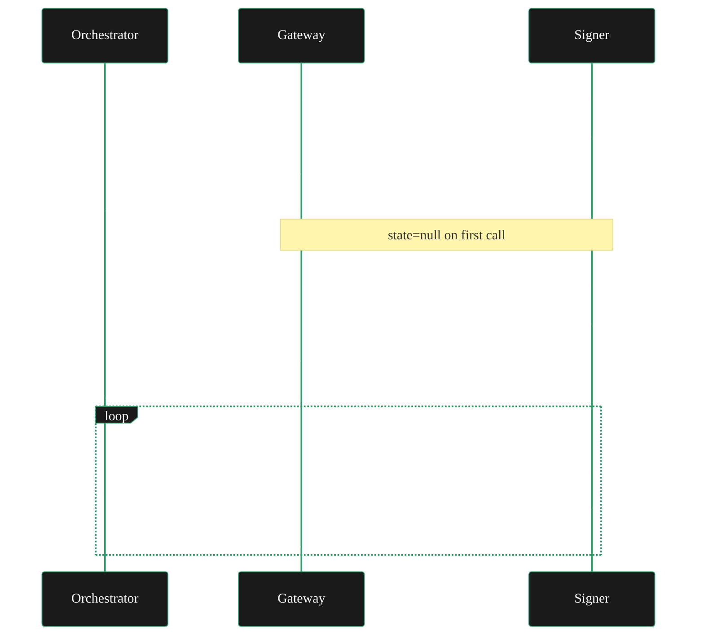

{/* TODO:
Terminology Validation:
- Ensure the terminology and definitions used in this page is consistent with the resources/glossary terminology
Verify:
- ~~Mermaid diagrams use theme colours~~
- ~~Fontawesome icons are used on accordions and tabs~~
- ~~Tables use StyledTable component~~
- ~~No em-dashes are used (instead use standard -)~~
- UK spelling is used
- ~~Headers are concise and technical - no long headers or questions (aim for max 3 words)~~
- ~~CustomDivider is used~~
- Placeholders for Media & Video Resources are in comments with a TODO for a human. (N/A)
- ~~REVIEW flags are in JSX flags for a human.~~
Human:
- H1 removed (was repeating frontmatter title)
- "Why use a remote signer?" renamed to "Benefits", tightened
- "Clearinghouse building block" trimmed to cross-link
- Voice converted to entity-led throughout
- Port 8937 → 8935
- Broken links fixed (payment-paths → payment-guide, fund-your-gateway → funding-guide)
- Em dashes removed throughout
- Mermaid theme block added
- Markdown table converted to StyledTable
*/}

import { CustomDivider } from "/snippets/components/primitives/divider.jsx"
import { LinkArrow } from '/snippets/components/primitives/links.jsx'
import { StyledTable, TableRow, TableCell } from '/snippets/components/layout/tables.jsx'
import { StyledSteps, StyledStep } from "/snippets/components/layout/steps.jsx"

<Tip>
  **Current scope: Realtime AI Video (live-video-to-video) workloads only.**
  <br/> Remote signing is not supported for video transcoding.
</Tip>

<CustomDivider style={{margin: "-1rem 0 -1rem 0"}} />

A **remote signer** is a standalone `go-livepeer` mode that takes over all Ethereum-related responsibilities from the Gateway: signing payment tickets, managing PM session state, and providing the authentication signature for Orchestrator info requests. The Gateway communicates with the signer over the network and holds no Ethereum private key.

Remote signers were introduced in [PR #3791](https://github.com/livepeer/go-livepeer/pull/3791) and [PR #3822](https://github.com/livepeer/go-livepeer/pull/3822), in January 2026.

{/* REVIEW: Confirm the minimum go-livepeer version that includes PR #3791 and #3822. Rick to verify the release tag. PRs merged January 2026. */}

## Benefits

### Key Isolation

By default, a `go-livepeer` Gateway holds its Ethereum private key in the same process that handles media from external clients. A vulnerability in media parsing or job handling could expose that key, allowing an attacker to drain the ETH deposit.

A remote signer separates these concerns. The signer runs as a hardened service with a narrow, well-defined API surface. The Gateway never sees the private key - it only receives signed tickets and signatures.

<StyledTable>
  <TableRow header>
    <TableCell header>Without remote signer</TableCell>
    <TableCell header>With remote signer</TableCell>
  </TableRow>
  <TableRow>
    <TableCell>ETH key lives in the Gateway process</TableCell>
    <TableCell>ETH key lives in the signer service only</TableCell>
  </TableRow>
  <TableRow>
    <TableCell>Gateway compromise risks key exposure</TableCell>
    <TableCell>Compromised Gateway cannot sign or drain funds</TableCell>
  </TableRow>
  <TableRow>
    <TableCell>Hard Ethereum dependency in Gateway</TableCell>
    <TableCell>Gateway runs without Ethereum connectivity</TableCell>
  </TableRow>
</StyledTable>

### Platform Flexibility

The PM system is complex enough that `go-livepeer` was historically the only Gateway implementation. Remote signers remove this barrier. A Python, browser, or mobile application can integrate with the Livepeer network by using a remote signer for all PM mechanics and interacting with a simple HTTP signing API rather than raw Arbitrum contracts. This is the foundation for the Livepeer SDK's Gateway capabilities.

Remote signers are also the technical primitive that <LinkArrow href="/v2/gateways/guides/payments-and-pricing/clearinghouse-guide" label="Clearinghouses" newline={false} /> build on.

<CustomDivider style={{margin: "-1rem 0 -2rem 0"}} />

## Signer Mechanics

The remote signer implements two operations corresponding to the two places where Ethereum signing occurs in a Live AI Gateway session.

### 1. `GetOrchestratorInfo` signature

When a Gateway contacts an Orchestrator, it must provide an authentication signature. This signature is static for a given key and can be safely cached. At startup, the Gateway fetches this signature from the signer once, caches it, and reuses it for all Orchestrator info requests.

``` icon="text"
Gateway -> Signer: getOrchInfoSig()
Signer  -> Gateway: gatewaySig
Gateway -> Orchestrator: getOrchInfo(gatewaySig)
```

### 2. Payment Ticket Signing

For each payment in a Live AI session, the Gateway asks the signer to sign a ticket. The signer returns the signed ticket and updated session state. The Gateway is responsible for carrying that state forward into the next call.



### Stateless Design

The signer stores **no state between calls**. State is carried by the Gateway and round-tripped on every signing request. The signer's state is cryptographically signed to prevent the Gateway from fabricating or replaying it.

This design enables running multiple signer instances behind a load balancer with no shared database, no synchronisation infrastructure, and seamless failover between instances.

<Note>
  **HTTP 480 - expired ticket params**
  <br/>If the signer returns HTTP status 480, the ticket parameters from the Orchestrator have expired.
  <br/>The Gateway should re-fetch OrchestratorInfo and restart the signing chain from the new parameters.
</Note>

<CustomDivider style={{margin: "-1rem 0 -2rem 0"}} />

## Prerequisites

- A `go-livepeer` binary that includes remote signer support (confirm with `livepeer --version`; see [PR #3822](https://github.com/livepeer/go-livepeer/pull/3822) for the implementation)
- A funded Ethereum account on Arbitrum One for the signer (the Gateway itself needs no ETH)
- An Arbitrum RPC endpoint accessible from the signer host
- Network connectivity from the Gateway host to the signer service

<CustomDivider style={{margin: "-1rem 0 -2rem 0"}} />

## Running the Signer

<StyledSteps>
  <StyledStep title="Start the remote signer service">
    Run `go-livepeer` in signer mode on a dedicated host or process:

    ```bash icon="terminal" Signer Start
    livepeer \
      -signer \
      -network arbitrum-one-mainnet \
      -ethUrl <YOUR_ARBITRUM_RPC_URL> \
      -ethKeystorePath ~/.lpData/keystore \
      -ethPassword <KEYSTORE_PASSWORD> \
      -httpAddr 0.0.0.0:7936
    ```

    {/* REVIEW: Confirm the exact flag for signer mode. Source: v2-payments--remote-signers.mdx uses "-signer". Rick / j0sh to confirm this is the current flag name. Check with "livepeer -help | grep signer". */}

    The signer service binds to port 7936 by default. This port must be reachable from the Gateway host. The signer holds the ETH key and Arbitrum connection; the Gateway needs neither.

    <Warning>
      Flag names for remote signer mode are subject to change as the feature matures. Verify with `livepeer -help | grep -i signer` on the installed version before deploying.
    </Warning>
  </StyledStep>

  <StyledStep title="Configure the Gateway to use the signer">
    Start the Gateway pointing at the signer instead of a local keystore:

    ```bash icon="terminal" Signer Configuration
    livepeer \
      -gateway \
      -network arbitrum-one-mainnet \
      -signerAddr <SIGNER_HOST>:7936 \
      -orchAddr <ORCH_1>,<ORCH_2> \
      -httpAddr 0.0.0.0:8935 \
      -httpIngest \
      ...
    ```

    {/* REVIEW: Confirm -signerAddr is the correct flag name for pointing the gateway at a remote signer. Rick to verify against current livepeer -help output. */}

    The Gateway uses `-signerAddr` for all PM signing. `-ethKeystorePath` and a local ETH account are not needed on the Gateway host.

    {/* REVIEW: Confirm whether -ethUrl is still required on the gateway when -signerAddr is set, or whether the gateway can run with no Arbitrum connection at all. Rick to verify. */}
  </StyledStep>

  <StyledStep title="Verify the signer is active">
    Check the Gateway startup logs for a line confirming the remote signer is connected.

    {/* REVIEW: Rick / j0sh to provide the exact log message that confirms remote signer is active at startup. */}

    Submit a Live AI job and confirm it processes successfully. Check that payments are flowing via `livepeer_cli`:

    ```bash icon="terminal" CLI command
    livepeer_cli -host 127.0.0.1 -http 5935
    # Select Option 1 - Get node status
    # Review active sessions and payment activity
    ```

  </StyledStep>
</StyledSteps>

<CustomDivider style={{margin: "0 0 -2rem 0"}} />

## Operational Rules

Running a remote signer in production requires attention to a few non-obvious rules. Violating these leads to rejected tickets and failed jobs.

<AccordionGroup>
  <Accordion title="Run multiple signer instances" icon="server">
    For production reliability, run two or more signer instances behind a load balancer. Because the signer is stateless, failover is seamless: the Gateway starts a new state chain from whichever instance responds next. No coordination infrastructure required.

    A simple round-robin or health-check-based load balancer is sufficient.
  </Accordion>

  <Accordion title="Never reuse or skip signer state" icon="triangle-exclamation">
    Every call to `signTicket` returns a new `signerState`. This state **must** be passed back to the next `signTicket` call for the same session. Passing stale state or an empty state on subsequent calls causes nonce collisions, which produce invalid tickets that Orchestrators reject.

    First call: `signTicket(state=null, ticketParams)` - null is correct here.
    Subsequent calls: `signTicket(signerStateFromPreviousCall, ticketParams)` - always use the most recent state.
  </Accordion>

  <Accordion title="One sequential chain per session" icon="arrow-down-1-9">
    Do not make concurrent `signTicket` calls for the same session. State advances sequentially; concurrent calls produce conflicting states and invalid tickets. One session maps to one sequential signing chain.

    Multiple sessions can run concurrently, each with their own state chain.
  </Accordion>

  <Accordion title="Discovery is not handled by the signer" icon="magnifying-glass">
    The remote signer handles signing only. It does not discover or select Orchestrators. For off-chain Live AI Gateways, supply Orchestrator addresses via `-orchAddr` or a discovery endpoint. Clearinghouse services may bundle discovery.
  </Accordion>
</AccordionGroup>

<CustomDivider style={{margin: "0 0 -2rem 0"}} />

## Security

With a remote signer correctly deployed:

- The Gateway process holds **no Ethereum private key**
- A fully compromised Gateway cannot sign payment tickets or drain ETH funds independently
- The signer's state is cryptographically signed and cannot be forged by the Gateway
- Multiple Gateway instances can be keyless, reducing the blast radius of any single compromise

What a remote signer does **not** protect against:
- A compromise of the signer service itself (the signer holds the actual key)
- Unlimited ticket requests from a compromised Gateway (rate limiting is the signer's responsibility)
- Video transcoding workloads (not in scope)

<CustomDivider style={{margin: "-1rem 0 -2rem 0"}} />

## Community Signer

A community-operated remote signer is available for testing and early development:

**Elite Encoder Remote Signer:** `https://signer.eliteencoder.net/`

{/* REVIEW: Confirm the exact URL is signer.eliteencoder.net (Discord referenced signer.eiteencoder.net as a typo). Verify with John at Elite Encoder. */}

This instance provides free ETH for testing. It uses SIWE (ERC-4361 Sign-In with Ethereum) for authentication and issues per-user JWT tokens.

<Warning>
    Do not use for production workloads.
    <br/> The signer holds the Gateway's signing key and can observe all tickets signed through it.
</Warning>

For production, run a dedicated signer instance.

<CustomDivider style={{margin: "-1rem 0 -2rem 0"}} />

## Related Pages

<CardGroup cols={2}>
  <Card title="Clearinghouses" icon="building-columns" href="/v2/gateways/guides/payments-and-pricing/clearinghouse-guide">
    Build on the remote signer primitive to create managed gateway services.
  </Card>
  <Card title="Payments Guide" icon="code-branch" href="/v2/gateways/guides/payments-and-pricing/payment-guide">
    Payment architecture decision guide.
  </Card>
  <Card title="Funding Guide" icon="coins" href="/v2/gateways/guides/payments-and-pricing/funding-guide">
    The signer's ETH account still needs funding - deposit and reserve setup.
  </Card>
  <Card title="go-livepeer PR #3822" icon="github" href="https://github.com/livepeer/go-livepeer/pull/3822">
    Implementation PR for the full technical specification.
  </Card>
</CardGroup>

{/* ---
title: 'Remote Signers'
description: 'Run Ethereum payment signing as a standalone service - isolate your private key from the gateway process, enable non-Go gateways, and support multi-instance redundancy.'
sidebarTitle: 'Remote Signers'
pageType: 'guide'
audience: 'gateway'
status: 'stub'
--- */}

{/*
  PURPOSE:
  Operational guide for running a remote signer. Covers WHY (security, platform flexibility,
  clearinghouse building block), HOW (CLI startup, architecture, stateless forwarding),
  and OPS (multi-instance, failover, session state rules).

  This is the single authoritative page for remote signers - merges the concept explainer
  (formerly payments/remote-signers.mdx) with operational how-to into one guide.
  The old payments/ section no longer exists; this page lives in Guides > Payments & Pricing.

  SECTION HOME: Guides > Payments & Pricing

  JOURNEY POSITION:
  1. Payment Paths - "Do I need ETH?" (may point here for "separate your key")
  2. Fund Your Gateway - "Get ETH in" (remote signer still needs a funded wallet somewhere)
  3. Pricing Strategy - "Set your prices"
  4. Remote Signers (this page) - "Isolate key management from your gateway"
  5. Clearinghouse Guide - "Delegate everything" (builds on remote signers)

  RELATED FILES (draw from):
  - all-resources/v2-payments--remote-signers.mdx           - PRIMARY SOURCE: concept+how-to hybrid (85%), Mermaid sequence diagram, stateless forwarding, CLI examples, community signer, operational requirements
  - all-resources/ctx-new--remote-signers.mdx               - _contextData_ version (identical to above)
  - all-resources/ctx-gwnew--GW-04-remote-signers-architecture.md - Research report: deep architecture analysis, PRs #3791/#3822, design rationale, multi-instance patterns
  - all-resources/v2-payments--how-payments-work.mdx        - PM system context (what the signer handles on your behalf) - PM explainer folding into Concepts economics page
  - all-resources/v2-payments--payment-clearinghouse.mdx    - Clearinghouse builds on remote signers (cross-ref)

  CROSS-REFS:
  - Clearinghouse Guide (this section) - clearinghouse = remote signer + user management + billing
  - Payment Paths (this section) - decision guide references remote signer as an architecture option
  - SDK / Alternative Gateway (Setup Paths guide) - non-Go gateways use remote signer
  - Concepts > economics/business model - PM protocol the signer implements
  - go-livepeer PRs #3791, #3822 - source of truth for implementation
*/}
