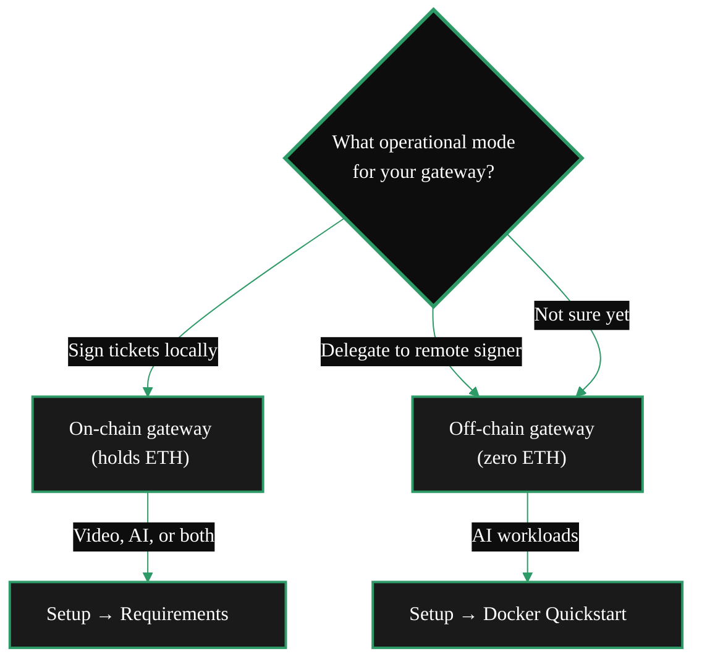

{/* TODO:
Terminology Validation:
- Ensure the terminology and definitions used in this page is consistent with the resources/glossary terminology
Verify:
- Terminology is consistent with resources/glossary
*/}

import { LinkArrow } from '/snippets/components/primitives/links.jsx'
import { StyledTable, TableRow, TableCell } from '/snippets/components/layout/tables.jsx'
import { StyledSteps, StyledStep } from '/snippets/components/layout/steps.jsx'
import { CustomDivider } from '/snippets/components/primitives/divider.jsx'
import { CenteredContainer, BorderedBox } from '/snippets/components/layout/containers.jsx'

<CenteredContainer style={{ width: '90%' }}>
  <Tip>This page helps you navigate the gateway documentation. Whether you're evaluating, building, or scaling  - start here to find the shortest path to what you need.</Tip>
</CenteredContainer>

<CustomDivider />

## What's your goal?

<Tabs>
  <Tab title="Build an AI product" icon="wand-magic-sparkles">
    You want to route AI inference (text-to-image, image-to-video, LLM, live AI) through Livepeer's GPU network  - **no ETH required**.

    **Your path:**
    1. <LinkArrow href="/v2/gateways/concepts/role" label="Understand the gateway role" newline={false} />  - what gateways do and don't do
    2. <LinkArrow href="/v2/gateways/quickstart/gateway-setup" label="Quickstart" newline={false} />  - gateway running in minutes via Docker
    3. <LinkArrow href="/v2/gateways/guides/node-pipelines/ai-pipelines" label="AI inference pipelines" newline={false} />  - supported models, request formats, capabilities
    4. <LinkArrow href="/v2/gateways/guides/roadmap-and-funding/operator-support" label="Operator opportunities" newline={false} />  - business models for AI gateway operators

    <Note>Off-chain gateways use a remote signer for payments - zero crypto knowledge needed at the gateway layer.</Note>
  </Tab>
  <Tab title="Transcode video" icon="video">
    You want to run an on-chain gateway for RTMP video ingest and HLS transcoding output.

    **Your path:**
    1. <LinkArrow href="/v2/gateways/concepts/role" label="Understand the gateway role" newline={false} />  - the original broadcaster function
    2. <LinkArrow href="/v2/gateways/setup/requirements/setup" label="Requirements & prerequisites" newline={false} />  - ETH funding, wallet setup, Arbitrum bridging
    3. <LinkArrow href="/v2/gateways/setup/install/install-overview" label="Install go-livepeer" newline={false} />  - Docker, Linux binary, or Windows
    4. <LinkArrow href="/v2/gateways/setup/configure/video-configuration" label="Configure video transcoding" newline={false} />  - RTMP ingest, profiles, output formats
    5. <LinkArrow href="/v2/gateways/guides/payments-and-pricing/funding-guide" label="Fund your gateway" newline={false} />  - deposit + reserve on Arbitrum

    <Warning>Video gateways require ~0.095 ETH on Arbitrum (deposit + reserve). Budget for gas fees too.</Warning>
  </Tab>
  <Tab title="Build a platform" icon="layer-group">
    You want to wrap Livepeer as a managed service  - multi-tenant API, billing, customer dashboards.

    **Your path:**
    1. <LinkArrow href="/v2/gateways/concepts/business-model" label="Gateway business model" newline={false} />  - margin capture, pricing independence
    2. <LinkArrow href="/v2/gateways/guides/roadmap-and-funding/naap-multi-tenancy" label="NaaP multi-tenancy guide" newline={false} />  - tenant isolation, auth flows, billing integration
    3. <LinkArrow href="/v2/gateways/guides/advanced-operations/gateway-middleware" label="Middleware layer" newline={false} />  - rate limiting, routing, orchestrator tiering
    4. <LinkArrow href="/v2/gateways/guides/advanced-operations/scaling" label="Scaling & resource management" newline={false} />  - scaling, reliability, monitoring
    5. <LinkArrow href="/v2/gateways/guides/roadmap-and-funding/spe-grant-model" label="SPE grant funding" newline={false} />  - get funded to build

    <Tip>The NaaP (Network as a Platform) model is how operators like Livepeer Studio and Cloud SPE serve thousands of customers through a single gateway.</Tip>
  </Tab>
  <Tab title="Evaluate first" icon="magnifying-glass">
    You want to understand what gateways are and whether running one makes sense for you  - before committing to setup.

    **Your path:**
    1. <LinkArrow href="/v2/gateways/concepts/role" label="What is a gateway?" newline={false} />  - the role explained with analogies
    2. <LinkArrow href="/v2/gateways/concepts/capabilities" label="Gateway capabilities" newline={false} />  - every workload type gateways can route
    3. <LinkArrow href="/v2/gateways/concepts/business-model" label="Business model" newline={false} />  - how operators earn revenue
    4. <LinkArrow href="/v2/gateways/guides/roadmap-and-funding/gateway-showcase" label="Who's operating today" newline={false} />  - see what others have built
    5. <LinkArrow href="/v2/gateways/concepts/architecture" label="Architecture" newline={false} />  - how the pieces fit together
  </Tab>
</Tabs>

<CustomDivider middleText="Gateway Types" />

## Operational Mode

"On-chain" and "off-chain" describe your gateway's **operational mode** - how it integrates with the Livepeer protocol. All workloads run off-chain on orchestrator hardware.

<StyledTable variant="bordered">
  <thead>
    <TableRow header>
      <TableCell header>Factor</TableCell>
      <TableCell header>On-chain gateway</TableCell>
      <TableCell header>Off-chain gateway</TableCell>
    </TableRow>
  </thead>
  <tbody>
    <TableRow>
      <TableCell>**Payment method**</TableCell>
      <TableCell>Gateway signs tickets locally</TableCell>
      <TableCell>Remote signer handles payments</TableCell>
    </TableRow>
    <TableRow>
      <TableCell>**Workloads**</TableCell>
      <TableCell>Video transcoding, AI inference, or both</TableCell>
      <TableCell>AI inference, LLM, live AI, BYOC</TableCell>
    </TableRow>
    <TableRow>
      <TableCell>**ETH required**</TableCell>
      <TableCell>~0.095 ETH on Arbitrum</TableCell>
      <TableCell>None</TableCell>
    </TableRow>
    <TableRow>
      <TableCell>**Crypto knowledge**</TableCell>
      <TableCell>Wallet, keystore, bridging</TableCell>
      <TableCell>None needed</TableCell>
    </TableRow>
    <TableRow>
      <TableCell>**OS support**</TableCell>
      <TableCell>Linux, Windows, macOS</TableCell>
      <TableCell>Linux only</TableCell>
    </TableRow>
    <TableRow>
      <TableCell>**Setup time**</TableCell>
      <TableCell>Hours</TableCell>
      <TableCell>Minutes</TableCell>
    </TableRow>
    <TableRow>
      <TableCell>**Best for**</TableCell>
      <TableCell>Video platforms, dual workloads, full-service operators</TableCell>
      <TableCell>AI app devs, API providers, platform builders</TableCell>
    </TableRow>
  </tbody>
</StyledTable>

<Note>Running both video and AI workloads from a single node ("dual configuration") is a workload setup choice, not an operational mode. An on-chain gateway supports all workload types. See <LinkArrow href="/v2/gateways/setup/configure/dual-configuration" label="Dual gateway configuration" newline={false} /> for details.</Note>

<CustomDivider middleText="Journey" />

## Your journey through the docs

The gateway documentation follows a six-section structure. Each section builds on the previous one  - but you can jump to any section that matches where you are.

<StyledSteps iconColor="#2d9a67" titleColor="var(--accent)">
  <StyledStep title="Concepts" icon="lightbulb">
    **Understand what gateways are and how they work.**

    Start here if you're new. Four pages cover the gateway role, capabilities, architecture, and business model  - everything you need before touching a terminal.

    <LinkArrow href="/v2/gateways/concepts/role" label="Start with concepts →" newline={false} />
  </StyledStep>

  <StyledStep title="Quickstart" icon="bolt">
    **Get a gateway running in minutes.**

    A fast-track setup that gets you from zero to a working gateway with a single Docker command. Ideal for AI workloads where you want to test before committing to a full setup.

    <LinkArrow href="/v2/gateways/quickstart/gateway-setup" label="Jump to quickstart →" newline={false} />
  </StyledStep>

  <StyledStep title="Setup" icon="wrench">
    **Production-grade installation and configuration.**

    The comprehensive setup path: requirements, installation (Docker/Linux/Windows), configuration (video/AI/dual/pricing), connecting to orchestrators, and monitoring. This is the section you'll spend the most time in.

    <LinkArrow href="/v2/gateways/setup/run-a-gateway" label="Begin full setup →" newline={false} />
  </StyledStep>

  <StyledStep title="Guides" icon="book-open">
    **Deep-dive guides for specific topics.**

    Eight subsections covering setup paths, job pipelines, payments, monitoring, advanced operations, opportunities, and tutorials. Dip into whichever topic you need  - see the deep-dive section below.

    <LinkArrow href="/v2/gateways/guides/deployment-details/setup-options" label="Explore guides →" newline={false} />
  </StyledStep>

  <StyledStep title="Opportunities" icon="rocket">
    **Turn your gateway into a business.**

    Four operator models, the NaaP multi-tenancy pattern, SPE grant funding, and the ecosystem of operators already building on Livepeer.

    <LinkArrow href="/v2/gateways/guides/roadmap-and-funding/operator-support" label="See opportunities →" newline={false} />
  </StyledStep>

  <StyledStep title="Resources" icon="folder-open">
    **Reference material and community content.**

    FAQ, community guides, technical references  - the long tail of content you'll need when troubleshooting or optimizing.

    <LinkArrow href="/v2/gateways/resources/faq" label="Browse resources →" newline={false} />
  </StyledStep>
</StyledSteps>

<CustomDivider middleText="Guides Deep-Dive" />

## Guides by topic

Each guides subsection covers a specific operational area. Expand any topic to see what's inside.

<AccordionGroup>
  <Accordion title="Setup Paths" icon="route">
    Compare on-chain vs off-chain, SDK alternatives, and dual-gateway configuration. Helps you pick the right setup approach before starting installation.

    - <LinkArrow href="/v2/gateways/guides/deployment-details/setup-options" label="Gateway setup paths overview" newline={false} />
    - <LinkArrow href="/v2/gateways/guides/deployment-details/setup-options" label="On-chain vs off-chain comparison" newline={false} />
    - <LinkArrow href="/v2/gateways/guides/deployment-details/setup-options" label="SDK & alternative gateways" newline={false} />
    - <LinkArrow href="/v2/gateways/setup/configure/dual-configuration" label="Dual gateway configuration" newline={false} />
  </Accordion>

  <Accordion title="AI & Job Pipelines" icon="microchip">
    Understand every workload type gateways can route  - video transcoding, AI inference, BYOC custom pipelines, and pipeline configuration.

    - <LinkArrow href="/v2/gateways/guides/node-pipelines/guide" label="Pipeline overview" newline={false} />
    - <LinkArrow href="/v2/gateways/guides/node-pipelines/video-pipelines" label="Video transcoding pipelines" newline={false} />
    - <LinkArrow href="/v2/gateways/guides/node-pipelines/ai-pipelines" label="AI inference pipelines" newline={false} />
    - <LinkArrow href="/v2/gateways/guides/node-pipelines/byoc-pipelines" label="BYOC custom pipelines" newline={false} />
    - <LinkArrow href="/v2/gateways/guides/node-pipelines/pipeline-configuration" label="Pipeline configuration" newline={false} />
  </Accordion>

  <Accordion title="Payments & Pricing" icon="credit-card">
    How payments flow, funding requirements, pricing strategy, clearinghouse operations, and remote signer setup.

    - <LinkArrow href="/v2/gateways/guides/payments-and-pricing/payment-guide" label="Payment paths" newline={false} />
    - <LinkArrow href="/v2/gateways/guides/payments-and-pricing/funding-guide" label="Fund your gateway" newline={false} />
    - <LinkArrow href="/v2/gateways/guides/payments-and-pricing/pricing-strategy" label="Pricing strategy" newline={false} />
    - <LinkArrow href="/v2/gateways/guides/payments-and-pricing/clearinghouse-guide" label="Clearinghouse guide" newline={false} />
    - <LinkArrow href="/v2/gateways/guides/payments-and-pricing/remote-signers" label="Remote signers" newline={false} />
  </Accordion>

  <Accordion title="Monitoring & Tooling" icon="chart-line">
    Health checks, Prometheus/Grafana monitoring, on-chain metrics, available tools and dashboards, and troubleshooting guides.

    - <LinkArrow href="/v2/gateways/guides/monitoring-and-tooling/health-checks" label="Gateway health checks" newline={false} />
    - <LinkArrow href="/v2/gateways/guides/monitoring-and-tooling/monitoring-setup" label="Monitoring setup" newline={false} />
    - <LinkArrow href="/v2/gateways/guides/monitoring-and-tooling/on-chain-metrics" label="On-chain metrics" newline={false} />
    - <LinkArrow href="/v2/gateways/guides/monitoring-and-tooling/tools-and-dashboards" label="Tools & dashboards" newline={false} />
    - <LinkArrow href="/v2/gateways/guides/monitoring-and-tooling/troubleshooting" label="Troubleshooting" newline={false} />
  </Accordion>

  <Accordion title="Advanced Operations" icon="gear">
    Orchestrator selection strategy, scaling, middleware, and publishing a gateway to the network.

    - <LinkArrow href="/v2/gateways/guides/advanced-operations/orchestrator-selection" label="Orchestrator selection" newline={false} />
    - <LinkArrow href="/v2/gateways/guides/advanced-operations/scaling" label="Scaling" newline={false} />
    - <LinkArrow href="/v2/gateways/guides/advanced-operations/gateway-middleware" label="Gateway middleware" newline={false} />
    - <LinkArrow href="/v2/gateways/guides/advanced-operations/gateway-discoverability" label="Publishing a gateway" newline={false} />
  </Accordion>

  <Accordion title="Opportunities" icon="rocket">
    Business models, NaaP platform building, SPE grant funding, and the ecosystem of gateway operators.

    - <LinkArrow href="/v2/gateways/guides/roadmap-and-funding/operator-support" label="Operator opportunities overview" newline={false} />
    - <LinkArrow href="/v2/gateways/guides/roadmap-and-funding/naap-multi-tenancy" label="NaaP multi-tenancy" newline={false} />
    - <LinkArrow href="/v2/gateways/guides/roadmap-and-funding/spe-grant-model" label="SPE grant model" newline={false} />
    - <LinkArrow href="/v2/gateways/guides/roadmap-and-funding/gateway-showcase" label="Community & ecosystem" newline={false} />
  </Accordion>

  <Accordion title="Tutorials" icon="graduation-cap">
    Step-by-step walkthroughs for specific tasks  - from BYOC CPU pipelines to full gateway-orchestrator setups.

    - <LinkArrow href="/v2/gateways/guides/tutorials/byoc-cpu-tutorial" label="BYOC CPU pipeline tutorial" newline={false} />
  </Accordion>
</AccordionGroup>

<CustomDivider middleText="Path Matrix" />

## Find your entry point by persona

| Persona | Start here | Continue with | Reference when needed |
|---|---|---|---|
| **AI app developer** | [Quickstart](/v2/gateways/quickstart/gateway-setup) | [AI pipelines](/v2/gateways/guides/node-pipelines/ai-pipelines) | [Pricing strategy](/v2/gateways/guides/payments-and-pricing/pricing-strategy) |
| **Video platform** | [Requirements](/v2/gateways/setup/requirements/setup) | [Video config](/v2/gateways/setup/configure/video-configuration) | [Troubleshooting](/v2/gateways/guides/monitoring-and-tooling/troubleshooting) |
| **Platform builder** | [Business model](/v2/gateways/concepts/business-model) | [NaaP guide](/v2/gateways/guides/roadmap-and-funding/naap-multi-tenancy) | [Middleware](/v2/gateways/guides/advanced-operations/gateway-middleware) |
| **Evaluating** | [Gateway role](/v2/gateways/concepts/role) | [Capabilities](/v2/gateways/concepts/capabilities) | [Ecosystem](/v2/gateways/guides/roadmap-and-funding/gateway-showcase) |
| **Existing operator** | [Orchestrator selection](/v2/gateways/guides/advanced-operations/orchestrator-selection) | [Scaling](/v2/gateways/guides/advanced-operations/scaling) | [Health checks](/v2/gateways/guides/monitoring-and-tooling/health-checks) |
| **Grant applicant** | [SPE model](/v2/gateways/guides/roadmap-and-funding/spe-grant-model) | [Opportunities](/v2/gateways/guides/roadmap-and-funding/operator-support) | [Community](/v2/gateways/guides/roadmap-and-funding/gateway-showcase) |

<CustomDivider />

## Quick links

<CardGroup cols={3}>
  <Card title="Quickstart" icon="bolt" href="/v2/gateways/quickstart/gateway-setup" arrow>
    Zero to gateway in minutes.
  </Card>
  <Card title="Gateway Role" icon="circle-info" href="/v2/gateways/concepts/role" arrow>
    What gateways are and how they work.
  </Card>
  <Card title="Business Model" icon="chart-line" href="/v2/gateways/concepts/business-model" arrow>
    How operators earn revenue.
  </Card>
  <Card title="AI Pipelines" icon="microchip" href="/v2/gateways/guides/node-pipelines/ai-pipelines" arrow>
    Supported models and request formats.
  </Card>
  <Card title="Payments" icon="credit-card" href="/v2/gateways/guides/payments-and-pricing/payment-guide" arrow>
    How payment flows work.
  </Card>
  <Card title="Ecosystem" icon="users" href="/v2/gateways/guides/roadmap-and-funding/gateway-showcase" arrow>
    Who's building on Livepeer today.
  </Card>
</CardGroup>
