import { DoubleIconLink } from '/snippets/components/primitives/links.jsx'
import { DynamicTable } from '/snippets/components/layout/table.jsx'
import { ScrollableDiagram } from '/snippets/components/content/zoomableDiagram.jsx'

{/* Views:

- Intro & Architecture
- Quickstart
- Full Config Guide
- Config Flags
*/}

## TL;DR Configuration

If you just want a working video gateway, run the below command:

<CodeGroup>
```bash wrap lines icon="terminal" Off-Chain Video Gateway
livepeer -gateway \
  -network offchain \
  # Minimum required video flags
  -rtmpAddr=0.0.0.0:1935 \
  -httpAddr=0.0.0.0:8935 \
  -transcodingOptions=P240p30fps16x9,P360p30fps16x9 \
  # You will need to add your local orchestrator address if you are running offchain
  -orchAddr=<ORCH_ADDR> 
```

```bash wrap lines icon="link" On-Chain Video Gateway
livepeer -gateway \
  -network arbitrum-one-mainnet \
  # See the on-chain setup guide for more details on these flags
  -ethUrl=<YOUR_RPC_URL> \
  -ethAcctAddr=<YOUR_ETH_ADDRESS> \
  -ethPassword=<YOUR_PASSWORD> \
  -ethKeystorePath=<KEYSTORE_PATH> \
  # Minimum required video flags
  -rtmpAddr=0.0.0.0:1935 \
  -httpAddr=0.0.0.0:8935 \
  -maxPricePerUnit=1000 \
  -transcodingOptions=P240p30fps16x9,P360p30fps16x9 \
  -orchAddr=<ORCHESTRATOR_ADDRESSES>
  # You will need to connect to a public orchestrator if you are running onchain

```

</CodeGroup>

<View title="Intro & Architecture" icon="play" iconType="solid">
## Gateways for Video Transcoding
In traditional video transcoding, the Gateway ingests video streams via [RTMP](https://en.wikipedia.org/wiki/Real-Time_Messaging_Protocol) or [HTTP](https://en.wikipedia.org/wiki/Hypertext_Transfer_Protocol), 
segments them, and distributes transcoding work to Orchestrators

The workflow involves segmenting video, sending segments with payments to Orchestrators,
receiving transcoded results, and serving them via HLS .

Gateways that receive a live or recorded RTMP stream need to transcode it into multiple renditions before sending it to Orchestrators for distribution.

{/* Key components include:

- **[BroadcastSessionsManager](https://github.com/livepeer/go-livepeer/blob/5691cb48/core/broadcast.go)**: Manages transcoding sessions and selects Orchestrators
- **[RTMP](https://en.wikipedia.org/wiki/Real-Time_Messaging_Protocol) Server**: Handles RTMP (Real-Time Message Protocol) stream ingestion
- **[Payment Manager](https://github.com/livepeer/go-livepeer/blob/5691cb48/core/live_payment.go)**: Generates and sends payment tickets for transcoding work */}

{/* 2. Diagram */}

```mermaid
%%{init: {'theme': 'base', 'themeVariables': { 'primaryColor': '#1a1a1a', 'primaryTextColor': '#fff', 'primaryBorderColor': '#2d9a67', 'lineColor': '#2d9a67', 'secondaryColor': '#0d0d0d', 'tertiaryColor': '#1a1a1a', 'background': '#0d0d0d', 'fontFamily': 'system-ui' }}}%%
flowchart TB
    subgraph INPUT["Video Input Sources"]
        direction LR
        RTMP["RTMP Stream<br/>:1935"]
        HTTP["HTTP Upload<br/>:8935"]
    end

    GATEWAY["Gateway Node<br/>LivepeerNode<br/>-gateway mode"]

    INPUT --> GATEWAY

    subgraph MANAGER["Broadcast Session Manager"]
        BSM["BroadcastSessionsManager<br/>Manages transcoding sessions<br/>Selects orchestrators"]
    end

    GATEWAY --> BSM

    subgraph PROCESSING["Video Processing Pipeline"]
        direction TB
        SEG["Segment Video<br/>Split into chunks"]
        TRANS["Send to Orchestrators<br/>with payment tickets"]
        ORCH["Orchestrators<br/>Transcode segments<br/>Multiple renditions"]
        RECEIVE["Receive Results<br/>Transcoded segments"]
    end

    BSM --> SEG --> TRANS --> ORCH --> RECEIVE

    subgraph OUTPUT["Output & Delivery"]
        direction LR
        HLS["HLS Manifest<br/>.m3u8"]
        RENDITIONS["Multiple Renditions<br/>240p, 360p, 720p, 1080p"]
    end

    RECEIVE --> HLS --> RENDITIONS

    subgraph PAYMENT["Payment System"]
        direction TB
        PM["Payment Manager<br/>Generate tickets"]
        TICKETS["Per-segment payments<br/>Based on pixels transcoded"]
    end

    TRANS --> PM --> TICKETS --> ORCH

    subgraph STORAGE["Storage (Optional)"]
        OBJ["Object Store<br/>S3/IPFS"]
    end

    RENDITIONS -.-> OBJ

    classDef default fill:#1a1a1a,color:#fff,stroke:#2d9a67,stroke-width:2px
    classDef video fill:#1a1a1a,color:#fff,stroke:#3b82f6,stroke-width:2px
    classDef payment fill:#1a1a1a,color:#fff,stroke:#fbbf24,stroke-width:2px
    class RTMP,HTTP,BSM,SEG,TRANS,ORCH,RECEIVE,HLS,RENDITIONS video
    class PM,TICKETS payment
    style INPUT fill:#0d0d0d,stroke:#2d9a67,stroke-width:1px
    style MANAGER fill:#0d0d0d,stroke:#3b82f6,stroke-width:1px
    style PROCESSING fill:#0d0d0d,stroke:#3b82f6,stroke-width:1px
    style OUTPUT fill:#0d0d0d,stroke:#3b82f6,stroke-width:1px
    style PAYMENT fill:#0d0d0d,stroke:#fbbf24,stroke-width:1px
    style STORAGE fill:#0d0d0d,stroke:#2d9a67,stroke-width:1px,stroke-dasharray: 5 5
```

<ScrollableDiagram title="Video Gateway Transcoding Architecture">



</ScrollableDiagram>

<Card
    title="Code Reference"
    icon="github"
    href="https://github.com/livepeer/go-livepeer/blob/5691cb48/core/livepeernode.go"
    horizontal
    arrow
  >
  go-livepeer/core/livepeernode.go
  </Card>
</View>
<View title="Quickstart" icon="forward" iconType="solid">
  # Quick Start Video Gateway Configuration

For a basic video gateway, start with the below recommended settings and gradually add options based on your specific needs.
The most critical settings are `-orchAddr` (to connect to orchestrators) and network addresses to allow external access.

```bash wrap lines icon="terminal" Transcoding Options
livepeer -gateway \
  -network offchain \
  -rtmpAddr=0.0.0.0:1935 \
  -httpAddr=0.0.0.0:8935 \
  -cliAddr=0.0.0.0:5935 \
    -maxSessions=10 \
  -orchAddr=<ORCHESTRATOR_ADDRESSES> \
  -transcodingOptions=P240p30fps16x9,P360p30fps16x9,P720p30fps16x9
  # You can also use a JSON file: path/to/transcodingOptions.json
```

</View>
<View title="Full Config Guide" icon="tools" iconType="solid">
  wip
</View>
<View title="Config Flags" icon="book-open" iconType="solid">
  wip
</View>
