{/* TODO:
Terminology Validation:
- Ensure the terminology and definitions used in this page is consistent with the resources/glossary terminology
Verify:
- Terminology is consistent with resources/glossary
*/}


import { ScrollableDiagram } from '/snippets/components/content/zoomableDiagram.jsx'
import { DoubleIconLink } from '/snippets/components/primitives/links.jsx'
import { StyledTable, TableRow, TableCell } from '/snippets/components/layout/tables.jsx'

<Danger>
 This is way too long
  <Expandable title="TODO">
 **TODO:** - [ ] Verify flags and options are correct - [ ] Decide on more
 streamlined layout or steps flow - [ ] (fixme) #Configuration - [ ] (fixme)
 ##Deployment - [ ] Move Example to Guides & Resources
  </Expandable>
</Danger>

The Livepeer Gateway supports a dual setup configuration that enables a single node to handle both
traditional video transcoding and AI processing workloads simultaneously.

This unified architecture reduces infrastructure complexity while providing
comprehensive media processing capabilities.

```mermaid
%%{init: {'theme': 'base', 'themeVariables': { 'primaryColor': '#1a1a1a', 'primaryTextColor': '#fff', 'primaryBorderColor': '#2d9a67', 'lineColor': '#2d9a67', 'secondaryColor': '#0d0d0d', 'tertiaryColor': '#1a1a1a', 'background': '#0d0d0d', 'fontFamily': 'system-ui' }}}%%
flowchart TB
    subgraph INPUT["Input Sources"]
        direction LR
        RTMP["RTMP Stream"]
        HTTP["HTTP Upload"]
        AI_REQ["AI Request"]
    end

    GATEWAY["Gateway Node<br/>LivepeerNode"]

    INPUT --> GATEWAY

    subgraph MANAGERS["Session Managers"]
        direction LR
        BSM["BroadcastSessionsManager<br/>Video Transcoding"]
        ASM["AISessionManager<br/>AI Processing"]
    end

    GATEWAY --> BSM
    GATEWAY --> ASM

    subgraph VIDEO["Video Pipeline"]
        SEG["Segment Processing"]
        ORCH_V["Orchestrators<br/>Transcoding"]
        HLS["HLS/DASH Output"]
    end

    subgraph AI["AI Pipeline"]
        PROC["AI Processing"]
        ORCH_AI["Orchestrators<br/>AI Models"]
        OUT_AI["AI Output<br/>Images/Video"]
    end

    BSM --> SEG --> ORCH_V --> HLS
    ASM --> PROC --> ORCH_AI --> OUT_AI

    subgraph PAYMENT["Payment"]
        direction LR
        PAY_SEG["Per Segment"]
        PAY_PIX["Per Pixel"]
    end

    ORCH_V --> PAY_SEG
    ORCH_AI --> PAY_PIX

    classDef default fill:#1a1a1a,color:#fff,stroke:#2d9a67,stroke-width:2px
    classDef video fill:#1a1a1a,color:#fff,stroke:#3b82f6,stroke-width:2px
    classDef ai fill:#1a1a1a,color:#fff,stroke:#a855f7,stroke-width:2px
    class RTMP,HTTP,BSM,SEG,ORCH_V,HLS,PAY_SEG video
    class AI_REQ,ASM,PROC,ORCH_AI,OUT_AI,PAY_PIX ai
    style INPUT fill:#0d0d0d,stroke:#2d9a67,stroke-width:1px
    style MANAGERS fill:#0d0d0d,stroke:#2d9a67,stroke-width:1px
    style VIDEO fill:#0d0d0d,stroke:#3b82f6,stroke-width:1px
    style AI fill:#0d0d0d,stroke:#a855f7,stroke-width:1px
    style PAYMENT fill:#0d0d0d,stroke:#2d9a67,stroke-width:1px
```

<ScrollableDiagram title="Dual Gateway Architecture: Video & AI Pipelines">



</ScrollableDiagram>

## Overview

The Gateway's dual capability is enabled by its modular architecture, where different
managers handle specific workflows while sharing common infrastructure for media ingestion,
payment processing, and result delivery.

The LivepeerNode struct contains fields for both traditional transcoding (Transcoder, TranscoderManager)
and AI processing (AIWorker, AIWorkerManager) <DoubleIconLink label="livepeernode.go" href="https://github.com/livepeer/go-livepeer/blob/5691cb48/core/livepeernode.go" iconLeft="github" />

The gateway determines the processing type based on the request:

- Standard transcoding requests go through the BroadcastSessionsManager
- AI requests go through the AISessionManager with AI-specific authentication and pipeline selection <DoubleIconLink label="ai_auth.go" href="https://github.com/livepeer/go-livepeer/blob/5691cb48/server/ai_auth.go" iconLeft="github" />

The gateway initializes with two distinct session managers:

```go icon="terminal"
// Traditional transcoding session manager
sessManager = NewSessionManager(ctx, s.LivepeerNode, params)
```

```go icon="terminal"
// AI processing session manager
AISessionManager: NewAISessionManager(lpNode, AISessionManagerTTL)
```

**Key Differences**

<StyledTable variant="bordered">
  <thead>
    <TableRow header>
      <TableCell header>Aspect</TableCell>
      <TableCell header>Video Transcoding</TableCell>
      <TableCell header>AI Pipelines</TableCell>
    </TableRow>
  </thead>
  <tbody>
    <TableRow>
      <TableCell>Processing Type</TableCell>
      <TableCell>Format/bitrate conversion</TableCell>
      <TableCell>AI model inference</TableCell>
    </TableRow>
    <TableRow>
      <TableCell>Session Manager</TableCell>
      <TableCell><code>BroadcastSessionsManager</code></TableCell>
      <TableCell><code>AISessionManager</code></TableCell>
    </TableRow>
    <TableRow>
      <TableCell>Payment Model</TableCell>
      <TableCell>Per segment</TableCell>
      <TableCell>Per pixel processed</TableCell>
    </TableRow>
    <TableRow>
      <TableCell>Protocol</TableCell>
      <TableCell>Standard HLS/DASH</TableCell>
      <TableCell>Trickle protocol for real-time AI</TableCell>
    </TableRow>
    <TableRow>
      <TableCell>Components</TableCell>
      <TableCell>RTMP Server, Playlist Manager</TableCell>
      <TableCell>MediaMTX, Trickle Server</TableCell>
    </TableRow>
  </tbody>
</StyledTable>

## Configuration

To configure a gateway to handle both video transcoding and AI processing, you need
to set the appropriate flags and options when starting the livepeer binary.

**Essential Flags**

To enable dual setup, configure the gateway with the following flags:

<StyledTable variant="bordered">
  <thead>
    <TableRow header>
      <TableCell header>Flag</TableCell>
      <TableCell header>Description</TableCell>
      <TableCell header align="center">Required</TableCell>
    </TableRow>
  </thead>
  <tbody>
    <TableRow>
      <TableCell><code>-gateway</code></TableCell>
      <TableCell>Run as a gateway node</TableCell>
      <TableCell align="center">✓</TableCell>
    </TableRow>
    <TableRow>
      <TableCell><code>-httpIngest</code></TableCell>
      <TableCell>Enable HTTP ingest for AI requests</TableCell>
      <TableCell align="center">✓</TableCell>
    </TableRow>
    <TableRow>
      <TableCell><code>-transcodingOptions</code></TableCell>
      <TableCell>Transcoding profiles for video</TableCell>
      <TableCell align="center">✓</TableCell>
    </TableRow>
    <TableRow>
      <TableCell><code>-aiServiceRegistry</code></TableCell>
      <TableCell>Enable AI service registry</TableCell>
      <TableCell align="center">✓</TableCell>
    </TableRow>
  </tbody>
</StyledTable>
See: <DoubleIconLink
  label="cmd/livepeer/livepeer.go"
  href="https://github.com/livepeer/go-livepeer/blob/5691cb48/cmd/livepeer/livepeer.go"
  iconLeft="github"
/>


### AI-Specific Configuration

```bash AI flags icon="user-robot"
-aiModels=${env:HOME}/.lpData/cfg/aiModels.json
-aiModelsDir=${env:HOME}/.lpData/models
-aiRunnerContainersPerGPU=1
-livePaymentInterval=5s
```

### Transcoding Configuration

Note, if the `transcodingOptions.json` file is not provided, the gateway will use the default transcoding profiles `-transcodingOptions=P240p30fps16x9,P360p30fps16x9`.

```bash Transcoding flags icon="film-canister"
# -transcodingOptions=P240p30fps16x9,P360p30fps16x9
-transcodingOptions=${env:HOME}/.lpData/cfg/transcodingOptions.json
-maxSessions=10
-nvidia=all  # or specific GPU IDs
```

<Note>
 `-nvidia` and NVIDIA drivers are only required for GPU transcoding hosts. A
 gateway-only routing setup does not require NVIDIA drivers.
</Note>

## Deployment

<Tabs>
  <Tab title="Off-Chain Developement Setup">
 For local development and testing purposes, there is no need to connect to the blockchain payments layer.

 <Note> You will need to run your own orchestrator node for local development. </Note>

        ```bash Off-Chain Gateway Deployment with dual capabilities icon="terminal"
        livepeer -gateway \
            -httpIngest \
            -transcodingOptions=${env:HOME}/.lpData/offchain/transcodingOptions.json \
            -orchAddr=0.0.0.0:8935 \
            -httpAddr=0.0.0.0:9935 \
            -httpIngest \
            -v=6

            # Verify these
            -aiServiceRegistry \
            -aiModels=${env:HOME}/.lpData/cfg/aiModels.json \
            -aiModelsDir=${env:HOME}/.lpData/models \
            -aiRunnerContainersPerGPU=1 \
        ```

    </Tab>
    <Tab title="On-Chain Production Setup">
 For production deployment with blockchain integration

 You will need an ETH account with funds to pay for transcoding and AI processing and set the following environment variables:
        `$ETH_SECRET`
        `$ETH_ACCT_ADDR`

        ```bash On-Chain Gateway Deployment with dual capabilities icon="terminal"
        livepeer -gateway \
            -transcodingOptions=${env:HOME}/.lpData/offchain/transcodingOptions.json \
            -orchAddr=0.0.0.0:8935 \
            -httpAddr=0.0.0.0:9935 \
            -httpIngest \
            -v=6 \
            -network=arbitrum-one-mainnet \
            -ethUrl=https://arb1.arbitrum.io/rpc \
            -ethPassword=<ETH_SECRET> \
            -ethAcctAddr=<ETH_ACCT_ADDR> \
            -v=6

            # verfiy these
            -aiServiceRegistry \
            -aiModels=${env:HOME}/.lpData/cfg/aiModels.json \
            -aiModelsDir=${env:HOME}/.lpData/models \
            -aiRunnerContainersPerGPU=1 \
            -livePaymentInterval=5s
        ```
    </Tab>

</Tabs>

## Combined Gateway/Orchestrator AI-Enabled Deployment

For nodes that handle both orchestration and AI processing

```bash Combined Gateway/OrchestratorOn-Chain Deployment icon="terminal"

    livepeer -orchestrator -aiWorker -aiServiceRegistry \
        -serviceAddr=0.0.0.0:8935 \
        -nvidia=all \
        -aiModels=${env:HOME}/.lpData/cfg/aiModels.json \
        -aiModelsDir=${env:HOME}/.lpData/models \
        -network=arbitrum-one-mainnet \
        -ethUrl=https://arb1.arbitrum.io/rpc \
        -ethPassword=<ETH_SECRET> \
        -ethAcctAddr=<ETH_ACCT_ADDR> \
        -ethOrchAddr=<ORCH_ADDR>
```

## Troubleshooting

**Common Issues**

- **AI models not loading:** Check `-aiModelsDir` and model file permissions
- **GPU transcoding failures:** Verify NVIDIA drivers and `-nvidia` configuration (only required for GPU transcoding hosts)
- **Port conflicts:** Ensure `-rtmpAddr`, `-httpAddr`, and `-cliAddr` are available
- **Memory pressure:** Monitor AI model memory usage, adjust `-aiRunnerContainersPerGPU`

**Debug Commands**

```bash icon="terminal"
    # Check transcoding capabilities
    curl http://localhost:8935/getBroadcastConfig

    # Test AI endpoint
    curl -X POST http://localhost:8935/text-to-image \
    -H "Content-Type: application/json" \
    -d '{"prompt":"test image"}'

    # Monitor logs
    livepeer -gateway -v=6 2>&1 | grep -E "(transcode|AI|segment)"
```

<br />

## Example Setup

The box setup for local development demonstrates running a gateway that handles both types of processing.

<Note>
 The embedded `box/box.md` excerpt is unavailable in this docs branch.
 Review the full example setup in the upstream repository:
 [livepeer/go-livepeer `box/box.md`](https://github.com/livepeer/go-livepeer/blob/master/box/box.md).
</Note>
