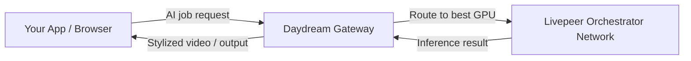

import { BorderedBox } from '/snippets/components/layout/containers.jsx'
import { DoubleIconLink } from '/snippets/components/primitives/links.jsx'


Daydream is an **open-source toolkit for world models and real-time AI video** built on the Livepeer network. The Daydream gateway routes real-time AI inference jobs - style transfer, image-to-video, StreamDiffusion pipelines - to Livepeer's decentralized GPU network.

<Info>
  Daydream is a full product with its own documentation. This page covers the gateway aspect relevant to Livepeer developers. For the complete product documentation, visit [docs.daydream.live](https://docs.daydream.live).
</Info>

## Start here in 5 minutes

<BorderedBox variant="accent" padding="16px">

- **Prereqs:** Browser with camera access (hosted path) or a backend with a Daydream API key
- **Time:** 5 minutes
- **Outcome:** A working Daydream session or your first API call scaffolded
- **First action:** Open [daydream.live](https://daydream.live) for no-code testing, then use [docs.daydream.live](https://docs.daydream.live) to copy the current API endpoint and auth settings

</BorderedBox>

---

## What the Daydream Gateway Does

The Daydream gateway is a Livepeer gateway node operated by the Daydream team. It accepts real-time video and AI inference requests and routes them to compatible orchestrators on the Livepeer GPU network.

Use the Daydream gateway to:

- Transform a live camera feed into AI-stylized video in real time using text prompts
- Run StreamDiffusion pipelines (image-to-image, style transfer) on video streams
- Experiment with world models and generative AI video workflows
- Access Livepeer AI inference without running your own gateway node

---

## Access Options

<Tabs>
  <Tab title="Hosted App">
    The fastest way to experience Daydream is the hosted app at [daydream.live](https://daydream.live). No API key or setup required - open the app, allow camera access, enter a text prompt, and your video is transformed in real time.

    This is ideal for creators, artists, and anyone who wants to explore real-time AI video without writing code.

    <Card title="Try Daydream" icon="wand-magic-sparkles" href="https://daydream.live" arrow horizontal>
      Open the hosted Daydream app - no account required.
    </Card>
  </Tab>
  <Tab title="API / Developer Access">
    Developers can integrate with the Daydream gateway via the Daydream API to build real-time AI video into their own applications.

    Refer to the official Daydream developer documentation for authentication, endpoints, and pipeline configuration:

    <Card title="Daydream Developer Docs" icon="book" href="https://docs.daydream.live" arrow horizontal>
      Full API reference, setup guides, and pipeline examples.
    </Card>
  </Tab>
  <Tab title="Self-Hosted Gateway">
    Because Daydream is open-source, you can run the Daydream stack against your own Livepeer gateway node. This is the path for teams who need custom models, private deployments, or white-label AI video infrastructure.

    <DoubleIconLink label="Daydream GitHub (Scope)" href="https://github.com/daydreamlive/scope" iconLeft="github" />

    For running your own Livepeer gateway for AI workloads, see the [Run a Gateway guide](/v2/gateways/run-a-gateway/run-a-gateway).
  </Tab>
</Tabs>

## First Request Example (Portal-Guided API)

Use the Daydream docs as the source of truth for the current API base URL and route, then run a minimal authenticated request:

```bash
DAYDREAM_API_URL="<copy from docs.daydream.live quickstart>"

curl -X POST "$DAYDREAM_API_URL" \
  -H "Authorization: Bearer <DAYDREAM_API_KEY>" \
  -H "Content-Type: application/json" \
  -d '{
    "prompt": "cinematic watercolor skyline at dusk"
  }'
```

Expected success signal: HTTP `200` response with generated output metadata (for example, an asset URL, stream URL, or job/result payload depending on the selected route).

---

## What Daydream Supports

<CardGroup cols={2}>
  <Card title="Real-Time Style Transfer" icon="palette">
    Transform live video with text prompts using StreamDiffusion. Sub-second latency on GPU.
  </Card>
  <Card title="Image-to-Video" icon="film">
    Generate video from image inputs using diffusion model pipelines.
  </Card>
  <Card title="World Models" icon="earth-europe">
    Experiment with generative and interactive world models for video.
  </Card>
  <Card title="Custom Pipelines" icon="sliders">
    BYOC (Bring Your Own Compute) support for custom AI pipelines via the Livepeer gateway.
  </Card>
</CardGroup>

---

## Network Architecture

Daydream runs on Livepeer's GPU network. When you send a job through the Daydream gateway:

1. Your request hits the Daydream gateway node
2. The gateway routes the job to a compatible orchestrator (GPU node)
3. The orchestrator runs inference and returns the result
4. The gateway streams the output back to your client

This means inference is distributed, low-latency, and scales with network GPU supply - without Daydream needing to own or provision GPUs directly.



---

## Community and Resources

- [daydream.live](https://daydream.live) - Hosted app
- [docs.daydream.live](https://docs.daydream.live) - Full developer documentation
- [GitHub: Scope](https://github.com/daydreamlive/scope) - Open-source real-time AI video toolkit
- [Community Hub](https://app.daydream.live) - Discover and explore community creations
- [Discord](https://discord.com/invite/mnfGR4Fjhp) - Daydream community (builders, creatives, researchers)
- [Blog](https://blog.daydream.live) - Tutorials, creator stories, and research

---

## Related Pages

<CardGroup cols={2}>
  <Card title="Daydream Product Overview" href="/v2/solutions/daydream/overview" icon="wand-magic-sparkles" arrow>
    Full Daydream product context, videos, and ecosystem fit.
  </Card>
  <Card title="Run Your Own Gateway" href="/v2/gateways/run-a-gateway/run-a-gateway" icon="server" arrow>
    Build your own gateway node for custom AI video routing.
  </Card>
  <Card title="AI Pipelines Overview" href="/v2/developers/ai-pipelines/overview" icon="robot" arrow>
    How AI pipelines, ComfyStream, and BYOC work on Livepeer.
  </Card>
  <Card title="Find Gateway Services" href="../choosing-a-gateway" icon="compass" arrow>
    Compare all gateway providers.
  </Card>
</CardGroup>
