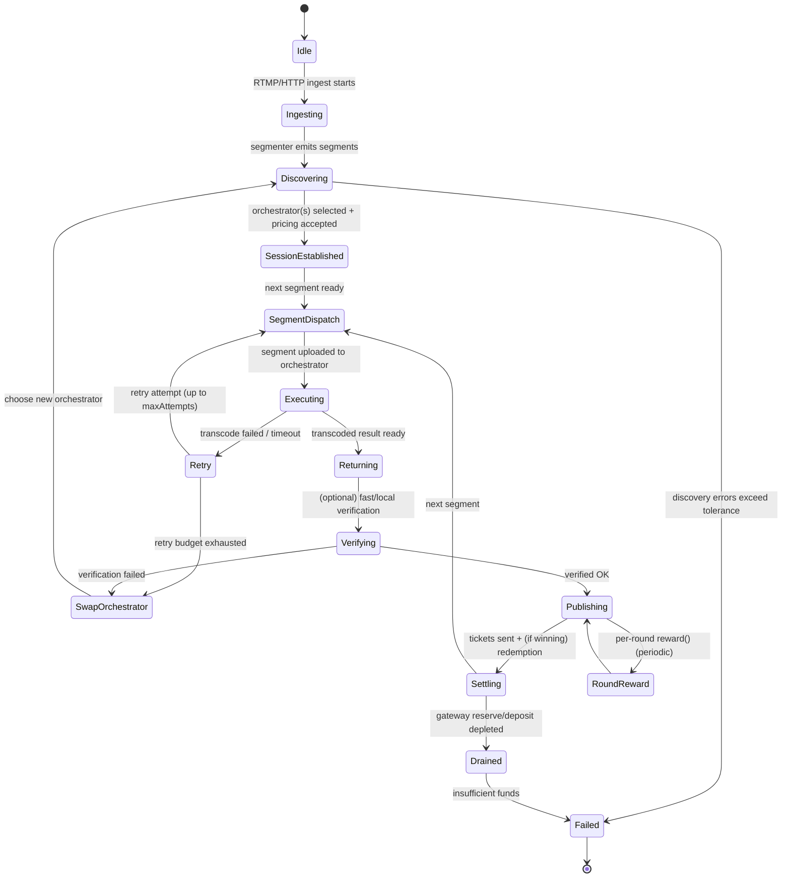

{/* codex-i18n: eyJraW5kIjoiY29kZXgtaTE4biIsInZlcnNpb24iOjEsInNvdXJjZVBhdGgiOiJ2Mi9hYm91dC9saXZlcGVlci1uZXR3b3JrL2pvYi1saWZlY3ljbGUubWR4Iiwic291cmNlUm91dGUiOiJ2Mi9hYm91dC9saXZlcGVlci1uZXR3b3JrL2pvYi1saWZlY3ljbGUiLCJzb3VyY2VIYXNoIjoiNzg5MmU2MmE4YWNlYTBjNDE5ODFlNjM5N2IxZTIyZDU1YWEyMGY3YmZjY2YyMGQxNGJiMGVkNWQ3ZWFhMTM3NyIsImxhbmd1YWdlIjoiY24iLCJwcm92aWRlciI6Im9wZW5yb3V0ZXIiLCJtb2RlbCI6Im9wZW5haS9ncHQtb3NzLTIwYjpmcmVlIiwiZ2VuZXJhdGVkQXQiOiIyMDI2LTAyLTI2VDA3OjIxOjEzLjg5MFoifQ== */}
import { DynamicTable } from "/snippets/components/layout/table.jsx"

{/* 
This page describes:
6. **Job Lifecycle**

   * Job submission
   * Assignment
   * Execution
   * Verification
   * Payment (ETH fees)
 */}

{/* ## Job Lifecycle
This view describes the end-to-end “compute job” as a state machine. Because Livepeer’s compute is segment-oriented, the lifecycle is modelled at the level of a stream session and per-segment processing, with payment settlement occurring continuously via tickets and periodically via reward calls. */}

### 生命周期叙事
一个最小化、基于源的作业生命周期是：
<Steps>
<Step title="Ingest and segmentation">
Ingest and segmentation: A Gateway receives an RTMP stream (docs provide explicit RTMP ingest examples) and produces segments to be processed. 
</Step>
<Step title="Discovery and selection">
Discovery and selection: The Gateway selects an Orchestrator set according to the node software’s discovery logic; operational failures here appear as discovery errors and orchestrator swaps. 
</Step>
<Step title="Price and session parameters">
Price and session parameters: Orchestrators advertise a price per pixel (Wei denominated) to gateways off-chain; orchestrators may auto-adjust price to compensate for ticket redemption overhead when gas is high. 
</Step>
<Step title="Segment dispatch and compute">
Segment dispatch and compute: The Gateway uploads segments; the Orchestrator executes transcoding/AI compute locally or delegates to attached transcoder processes. 
</Step>
<Step title="Result return and verification">
Result return and verification: Results are returned to the Gateway; verification may be performed (fast verification metrics exist and are explicitly named). Failures can trigger orchestrator swaps and retries. 
</Step>
<Step title="Continuous settlement">
Continuous settlement: The Gateway sends probabilistic payment tickets; the Orchestrator redeems winning tickets and the system tracks redemption errors and redeemed value. 
</Step>
<Step title="Periodic reward accounting">
Periodic reward accounting: Each round, orchestrators may call reward() as an Arbitrum transaction distributing minted rewards to itself and its delegators.
</Step>
</Steps>

### 状态机图

### 事件与转换
下表将具体触发器映射到转换，尽可能使用显式配置旋钮/指标：

<DynamicTable
  headerList={["Event / Trigger", "Observable Evidence", "Transition", "Notes"]}
  itemsList={[
    { "Event / Trigger": "Stream starts", "Observable Evidence": "livepeer_stream_started_total increments", "Transition": "Idle → Ingesting", "Notes": "Metrics are defined in node docs." },
    { "Event / Trigger": "Discovery fails", "Observable Evidence": "livepeer_discovery_errors_total increments", "Transition": "Discovering → Failed", "Notes": "Exact selection algorithm is not fully specified in docs; treat as implementation detail." },
    { "Event / Trigger": "Segment transcode fails", "Observable Evidence": "livepeer_segment_transcode_failed_total / livepeer_transcode_retried", "Transition": "Executing → Retry", "Notes": "Retry budget controlled by maxAttempts (default 3)." },
    { "Event / Trigger": "Orchestrator swap mid-stream", "Observable Evidence": "livepeer_orchestrator_swaps", "Transition": "Retry/Verifying → SwapOrchestrator", "Notes": "Swap behaviour is observable though exact policy is not fully specified." },
    { "Event / Trigger": "Payment sent", "Observable Evidence": "livepeer_tickets_sent, livepeer_ticket_value_sent", "Transition": "Publishing → Settling", "Notes": "Deposit/reserve are explicitly surfaced per gateway." },
    { "Event / Trigger": "Reserve/deposit depleted", "Observable Evidence": "livepeer_gateway_reserve / livepeer_gateway_deposit low/zero", "Transition": "Settling → Drained", "Notes": "Some community guides discuss splitting ETH into deposit + reserve for testing; treat exact sizing as operator-specific." },
    { "Event / Trigger": "Ticket redemption error", "Observable Evidence": "livepeer_ticket_redemption_errors", "Transition": "Settling → (degraded)", "Notes": "Redemption reliability impacts realised revenue for Orchestrator." },
    { "Event / Trigger": "On-chain tx confirmation timeout", "Observable Evidence": "txTimeout (default 5 mins)", "Transition": "Settling/RoundReward → (retry/replace tx)", "Notes": "Transaction replacement knobs are defined in CLI options." },
    { "Event / Trigger": "Per-round reward minted/distributed", "Observable Evidence": "orchestrator reward service enabled", "Transition": "Publishing ↔ RoundReward", "Notes": "Docs describe default auto reward calls per round on Arbitrum." }
  ]}
  monospaceColumns={[1]}
/>

### 作业生命周期（视频 vs AI）

Livepeer 支持两种主要任务类型：转码（视频格式转换）和 AI 推理（例如风格迁移、生成）。每种任务遵循类似的多方流程，但管道细节不同。转码工作流：当网关（广播者）有实时流（或视频）需要处理时，它：
Register Funds: 预先向链上 TicketBroker 合约注入等于预期任务费用的 ETH。
Select Orchestrator: 在链下，网关查询网络（使用 Explorer 或 libp2p 信令），寻找满足价格和位置需求的活跃编排者。
Submit Segments: 对于每个视频片段（通常几秒），网关将原始片段连同概率支付票据一起发送给选定的编排者。此“票据”是一次签名的支付承诺，用于随机抽奖（见下文）。
Transcode: 编排者将片段传递给其连接的转码器（GPU 硬件），生成请求的不同版本（例如不同码率、格式）。
Return Results: 转码器将编码后的片段返回给编排者，后者再将其发送回网关（或输出流）。
Redeem Payments: 编排者定期（或任务结束时）将任何中奖票据提交到链上的 TicketBroker，以兑换 ETH。中奖票据是指在密码学上满足随机阈值的票据；大多数票据“未中奖”，但从统计上看，随着时间推移，编排者会收到全部应得费用。
The essential flow is:
flowchart LR
Gateway([Gateway (Broadcaster)]) -->|“video + ticket”| Orchestrator([Orchestrator Node])
Orchestrator -->|“assign chunk”| Transcoder([Transcoder GPU])
Transcoder -->|“renditions”| Orchestrator
Orchestrator -->|“encoded output”| Gateway
Gateway -->|“next segment / finalize”| Orchestrator
Example: 一个网关拥有 30 秒的实时视频。它在 TicketBroker 中存入 ETH，随后将带票据的片段流式传输给编排者 A。编排者 A 的转码器输出多种码率。稍后，编排者 A 将任何中奖票据发送到位于 Arbitrum 的 TicketBroker 合约以领取付款。费用（以 ETH 计）会根据编排者的费用分成设置自动分配，记入委托人的余额。
Probabilistic Payments: 网关不是按片段付费，而是使用抽奖票据方案。每张票据都有机会“赢得”固定的 ETH 奖金。经过大量片段后，预期的支付额等于实际工作成本。这可以保护编排者免受微小链上交易和 gas 费用波动的影响。（广播者预先注入足够的 ETH，以确保预期支付覆盖所有票据。）AI Inference Workflow: AI 任务（例如实时风格迁移、视频生成）使用相同的质押/费用模型，但可能涉及多个模型的流水线（例如 Stage-1 文本编码器 → Stage-2 图像解码器）。
Livepeer 的 Cascade 框架协调多步骤 AI 工作流：网关发送初始数据和提示，编排者依次应用模型，直至生成最终视频。For example, Daydream (an AI app) captures webcam video, sends it through a StableDiffusion pipeline on the network, and returns the stylized video output.
Example (AI): 用户将摄像头流输入 Daydream（由 Livepeer AI 提供动力）。网关将帧和“风格”提示发送给编排者 B。B 运行一系列 GPU（例如增强 → 风格化），实时返回 AI 编辑后的视频。Livepeer 的 GPU 和网络针对该低延迟流水线进行了优化。
The common pattern: Gateway 🡒 Orchestrator(s) 🡒 Transcoder/AI Model 🡒 Gateway. Smart contracts (TicketBroker for fees, JobsManager, etc.) mediate off-chain jobs and on-chain accounting.
