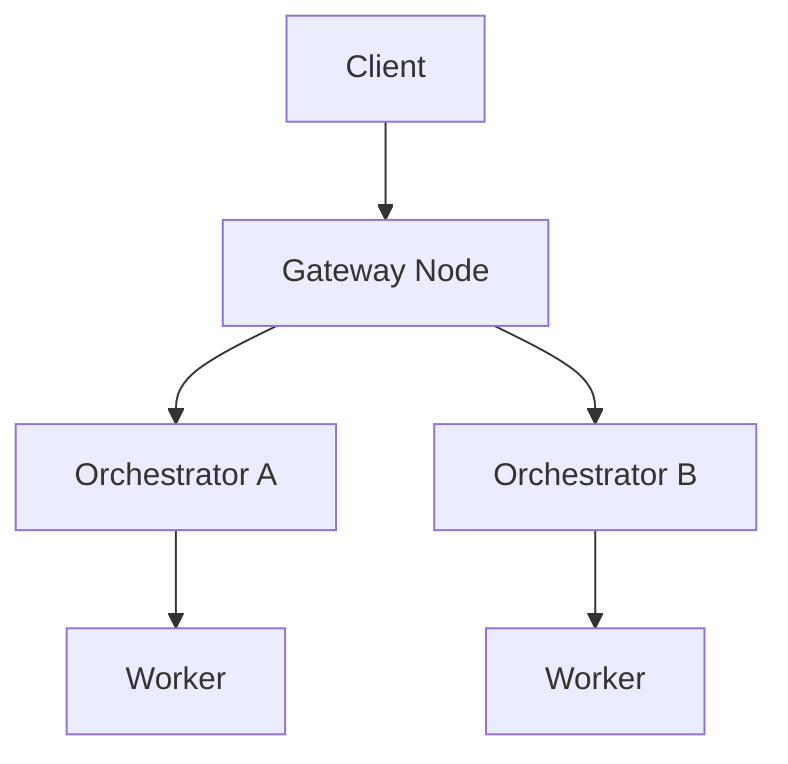

{/* codex-i18n: eyJraW5kIjoiY29kZXgtaTE4biIsInZlcnNpb24iOjEsInNvdXJjZVBhdGgiOiJ2Mi9hYm91dC9saXZlcGVlci1uZXR3b3JrL21hcmtldHBsYWNlLm1keCIsInNvdXJjZVJvdXRlIjoidjIvYWJvdXQvbGl2ZXBlZXItbmV0d29yay9tYXJrZXRwbGFjZSIsInNvdXJjZUhhc2giOiI2NTFlN2IwMWU1MWU0NWQzMzA4Zjc4M2FmNmU1ODMxYjdjNjY3ZjRhMTQxZTA3MTc5M2QyYWM4ZTdhZWM4Zjc5IiwibGFuZ3VhZ2UiOiJjbiIsInByb3ZpZGVyIjoib3BlbnJvdXRlciIsIm1vZGVsIjoib3BlbmFpL2dwdC1vc3MtMjBiOmZyZWUiLCJnZW5lcmF0ZWRBdCI6IjIwMjYtMDItMjZUMDY6NTc6NDQuNzkwWiJ9 */}
import { DynamicTable } from '/snippets/components/layout/table.jsx'
import { GotoCard, GotoLink } from '/snippets/components/primitives/links.jsx'

Livepeer 网络支持一个动态去中心化的实时媒体计算市场：转码和 AI 推理。与静态基础设施平台不同，Livepeer 的开放市场引入了实时**竞价、路由和定价** 的作业在全球 Orchestrators 池中。此页面概述了市场层、参与者行为、会话经济学，以及它与协议的关系。

## 市场概览

<DynamicTable
  headerList={["Element", "Role"]}
  itemsList={[
    { "Element": "Gateway / Client", "Role": "Submit job requests (stream, image, session intent)" },
    { "Element": "Gateway", "Role": "Matches requests to suitable Orchestrators" },
    { "Element": "Orchestrator", "Role": "Advertises availability, pricing, and capabilities" },
    { "Element": "Worker", "Role": "Executes compute task (Transcoder or AI worker)" },
    { "Element": "TicketBroker", "Role": "Receives tickets for ETH reward upon verified work (on-chain)" }
  ]}
/>

此市场是**持续的** - Orchestrators 始终可用于会话；Gateways 在链下路由工作，无需每个作业的链上 gas。

## 需求：客户端工作负载

客户端通过 Gateways 提交各种媒体计算作业：

<DynamicTable
  headerList={["Job type", "Example use case", "Payment style"]}
  itemsList={[
    { "Job type": "Live stream", "Example use case": "RTMP ingest for video platforms", "Payment style": "Per-minute ETH / credits" },
    { "Job type": "AI inference", "Example use case": "Frame-by-frame image-to-image generation", "Payment style": "Per-job (frame, token)" },
    { "Job type": "File transcode", "Example use case": "Static MP4 → web formats", "Payment style": "Batch credits" }
  ]}
/>

**API 示例：** Livepeer Studio REST, Gateway POST job, ComfyStream interface (AI).

## 供给：Orchestrator 节点

Orchestrators 广告：

- 硬件规格（GPU/CPU，内存）
- 地区和延迟
- 支持的工作负载（视频、AI 或两者）
- 每段/帧/令牌价格

它们通过网关侧的 gRPC 或 REST 心跳端点更新可用性。Gateways 使用此信息将作业路由到最佳匹配。

## 路由逻辑

Gateway 根据以下标准对 Orchestrators 进行评分：

- 到输入源的延迟
- 工作负载匹配（视频 vs AI）
- 每个作业成本
- 可用性和重试缓冲

会话是**路由的** 在链下路由到最佳匹配；每个作业不消耗链上 gas。

## 价格发现

当前 Livepeer 实现使用**已发布定价**（Orchestrator-set），非拍卖式。几点说明：

- 客户端可以匹配到最低可用兼容提供商。
- 价格可能因以下因素而异：
  - 地区（例如 US-East vs EU-Central）
  - GPU 负载（AI 密集型 Orchestrators 可能收费更高）
  - 质量配置（例如 1080p60 vs 720p30）

<Note>
In development: LIPs may introduce dynamic auction mechanisms for AI sessions (e.g. spot job auctions). See the [Forum LIPs](https://forum.livepeer.org/c/lips/) for proposals.
</Note>

## 支付与结算

**客户端** 通过以下方式支付：

- ETH 票（通过协议的链上结算）`TicketBroker`)
- 信用余额（由某些 Gateways 在链下跟踪）

**Orchestrators：**

- 索取获胜票到`TicketBroker` 在 Arbitrum 上
- 累计 ETH 来自转码/AI 工作的收益
- 索取通胀（LPT）奖励来自`BondingManager` 每轮

## 信用系统扩展

一些 Gateways 除了直接 ETH 之外，还提供用户友好的定价：

<DynamicTable
  headerList={["Currency", "Top-up methods", "Denomination example"]}
  itemsList={[
    { "Currency": "USD", "Top-up methods": "Credit card, USDC", "Denomination example": "Per minute or per job" },
    { "Currency": "ETH", "Top-up methods": "MetaMask, smart wallet", "Denomination example": "Per job or per segment" }
  ]}
/>

Orchestrators 可以在支持的情况下通过基于预言机的报价以美元等值计价。

## 可观测性

每个会话可以记录以下信息：

- 首次响应延迟
- 重试次数
- Orchestrator ID 和地区
- 支付的价格 (ETH 或信用)

未来的市场索引器可能会展示网络的实时作业流统计信息。

## 协议–市场边界

<DynamicTable
  headerList={["Layer", "Description", "Example"]}
  itemsList={[
    { "Layer": "Protocol", "Description": "Verifies work and pays ETH & LPT rewards", "Example": "TicketBroker, BondingManager" },
    { "Layer": "Marketplace", "Description": "Matches jobs to compute providers", "Example": "Gateway load balancer, routing" },
    { "Layer": "Interface layer", "Description": "Abstracts API, SDK, session negotiation", "Example": "Livepeer Studio SDK, Daydream API" }
  ]}
/>

## 未来升级（已提议的 LIP）

- **LIP-78：** 现货作业拍卖
- **LIP-81：** 信用到协议同步桥
- **LIP-85：** Orchestrator 质押对作业路由的影响

有关当前状态，请参见 [论坛 LIP](https://forum.livepeer.org/c/lips/) 和 [技术路线图](../resources/technical-roadmap).

## 另请参见

- [作业生命周期](./job-lifecycle) - 从摄取到结算的端到端流程
- [参与者](./actors) - 网关、Orchestrator 和 Delegator 角色
- [Livepeer 协议概览](../livepeer-protocol/overview) - 链上合约和激励
- [区块链合约](../resources/blockchain-contracts) - TicketBroker 和其他合约地址

## 参考资料

- [Livepeer Studio / Gateway 文档](https://livepeer.studio/docs)
- [TicketBroker（协议）](https://github.com/livepeer/protocol/tree/master/contracts/job)
- [Orchestrator 节点设置](/v2/cn/orchestrators/orchestrators-portal)
- [论坛：LIP 提案](https://forum.livepeer.org/c/lips/)
- [Livepeer AI（ComfyStream，博客）](https://blog.livepeer.org/real-time-ai-comfyui)
