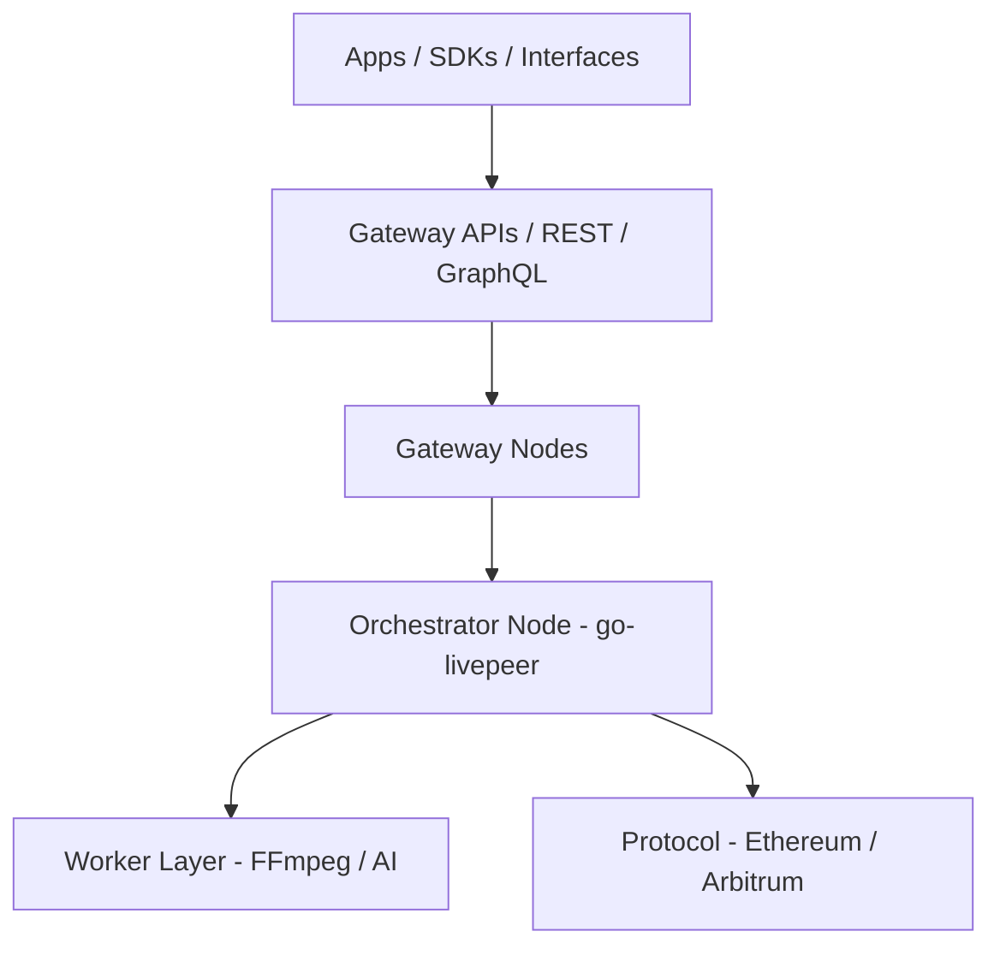

{/* codex-i18n: eyJraW5kIjoiY29kZXgtaTE4biIsInZlcnNpb24iOjEsInNvdXJjZVBhdGgiOiJ2Mi9hYm91dC9saXZlcGVlci1uZXR3b3JrL3RlY2huaWNhbC1hcmNoaXRlY3R1cmUubWR4Iiwic291cmNlUm91dGUiOiJ2Mi9hYm91dC9saXZlcGVlci1uZXR3b3JrL3RlY2huaWNhbC1hcmNoaXRlY3R1cmUiLCJzb3VyY2VIYXNoIjoiOWFmZTc2YTc4YzNiM2Q4MGExOTY5MzE0N2FlNzEwNmZiYTYxYjM1MTA5NjVhZWFhOWEyNzBiMjhjOWFlYjc1MCIsImxhbmd1YWdlIjoiY24iLCJwcm92aWRlciI6Im9wZW5yb3V0ZXIiLCJtb2RlbCI6Im9wZW5haS9ncHQtb3NzLTEyMGI6ZnJlZSIsImdlbmVyYXRlZEF0IjoiMjAyNi0wMi0yNlQwNjo1ODo0Ny44MjVaIn0= */}
import { DynamicTable } from '/snippets/components/layout/table.jsx'
import { GotoCard, GotoLink } from '/snippets/components/primitives/links.jsx'

此页面概述了在节点、网关和客户端层面为 Livepeer 网络提供动力的完整工具、基础设施和组件堆栈。Livepeer 的架构是模块化且面向开发者的：您可以运行 Orchestrator，构建自定义 AI 网关，或使用 API 在去中心化计算上构建媒体应用。

## 架构层

网络位于协议之上：网关和 Orchestrator 处理链下计算和路由；协议（Arbitrum）负责质押、票据和奖励。

## Orchestrator 节点

Orchestrator 节点运行 **go-livepeer**（该`livepeer` 二进制），可在以下位置获取：

[https://github.com/livepeer/go-livepeer](https://github.com/livepeer/go-livepeer)

### 关键组件

- **转码器选择** - 内部或外部工作者；通过 `orchSecret` 和 `orchAddr` 为远程转码器
- **票据验证** - L2 `TicketBroker` 在 Arbitrum 上用于 ETH 支付兑换
- **奖励领取** - 向 `BondingManager` 每轮
- **LPT 质押** - BondingManager 用于自我质押和委托人质押
- **地区广告** - 用于网关路由（延迟、容量）

### 部署模式

- 裸金属服务器 + GPU
- 容器化
- 云端自动扩缩容

### 工具

- **livepeer_cli** - 质押、设置费用/奖励比例、监控会话
- **livepeer_exporter** - 用于可观测性的 Prometheus 指标导出器

## 工作者层

工作者可以是本地或远程服务，附加到 Orchestrator：

<DynamicTable
  headerList={["Type", "Language / runtime", "Example use"]}
  itemsList={[
    { "Type": "Transcoder", "Language / runtime": "FFmpeg", "Example use": ".ts segment processing, multi-bitrate output" },
    { "Type": "Inference", "Language / runtime": "Python (Torch)", "Example use": "AI tasks, e.g. SDXL image-to-image" },
    { "Type": "Plugin", "Language / runtime": "WebRTC / C++", "Example use": "Real-time browser capture or object detection" }
  ]}
/>

通过 Orchestrator `config.json` 或环境变量。

## 网关基础设施

网关管理：

- 会话认证（API 密钥、ETH 押金或信用检查）
- 作业路由至 Orchestrator
- 会话日志记录与重试

**代码库：**

- [Studio 网关](https://github.com/livepeer/studio-gateway)
- [Daydream 网关](https://github.com/livepeer/daydream)
- [Cascade](https://github.com/livepeer/cascade) - 负载均衡器和 AI 工作流协调

**特性：** 限流、地区评分、健康探针、后备 Orchestrator、信用跟踪（例如 Postgres/Redis）。

## API

<DynamicTable
  headerList={["API", "Protocol", "Description"]}
  itemsList={[
    { "API": "REST Gateway", "Protocol": "HTTPS", "Description": "Transcode, AI job control (e.g. Livepeer Studio API)" },
    { "API": "gRPC Gateway", "Protocol": "gRPC", "Description": "Fast session handshakes, monitoring (e.g. ReserveSession, Heartbeat)" },
    { "API": "Explorer API", "Protocol": "GraphQL", "Description": "Metrics, staking, round data (explorer.livepeer.org)" }
  ]}
/>

**端点：**

- `https://livepeer.studio/api` - Studio REST
- `https://explorer.livepeer.org/graphql` - Explorer GraphQL

## CLI 和 SDK

**CLI：** `livepeer_cli`（随 go-livepeer 提供）

- 质押 LPT，绑定/解绑
- 设置 Orchestrator 费用和奖励分成
- 监控活跃会话，查询协议状态

**SDK：**

- **[Livepeer JS SDK](https://github.com/livepeer/js-sdk)** - 播放、摄取、AI 会话工具；可在 Node.js 和浏览器中使用
- **Python AI 管道** - 用于内部和社区项目（例如 dotSimulate、MetaDJ）

## 监控与可观测性

<DynamicTable
  headerList={["Tool", "Metric type", "Description"]}
  itemsList={[
    { "Tool": "Prometheus", "Metric type": "Session, CPU, ticketing", "Description": "Exposed via livepeer_exporter" },
    { "Tool": "Grafana dashboards", "Metric type": "Visual ops", "Description": "Studio and Orchestrator internal views" },
    { "Tool": "Loki", "Metric type": "Logs", "Description": "Transcode errors, API retries" },
    { "Tool": "Gateway logs", "Metric type": "Credits, API, routing", "Description": "Per-session logs (e.g. Redis / S3)" }
  ]}
/>

节点软件公开明确的指标（例如段成功率、已发送/已兑换的票据价值、Orchestrator 交换）；参见 [作业生命周期](./job-lifecycle) 获取事件/转换细节。

## 部署示例

- [在 AWS 上的 Orchestrator](https://github.com/livepeer/orchestrator-on-aws)
- [Studio 网关部署](https://github.com/livepeer/studio-gateway-deploy)
- [Daydream AI 节点管道](https://github.com/livepeer/daydream)

## 另请参见

- [接口](./interfaces) - REST、gRPC、GraphQL、JS SDK、CLI 和智能合约访问
- [市场](./marketplace) - 网关如何路由作业以及定价机制
- [作业生命周期](./job-lifecycle) - 端到端流程和状态机
- [协议技术架构](../livepeer-protocol/technical-architecture) - 从协议角度看链上合约和节点类型
- [区块链合约](../resources/blockchain-contracts) - 合约地址 (Arbitrum)

## 参考资料

- [Livepeer GitHub](https://github.com/livepeer)
- [Orchestrator 文档](/v2/cn/orchestrators/orchestrators-portal)
- [Daydream 网关](https://github.com/livepeer/daydream)
- [Livepeer Explorer](https://explorer.livepeer.org)
