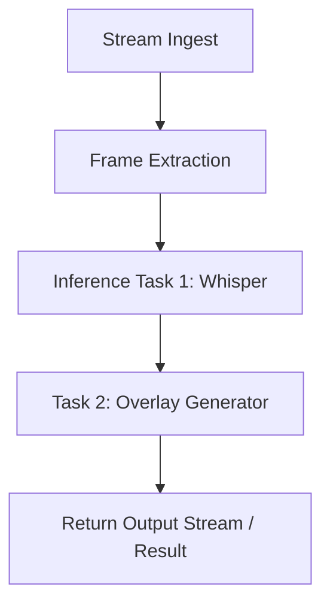

{/* codex-i18n: eyJraW5kIjoiY29kZXgtaTE4biIsInZlcnNpb24iOjEsInNvdXJjZVBhdGgiOiJ2Mi9kZXZlbG9wZXJzL2FpLXBpcGVsaW5lcy9vdmVydmlldy5tZHgiLCJzb3VyY2VSb3V0ZSI6InYyL2RldmVsb3BlcnMvYWktcGlwZWxpbmVzL292ZXJ2aWV3Iiwic291cmNlSGFzaCI6Ijc4MWU0NWEyYmY3OWE4ODljMTc4OWE4NDNlZTcxMjY1MTU3NDNlMWNlZTJjMDY3MGQyZGJiZDEyMzgyMzkwYTAiLCJsYW5ndWFnZSI6ImNuIiwicHJvdmlkZXIiOiJvcGVucm91dGVyIiwibW9kZWwiOiJxd2VuL3F3ZW4tdHVyYm8iLCJnZW5lcmF0ZWRBdCI6IjIwMjYtMDItMjdUMTI6MjY6NDEuODkzWiJ9 */}
import { DynamicTable } from '/snippets/components/layout/table.jsx'

Livepeer AI 管道让您在分布式 GPU 基础设施上运行可自定义、可组合的视频推理任务。由 Livepeer 网络提供支持，并由像 ComfyStream 这样的离链工作者支持，该系统使您能够轻松地大规模部署视频 AI。

## 简而言之

- **管道** 是一个或多个推理任务（例如 Whisper、风格迁移、检测）按顺序在视频帧上运行。
- **网关** 将任务路由到兼容的**协调者**和**工作者**；协议处理支付和协调。
- **BYOC**（自带计算资源）和**ComfyStream** 是两种运行或扩展管道的方式，您可以使用自己的模型和节点。

## 使用案例

- 语音转文本（Whisper）
- 风格迁移或滤镜（Stable Diffusion）
- 物体跟踪和检测（YOLO）
- 视频分割（segment-anything）
- 人脸遮蔽或模糊处理
- BYOC（自备计算资源）

## 什么是管道？

AI 管道由一个或多个任务组成，这些任务按顺序在实时视频帧上执行。每个任务可能：

- 修改视频（例如添加叠加层）
- 生成元数据（例如，字幕，边界框）
- 将结果中继到另一个节点

Livepeer 处理流摄入、帧提取和任务分发。节点运行实际的推理。



## 架构

### 网关和工作者

- **协调者** 队列推理任务并运行（或委托给）工作者。
- **工作者** 订阅任务类型（例如 whisper-transcribe）并执行它们。
- **网关** 从客户端将任务路由到兼容的节点。这是链下操作；协议 (Arbitrum) 处理付款和奖励。

### 工作者类型

<DynamicTable
  headerList={["Type", "Description", "Example models"]}
  itemsList={[
    { "Type": "Whisper Worker", "Description": "Speech-to-text inference", "Example models": "whisper-large" },
    { "Type": "Diffusion Worker", "Description": "Image-to-image or overlay generation", "Example models": "sdxl, controlnet" },
    { "Type": "Detection Worker", "Description": "Bounding box or class prediction", "Example models": "YOLOv8" },
    { "Type": "Pipeline Worker", "Description": "Chained tasks via ComfyStream or custom", "Example models": "custom-pipeline" }
  ]}
/>

## Pipeline definition format

Jobs can be JSON-based task objects. Example:

```json
{
  "streamId": "abc123",
  "task": "custom-pipeline",
  "pipeline": [
    { "task": "whisper-transcribe", "lang": "en" },
    { "task": "segment-blur", "target": "faces" }
  ]
}
```

Workers can accept:

- JSON-formatted tasks via the Gateway
- Frame-by-frame gRPC (low latency)
- Result upload via webhook

## 自带计算资源 (BYOC)

您可以使用自己的 GPU 节点来提供推理任务:

1. 克隆 [ComfyStream](https://github.com/livepeer/comfystream) 或实现处理 API。
2. 添加 Whisper、ControlNet 或其他模型的插件。
3. 通过网关注册您的节点（并可选地在链上注册）

参见[BYOC](./byoc)以获取完整的设置指南。

## 另请参见

- [BYOC](./byoc) - 运行自己的 AI 工作人员并注册到网络
- [ComfyStream](./comfystream) - 基于 ComfyUI 的管道和网关集成
- [Livepeer AI（概述）](/v2/developers/ai-inference-on-livepeer/overview) - 产品概述和使用案例
- [网络技术架构](/v2/cn/about/livepeer-network/technical-architecture) - 网关、协调器和协议

## 资源

- [ComfyStream GitHub](https://github.com/livepeer/comfystream)
- [Livepeer Studio AI 文档](https://livepeer.studio/docs/ai)
- [论坛：示例流程](https://forum.livepeer.org/t/example-pipelines)
- [探索者](https://explorer.livepeer.org) - 网络和节点统计
