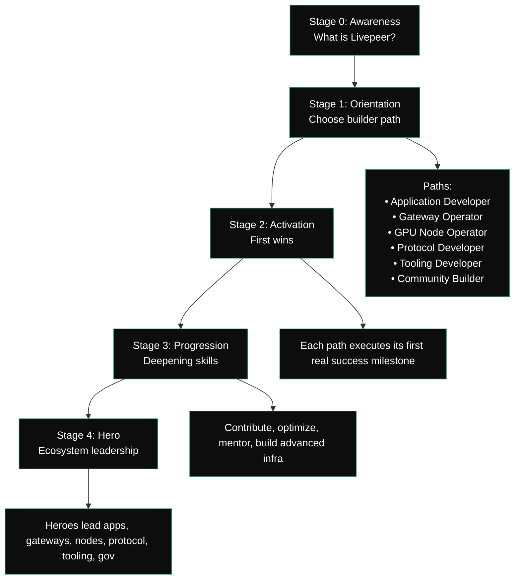

{/* codex-i18n: eyJraW5kIjoiY29kZXgtaTE4biIsInZlcnNpb24iOjEsInNvdXJjZVBhdGgiOiJ2Mi9kZXZlbG9wZXJzL2RldmVsb3Blci1qb3VybmV5Lm1keCIsInNvdXJjZVJvdXRlIjoidjIvZGV2ZWxvcGVycy9kZXZlbG9wZXItam91cm5leSIsInNvdXJjZUhhc2giOiI3ZGY1ZTM0N2Q2ODc2ZWI0NDc4N2EyZWQxODgzOGI0ZjA1MzIxNTljNWY5NGM4YTVlMzVmNzUwNTQ1NTIwY2EwIiwibGFuZ3VhZ2UiOiJjbiIsInByb3ZpZGVyIjoib3BlbnJvdXRlciIsIm1vZGVsIjoib3BlbmFpL2dwdC1vc3MtMTIwYjpmcmVlIiwiZ2VuZXJhdGVkQXQiOiIyMDI2LTAyLTI3VDAyOjIxOjI1LjIwMFoifQ== */}
| 阶段 | 名称        | 目的                                             | 成果                                                                           |
| ----- | ----------- | --------------------------------------------------- | ---------------------------------------------------------------------------------- |
| 0     | 认知   | 了解 Livepeer、计算模型、生态系统角色 | 明确协议 → 网络 → 应用；基本思维模型                           |
| 1     | 方向 | 确定哪个构建者角色符合他们的目标     | 选择的路径：App Dev、Gateway Operator、GPU Node、Protocol Dev、Tooling、Community |
| 2     | 激活  | 在所选路径中执行第一次有意义的操作      | "First win" 实现：应用已构建，节点已部署，合约已编写，工具已创建     |
| 3     | 进展 | 提升专业知识和贡献                 | 贡献、优化、指导、先进工作流                        |
| 4     | 英雄        | 成为生态系统中的领袖/管理者            | 大规模运营，发布工具，撰写提案，运行项目                    |

