{/* codex-i18n: eyJraW5kIjoiY29kZXgtaTE4biIsInZlcnNpb24iOjEsInNvdXJjZVBhdGgiOiJ2Mi9nYXRld2F5cy9ydW4tYS1nYXRld2F5L2NvbmZpZ3VyZS9kdWFsLWNvbmZpZ3VyYXRpb24ubWR4Iiwic291cmNlUm91dGUiOiJ2Mi9nYXRld2F5cy9ydW4tYS1nYXRld2F5L2NvbmZpZ3VyZS9kdWFsLWNvbmZpZ3VyYXRpb24iLCJzb3VyY2VIYXNoIjoiZTE5Y2E2YTJiMDAzOGI4MzgwNjI5MGNlZTI4ODJiZjEyMTE5YjVmY2I2MjU1Mjk2MjJiOGQ4ODM4NjIxMWI3NiIsImxhbmd1YWdlIjoiY24iLCJwcm92aWRlciI6Im9wZW5yb3V0ZXIiLCJtb2RlbCI6InF3ZW4vcXdlbi10dXJibyIsImdlbmVyYXRlZEF0IjoiMjAyNi0wMi0yN1QxNDoxMjoyOC44OTVaIn0= */}
import { ScrollableDiagram } from '/snippets/components/content/zoomableDiagram.jsx'
import { DoubleIconLink } from '/snippets/components/primitives/links.jsx'
import { ExternalContent } from '/snippets/components/content/externalContent.jsx'
import BoxConfig from '/snippets/external/box-additional-config.mdx'

<Danger>
  This is way too long
  <Expandable title="TODO">
    **TODO:** - [ ] Verify flags and options are correct - [ ] Decide on more
    streamlined layour or steps flow - [ ] (fixme) #Configuration - [ ] (fixme)
    ##Deployment - [ ] Move Example to Guides & Resources
  </Expandable>
</Danger>

Livepeer 网关支持双设置配置，使单个节点能够同时处理传统的视频转码和AI处理工作负载。

这种统一的架构减少了基础设施的复杂性，同时提供了全面的媒体处理能力。

```mermaid
%%{init: {'theme': 'base', 'themeVariables': { 'primaryColor': '#1a1a1a', 'primaryTextColor': '#fff', 'primaryBorderColor': '#2d9a67', 'lineColor': '#2d9a67', 'secondaryColor': '#0d0d0d', 'tertiaryColor': '#1a1a1a', 'background': '#0d0d0d', 'fontFamily': 'system-ui' }}}%%
flowchart TB
    subgraph INPUT["Input Sources"]
        direction LR
        RTMP["RTMP Stream"]
        HTTP["HTTP Upload"]
        AI_REQ["AI Request"]
    end

    GATEWAY["Gateway Node<br/>LivepeerNode"]

    INPUT --> GATEWAY

    subgraph MANAGERS["Session Managers"]
        direction LR
        BSM["BroadcastSessionsManager<br/>Video Transcoding"]
        ASM["AISessionManager<br/>AI Processing"]
    end

    GATEWAY --> BSM
    GATEWAY --> ASM

    subgraph VIDEO["Video Pipeline"]
        SEG["Segment Processing"]
        ORCH_V["Orchestrators<br/>Transcoding"]
        HLS["HLS/DASH Output"]
    end

    subgraph AI["AI Pipeline"]
        PROC["AI Processing"]
        ORCH_AI["Orchestrators<br/>AI Models"]
        OUT_AI["AI Output<br/>Images/Video"]
    end

    BSM --> SEG --> ORCH_V --> HLS
    ASM --> PROC --> ORCH_AI --> OUT_AI

    subgraph PAYMENT["Payment"]
        direction LR
        PAY_SEG["Per Segment"]
        PAY_PIX["Per Pixel"]
    end

    ORCH_V --> PAY_SEG
    ORCH_AI --> PAY_PIX

    classDef default fill:#1a1a1a,color:#fff,stroke:#2d9a67,stroke-width:2px
    classDef video fill:#1a1a1a,color:#fff,stroke:#3b82f6,stroke-width:2px
    classDef ai fill:#1a1a1a,color:#fff,stroke:#a855f7,stroke-width:2px
    class RTMP,HTTP,BSM,SEG,ORCH_V,HLS,PAY_SEG video
    class AI_REQ,ASM,PROC,ORCH_AI,OUT_AI,PAY_PIX ai
    style INPUT fill:#0d0d0d,stroke:#2d9a67,stroke-width:1px
    style MANAGERS fill:#0d0d0d,stroke:#2d9a67,stroke-width:1px
    style VIDEO fill:#0d0d0d,stroke:#3b82f6,stroke-width:1px
    style AI fill:#0d0d0d,stroke:#a855f7,stroke-width:1px
    style PAYMENT fill:#0d0d0d,stroke:#2d9a67,stroke-width:1px
```

<ScrollableDiagram title="Dual Gateway Architecture: Video & AI Pipelines">



</ScrollableDiagram>

## 概述

网关的双重功能由其模块化架构实现，不同的管理器处理特定的工作流程，同时共享用于媒体摄取、支付处理和结果交付的公共基础设施。

LivepeerNode 结构包含传统转码（Transcoder, TranscoderManager）和AI处理（AIWorker, AIWorkerManager）的字段<DoubleIconLink label="livepeernode.go" href="https://github.com/livepeer/go-livepeer/blob/5691cb48/core/livepeernode.go" iconLeft="github" />

网关根据请求确定处理类型：

- 标准转码请求通过 BroadcastSessionsManager 处理
- AI 请求通过 AISessionManager 处理，并使用 AI 特定的身份验证和管道选择<DoubleIconLink label="ai_auth.go" href="https://github.com/livepeer/go-livepeer/blob/5691cb48/server/ai_auth.go" iconLeft="github" />

网关初始化时会创建两个不同的会话管理器：

```go
// Traditional transcoding session manager
sessManager = NewSessionManager(ctx, s.LivepeerNode, params)
```

```go
// AI processing session manager
AISessionManager: NewAISessionManager(lpNode, AISessionManagerTTL)
```

**关键差异**

<table style={{ width: '100%', borderCollapse: 'collapse' }}>
  <thead>
    <tr style={{ background: '#1a1a1a', borderBottom: '2px solid #2d9a67' }}>
      <th
        style={{
          padding: '12px 16px',
          textAlign: 'left',
          color: '#2d9a67',
          fontWeight: '600',
        }}
      >
        Aspect
      </th>
      <th
        style={{
          padding: '12px 16px',
          textAlign: 'left',
          color: '#3b82f6',
          fontWeight: '600',
        }}
      >
        Video Transcoding
      </th>
      <th
        style={{
          padding: '12px 16px',
          textAlign: 'left',
          color: '#a855f7',
          fontWeight: '600',
        }}
      >
        AI Pipelines
      </th>
    </tr>
  </thead>
  <tbody>
    <tr style={{ borderBottom: '1px solid #333' }}>
      <td style={{ padding: '10px 16px', color: '#2d9a67' }}>
        Processing Type
      </td>
      <td style={{ padding: '10px 16px' }}>Format/bitrate conversion</td>
      <td style={{ padding: '10px 16px' }}>AI model inference</td>
    </tr>
    <tr style={{ borderBottom: '1px solid #333' }}>
      <td style={{ padding: '10px 16px', color: '#2d9a67' }}>
        Session Manager
      </td>
      <td style={{ padding: '10px 16px', fontFamily: 'monospace' }}>
        BroadcastSessionsManager
      </td>
      <td style={{ padding: '10px 16px', fontFamily: 'monospace' }}>
        AISessionManager
      </td>
    </tr>
    <tr style={{ borderBottom: '1px solid #333' }}>
      <td style={{ padding: '10px 16px', color: '#2d9a67' }}>Payment Model</td>
      <td style={{ padding: '10px 16px' }}>Per segment</td>
      <td style={{ padding: '10px 16px' }}>Per pixel processed</td>
    </tr>
    <tr style={{ borderBottom: '1px solid #333' }}>
      <td style={{ padding: '10px 16px', color: '#2d9a67' }}>Protocol</td>
      <td style={{ padding: '10px 16px' }}>Standard HLS/DASH</td>
      <td style={{ padding: '10px 16px' }}>
        Trickle protocol for real-time AI
      </td>
    </tr>
    <tr style={{ borderBottom: '1px solid #333' }}>
      <td style={{ padding: '10px 16px', color: '#2d9a67' }}>Components</td>
      <td style={{ padding: '10px 16px' }}>RTMP Server, Playlist Manager</td>
      <td style={{ padding: '10px 16px' }}>MediaMTX, Trickle Server</td>
    </tr>
  </tbody>
</table>

## 配置

要配置网关以同时处理视频转码和 AI 处理，您需要在启动 livepeer 二进制文件时设置适当的标志和选项。

**关键标志**

要启用双设置，请使用以下标志配置网关：

<table style={{ width: '100%', borderCollapse: 'collapse' }}>
  <thead>
    <tr style={{ background: '#1a1a1a', borderBottom: '2px solid #2d9a67' }}>
      <th
        style={{
          padding: '12px 16px',
          textAlign: 'left',
          color: '#2d9a67',
          fontWeight: '600',
        }}
      >
        Flag
      </th>
      <th style={{ padding: '12px 16px', textAlign: 'left', color: '#fff' }}>
        Description
      </th>
      <th style={{ padding: '12px 16px', textAlign: 'center', color: '#fff' }}>
        Required
      </th>
    </tr>
  </thead>
  <tbody>
    <tr style={{ borderBottom: '1px solid #333' }}>
      <td
        style={{
          padding: '10px 16px',
          fontFamily: 'monospace',
          color: '#2d9a67',
        }}
      >
        -gateway
      </td>
      <td style={{ padding: '10px 16px' }}>Run as a gateway node</td>
      <td style={{ padding: '10px 16px', textAlign: 'center' }}>✓</td>
    </tr>
    <tr style={{ borderBottom: '1px solid #333' }}>
      <td
        style={{
          padding: '10px 16px',
          fontFamily: 'monospace',
          color: '#2d9a67',
        }}
      >
        -httpIngest
      </td>
      <td style={{ padding: '10px 16px' }}>
        Enable HTTP ingest for AI requests
      </td>
      <td style={{ padding: '10px 16px', textAlign: 'center' }}>✓</td>
    </tr>
    <tr style={{ borderBottom: '1px solid #333' }}>
      <td
        style={{
          padding: '10px 16px',
          fontFamily: 'monospace',
          color: '#2d9a67',
        }}
      >
        -transcodingOptions
      </td>
      <td style={{ padding: '10px 16px' }}>Transcoding profiles for video</td>
      <td style={{ padding: '10px 16px', textAlign: 'center' }}>✓</td>
    </tr>
    <tr style={{ borderBottom: '1px solid #333' }}>
      <td
        style={{
          padding: '10px 16px',
          fontFamily: 'monospace',
          color: '#2d9a67',
        }}
      >
        -aiServiceRegistry
      </td>
      <td style={{ padding: '10px 16px' }}>Enable AI service registry</td>
      <td style={{ padding: '10px 16px', textAlign: 'center' }}>✓</td>
    </tr>
  </tbody>
</table>
参见：<DoubleIconLink
  label="cmd/livepeer/livepeer.go"
  href="https://github.com/livepeer/go-livepeer/blob/5691cb48/cmd/livepeer/livepeer.go"
  iconLeft="github"
/>

<Danger> Verify all code below here </Danger>

### AI 专用配置

```bash AI flags icon="user-robot"
-aiModels=${env:HOME}/.lpData/cfg/aiModels.json
-aiModelsDir=${env:HOME}/.lpData/models
-aiRunnerContainersPerGPU=1
-livePaymentInterval=5s
```

### 转码配置

注意，如果`transcodingOptions.json` 文件未提供时，网关将使用默认的转码配置`-transcodingOptions=P240p30fps16x9,P360p30fps16x9`。

```bash Transcoding flags icon="film-canister"
# -transcodingOptions=P240p30fps16x9,P360p30fps16x9
-transcodingOptions=${env:HOME}/.lpData/cfg/transcodingOptions.json
-maxSessions=10
-nvidia=all  # or specific GPU IDs
```

## 部署

<Tabs>
  <Tab title="Off-Chain Developement Setup">
    For local development and testing purposes, there is no need to connect to the blockchain payments layer.

    <Note> You will need to run your own orchestrator node for local development. </Note>

        ```bash Off-Chain Gateway Deployment with dual capabilities icon="terminal"
        livepeer -gateway \
            -httpIngest \
            -transcodingOptions=${env:HOME}/.lpData/offchain/transcodingOptions.json \
            -orchAddr=0.0.0.0:8935 \
            -httpAddr=0.0.0.0:9935 \
            -httpIngest \
            -v=6

            # Verify these
            -aiServiceRegistry \
            -aiModels=${env:HOME}/.lpData/cfg/aiModels.json \
            -aiModelsDir=${env:HOME}/.lpData/models \
            -aiRunnerContainersPerGPU=1 \
        ```

    </Tab>
    <Tab title="On-Chain Production Setup">
        For production deployment with blockchain integration

        You will need an ETH account with funds to pay for transcoding and AI processing and set the following environment variables:
        `$ETH_SECRET`
        `$ETH_ACCT_ADDR`

        ```bash On-Chain Gateway Deployment with dual capabilities icon="terminal"
        livepeer -gateway \
            -transcodingOptions=${env:HOME}/.lpData/offchain/transcodingOptions.json \
            -orchAddr=0.0.0.0:8935 \
            -httpAddr=0.0.0.0:9935 \
            -httpIngest \
            -v=6 \
            -network=arbitrum-one-mainnet \
            -ethUrl=https://arb1.arbitrum.io/rpc \
            -ethPassword=<ETH_SECRET> \
            -ethAcctAddr=<ETH_ACCT_ADDR> \
            -v=6

            # verfiy these
            -aiServiceRegistry \
            -aiModels=${env:HOME}/.lpData/cfg/aiModels.json \
            -aiModelsDir=${env:HOME}/.lpData/models \
            -aiRunnerContainersPerGPU=1 \
            -livePaymentInterval=5s
        ```
    </Tab>

</Tabs>

## 集成网关/协调器的AI启用部署

同时处理协调和AI处理的节点

```bash Combined Gateway/OrchestratorOn-Chain Deployment icon="terminal"

    livepeer -orchestrator -aiWorker -aiServiceRegistry \
        -serviceAddr=0.0.0.0:8935 \
        -nvidia=all \
        -aiModels=${env:HOME}/.lpData/cfg/aiModels.json \
        -aiModelsDir=${env:HOME}/.lpData/models \
        -network=arbitrum-one-mainnet \
        -ethUrl=https://arb1.arbitrum.io/rpc \
        -ethPassword=<ETH_SECRET> \
        -ethAcctAddr=<ETH_ACCT_ADDR> \
        -ethOrchAddr=<ORCH_ADDR>
```

## 故障排除

**常见问题**

- **AI 模型未加载:** 检查 `-aiModelsDir` 和模型文件权限
- **转码失败:** 验证 GPU 驱动和 `-nvidia`配置
- **端口冲突:**确保`-rtmpAddr`, `-httpAddr`, 和`-cliAddr` 可用
- **内存压力:** 监控AI模型内存使用情况，调整 `-aiRunnerContainersPerGPU`

**调试命令**

```bash icon="terminal"
    # Check transcoding capabilities
    curl http://localhost:8935/getBroadcastConfig

    # Test AI endpoint
    curl -X POST http://localhost:8935/text-to-image \
    -H "Content-Type: application/json" \
    -d '{"prompt":"test image"}'

    # Monitor logs
    livepeer -gateway -v=6 2>&1 | grep -E "(transcode|AI|segment)"
```

<br />

## 示例设置

本地开发的盒子设置演示了运行一个处理两种类型处理的网关。

<ExternalContent
  repoName="livepeer/go-livepeer - box/box.md"
  githubUrl="https://github.com/livepeer/go-livepeer/blob/master/box/box.md"
  maxHeight="800px"
>
  <BoxConfig />
</ExternalContent>
