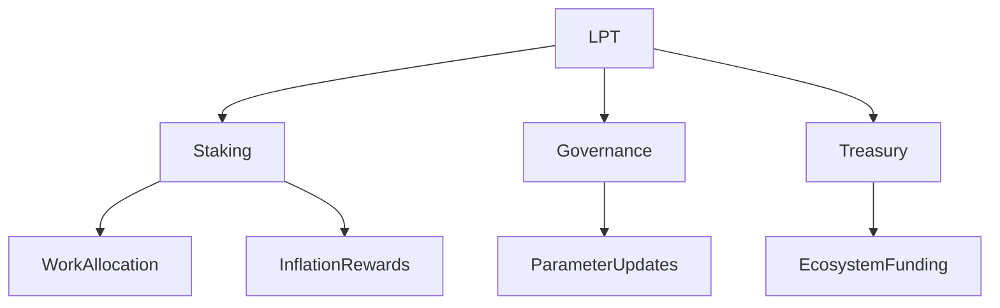

{/* codex-i18n: eyJraW5kIjoiY29kZXgtaTE4biIsInZlcnNpb24iOjEsInNvdXJjZVBhdGgiOiJ2Mi9scHQvYWJvdXQvb3ZlcnZpZXcubWR4Iiwic291cmNlUm91dGUiOiJ2Mi9scHQvYWJvdXQvb3ZlcnZpZXciLCJzb3VyY2VIYXNoIjoiNGQ2ZjU3YmU0ZTZmYjEyOGJkODc5NjdiNzRkYmRjNWYzMDM3Mjg4MThiNDk4YzNlYjE0ZjliMzRlNDkzMWY5NSIsImxhbmd1YWdlIjoiY24iLCJwcm92aWRlciI6Im9wZW5yb3V0ZXIiLCJtb2RlbCI6Im9wZW5haS9ncHQtb3NzLTIwYjpmcmVlIiwiZ2VuZXJhdGVkQXQiOiIyMDI2LTAzLTAxVDEwOjI0OjI0LjIxM1oifQ== */}
import { MathInline, MathBlock } from '/snippets/components/content/math.jsx'

## 执行摘要

The Livepeer Token (LPT) is the protocol-layer asset that secures, governs, and economically regulates the Livepeer network. It is not a payment token for video consumption, nor a representation of corporate equity. Its function is strictly structural: it converts bonded capital into measurable economic weight that secures job allocation, enables governance, and funds ecosystem development.

LPT operates exclusively at the **protocol layer (on-chain)** on Arbitrum One.

---

## 1. Formal Definition

Let the Livepeer Protocol be defined as an on-chain coordination system for allocating work and rewards across decentralized compute providers.

LPT is defined as:

> A stake-weighted coordination asset that provides economic security, governance authority, and treasury control within the Livepeer Protocol.

Its functional domains are:

1. Staking security
2. Inflation-based reward distribution
3. Delegated capital allocation
4. Governance voting
5. Treasury stewardship

---

## 2. Architectural Context

### 2.1 Protocol Layer (On-Chain)

LPT interacts with core smart contracts:

- **BondingManager** - stake accounting
- **铸币者** - 通胀发行
- **RoundsManager** - 基于纪元的奖励计时
- **Governor** - 提案和投票执行
- **Treasury** - 由治理控制的资金

所有协议权限源自绑定的 LPT 余额。

### 2.2 网络层（链下）

网络层包括：

- Orchestrator 软件
- GPU 计算执行
- 转码与推理管道
- 网关 API 与路由

LPT 不执行工作。它通过经济手段保障执行工作的参与者。

---

## 3. 质押与经济权重

设定：

- <MathInline latex={String.raw`B_i`} /> = 参与者的绑定质押<MathInline latex={String.raw`i`} />
- <MathInline latex={String.raw`B_T`} /> = 总绑定质押

经济权重：

<MathBlock latex={String.raw`W_i = \frac{B_i}{B_T}`} />

工作分配和通胀奖励与以下成正比：<MathInline latex={String.raw`W_i`} />.

这创建了一个资本支持的 Sybil 抵抗模型。

---

## 4. 通胀机制概述

每轮<MathInline latex={String.raw`t`} />:

<MathBlock latex={String.raw`R_t = S_t \times r_t`} />

其中：

- <MathInline latex={String.raw`S_t`} /> = 第 round 轮的代币供应量<MathInline latex={String.raw`t`} />
- <MathInline latex={String.raw`r_t`} /> = 协议定义的通胀率

通胀率会根据绑定率与目标绑定率的相对关系动态调整（参见[代币经济学](./tokenomics) 部分以获取完整推导）。

---

## 5. 委托模型

委托者将质押绑定给编排者，提升其经济权重，而无需运行基础设施。

总编排者质押量：

<MathBlock latex={String.raw`B_O = B_{self,O} + \sum_D b_{D,O}`} />

委托实现资本效率和竞争性的运营商市场。

---

## 6. 治理权威

投票权来自绑定质押：

<MathBlock latex={String.raw`V_i = \frac{B_i}{B_T}`} />

治理可能修改：

- 通胀参数
- 合约实现
- 国库分配

治理权力按资本加权，并在链上执行。

---

## 7. 安全模型

协议安全性与总抵押股份成正比：

<MathBlock latex={String.raw`\text{Security} \propto B_T`} />

攻击者必须获得抵押的 LPT 的阈值比例，才能影响工作分配或治理。

---

## 8. 经济权衡

| 机制 | 权衡 |
|-----------|----------|
| 通胀发行 | 启动与稀释 |
| 委托 | 可访问性与集中度 |
| 资本加权治理 | 安全性与财富影响 |

这些权衡是明确的设计决策。

---

## 9. 系统交互图

---

## 10. 运营考虑

参与者必须理解：

- 绑定与解绑延迟
- 佣金结构
- 通胀参数调整
- 治理法定人数阈值

参与会将资本暴露于协议级风险。

---

## 参考文献

- [Livepeer 协议仓库](https://github.com/livepeer/protocol)
- [合约注册表](https://docs.livepeer.org/references/contract-addresses)
- [Livepeer 改进提案 (LIPs)](https://github.com/livepeer/LIPs)
