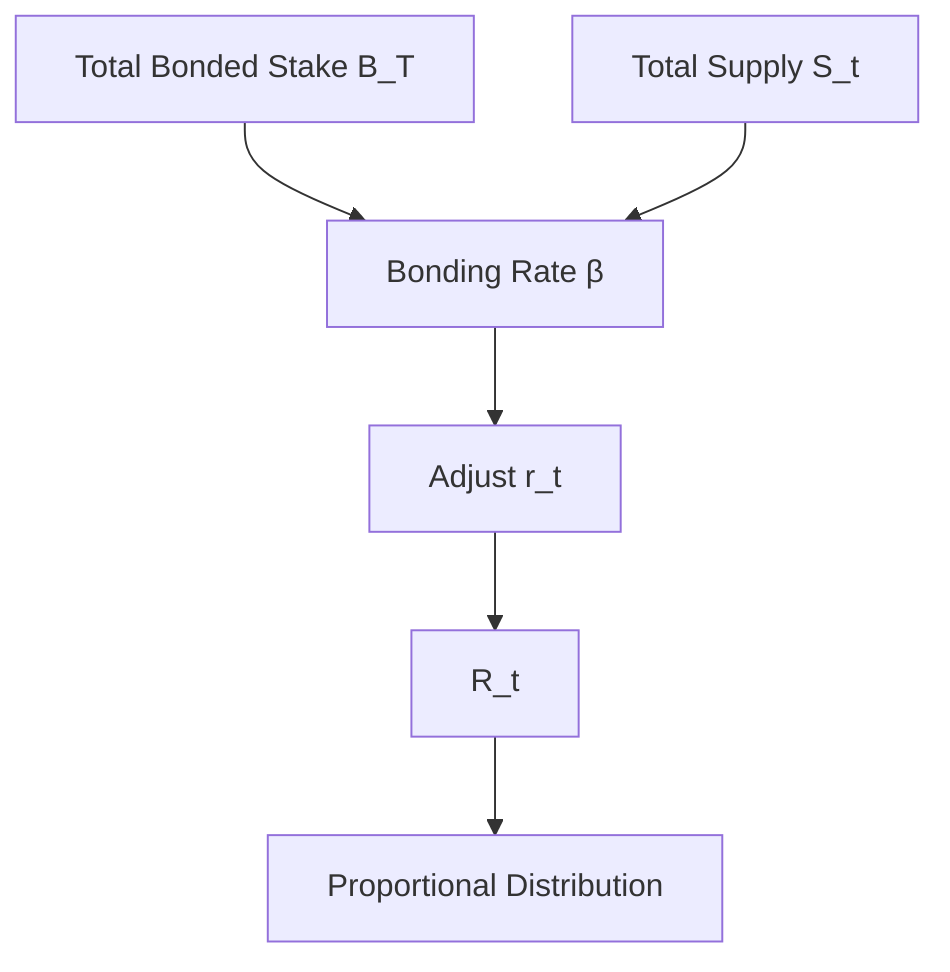

{/* codex-i18n: eyJraW5kIjoiY29kZXgtaTE4biIsInZlcnNpb24iOjEsInNvdXJjZVBhdGgiOiJ2Mi9scHQvYWJvdXQvdG9rZW5vbWljcy5tZHgiLCJzb3VyY2VSb3V0ZSI6InYyL2xwdC9hYm91dC90b2tlbm9taWNzIiwic291cmNlSGFzaCI6IjBiZDJlZmIyODVmZTUwMzIxNGQ0NGY1YjZmNmM5MmIyYTc5OTA2NDAwYjlkNWIwOGYwNDg5ZTAwZjVkNWRkNzMiLCJsYW5ndWFnZSI6ImNuIiwicHJvdmlkZXIiOiJvcGVucm91dGVyIiwibW9kZWwiOiJvcGVuYWkvZ3B0LW9zcy0yMGI6ZnJlZSIsImdlbmVyYXRlZEF0IjoiMjAyNi0wMy0wMVQxMDozMDozMy42NzBaIn0= */}
import { MathInline, MathBlock } from '/snippets/components/content/math.jsx'

## 执行摘要

LPT 代币经济学定义了 Livepeer 协议如何发行新供应、根据安全参与度调整通胀、分配奖励，并维持资本支持的安全均衡。

代币经济模型在以下层面实现：**协议层（链上）**通过质押、通胀调整逻辑和确定性奖励分配。

---

## 1. 形式变量

设定：

- <MathInline latex={String.raw`S_t`} /> = 第 LPT 轮的总供应量<MathInline latex={String.raw`t`} />
- <MathInline latex={String.raw`B_T`} /> = 总绑定的 LPT
- <MathInline latex={String.raw`B_i`} /> = 归属于参与者的绑定质押<MathInline latex={String.raw`i`} />
- <MathInline latex={String.raw`\beta`} /> = 绑定率 = <MathInline latex={String.raw`\frac{B_T}{S_t}`} />
- <MathInline latex={String.raw`\beta^*`} /> = 目标绑定率
- <MathInline latex={String.raw`r_t`} /> = 第 __I18N_PH_0__ 轮的通胀率<MathInline latex={String.raw`t`} />
- <MathInline latex={String.raw`\alpha`} /> = 通胀调整系数
- <MathInline latex={String.raw`c_O`} /> = 由协调者设定的佣金率<MathInline latex={String.raw`O`} />

---

## 2. 通胀发行模型

每轮<MathInline latex={String.raw`t`} />, 新铸造的 LPT：

<MathBlock latex={String.raw`R_t = S_t \cdot r_t`} />

供应更新：

<MathBlock latex={String.raw`S_{t+1} = S_t + R_t`} />

因此，通胀相对于当前供应量复合。

---

## 3. 绑定率反馈机制

协议根据当前绑定率与目标绑定率之间的偏差来调整通胀。

当前绑定率:

<MathBlock latex={String.raw`\beta = \frac{B_T}{S_t}`} />

调整规则:

如果 <MathInline latex={String.raw`\beta < \beta^*`} />:

<MathBlock latex={String.raw`r_{t+1} = r_t + \alpha`} />

如果 <MathInline latex={String.raw`\beta > \beta^*`} />:

<MathBlock latex={String.raw`r_{t+1} = r_t - \alpha`} />

这形成了一个控制循环:

- 绑定不足的系统 → 更高的通胀 → 更强的质押激励
- 绑定过度的系统 → 更低的通胀 → 减少稀释

系统寻求平衡点在 <MathInline latex={String.raw`\beta \approx \beta^*`} />.

---

## 4. 奖励分配

每轮总发行量 <MathInline latex={String.raw`R_t`} /> 按质押权重按比例分配。

定义经济权重:

<MathBlock latex={String.raw`W_i = \frac{B_i}{B_T}`} />

分配给编排者 <MathInline latex={String.raw`O`} />:

<MathBlock latex={String.raw`R_O = R_t \cdot \frac{B_O}{B_T}`} />

委托者 <MathInline latex={String.raw`D`} /> 绑定到协调器 <MathInline latex={String.raw`O`} />:

<MathBlock latex={String.raw`R_{D,O} = R_O (1 - c_O) \cdot \frac{b_{D,O}}{B_O}`} />

这将总发行量与佣金调整后的委托人回报分离。

---

## 5. 发行与费用收入

对已绑定参与者的回报可能包括：

1. 基于通胀的发行（供应扩张）
2. 来自视频/AI 工作负载的费用收入（需求驱动）

对参与者的总奖励 <MathInline latex={String.raw`i`} />:

<MathBlock latex={String.raw`Reward_i = Issuance_i + Fees_i`} />

通胀由协议决定；费用由市场驱动。

因此，代币经济学必须从两个方面评估：发行动态和网络需求。

---

## 6. 安全平衡

对抗性控制的安全成本随已绑定权益规模而扩大。

设 <MathInline latex={String.raw`\theta`} /> 为影响治理或分配所需的阈值比例。

所需资本：

<MathBlock latex={String.raw`Capital_{attack} \geq \theta B_T`} />

增加 <MathInline latex={String.raw`B_T`} /> 会增加控制成本。

通胀调整鼓励围绕稳定的安全参与率实现平衡。

---

## 7. 经济权衡

| 机制 | 权衡 |
|------------|-----------|
| 动态通胀 | 稳定性与响应性 |
| 委托质押 | 可访问性与中心化风险 |
| 资本加权奖励 | 安全强度与财富集中 |

---

## 8. 系统图

---

## 9. 协议与网络分离

**协议层（链上）：**
- 通胀计算
- 绑定率调整
- 质押核算
- 奖励铸造

**网络层（链下）：**
- 工作负载产生费用
- 运营性能
- 任务路由

代币经济决定发行；网络活动决定费用。

---

## 参考文献

- [Livepeer 协议仓库](https://github.com/livepeer/protocol)
- [合约注册表](https://docs.livepeer.org/references/contract-addresses)
