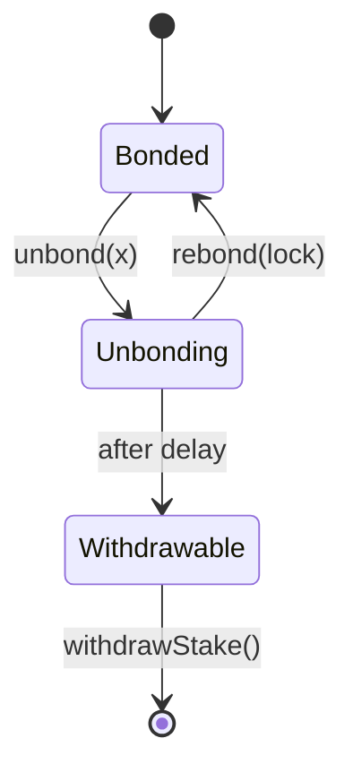
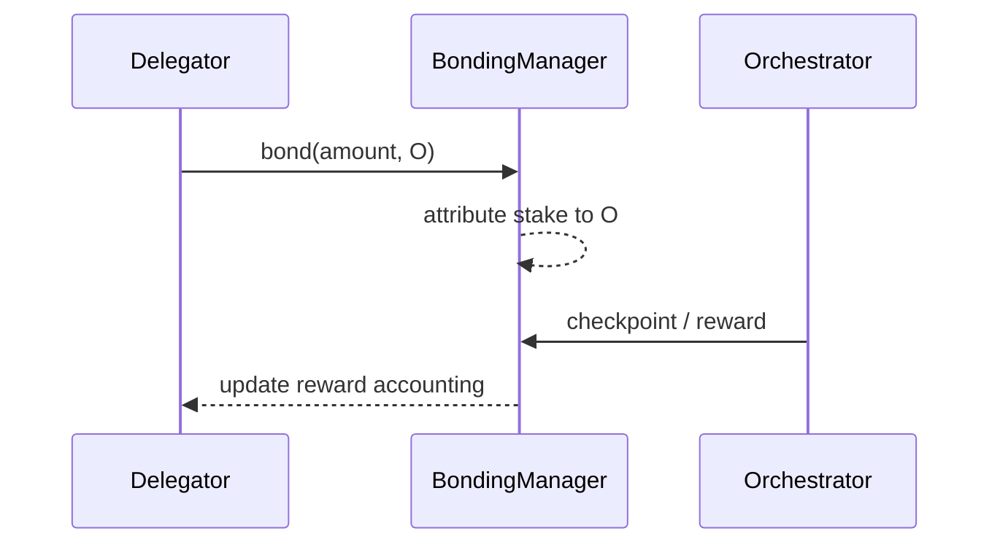

{/* codex-i18n: eyJraW5kIjoiY29kZXgtaTE4biIsInZlcnNpb24iOjEsInNvdXJjZVBhdGgiOiJ2Mi9scHQvZGVsZWdhdGlvbi9hYm91dC1kZWxlZ2F0b3JzLm1keCIsInNvdXJjZVJvdXRlIjoidjIvbHB0L2RlbGVnYXRpb24vYWJvdXQtZGVsZWdhdG9ycyIsInNvdXJjZUhhc2giOiJmNjg4MThlMjM3YjYzNGVhMDY2YWU3ODc2N2M1MjA0NGU0YWQ4ZWFlMmViZTg0YTllY2I5MDgzNjU1ZTMyZDNiIiwibGFuZ3VhZ2UiOiJjbiIsInByb3ZpZGVyIjoib3BlbnJvdXRlciIsIm1vZGVsIjoicXdlbi9xd2VuLXR1cmJvIiwiZ2VuZXJhdGVkQXQiOiIyMDI2LTAzLTAxVDExOjA3OjUzLjY1OFoifQ== */}
import { MathInline, MathBlock } from '/snippets/components/content/math.jsx'

## 执行摘要

一个**委托人** 是一个 LPT 持有人，将质押代币绑定并分配给一个协调者。委托人不运行基础设施，但他们是经济上负责任的参与者：他们的质押增加了协议安全性，影响了协调者之间的资本分配，并贡献了基于质押量的治理权力。

委托严格来说是**协议层（链上）**机制。委托人不路由或执行任务；他们参与链上经济基础，该基础约束并激励网络层操作员。

---

## 1. 正式定义

设：

- <MathInline latex={String.raw`D`} />：委托人地址
- <MathInline latex={String.raw`O`} />：协调者地址
- <MathInline latex={String.raw`b_{D,O}`} />：由<MathInline latex={String.raw`D`} /> 向 <MathInline latex={String.raw`O`} />
- <MathInline latex={String.raw`B_{self,O}`} />: 自质押的权益 <MathInline latex={String.raw`O`} />

分配给 <MathInline latex={String.raw`O`} />:

<MathBlock latex={String.raw`B_O = B_{self,O} + \sum_D b_{D,O}`} />

总质押权益:

<MathBlock latex={String.raw`B_T = \sum_O B_O`} />

委托人权益更改协议会计状态（质押归属），因此影响权益加权的奖励和治理结果。

---

## 2. 架构背景

### 2.1 协议层（链上）

委托人与协议合约进行交互，这些合约执行以下功能：

- 跟踪每个地址的质押代币
- 将质押代币分配给一个委托人（协调者）
- 强制执行解押延迟
- 分配发行（以及适用时的费用）
- 计算基于质押的治理权力

规范的合同地址和网络在 [合同注册表](https://docs.livepeer.org/references/contract-addresses)。

### 2.2 网络层（离线）

Orchestrators 运行节点软件和基础设施（GPU/计算、路由、操作流程）来执行工作。委托人与运营商的表现和行为在经济上相关，但不直接控制执行路径。

---

## 3. 经济角色

委托人服务于三个协议目标。

### 3.1 安全性参与

安全成本随着总质押代币量成比例增长：

<MathBlock latex={String.raw`\text{Security} \propto B_T`} />

委托人增加 <MathInline latex={String.raw`B_T`} />，从而提高捕获加权权益结果的经济成本。

### 3.2 资本分配

委托将权益重新分配给协调者，塑造运营商市场结构。

协调者权重：

<MathBlock latex={String.raw`W_O = \frac{B_O}{B_T}`} />

选择<MathInline latex={String.raw`O`} />增加<MathInline latex={String.raw`W_O`} />，影响发行分配和治理影响力。

### 3.3 治理参与

投票权来自质押的代币。对于参与者<MathInline latex={String.raw`i`} />:

<MathBlock latex={String.raw`V_i = \frac{B_i}{B_T}`} />

因此，委托人可以影响协议参数更改、升级和储备金决策。

---

## 4. 奖励模型（发行和费用）

每轮 <MathInline latex={String.raw`t`} />, 协议发行:

<MathBlock latex={String.raw`R_t = S_t \cdot r_t`} />

协调者总发行分配:

<MathBlock latex={String.raw`R_O = R_t \cdot \frac{B_O}{B_T}`} />

委托人净发行分配（含佣金 <MathInline latex={String.raw`c_O`} />:

<MathBlock latex={String.raw`R_{D,O} = R_O \cdot (1 - c_O) \cdot \frac{b_{D,O}}{B_O}`} />

委托人总回报分解为:

<MathBlock latex={String.raw`\text{Reward}_{D,O} = \text{Issuance}_{D,O} + \text{Fees}_{D,O}`} />

发行由协议决定；费用由市场驱动（网络需求）。

---

## 5. 权利、限制和责任

### 5.1 权利

委托人可以：

- 绑定并委托质押给一个协调者
- 解除质押（受协议延迟限制）
- 在解绑窗口期间重新委托
- 在解绑期后提取质押
- 根据协议机制领取/重新委托奖励

### 5.2 限制

委托人不能:

- 超越协议定义的延迟加速解绑
- 保证作业流程或费用收入
- 覆盖协调器的操作决策

委托是资本暴露而没有操作控制。

### 5.3 责任（实际）

委托人应监控：

- 佣金率 <MathInline latex={String.raw`c_O`} />
- 奖励检查点一致性
- 质押集中度和去中心化
- 影响通货膨胀/安全参数的治理提案

委托最好被建模为长期资本配置。

---

## 6. 协调器选择的评估框架

委托者选择是多目标的。

定义一个委托者实用函数：

<MathBlock latex={String.raw`U(O) = f(\text{NetYield}_O, \text{Reliability}_O, \text{Concentration}_O, \text{GovernanceAlignment}_O)`} />

其中：

- <MathInline latex={String.raw`\text{NetYield}_O`} /> 会因佣金而减少<MathInline latex={String.raw`c_O`} />
- <MathInline latex={String.raw`\text{Reliability}_O`} /> 捕捉检查点一致性和操作稳定性
- <MathInline latex={String.raw`\text{Concentration}_O`} /> 惩罚已经占主导地位的质押份额
- <MathInline latex={String.raw`\text{GovernanceAlignment}_O`} /> 反映长期治理偏好

---

## 7. 风险和故障模式

委托人面临分层的风险状况。

1. **佣金风险:** 更高 <MathInline latex={String.raw`c_O`} /> 会降低净收益。
2. **检查点/实现风险:**如果未执行检查点，实际发行量可能会与理论分配量不同。
3. **流动性风险:**解绑延迟限制了退出。
4. **集中度风险:**随着质押集中度的增加，系统性风险也会增加。
5. **削减风险（如果已启用）:**质押可能在定义的协议条件下减少。

---

## 8. 图表

### 8.1 状态模型

### 8.2 奖励流程

---

## 9. 协议与网络分离

**协议（链上）:**质押余额会计和归属，发行和质押加权分配，解押延迟，治理投票权。

**网络（链下）：**任务执行和路由，费用生成，运营表现和正常运行时间。

委托人参与协议经济；协调者参与网络操作。

---

## 参考文献

- [Livepeer 协议仓库](https://github.com/livepeer/protocol)
- [合约注册表](https://docs.livepeer.org/references/contract-addresses)
