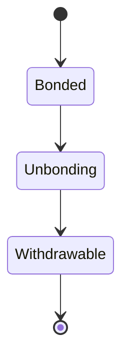
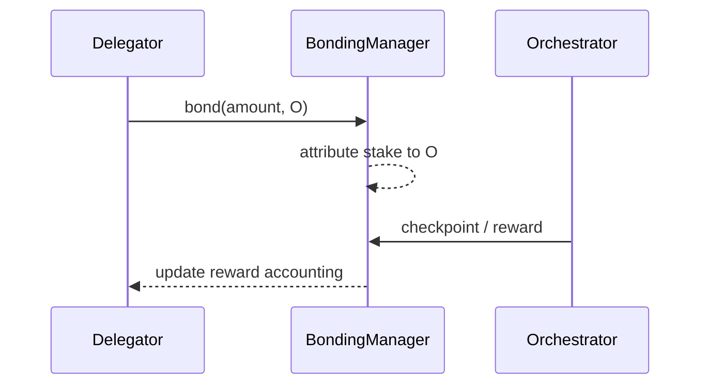

{/* codex-i18n: eyJraW5kIjoiY29kZXgtaTE4biIsInZlcnNpb24iOjEsInNvdXJjZVBhdGgiOiJ2Mi9scHQvZGVsZWdhdGlvbi9vdmVydmlldy5tZHgiLCJzb3VyY2VSb3V0ZSI6InYyL2xwdC9kZWxlZ2F0aW9uL292ZXJ2aWV3Iiwic291cmNlSGFzaCI6IjQ3NTcwM2Y0NDQyNzA1MmY4ZTJjMTFmODlhODk4MDYwZDc3MjcyMzE4ODE3MzA5N2NiYTZhNzI4Y2Y1MGJlMWMiLCJsYW5ndWFnZSI6ImNuIiwicHJvdmlkZXIiOiJvcGVucm91dGVyIiwibW9kZWwiOiJxd2VuL3F3ZW4tdHVyYm8iLCJnZW5lcmF0ZWRBdCI6IjIwMjYtMDMtMDFUMTE6MDY6MjQuMzMzWiJ9 */}
import { MathInline, MathBlock } from '/snippets/components/content/math.jsx'

## 执行摘要

委托是协议机制，通过该机制，LPT 持有者将质押代币绑定并分配给编排者，从而在不运行基础设施的情况下增加该编排者的经济权重。

委托严格是一项 **协议层（链上）** 操作。它不会执行任务、路由片段或控制 GPU 调度。相反，它会修改基于质押权重的结果：奖励分配、治理权重以及（如适用）工作分配。

---

## 1. 正式定义

让：

- <MathInline latex={String.raw`D`} />是一个委托人
- <MathInline latex={String.raw`O`} />是一个协调者
- <MathInline latex={String.raw`b_{D,O}`} />是LPT由<MathInline latex={String.raw`D`} />绑定到<MathInline latex={String.raw`O`} />
- <MathInline latex={String.raw`B_{self,O}`} />是协调者自绑定的质押

分配给协调器的总质押<MathInline latex={String.raw`O`} />:

<MathBlock latex={String.raw`B_O = B_{self,O} + \sum_D b_{D,O}`} />

总质押:

<MathBlock latex={String.raw`B_T = \sum_O B_O`} />

委托是协议合约状态中记录的质押的分配规则。

---

## 2. 架构背景

### 2.1 协议层职责

委托由协议智能合约实现，其功能包括：

- 跟踪每个地址的质押代币
- 将委托人质押代币分配给委托人（协调者）
- 按比例分配通胀和费用权益
- 强制解押延迟

标准合约地址：[合约注册表](https://docs.livepeer.org/references/contract-addresses)

### 2.2 网络层职责

网络层：

- 运行协调器软件
- 执行转码/AI工作负载
- 在市场需求下产生费用
- 保持正常运行时间和性能特性

委托会影响哪些运营商具有更大的经济权重，但网络执行仍发生在链下。

---

## 3. 经济权重和安全性

委托增加<MathInline latex={String.raw`B_O`} />，增加协调器的质押加权份额。

定义协调器权重:

<MathBlock latex={String.raw`W_O = \frac{B_O}{B_T}`} />

安全影响:

- 增加 <MathInline latex={String.raw`B_T`} /> 会增加捕获权益加权结果所需的资本成本。

因此:

<MathBlock latex={String.raw`\text{Security} \propto B_T`} />

---

## 4. 奖励分配（发行）

每轮 <MathInline latex={String.raw`t`} />，协议发行是铸造的：

<MathBlock latex={String.raw`R_t = S_t \cdot r_t`} />

协调者总发行分配：

<MathBlock latex={String.raw`R_O = R_t \cdot \frac{B_O}{B_T}`} />

委托人净发行分配（含佣金<MathInline latex={String.raw`c_O`} />）

<MathBlock latex={String.raw`R_{D,O} = R_O (1 - c_O) \cdot \frac{b_{D,O}}{B_O}`} />

此公式分离了：

- 协议发行（供应扩张）
- 协调器佣金
- 按比例分配给委托人的份额

---

## 5. 费用收入（需求）

费用由需求驱动，可能根据协议会计规则分配给利益相关者。

总委托人回报分解为：

<MathBlock latex={String.raw`Reward_{D,O} = Issuance_{D,O} + Fees_{D,O}`} />

发行由协议决定；费用取决于网络使用情况。

---

## 6. 委托作为资本分配

委托创建了一个运营商市场。委托人根据以下因素分配质押:

- 佣金水平
- 检查点可靠性
- 性能声誉
- 去中心化偏好

由于质押可以迁移（受解押约束的限制），委托功能作为持续的资本分配，而不是一次性的决定。

---

## 7. 流动性约束和解押

委托不能立即撤销。

解押引入了以协议轮次为单位的延迟。此延迟：

- 减少快速质押轮换攻击
- 稳定安全参与
- 为委托者引入流动性约束

状态模型:

---

## 8. 风险和故障模式

委托者面临协议和操作员层面的风险:

1. **佣金风险:** <MathInline latex={String.raw`c_O`} /> 会减少净收益
2. **检查点风险:** 未进行检查点操作会减少实际发行量
3. **削减暴露风险:** 在启用的情况下，可能在特定条件下减少质押金额
4. **集中风险:** 大量<MathInline latex={String.raw`B_O`} /> 增加系统性风险
5. ** 流动性风险:** 解押延迟限制退出

这些是资本加权协议固有的经济风险。

---

## 9. 时序图

---

## 10. 协议与网络分离

**协议（链上）：**
- 质押归属
- 发行公式和铸造
- 奖励权益核算
- 治理权重归属

**网络（链下）：**
- 转码/AI作业的执行
- 运行时间和性能
- 费用生成

委托是一种协议操作，从经济上约束网络行为。

---

## 参考文献

- [Livepeer 协议仓库](https://github.com/livepeer/protocol)
- [合约注册表](https://docs.livepeer.org/references/contract-addresses)
