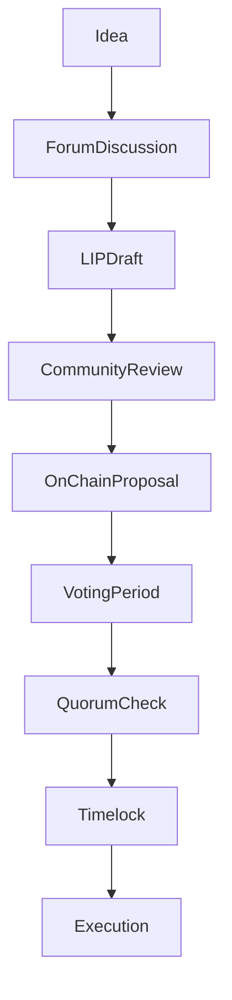

{/* codex-i18n: eyJraW5kIjoiY29kZXgtaTE4biIsInZlcnNpb24iOjEsInNvdXJjZVBhdGgiOiJ2Mi9scHQvZ292ZXJuYW5jZS9wcm9jZXNzZXMubWR4Iiwic291cmNlUm91dGUiOiJ2Mi9scHQvZ292ZXJuYW5jZS9wcm9jZXNzZXMiLCJzb3VyY2VIYXNoIjoiZGIxZDNkMGQ4ZjQxMDI5OWI3ZWY2MzQ2OWZmYjcyOTdkYzUyMDE0ZTgwYmEyYmY3NzY1NzUzNjY5ODM3NDcwMiIsImxhbmd1YWdlIjoiY24iLCJwcm92aWRlciI6Im9wZW5yb3V0ZXIiLCJtb2RlbCI6InF3ZW4vcXdlbi10dXJibyIsImdlbmVyYXRlZEF0IjoiMjAyNi0wMy0wMVQxMToxNzo1MS41NTRaIn0= */}
import { MathInline, MathBlock } from '/snippets/components/content/math.jsx'

## 执行摘要

Livepeer 治理包括链下协调流程和链上执行逻辑。虽然投票和参数执行由智能合约处理，但提案的形成、审查和社会共识的建立发生在链下。

本页面正式定义了从想法形成到链上执行的完整治理生命周期。

---

## 1. 治理生命周期概述

治理在两个协调的领域中展开：

1. **链下流程层**（讨论，起草，信号）
2. **链上执行层**（提案提交，投票，执行）

这些层是互补但不同的。

---

## 2. 链下流程层

### 2.1 概念形成

治理通常从以下开始：

- 协议参数效率低下的识别
- 安全模型调整
- 经济不对齐
- 储备金分配需求
- 合约升级需求

想法通常在正式化之前在公共论坛中进行讨论。

### 2.2 Livepeer 改进提案 (LIPs)

一个 Livepeer 改进提案 (LIP) 正式化协议更改。一个 LIP 通常包括：

- 动机
- 技术规范
- 经济影响分析
- 安全注意事项
- 向后兼容性分析

LIPs 是治理变更的官方文档。

### 2.3 社交信号和反馈

在链上提交之前，提案通常会经历：

- 社区讨论
- 技术审查
- 风险评估
- 利益相关者信号

这降低了恶意或构造不良的提案到达执行阶段的可能性。

---

## 3. 链上投票规则

治理合约强制执行明确的投票阈值，以防止低参与度攻击：

### 3.1 门槛

至少**33%** 的所有质押 LPT 必须参与投票，否则投票无效。此要求确保一小部分人不能在没有广泛社区参与的情况下推动激进的更改。

### 3.2 批准门槛

超过**50%**的参与投票必须支持该提案。简单多数批准在包容性和决断力之间取得平衡：社区平均分裂的提案无法通过。

### 3.3 投票权

投票权与绑定的 LPT 成比例：

<MathBlock latex={String.raw`V_i = \frac{B_i}{B_T}`} />

委托者通过委托给与其价值观一致的协调者来间接行使治理权；协调者必须公开声明其立场，并据此投票。

---

## 4. 链上执行层

### 4.1 提案提交

正式的治理提案编码了可执行的合约操作。提案有效载荷可能包括：

- 参数更新
- 合约实现升级
- 国库转账

提交将触发确定性的治理状态机。

### 4.2 投票窗口

投票通过链上智能合约进行。当一个 LIP 准备就绪时，其哈希和参数会被排队，代币持有者可以使用基于签名的消息进行投票。

### 4.3 门槛和阈值检查

提案必须满足：

<MathBlock latex={String.raw`V_{cast} \ge Q \cdot B_T`} />

并且多数条件：

<MathBlock latex={String.raw`V_{for} > V_{against}`} />

这些条件由治理合约强制执行。

### 4.4 时间锁队列

已批准的提案在执行前会进入时间锁阶段。

时间锁属性：

- 批准与执行之间的延迟
- 防止参数突然变化的风险缓解
- 允许参与者评估后果

### 4.5 执行

如果条件满足且时间锁到期：

- 编码的操作会原子性执行
- 合约状态发生变化
- 如果包含，则会发生金库转账

执行在交易级别上是不可逆的。

---

## 5. 财务协调

财务分配遵循相同的治理生命周期：

1. 链下提案讨论
2. 链上编码的财务操作
3. 投票和法定人数
4. 时间锁
5. 执行

资金库治理使用相同的质押加权执行逻辑。

---

## 6. Livepeer 基金会和资金库管理

Livepeer 基金会于2025年作为中立非营利组织成立，负责维护协议的长期健康。它协调核心开发、研究和生态系统增长，但其权力来源于通过治理的代币持有者。

主要职责包括：

| 责任 | 描述 |
|----------------|-------------|
| **协议维护** | 维护和升级智能合约、参考实现和 SDK |
| **研究和标准** | 资助关于可验证转码、零知识证明和新编解码器的研究 |
| **资助计划** | 管理社区金库以资助开发者、工具和文档 |
| **生态系统倡导** | 在监管讨论中代表 Livepeer 并与区块链社区互动 |

尽管基金会起到协调作用，但它不是中央权威。资金拨款、主要协议变更和长期路线图需要通过LIPs获得批准。

---

## 7. 风险缓解和流程保障

### 7.1 多阶段审查

分离：

- 社交审查（链下）
- 确定性执行（链上）

减少意外或恶意的参数更改。

### 7.2 透明度

所有投票和执行交易都可以在链上公开验证。治理可以通过区块浏览器进行审计。

### 7.3 参数校准

法定人数<MathInline latex={String.raw`Q`} /> 和时间锁持续时间<MathInline latex={String.raw`T_{delay}`} /> 是治理级别的安全参数。

如果<MathInline latex={String.raw`Q`} /> 过低：
- 小联盟可能通过提案

如果<MathInline latex={String.raw`Q`} />太高：
- 治理可能陷入停滞

---

## 8. 考虑因素和潜在改进

选择33%的法定人数和50%的批准反映了敏捷性和抗捕获能力之间的权衡。一些去中心化网络已经探索过：

- **动态投票门槛** - 根据历史投票率调整投票门槛
- **信念投票** - 投票权随时间累积
- **二次投票** - 放大少数群体的声音

Livepeer 的治理尚未采用这些机制，但社区讨论仍在继续。

---

## 9. 治理流程图

---

## 10. 协议与网络分离

**协议（链上）：**
- 提案提交
- 投票
- 法定人数强制执行
- 时间锁队列
- 合同更改执行

**网络（链下）:**
- 讨论论坛
- LIP 草案
- 社交信号
- 基础设施执行

治理修改协议规则；网络参与者在更新后的参数内操作。

---

## 参考文献

- [Livepeer 协议仓库](https://github.com/livepeer/protocol)
- [合约注册表](https://docs.livepeer.org/references/contract-addresses)
- [Livepeer 改进提案 (LIPs)](https://github.com/livepeer/LIPs)
- [Livepeer 论坛](https://forum.livepeer.org)
