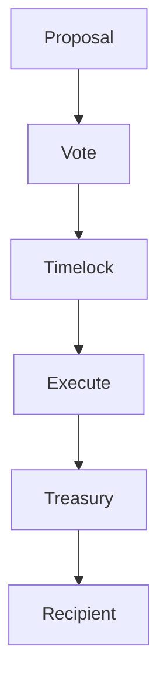

{/* codex-i18n: eyJraW5kIjoiY29kZXgtaTE4biIsInZlcnNpb24iOjEsInNvdXJjZVBhdGgiOiJ2Mi9scHQvdHJlYXN1cnkvb3ZlcnZpZXcubWR4Iiwic291cmNlUm91dGUiOiJ2Mi9scHQvdHJlYXN1cnkvb3ZlcnZpZXciLCJzb3VyY2VIYXNoIjoiOGQ2ZDZiMmFlNmFjN2EzYWVlMjNmMmM2ZWUyNmFlMzY2ZmM0NzFjYjVhMjhmOGQxOTU4NWQ5ZDhlZDQwYzg5MCIsImxhbmd1YWdlIjoiY24iLCJwcm92aWRlciI6Im9wZW5yb3V0ZXIiLCJtb2RlbCI6InF3ZW4vcXdlbi10dXJibyIsImdlbmVyYXRlZEF0IjoiMjAyNi0wMy0wMVQxMToyMzowNi43MjJaIn0= */}
import { MathInline, MathBlock } from '/snippets/components/content/math.jsx'

## 执行摘要

Livepeer 金库是协议管理的资产池，由治理控制，用于资助生态系统开发、安全研究、基础设施支持和其他战略对齐的分配。

金库控制在 **协议层（链上）** 通过治理执行来实现。金库在执行意义上不由链下委员会控制；相反，治理提案确定性地授权转移和操作。

---

## 1. 正式定义

让:

- <MathInline latex={String.raw`T`} /> = 金库余额（以相关资产单位计算）
- <MathInline latex={String.raw`A_k`} /> = 由提案执行的分配金额<MathInline latex={String.raw`k`} />

分配后的金库余额更新<MathInline latex={String.raw`k`} />:

<MathBlock latex={String.raw`T' = T - A_k`} />

更一般地，经过一组分配之后<MathInline latex={String.raw`\{A_1, A_2, \dots, A_n\}`} />:

<MathBlock latex={String.raw`T_n = T_0 - \sum_{k=1}^{n} A_k`} />

其中每个<MathInline latex={String.raw`A_k`} /> 通过治理授权。

---

## 2. 架构上下文

### 2.1 协议层

在协议层：

- 治理合约授权分配
- 执行合约（例如，时间锁/资金库执行逻辑）执行转账
- 链上状态是唯一真实来源

规范合约注册表：[合约地址](https://docs.livepeer.org/references/contract-addresses)

### 2.2 网络层

在网络层，由储备金资助的举措可能会影响：

- 协调器采用
- 开发者工具
- 生态系统应用

但储备金执行仍保持链上。

---

## 3. 储备金目的与经济合理性

一个协议储备金存在以：

1. 资助与协议增长一致的公共产品
2. 减少在共享基础设施上的投资不足
3. 支持长期的研究和开发
4. 为战略生态系统干预提供机制

从经济角度来看，储备金是资助市场无法充分提供的非排他性利益的协调工具。

---

## 4. 财务库治理模型

财务库决策通过治理生命周期执行。

让:

- <MathInline latex={String.raw`B_T`} /> = 总质押余额
- <MathInline latex={String.raw`B_i`} /> = 分配给投票者 的质押余额<MathInline latex={String.raw`i`} />

投票权:

<MathBlock latex={String.raw`V_i = \frac{B_i}{B_T}`} />

因此，金库继承了治理安全属性。

---

## 5. 安全模型

金库安全取决于：

1. 总质押代币量<MathInline latex={String.raw`B_T`} />
2. 质押分布（集中度）
3. 投票门槛和时间锁配置

控制结果所需的资本：

<MathBlock latex={String.raw`Capital_{control} \ge \theta B_T`} />

因此，储备金的安全性取决于控制它的治理系统。

---

## 6. 风险和故障模式

主要风险包括：

- **治理捕获** - - 抵押品集中
- **低参与度** - 门槛风险
- **错误指定的 calldata** - 执行失败
- **激励不对齐** - 分配低效

储备金并不是自动是"好的"；其结果取决于治理流程的质量。

---

## 7. 系统图

---

## 8. 协议与网络分离

**协议（链上）：**
- 储备金保管和执行
- 治理授权
- 确定性的链上转账

**网络（链下）:**
- 分配接收者执行工作（开发、基础设施）
- 生态系统增长影响
- 运营交付

储备金由协议逻辑强制执行；结果通过链下交付实现。

---

## 参考文献

- [Livepeer 协议仓库](https://github.com/livepeer/protocol)
- [合约注册表](https://docs.livepeer.org/references/contract-addresses)
