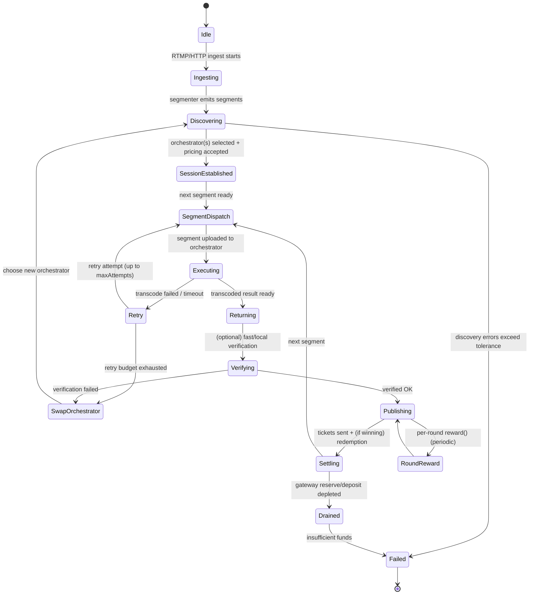

{/* codex-i18n: eyJraW5kIjoiY29kZXgtaTE4biIsInZlcnNpb24iOjEsInNvdXJjZVBhdGgiOiJ2Mi9hYm91dC9saXZlcGVlci1uZXR3b3JrL2pvYi1saWZlY3ljbGUubWR4Iiwic291cmNlUm91dGUiOiJ2Mi9hYm91dC9saXZlcGVlci1uZXR3b3JrL2pvYi1saWZlY3ljbGUiLCJzb3VyY2VIYXNoIjoiNzg5MmU2MmE4YWNlYTBjNDE5ODFlNjM5N2IxZTIyZDU1YWEyMGY3YmZjY2YyMGQxNGJiMGVkNWQ3ZWFhMTM3NyIsImxhbmd1YWdlIjoiZXMiLCJwcm92aWRlciI6Im9wZW5yb3V0ZXIiLCJtb2RlbCI6Im9wZW5haS9ncHQtb3NzLTEyMGI6ZnJlZSIsImdlbmVyYXRlZEF0IjoiMjAyNi0wMi0yNlQwNjozNDoyNC4xMzhaIn0= */}
import { DynamicTable } from "/snippets/components/layout/table.jsx"

{/* 
This page describes:
6. **Job Lifecycle**

   * Job submission
   * Assignment
   * Execution
   * Verification
   * Payment (ETH fees)
 */}

{/* ## Job Lifecycle
This view describes the end-to-end “compute job” as a state machine. Because Livepeer’s compute is segment-oriented, the lifecycle is modelled at the level of a stream session and per-segment processing, with payment settlement occurring continuously via tickets and periodically via reward calls. */}

### Narrativa del ciclo de vida
Un ciclo de vida de trabajo minimalista y basado en la fuente es:
<Steps>
<Step title="Ingest and segmentation">
Ingest and segmentation: A Gateway receives an RTMP stream (docs provide explicit RTMP ingest examples) and produces segments to be processed. 
</Step>
<Step title="Discovery and selection">
Discovery and selection: The Gateway selects an Orchestrator set according to the node software’s discovery logic; operational failures here appear as discovery errors and orchestrator swaps. 
</Step>
<Step title="Price and session parameters">
Price and session parameters: Orchestrators advertise a price per pixel (Wei denominated) to gateways off-chain; orchestrators may auto-adjust price to compensate for ticket redemption overhead when gas is high. 
</Step>
<Step title="Segment dispatch and compute">
Segment dispatch and compute: The Gateway uploads segments; the Orchestrator executes transcoding/AI compute locally or delegates to attached transcoder processes. 
</Step>
<Step title="Result return and verification">
Result return and verification: Results are returned to the Gateway; verification may be performed (fast verification metrics exist and are explicitly named). Failures can trigger orchestrator swaps and retries. 
</Step>
<Step title="Continuous settlement">
Continuous settlement: The Gateway sends probabilistic payment tickets; the Orchestrator redeems winning tickets and the system tracks redemption errors and redeemed value. 
</Step>
<Step title="Periodic reward accounting">
Periodic reward accounting: Each round, orchestrators may call reward() as an Arbitrum transaction distributing minted rewards to itself and its delegators.
</Step>
</Steps>

### Diagrama de máquina de estados

### Eventos y transiciones
La tabla a continuación asigna disparadores concretos a transiciones usando perillas/métricas de configuración explícitas cuando sea posible:

<DynamicTable
  headerList={["Event / Trigger", "Observable Evidence", "Transition", "Notes"]}
  itemsList={[
    { "Event / Trigger": "Stream starts", "Observable Evidence": "livepeer_stream_started_total increments", "Transition": "Idle → Ingesting", "Notes": "Metrics are defined in node docs." },
    { "Event / Trigger": "Discovery fails", "Observable Evidence": "livepeer_discovery_errors_total increments", "Transition": "Discovering → Failed", "Notes": "Exact selection algorithm is not fully specified in docs; treat as implementation detail." },
    { "Event / Trigger": "Segment transcode fails", "Observable Evidence": "livepeer_segment_transcode_failed_total / livepeer_transcode_retried", "Transition": "Executing → Retry", "Notes": "Retry budget controlled by maxAttempts (default 3)." },
    { "Event / Trigger": "Orchestrator swap mid-stream", "Observable Evidence": "livepeer_orchestrator_swaps", "Transition": "Retry/Verifying → SwapOrchestrator", "Notes": "Swap behaviour is observable though exact policy is not fully specified." },
    { "Event / Trigger": "Payment sent", "Observable Evidence": "livepeer_tickets_sent, livepeer_ticket_value_sent", "Transition": "Publishing → Settling", "Notes": "Deposit/reserve are explicitly surfaced per gateway." },
    { "Event / Trigger": "Reserve/deposit depleted", "Observable Evidence": "livepeer_gateway_reserve / livepeer_gateway_deposit low/zero", "Transition": "Settling → Drained", "Notes": "Some community guides discuss splitting ETH into deposit + reserve for testing; treat exact sizing as operator-specific." },
    { "Event / Trigger": "Ticket redemption error", "Observable Evidence": "livepeer_ticket_redemption_errors", "Transition": "Settling → (degraded)", "Notes": "Redemption reliability impacts realised revenue for Orchestrator." },
    { "Event / Trigger": "On-chain tx confirmation timeout", "Observable Evidence": "txTimeout (default 5 mins)", "Transition": "Settling/RoundReward → (retry/replace tx)", "Notes": "Transaction replacement knobs are defined in CLI options." },
    { "Event / Trigger": "Per-round reward minted/distributed", "Observable Evidence": "orchestrator reward service enabled", "Transition": "Publishing ↔ RoundReward", "Notes": "Docs describe default auto reward calls per round on Arbitrum." }
  ]}
  monospaceColumns={[1]}
/>

### Ciclo de vida del trabajo (video vs IA)

Livepeer admite dos tipos principales de trabajo: transcodificación (conversión de formato de video) e inferencia de IA (p. ej., transferencia de estilo, generación). Cada uno sigue un flujo multi‑parte similar pero con detalles de pipeline diferentes. Flujo de trabajo de transcodificación: Cuando una Gateway (difusor) tiene una transmisión en vivo (o video) para procesar, ella:
Registrar fondos: Pre‑financia un contrato TicketBroker on‑chain con ETH igual a las tarifas esperadas del trabajo.
Seleccionar Orchestrator: Off‑chain, la Gateway consulta la red (usando el Explorer o señalización libp2p) para encontrar un Orchestrator activo cuyo precio y ubicación cumplan sus necesidades.
Enviar segmentos: Para cada segmento de video (usualmente unos pocos segundos), la Gateway envía el segmento crudo al Orchestrator elegido junto con un ticket de pago probabilístico. Este “ticket” es una promesa de pago firmada para un sorteo aleatorio (ver más abajo).
Transcodificar: El Orchestrator pasa el segmento a su Transcoder conectado (el hardware GPU) que genera las versiones solicitadas (p. ej., diferentes tasas de bits, formatos).
Devolver resultados: El Transcoder devuelve el(los) segmento(s) codificado(s) al Orchestrator, que los envía de vuelta a la Gateway (o a una transmisión de salida).
Canjear pagos: Periódicamente (o al final del trabajo), el Orchestrator envía cualquier ticket ganador al TicketBroker on‑chain, canjeándolos por ETH. Un ticket ganador es aquel que cumple criptográficamente con un umbral aleatorio; la mayoría de los tickets “pierden”, pero estadísticamente con el tiempo el Orchestrator recibe la tarifa completa ganada.
El flujo esencial es:
flowchart LR
Gateway([Gateway (Broadcaster)]) -->|“video + ticket”| Orchestrator([Orchestrator Node])
Orchestrator -->|“assign chunk”| Transcoder([Transcoder GPU])
Transcoder -->|“renditions”| Orchestrator
Orchestrator -->|“encoded output”| Gateway
Gateway -->|“next segment / finalize”| Orchestrator
Ejemplo: Una Gateway tiene un video en vivo de 30 segundos. Deposita ETH en TicketBroker, luego transmite segmentos al Orchestrator A con tickets. El Transcoder del Orchestrator A produce múltiples tasas de bits. Más tarde, el Orchestrator A envía cualquier ticket ganador al contrato TicketBroker en Arbitrum para reclamar el pago. Las tarifas (en ETH) se dividen automáticamente según la configuración de reparto de tarifas del Orchestrator, acreditando los saldos de los Delegadores.
.
Pagos probabilísticos: En lugar de pagar por segmento, las Gateways usan un esquema de tickets de lotería. Cada ticket tiene una probabilidad de “ganar” un premio fijo de ETH. Con muchos segmentos, el pago esperado equivale al costo real del trabajo.
. Esto protege a los Orchestrators de transacciones on‑chain diminutas y de la variabilidad del gas. (Los difusores pre‑financian suficiente ETH para que los pagos esperados cubran todos los tickets.) Flujo de trabajo de inferencia de IA: Los trabajos de IA (p. ej., transferencia de estilo en tiempo real, generación de video) usan el mismo modelo de stake/tarifa pero pueden involucrar pipelines de varios modelos (p. ej., Codificador de texto Etapa‑1 → Decodificador de imagen Etapa‑2). El framework Cascade de Livepeer coordina flujos de trabajo de IA de varios pasos: una Gateway envía datos iniciales y un prompt, y los orchestrators aplican secuencialmente los modelos hasta producir un video final.
. Por ejemplo, Daydream (una aplicación de IA) captura video de webcam, lo envía a través de un pipeline StableDiffusion en la red y devuelve el video estilizado.
Ejemplo (IA): Un usuario alimenta una transmisión de webcam a Daydream (potenciado por IA de Livepeer). La Gateway envía fotogramas más un prompt de “estilo” al Orchestrator B. B ejecuta una secuencia de GPUs (p. ej., mejorar → estilizar) y devuelve un video editado por IA en tiempo real. Las GPUs y la red de Livepeer están optimizadas para este pipeline de baja latencia.
.
El patrón común: Gateway 🡒 Orchestrator(s) 🡒 Transcoder/Modelo IA 🡒 Gateway. Los contratos inteligentes (TicketBroker para tarifas, JobsManager, etc.) median los trabajos off‑chain y la contabilidad on‑chain.
