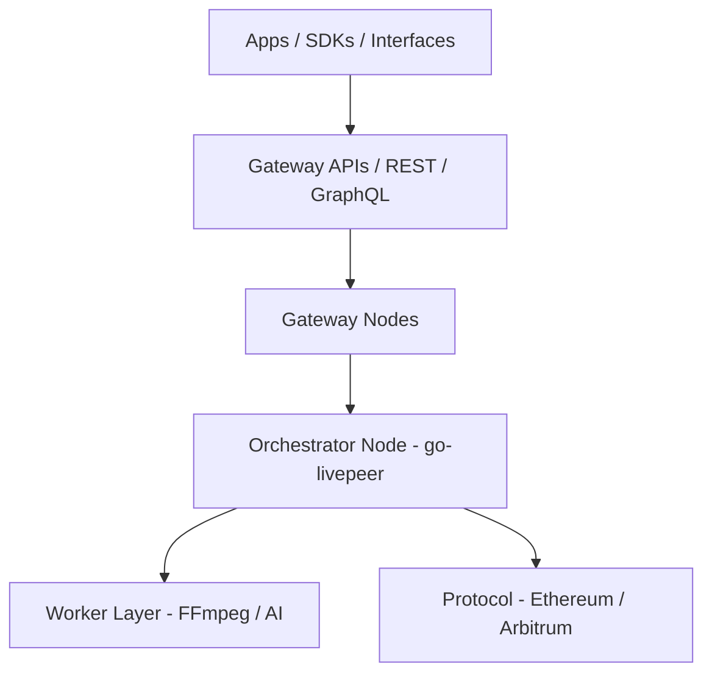

{/* codex-i18n: eyJraW5kIjoiY29kZXgtaTE4biIsInZlcnNpb24iOjEsInNvdXJjZVBhdGgiOiJ2Mi9hYm91dC9saXZlcGVlci1uZXR3b3JrL3RlY2huaWNhbC1hcmNoaXRlY3R1cmUubWR4Iiwic291cmNlUm91dGUiOiJ2Mi9hYm91dC9saXZlcGVlci1uZXR3b3JrL3RlY2huaWNhbC1hcmNoaXRlY3R1cmUiLCJzb3VyY2VIYXNoIjoiOWFmZTc2YTc4YzNiM2Q4MGExOTY5MzE0N2FlNzEwNmZiYTYxYjM1MTA5NjVhZWFhOWEyNzBiMjhjOWFlYjc1MCIsImxhbmd1YWdlIjoiZXMiLCJwcm92aWRlciI6Im9wZW5yb3V0ZXIiLCJtb2RlbCI6Im9wZW5haS9ncHQtb3NzLTEyMGI6ZnJlZSIsImdlbmVyYXRlZEF0IjoiMjAyNi0wMi0yNlQwNjozODo1My43MDhaIn0= */}
import { DynamicTable } from '/snippets/components/layout/table.jsx'
import { GotoCard, GotoLink } from '/snippets/components/primitives/links.jsx'

Esta página describe la pila completa de herramientas, infraestructura y componentes que impulsan la red Livepeer a nivel de nodo, Gateway y cliente. La arquitectura de Livepeer es modular y está orientada al desarrollador: puedes ejecutar un Orchestrator, crear un Gateway de IA personalizado, o usar APIs para construir aplicaciones de medios sobre cómputo descentralizado.

## Capas de arquitectura

La red se sitúa por encima del protocolo: los Gateways y Orchestrators manejan el cómputo y enrutamiento fuera de cadena; el protocolo (Arbitrum) gestiona staking, tickets y recompensas.

## Nodo Orchestrator

El nodo Orchestrator ejecuta **go-livepeer** (el `livepeer` binario), disponible en:

[https://github.com/livepeer/go-livepeer](https://github.com/livepeer/go-livepeer)

### Componentes clave

- **Selección de transcodificador** - Trabajadores internos o externos; configurados a través de `orchSecret` y `orchAddr` para transcodificadores remotos
- **Validación de tickets** - L2 `TicketBroker` en Arbitrum para la redención de pagos ETH
- **Reclamo de recompensas** - Envío Merkle a `BondingManager` cada ronda
- **Staking de LPT** - BondingManager para auto‑bond y stake de delegador
- **Publicidad de región** - Para el enrutamiento del Gateway (latencia, capacidad)

### Modos de despliegue

- Metal desnudo con GPU
- Contenerizado
- Auto‑escalado en la nube

### Herramientas

- **livepeer_cli** - Stake, establecer tarifa/corte de recompensa, monitorear sesiones
- **livepeer_exporter** - Exportador de métricas Prometheus para observabilidad

## Capa de trabajador

Los trabajadores pueden ser servicios locales o remotos adjuntos a un Orchestrator:

<DynamicTable
  headerList={["Type", "Language / runtime", "Example use"]}
  itemsList={[
    { "Type": "Transcoder", "Language / runtime": "FFmpeg", "Example use": ".ts segment processing, multi-bitrate output" },
    { "Type": "Inference", "Language / runtime": "Python (Torch)", "Example use": "AI tasks, e.g. SDXL image-to-image" },
    { "Type": "Plugin", "Language / runtime": "WebRTC / C++", "Example use": "Real-time browser capture or object detection" }
  ]}
/>

Configurado vía Orchestrator `config.json` o variables de entorno.

## Infraestructura del Gateway

Los Gateways gestionan:

- Autenticación de sesión (clave API, depósito ETH, o verificación de crédito)
- Enrutamiento de trabajos a Orchestrators
- Registro de sesiones y reintentos

**Bases de código:**

- [Studio Gateway](https://github.com/livepeer/studio-gateway)
- [Daydream Gateway](https://github.com/livepeer/daydream)
- [Cascade](https://github.com/livepeer/cascade) - Balanceador de carga y coordinación de flujo de trabajo de IA

**Características:** Limitación de velocidad, puntuación por región, pruebas de salud, Orchestrators de respaldo, seguimiento de crédito (p. ej., Postgres/Redis).

## APIs

<DynamicTable
  headerList={["API", "Protocol", "Description"]}
  itemsList={[
    { "API": "REST Gateway", "Protocol": "HTTPS", "Description": "Transcode, AI job control (e.g. Livepeer Studio API)" },
    { "API": "gRPC Gateway", "Protocol": "gRPC", "Description": "Fast session handshakes, monitoring (e.g. ReserveSession, Heartbeat)" },
    { "API": "Explorer API", "Protocol": "GraphQL", "Description": "Metrics, staking, round data (explorer.livepeer.org)" }
  ]}
/>

**Puntos finales:**

- `https://livepeer.studio/api` - Studio REST
- `https://explorer.livepeer.org/graphql` - Explorer GraphQL

## CLI y SDKs

**CLI:** `livepeer_cli` (incluido con go-livepeer)

- Stake LPT, bond/unbond
- Establecer tarifas del Orchestrator y recorte de recompensas
- Ver sesiones activas, consultar el estado del protocolo

**SDKs:**

- **[Livepeer JS SDK](https://github.com/livepeer/js-sdk)** - Reproducción, ingestión, herramientas de sesiones de IA; funciona en Node.js y navegador
- **Pipelines de IA en Python** - Utilizado en proyectos internos y de la comunidad (p. ej., dotSimulate, MetaDJ)

## Monitoreo y observabilidad

<DynamicTable
  headerList={["Tool", "Metric type", "Description"]}
  itemsList={[
    { "Tool": "Prometheus", "Metric type": "Session, CPU, ticketing", "Description": "Exposed via livepeer_exporter" },
    { "Tool": "Grafana dashboards", "Metric type": "Visual ops", "Description": "Studio and Orchestrator internal views" },
    { "Tool": "Loki", "Metric type": "Logs", "Description": "Transcode errors, API retries" },
    { "Tool": "Gateway logs", "Metric type": "Credits, API, routing", "Description": "Per-session logs (e.g. Redis / S3)" }
  ]}
/>

El software del nodo expone métricas explícitas (p. ej., tasa de éxito de segmentos, valor de tickets enviados/redimidos, intercambios de orchestrator); ver [Ciclo de vida del trabajo](./job-lifecycle) para detalles de eventos/transiciones.

## Ejemplos de despliegue

- [Orchestrator en AWS](https://github.com/livepeer/orchestrator-on-aws)
- [Despliegue de gateway de Studio](https://github.com/livepeer/studio-gateway-deploy)
- [Pipeline de nodo AI Daydream](https://github.com/livepeer/daydream)

## Ver también

- [Interfaces](./interfaces) - REST, gRPC, GraphQL, JS SDK, CLI, y acceso a contratos inteligentes
- [Marketplace](./marketplace) - Cómo los Gateways enrutan trabajos y cómo funciona la fijación de precios
- [Ciclo de vida del trabajo](./job-lifecycle) - Flujo de extremo a extremo y máquina de estados
- [Arquitectura técnica del protocolo](../livepeer-protocol/technical-architecture) - Contratos on-chain y tipos de nodo desde la perspectiva del protocolo
- [Contratos de blockchain](../resources/blockchain-contracts) - Direcciones de contrato (Arbitrum)

## Referencias

- [Livepeer GitHub](https://github.com/livepeer)
- [Documentación del Orchestrator](/v2/es/orchestrators/orchestrators-portal)
- [Gateway Daydream](https://github.com/livepeer/daydream)
- [Livepeer Explorer](https://explorer.livepeer.org)
