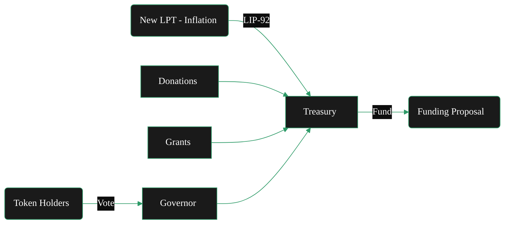

{/* codex-i18n: eyJraW5kIjoiY29kZXgtaTE4biIsInZlcnNpb24iOjEsInNvdXJjZVBhdGgiOiJ2Mi9hYm91dC9saXZlcGVlci1wcm90b2NvbC90cmVhc3VyeS5tZHgiLCJzb3VyY2VSb3V0ZSI6InYyL2Fib3V0L2xpdmVwZWVyLXByb3RvY29sL3RyZWFzdXJ5Iiwic291cmNlSGFzaCI6IjAyMDE4OGMxNzRmZjA1MDMxZDYyYmEzYzlkNDhlZmY4NDgwMDdlNDliODg5ZmJiZTFhNmU2ZmNkMjE5Y2M1ZDEiLCJsYW5ndWFnZSI6ImVzIiwicHJvdmlkZXIiOiJvcGVucm91dGVyIiwibW9kZWwiOiJvcGVuYWkvZ3B0LW9zcy0yMGI6ZnJlZSIsImdlbmVyYXRlZEF0IjoiMjAyNi0wMi0yNlQxMjozNDo1OS4xNDlaIn0= */}
{/* 
This page describes:
5. **Treasury**

   * Funding source
   * Inflation allocation
   * Grants / SPEs
   * Budget governance 

BUT - only briefly - it lives in token.

*/}
import { CardTitleTextWithArrow } from '/snippets/components/primitives/text.jsx'
import { CustomDivider } from '/snippets/components/primitives/divider.jsx'
import { Quote } from '/snippets/components/content/quote.jsx'
import { DynamicTable } from '/snippets/components/layout/table.jsx'

<div style={{ display: "flex", justifyContent: "center", padding: 0, margin: 0}}>
  <CardTitleTextWithArrow icon="piggy-bank" horizontal href="https://explorer.livepeer.org/treasury"> Livepeer Treasury </CardTitleTextWithArrow> 
</div>
<CustomDivider style={{margin: 0, marginBottom: "-1rem"}} />

<Quote>
The Livepeer Treasury is a smart contract-controlled pool of LPT tokens funded through protocol inflation and penalty mechanisms. It serves as the protocol’s capital allocator - financing public goods and ecosystem development, and is governed by token holders via LIP proposals.
</Quote>

## Génesis
A finales de 2023, la comunidad aprobó varias propuestas que crearon el Tesoro Livepeer. 

- **Creación y Gobernanza**: 
   - [LIP‑89](https://github.com/livepeer/LIPs/blob/main/LIPs/LIP-0089.md)estableció el [Tesoro](./treasury)
   - Desplegó un Gobernador OpenZeppelin personalizado (con un umbral de propuesta de 100 LPT y votación ponderada por participación)
{/* - [LIP-89](https://github.com/livepeer/LIPs/blob/main/LIPs/LIP-0089.md) introduced a treasury contract managed by Livepeer’s Governor framework. Any token holder can propose using treasury funds. Treasury proposals follow the standard governance rules: stake 100 LPT to propose, then voting requires ≥33% quorum and &gt;50% “For” to pass (identical to protocol votes). Once passed, the treasury contract executes the transfer (of LPT or ETH) to the specified recipient. */}
- **Financiación**: 
   - [LIP‑92](https://github.com/livepeer/LIPs/blob/main/LIPs/LIP-0092.md) establece la asignación de ingresos en cadena: enviando **10% de nuevas LPT** emisiones al tesoro.
   {/* - Initially, the treasury holds whatever funds were donated or allocated during genesis and via special proposals. There is no automatic tax today. [LIP-92](https://github.com/livepeer/LIPs/blob/main/LIPs/LIP-0092.md) has been discussed as a way to deduct a small percentage of protocol inflation each round and add it to the treasury. Other funding methods include grants, donations, or revenue-sharing agreements. Any change to treasury funding (like LIP-92) must be approved by token-holder vote. */}
- **Uso**: 
   - [LIP‑90](https://github.com/livepeer/LIPs/blob/main/LIPs/LIP-0090.md) estableció que el tesoro debería financiar bienes públicos.
   - Las propuestas aprobadas pueden asignar activos del tesoro a proyectos que beneficien el ecosistema Livepeer. 
   {/* - For example, Special Purpose Entities (teams building tools, education, security audits, etc.) can apply for grants from the treasury. All spending is transparent on-chain. The Community Forum often hosts calls or discussions with applicants, and final decisions rest with the on-chain vote. */}

<div sytle={{ display: "flex", justifyContent: "center", margin: "0 1rem" }}>

</div>
{/* https://github.com/shtukaresearch/livepeer-data-geography/blob/651a56e8c8290b30855f1393543ee9e0961c071c/roles/spe.md
The Livepeer treasury is allocated to ecosystem projects via so-called special-purpose entities (SPEs) who vie for budget allocations through a competitive grant application process. A dashboard of SPE with active funding allocations can be found here.

Scenarios
An SPE or prospective SPE operator must develop Livepeer ecosystem programmes and apply to the DAO for funding.

Identify opportunities for funded contributions.
Into which focus areas are funds most likely to be allocated?
Data availability score: 0 (no treasury allocation strategy)
Potential resource. Develop and publich ecosystem funding strategy.
How much existing competition for funding is there in my focus area?
Resource. Trawling Treasury forum
Data availability score: 4
Decide parameters (amount, focus area) to pitch an application for funding.
How much have previous grant applicants in similar focus areas received?
Resource. Trawling Treasury forum
Data availability score: 4
Which grants were rejected or revisions requested because they asked for too much funding or support?
Resource. Trawling Treasury forum; Treasury explorer
Data availability score: 4
Views: Governance (all subviews). */}

{/* <iframe src="https://dune.com/dob/livepeer-treasury" width="100%" height="500px" frameBorder="0"></iframe> */}

## Objetivos
El tesoro está diseñado para:

- **Sostener el crecimiento del ecosistema** financiar el desarrollo central, herramientas, integraciones y I+D
- **Mejorar la seguridad del protocolo**al apoyar auditorías, diseño de incentivos y recompensas por errores
- **Descentralizar la gobernanza** mediante votación en cadena sobre propuestas de financiación (LIPs)
- **Permitir la coordinación a largo plazo** más allá del alcance de cualquier actor o empresa individual

## Fuentes de financiación

Livepeer’s tesorería acumula valor de estas fuentes primarias (en 2026):

1. **Inflación del Protocolo**: 25% de los LPT recién acuñados (recompensas inflacionarias LPT) se dirige directamente al tesoro comunitario en cadena en cada ronda. (en un multisig controlado por la Fundación Livepeer y los guardianes comunitarios.)
2. **Penalizaciones por slashing**: cuando los orquestadores son castigados, el 50% del LPT castigado se quema y el 50% se transfiere al tesoro.
3. **Restos del Fondo de Tarifas**: si los gateways/transmisores depositan más ETH de lo que finalmente se paga mediante boletos ganadores, el resto se transfiere al tesoro. 
4. **Transferencias Directas LIP**: las entidades comunitarias o multisig pueden depositar LPT manualmente a través de propuestas LIP.

<DynamicTable
  headerList={["Source", "Description"]}
  itemsList={[
    { "Source": "Inflationary Minting", "Description": "% of each round’s LPT minted is routed to treasury" },
    { "Source": "Slashing Penalties", "Description": "Orchestrator misbehavior results in partial burn + treasury deposit" },
    { "Source": "Ticket Fee Remainders", "Description": "Unclaimed or expired broadcaster deposits are swept to the treasury" },
    { "Source": "Direct LIP Transfers", "Description": "Community or multisig entities can deposit LPT manually" },
  ]}
  margin= "0 0 -1rem 0"
/>

## Uso de Fondos
El propósito del tesoro es financiar bienes públicos.

Esto incluye desarrollo, subvenciones, auditorías de seguridad, investigación, iniciativas operativas, herramientas e iniciativas de crecimiento del ecosistema que beneficien a todo el ecosistema (según lo determinado por la comunidad). 
{/* Examples include grants for improving monitoring infrastructure, research into verifiable transcoding and support for builders.  */}

<DynamicTable
  tableTitle={<span style={{fontSize: '1rem'}}>Fund Use Cases</span>}
  headerList={["Category", "Examples"]}
  itemsList={[
    { "Category": "Core Development", "Examples": "Protocol upgrades, contract rewrites, Arbitrum migrations" },
    { "Category": "Ecosystem Grants", "Examples": "Funding for clients, indexers, AI integrations" },
    { "Category": "Public Goods", "Examples": "Documentation, SDKs, Explorer enhancements" },
    { "Category": "Security & Audits", "Examples": "Formal audits of bonding/ticket contracts" },
    { "Category": "Community Campaigns", "Examples": "Education, marketing, live events" },
    { "Category": "Contributor Payments", "Examples": "Retroactive or milestone-based compensation" },
  ]}
  margin="0 0 -1rem 0"
/>

> _Ver [LIP-73](https://github.com/livepeer/LIPs/blob/main/LIPs/LIP-0073.md) y [LIP-77](https://github.com/livepeer/LIPs/blob/main/LIPs/LIP-0077.md) para ejemplos_

<Card title="Livepeer Explorer - Treasury Dashboard" icon="globe" href="https://explorer.livepeer.org/treasury" arrow horizontal > Monitor on-chain staking, proposals, and treasury transactions in real time on the Livepeer Explorer </Card>
{/* When the treasury balance reached a pre‑defined cap, contributions paused; future LIPs can adjust the rate or resume funding. */}

## Gobernanza
El tesoro utiliza el mismo [modelo de gobernanza y procesos](governance-model) como el protocolo (aunque implementado por un contrato Governor separado):
{/* Compound-style Governor contract customized for Livepeer. */}
- **Propuestas**: Stake 100 LPT para proponer.
- **Votación**: Cualquier token apostado (orquestadores + delegadores) puede votar sobre la subvención. Los delegadores normalmente dejan que su operador vote en su nombre, pero pueden separarse para votar por separado.
- **Quórum/Umbral**: Igual que el protocolo: el 33% de la participación debe participar, con una mayoría a favor.
- **Ejecución**: Si se aprueba, el Gobernador libera los fondos inmediatamente. Si falla, la participación se devuelve y los fondos permanecen intactos.

### Informe y Transparencia 

Los saldos del tesoro, los desembolsos y los resultados históricos de LIP son visibles públicamente a través de:

- [Livepeer Explorador](https://explorer.livepeer.org/treasury): Rastrear el tesoro en cadena a través del Livepeer Explorador – Página del Tesoro. 
- Historial de Gobernanza en [Arbiscan](https://arbiscan.io/address/0x363cdB9BaE210Ef182c60b5a496139E980330127#code): Todas las propuestas, votos y pagos son públicos
- Eventos de desembolso en [ABI](https://arbiscan.io/address/0x363cdB9BaE210Ef182c60b5a496139E980330127#code)
      ```javascript Example Query (using ethers.js)
      const event = TreasuryContract.filters.TreasuryWithdrawal()
      provider.on(event, (log) => console.log(log.args))
      ```
- Para ejemplos históricos, vea el [hilos del foro](https://forum.livepeer.org/c/treasury/20) sobre propuestas de financiación o los registros de votación del explorador.
- Siga las actualizaciones de hitos y los informes sobre el [Livepeer Foro](https://forum.livepeer.org/c/treasury/20).

{/* ## Grants & Allocations
The Livepeer treasury is allocated to ecosystem projects via so-called special-purpose entities (SPEs) who vie for budget allocations through a competitive grant application process. 

Spending proposals must be approved by governance, ensuring transparency and accountability. 

Special‑purpose entities (SPEs) can request allocations to execute scoped projects (e.g., building a verification framework, developing new codecs) and must report back on milestones. 

This structure turns inflation into a community‑directed investment in the protocol’s long‑term health rather than pure dilution. */}

## Livepeer Rol de la Fundación

Mientras que el tesoro en cadena en sí está completamente gobernado por la comunidad, la Fundación Livepeer desempeña un papel importante como custodio neutral de los procesos y resultados de financiación.
<Info> 
{/* The Livepeer Foundation is a non-profit organisation that stewards the long-term vision, ecosystem growth, and core development of the Livepeer network.  */}
{/* <br/><br/>  */}
**Treasury mechanics remain on-chain and community governance-controlled** 
- The community controls the money 
- The Foundation ensures the money is effectively & accountably used.
</Info>
Su rol incluye:
- **Orquestación de Gobernanza**: Garantiza que las propuestas de tesoro se muevan eficientemente desde la idea hasta la ejecución en cadena mediante procesos estructurados y coordinación.
   {/* 
   The Foundation ensures that treasury proposals move from idea → draft → community review → on-chain execution.
      This includes:

      - Structuring proposal frameworks (SPEs, budget formats, milestones)
      - Coordinating review cycles and community calls
      - Ensuring proposals are sufficiently specified before vote
      - Facilitating execution after approval
      Without this layer, treasury funds stall in process friction.
    */}
- **Responsabilidad y Supervisión de Hitos**: Mantiene la transparencia y rastrea los entregables para que los fondos aprobados se traduzcan en resultados medibles.
      {/* <div> 
      Once treasury funds are approved, the Foundation helps ensure:
         - Deliverables are tracked
         - Milestones are reported publicly
         - Budget usage aligns with scope
         - Underperforming initiatives are surfaced
      They do not “police” spending - they maintain transparency and continuity so governance decisions compound rather than fragment.
      </div> */}
- **Enmarcado Estratégico de Capital**: Ayuda a definir las prioridades de financiación y la estrategia de asignación a largo plazo alineada con la salud de la red.
   {/* 
   The Foundation helps define:
      - What categories of work treasury should fund (protocol R&D, ecosystem growth, infra, coordination)
      - Multi-quarter budgeting horizons
      - Tradeoffs between short-term impact and long-term network health
   They frame the strategy - the community votes on allocation.
    */}
- **Facilitación de Ejecución**: Alinea a los colaboradores y elimina obstáculos para que las iniciativas financiadas por el tesoro realmente se lancen.
   {/* 
      Treasury funding is only valuable if someone can execute.

      The Foundation:
      - Identifies capable contributors
      - Aligns working groups
      - Removes operational blockers
      - Bridges Foundation resources with independent SPEs

      This converts governance intent into shipped outcomes.
   */}
- **Salud a Largo Plazo de la Red**: Gestiona la asignación del tesoro para fortalecer la seguridad del protocolo, la descentralización y el crecimiento del ecosistema.
   {/* 
   The treasury exists to strengthen:
      - **Protocol security** - audits, formal verification, incentive design
      - **Decentralization** - reducing validator/operator concentration, enabling new node types
      - **Supply-side resilience** - transcoder infrastructure, redundancy, geographic distribution
      - **Demand-side growth** - application integrations, developer tooling, use-case expansion
      - **Tooling and ecosystem expansion** - SDKs, monitoring, indexing, public goods

   The Foundation’s role is to ensure treasury deployment reinforces these pillars rather than drifting into reactive or fragmented spending.
    */}

{/* The community controls the money.
The Foundation ensures the money gets used well.

They are not the treasury owner.
They are the steward of treasury effectiveness. */}

{/* 
- **Shapes/coordinates the governance pipeline** so treasury proposals get written, reviewed, and executed via the community’s SPE + voting process.
- **Convenes/participates in Advisory Boards** (incl. governance/treasury focus) to align priorities and unblock proposal work.
- **Supports the SPE framework** (templates, reporting, accountability), often via GovWorks-type operations.
- **Coordinates core ecosystem work** (incl. onboarding/aligning technical SPEs, convening dev syncs, mediating ecosystem-level conflicts), 
- Helps ensure **accountability** for allocated fund use. */ }

## Arquitectura de Contratos

- Nombre del contrato: `Treasury`
- Despliegue: Arbitrum Uno

_**Rol del contrato**_

- Posee LPT fondos
- Acepta autorizados `distribute()` llamadas de gobernanza
- Emite `TreasuryWithdrawal` eventos en gasto aprobado

<Card title="Treasury Contract on Arbiscan" icon="ethereum" href="https://arbiscan.io/address/0x363cdB9BaE210Ef182c60b5a496139E980330127#code" arrow horizontal > See the full Tresury contract ABI and transaction details on Arbiscan </Card> 

## Discusión de Mejoras
Para asegurar que el gasto del tesoro esté alineado con los objetivos del protocolo, la comunidad Livepeer ha experimentado con marcos para la financiación de bienes públicos. 

- Un ejemplo es el [**modelo de subvención transparente basado en hitos**](https://forum.livepeer.org/t/treasury-grant-process/3250): los proponentes presentan presupuestos y entregables, los fondos se liberan en tramos al completarse y el progreso se informa públicamente en el foro. 
- Otro es [**financiación cuadrática**](https://forum.livepeer.org/t/quadratic-funding/3251), que podría combinar las donaciones de la comunidad del tesoro para señalar un fuerte apoyo de base. Las discusiones también han explorado la financiación retroactiva al estilo de regen network, donde las contribuciones se recompensan después de que se demuestre el impacto. 

Estos experimentos reflejan el compromiso de una comunidad madura e involucrada con la asignación de recursos inclusiva y responsable.

{/* ## Long-Term Vision */}

## Recursos adicionales
<Card title="Treasury Documentation" icon="piggy-bank" href="/v2/es/lpt/treasury/overview" arrow horizontal > See the Livepeer Treasury documentation in the [LP Token](/v2/es/lpt/treasury/overview) section for comprehensive technical details and guides on voting and porposals. </Card>
<Columns cols={2}>
   <Card title="LIP-89: Treasury Proposal" icon="file" href="https://github.com/livepeer/LIPs/blob/master/LIPs/LIP-89.md"> Specification for the on-chain Treasury and governance framework </Card> 
   <Card title="LIP-92: Treasury Funding" icon="message" href="https://forum.livepeer.org/t/lip-92-livepeer-treasury-contribution-percentage/3249"> Discussion of allocating a percentage of inflation to the treasury </Card> 
   <Card title="Treasury Explorer" icon="globe" href="https://explorer.livepeer.org/treasury" > On-chain treasury transactions </Card>
   <Card title="Messari Report" icon="scroll" href="https://messari.io/asset/livepeer/reports" > Messari Report: Livepeer Treasury </Card>
   <Card title="Treasury Analytics" icon="chart-line" href="https://dune.com/dob/livepeer-treasury" > Dune Dashboard Analytics </Card>
   <Card href="https://www.karmahq.xyz/community/livepeer" title="Community SPE Dashboard" icon="boxes" > SPE Project Dashboard </Card>
   <Card href="https://arbiscan.io/address/0x363cdB9BaE210Ef182c60b5a496139E980330127#code" title="Treasury Contract" icon="ethereum" > Treasury Contract on Arbiscan </Card>
   <Card href="https://github.com/livepeer/protocol/blob/e8b6243c/contracts/governance/Treasury.sol" title="Treasury Contract" icon="github" > Treasury Contract on Github </Card>
</Columns>
