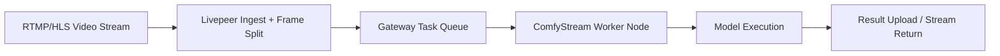

{/* codex-i18n: eyJraW5kIjoiY29kZXgtaTE4biIsInZlcnNpb24iOjEsInNvdXJjZVBhdGgiOiJ2Mi9kZXZlbG9wZXJzL2FpLXBpcGVsaW5lcy9jb21meXN0cmVhbS5tZHgiLCJzb3VyY2VSb3V0ZSI6InYyL2RldmVsb3BlcnMvYWktcGlwZWxpbmVzL2NvbWZ5c3RyZWFtIiwic291cmNlSGFzaCI6ImY0MjFiZDRlNzEzNDY2Yzk5NzhmYWY3OTdmYTliMmYyZGRlMmQyZGEwNzhiMWUxNGI3M2Y2ZTg1ZDg1M2Q0OTUiLCJsYW5ndWFnZSI6ImVzIiwicHJvdmlkZXIiOiJvcGVucm91dGVyIiwibW9kZWwiOiJxd2VuL3F3ZW4tdHVyYm8iLCJnZW5lcmF0ZWRBdCI6IjIwMjYtMDItMjdUMTI6MjQ6MzguMzY2WiJ9 */}
import { DynamicTable } from '/snippets/components/layout/table.jsx'

ComfyStream es un motor de inferencia de IA modular que se integra con el Protocolo de Pasarela de Livepeer para ejecutar pipelines de marcos de video en nodos de trabajo con GPU. Se extiende[ComfyUI](https://github.com/comfyanonymous/ComfyUI) con enlaces de pasarela compatibles con Livepeer, entrada/salida de transmisión en tiempo real, gráficos de nodos dinámicos y encadenamiento de complementos, así como renderizado de superposición y exportación de metadatos.

Para una vista general de alto nivel y DeepWiki, consulte el[guía completa de ComfyStream](/v2/es/developers/ai-pipelines/comfystream).

## Visión general de la arquitectura



## Tipos de nodos en ComfyStream

<DynamicTable
  headerList={["Node type", "Description", "Example models"]}
  itemsList={[
    { "Node type": "Whisper Node", "Description": "Transcribe / translate speech", "Example models": "whisper-large" },
    { "Node type": "Diffusion", "Description": "Style transfer, background change", "Example models": "SDXL, ControlNet" },
    { "Node type": "Detection", "Description": "Bounding boxes or masks", "Example models": "YOLOv8, SAM" },
    { "Node type": "Blur / Redact", "Description": "Visual filter", "Example models": "SegmentBlur, MediaPipe" }
  ]}
/>

Estos se exponen como módulos en `nodes/*.py` y se pueden encadenar en formato de grafo.

## Ejemplo de canal: superposición de leyenda

```json
{
  "pipeline": [
    { "task": "whisper-transcribe" },
    { "task": "caption-overlay", "font": "Roboto" }
  ]
}
```

ComfyStream lo convierte en un grafo de cálculo interno (por ejemplo, WhisperNode → TextOverlayNode → OutputStreamNode).

## Soporte de complementos

Puedes crear tus propios complementos:

- Implementa la`NodeBase` clase de ComfyUI
- Registra metadatos y parámetros
- Declara entradas y salidas para encadenamiento

Ejemplo:

```python
class FaceBlurNode(NodeBase):
  def run(self, frame):
    result = blur_faces(frame)
    return result
```

## Conexión al Gateway Livepeer

En `config.yaml`:

```yaml
gatewayURL: wss://gateway.livepeer.org
models:
  - whisper
  - sdxl
```

Inicie su nodo:

```bash
python run.py --adapter grpc --model whisper --gpu
```

El trabajador ComfyStream escuchará las colas de tareas mediante pub/sub, ejecutará los flujos de trabajo marco a marco y devolverá los resultados de inferencia como superposiciones o JSON.

## Depuración de pipelines

Los registros de ComfyStream envían latidos al gateway, cargas de trabajo, errores de gráficos y métricas de flujo de salida. Habilitar el modo detallado:

```bash
python run.py --debug
```

## Ver también

- [Visión general de pipelines de IA](./overview) - Conceptos de pipeline y tipos de trabajadores
- [BYOC](./byoc) - Trae tu propio entorno de cálculo
- [Guía completa de ComfyStream](/v2/es/developers/ai-pipelines/comfystream) - Capas de arquitectura, componentes y DeepWiki
- [Arquitectura técnica de la red](/v2/es/about/livepeer-network/technical-architecture) - Pila de Gateway y Orchestrator

## Recursos

- [GitHub ComfyStream](https://github.com/livepeer/comfystream)
- [Configuración BYOC](./byoc)
- [Ejemplos de complementos (Foro)](https://forum.livepeer.org/t/comfystream-nodes)
- [Livepeer Studio AI](https://livepeer.studio/docs/ai)
