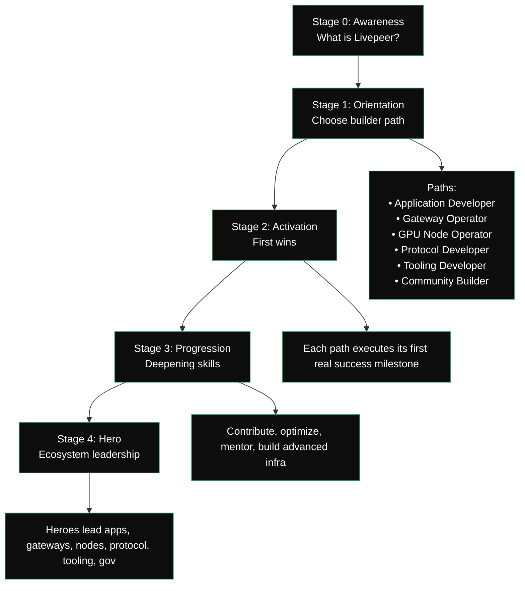

{/* codex-i18n: eyJraW5kIjoiY29kZXgtaTE4biIsInZlcnNpb24iOjEsInNvdXJjZVBhdGgiOiJ2Mi9kZXZlbG9wZXJzL2RldmVsb3Blci1qb3VybmV5Lm1keCIsInNvdXJjZVJvdXRlIjoidjIvZGV2ZWxvcGVycy9kZXZlbG9wZXItam91cm5leSIsInNvdXJjZUhhc2giOiI3ZGY1ZTM0N2Q2ODc2ZWI0NDc4N2EyZWQxODgzOGI0ZjA1MzIxNTljNWY5NGM4YTVlMzVmNzUwNTQ1NTIwY2EwIiwibGFuZ3VhZ2UiOiJlcyIsInByb3ZpZGVyIjoib3BlbnJvdXRlciIsIm1vZGVsIjoib3BlbmFpL2dwdC1vc3MtMTIwYjpmcmVlIiwiZ2VuZXJhdGVkQXQiOiIyMDI2LTAyLTI3VDAyOjE2OjExLjU1M1oifQ== */}
| Etapa | Nombre        | Propósito                                             | Resultados                                                                           |
| ----- | ----------- | --------------------------------------------------- | ---------------------------------------------------------------------------------- |
| 0     | Conciencia   | Entender Livepeer, modelo de cómputo, roles del ecosistema | Claridad sobre Protocolo → Red → Aplicaciones; modelo mental básico                           |
| 1     | Orientación | Identifica qué persona de constructor se ajusta a sus objetivos     | Ruta elegida: App Dev, Gateway Operator, GPU Node, Protocol Dev, Tooling, Community |
| 2     | Activación  | Realiza la primera acción significativa en la ruta elegida      | "Primer éxito" logrado: aplicación construida, nodo desplegado, contrato escrito, herramienta creada     |
| 3     | Progresión | Aumentar la experiencia y la contribución                 | Contribuciones, optimizaciones, mentoría, flujos de trabajo avanzados                        |
| 4     | Héroe        | Convertirse en un líder/administrador en el ecosistema            | Operar a gran escala, publicar herramientas, redactar propuestas, ejecutar programas                    |

