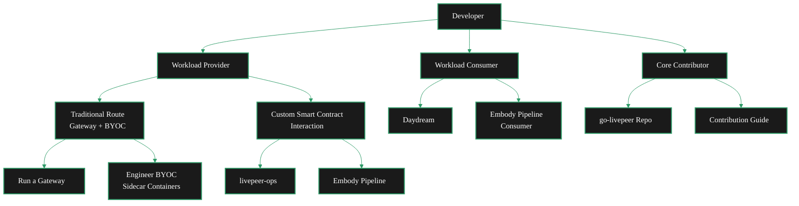

{/* codex-i18n: eyJraW5kIjoiY29kZXgtaTE4biIsInZlcnNpb24iOjEsInNvdXJjZVBhdGgiOiJ2Mi9kZXZlbG9wZXJzL2RldmVsb3Blci1wYXRoLm1keCIsInNvdXJjZVJvdXRlIjoidjIvZGV2ZWxvcGVycy9kZXZlbG9wZXItcGF0aCIsInNvdXJjZUhhc2giOiIyZDc0MDY0ODc2YWU3YTAwMWY1NTRkNmFmYTU5NzMwZmJlOWE0Y2VlZThlOWI0YTM0ZjZkMmIwNmNkMDIxZTU4IiwibGFuZ3VhZ2UiOiJlcyIsInByb3ZpZGVyIjoib3BlbnJvdXRlciIsIm1vZGVsIjoib3BlbmFpL2dwdC1vc3MtMTIwYjpmcmVlIiwiZ2VuZXJhdGVkQXQiOiIyMDI2LTAzLTAxVDA4OjMwOjM5LjY0OVoifQ== */}
Livepeer ofrece múltiples caminos para desarrolladores dependiendo de cómo quieras interactuar con la red. Ya sea que estés aportando cargas de trabajo de cómputo, consumiendo pipelines de IA existentes, o contribuyendo a la implementación central en Go, hay un camino claro para ti.

## Elige tu camino

<Columns cols={3}>
  <Card title="Workload Provider" icon="server" href="#path-1-workload-provider" arrow>
    Bring your own compute workloads to the Livepeer network by running a gateway or interacting with smart contracts directly.
  </Card>
  <Card title="Workload Consumer" icon="wand-magic-sparkles" href="#path-2-workload-consumer" arrow>
    Consume existing pipeline workloads running on the Livepeer network - no infrastructure setup required.
  </Card>
  <Card title="Core Contributor" icon="code-branch" href="#path-3-core-contributor" arrow>
    Contribute directly to go-livepeer, the Go implementation that powers the Livepeer network.
  </Card>
</Columns>

---

---

## Camino 1: Proveedor de carga de trabajo

Como un **Proveedor de carga de trabajo**, llevas cargas de trabajo de cómputo a la red Livepeer. Definis lo que se procesa - ya sea un pipeline de inferencia de IA, un trabajo de transcodificación de video, o algo totalmente personalizado - y lo enrutas a través de la red de orquestadores de Livepeer.

Hay dos enfoques dependiendo de tus necesidades.

### Opción A: Ruta tradicional (Gateway + BYOC)

La ruta estándar ejecuta tu propio gateway y utiliza contenedores sidecar BYOC (Bring Your Own Container) junto al contenedor principal de go-livepeer.

<Steps>
  <Step title="Run your own gateway" icon="tower-broadcast">
    Set up a Livepeer gateway node that routes workloads to orchestrators on the network.

    <Card title="Gateway Quickstart" icon="rocket" href="/v2/gateways/quickstart/gateway-setup" arrow horizontal>
      Get your gateway node running in minutes.
    </Card>
  </Step>
  <Step title="Engineer your BYOC containers" icon="docker">
    Build sidecar containers that run alongside the go-livepeer main container. BYOC lets you define custom workloads that orchestrators execute on their GPUs.

    <Card title="BYOC Documentation" icon="boxes" href="/v2/es/developers/ai-pipelines/byoc" arrow horizontal>
      Learn how to build and deploy BYOC sidecar containers.
    </Card>
  </Step>
  <Step title="Deploy workloads through your gateway" icon="arrow-up-right-from-square">
    Once your gateway is running and your BYOC containers are built, deploy your workloads to the network through your gateway.

    <Card title="AI Pipelines Overview" icon="brain-circuit" href="/v2/es/developers/ai-pipelines/overview" arrow horizontal>
      Understand the full AI pipeline architecture.
    </Card>
  </Step>
</Steps>

### Opción B: Interacción personalizada con contratos inteligentes

Si deseas más control, puedes interactuar directamente con los contratos inteligentes de Livepeer - evitando el flujo estándar del gateway para crear lógica de orquestación personalizada.

<Columns cols={2}>
  <Card title="livepeer-ops" icon="github" href="https://github.com/its-DeFine/livepeer-ops" arrow>
    Infrastructure tooling for deploying and managing Livepeer workloads with custom smart contract interactions.
  </Card>
  <Card title="Embody Pipeline" icon="github" href="https://github.com/its-DeFine/Unreal_Vtuber" arrow>
    A reference implementation showing how to build a custom pipeline that interacts with Livepeer contracts directly.
  </Card>
</Columns>

<Tip>
  You're not limited to these two options. Providers can fork livepeer-ops, extend the Embody pipeline, or build entirely custom implementations. The smart contract interface is open - use it however fits your architecture.
</Tip>

---

## Camino 2: Consumidor de carga de trabajo

Como un **Consumidor de carga de trabajo**, utilizas cargas de trabajo de pipelines existentes que ya están ejecutándose en la red Livepeer. No necesitas configurar infraestructura ni desplegar contenedores - te conectas a los pipelines disponibles y consumes su salida.

### Pipelines disponibles

<Columns cols={2}>
  <Card title="Daydream (DaS Scope)" icon="wand-sparkles" href="#">
    Consume Daydream pipeline workloads on the Livepeer network.
    <Note>Link coming soon</Note>
  </Card>
  <Card title="Embody Pipeline" icon="user-robot" href="#">
    Consume Embody pipeline workloads for real-time avatar and VTuber applications.
    <Note>Link coming soon</Note>
  </Card>
</Columns>

---

## Camino 3: Contribuidor central

Como un **Contribuidor central**, trabajas directamente en go-livepeer - la implementación en Go que impulsa gateways, orquestadores y el propio protocolo. Este camino es para desarrolladores que desean mejorar la red a nivel de infraestructura.

<Columns cols={2}>
  <Card title="go-livepeer" icon="github" href="https://github.com/livepeer/go-livepeer" arrow>
    The official Go implementation of the Livepeer protocol. Clone the repo and start exploring.
  </Card>
  <Card title="Contribution Guide" icon="book-open" href="/v2/developers/guides-and-tools/contribution-guide" arrow>
    Guidelines for contributing to Livepeer - coding standards, PR process, and how to get your changes merged.
  </Card>
</Columns>
