{/* codex-i18n: eyJraW5kIjoiY29kZXgtaTE4biIsInZlcnNpb24iOjEsInNvdXJjZVBhdGgiOiJ2Mi9nYXRld2F5cy9ydW4tYS1nYXRld2F5L3J1bi1hLWdhdGV3YXkubWR4Iiwic291cmNlUm91dGUiOiJ2Mi9nYXRld2F5cy9ydW4tYS1nYXRld2F5L3J1bi1hLWdhdGV3YXkiLCJzb3VyY2VIYXNoIjoiNGU0YjZiYjhmNjBmNjExNDk2MTRjMzcwMGFkMmI3MmE1M2IwNGIxMzJjZjQyOTMzZGI3NWZkOTFkMGI3ZTk3MiIsImxhbmd1YWdlIjoiZXMiLCJwcm92aWRlciI6Im9wZW5yb3V0ZXIiLCJtb2RlbCI6InF3ZW4vcXdlbi10dXJibyIsImdlbmVyYXRlZEF0IjoiMjAyNi0wMi0yN1QxNDo0MDo1MC43MjJaIn0= */}
<Warning> Complete: needs review. Steps need update </Warning>

import { GotoLink } from '/snippets/components/primitives/links.jsx'
import { ScrollableDiagram } from '/snippets/components/content/zoomableDiagram.jsx'
import { StyledSteps, StyledStep } from '/snippets/components/layout/steps.jsx'
import { FlexContainer } from '/snippets/components/layout/layout.jsx'

<br />
## Introducción Las puertas de enlace son infraestructura esencial en la red Livepeer. Ellas
proporcionan la capa de coordinación del servicio (enrutamiento y verificación) que conecta las aplicaciones a la capa de cálculo de GPU descentralizada (DePIN). Esta guía explica los requisitos, los pasos de configuración y las mejores prácticas para ejecutar un nodo de puerta de enlace.

## Modos de puerta de enlace

Puedes ejecutar una puerta de enlace

- <Icon icon="floppy-disk" size={18} /> **Fuera de cadena** -> modo dev o local
- <Icon icon="link" size={18} /> **En cadena** -> modo de producción conectado a la red Livepeer basada en blockchain (en Arbitrum).{' '}

## Capacidades del Gateway

Puedes ejecutar un Gateway para:

- <Badge color="blue"> Video Only </Badge> -> servicios tradicionales de transcodificación
- <Badge color="purple"> AI Only </Badge> -> servicios de inferencia de IA
- <Badge color="green"> Dual: AI & Video </Badge> -> ambos servicios de transcodificación de video e inferencia de IA

## Arquitectura de Gateway

```mermaid
%%{init: {'theme': 'base', 'themeVariables': { 'primaryColor': '#1a1a1a', 'primaryTextColor': '#fff', 'primaryBorderColor': '#2d9a67', 'lineColor': '#2d9a67', 'secondaryColor': '#0d0d0d', 'tertiaryColor': '#1a1a1a', 'background': '#0d0d0d', 'fontFamily': 'system-ui' }}}%%
flowchart LR
    subgraph INPUT["Input Sources"]
        CAM["Camera / RTMP / WebRTC"]
        VID["Video File"]
        AIIN["AI Prompt / Model Request"]
    end

    GATEWAY["Gateway Node<br/>• Ingest (RTMP/HTTP/WebRTC)<br/>• Segment video<br/>• Queue + order jobs<br/>• AI pipeline routing<br/>• Orchestrator selection<br/>• Verification & receipts"]

    CAM -->|"Live stream"| GATEWAY
    VID -->|"VOD upload"| GATEWAY
    AIIN -->|"AI job request"| GATEWAY

    subgraph JOBS["Workflows"]
        VJ["Video Transcoding Job"]
        AIJ["AI Inference Job<br/>(Daydream / ComfyStream / BYOC)"]
    end

    GATEWAY --> VJ
    GATEWAY --> AIJ

    subgraph ORCH["Orchestrator Network (GPU Operators)"]
        O1["Orchestrator A<br/>GPU Pool"]
        O2["Orchestrator B<br/>GPU Pool"]
        O3["Orchestrator C<br/>GPU Pool"]
    end

    VJ -->|"Transcode segments"| O1
    VJ --> O2
    AIJ -->|"Run model / inference"| O1
    AIJ --> O3

    subgraph OUTPUTS["Outputs"]
        HLS["Adaptive Bitrate Video (HLS/LL-HLS)"]
        AIOUT["AI Frames / Stylized Video"]
    end

    O1 --> GATEWAY
    O2 --> GATEWAY
    O3 --> GATEWAY

    GATEWAY --> HLS
    GATEWAY --> AIOUT

    ETH[("Arbitrum Blockchain<br/>Payments • Tickets • Rewards")]
    GATEWAY --> ETH
    O1 --> ETH
    O2 --> ETH
    O3 --> ETH

    classDef default fill:#1a1a1a,color:#fff,stroke:#2d9a67,stroke-width:2px
    style INPUT fill:#0d0d0d,stroke:#2d9a67,stroke-width:1px
    style JOBS fill:#0d0d0d,stroke:#2d9a67,stroke-width:1px
    style ORCH fill:#0d0d0d,stroke:#2d9a67,stroke-width:1px
    style OUTPUTS fill:#0d0d0d,stroke:#2d9a67,stroke-width:1px

```

<ScrollableDiagram title="Dual Gateway Architecture: Video & AI Pipelines" maxHeight="600px">

</ScrollableDiagram>

<br/>

## Viaje del Operador de Gateway

<Columns cols={2}>
<FlexContainer justify="center">
  <Mermaid
    chart={`%%{init: {'theme': 'base', 'themeVariables': { 'primaryColor': '#1a1a1a', 'primaryTextColor': '#fff', 'primaryBorderColor': '#2d9a67', 'lineColor': '#2d9a67', 'secondaryColor': '#0d0d0d', 'tertiaryColor': '#1a1a1a', 'background': '#0d0d0d', 'fontFamily': 'system-ui', 'clusterBkg': '#0d0d0d', 'clusterBorder': '#2d9a67' }}}%%
      flowchart TB
      subgraph check["Check"]
          A["Check network & hardware requirements"]
      end

      subgraph install["Install"]
          B["Install go-livepeer on your OS"]
      end

      subgraph configure["Configure"]
          C1["Configure AI, transcoding, or both"]
          C2["Configure pricing, funding, & regions"]
      end

      subgraph test["Test"]
          D["Test & troubleshoot"]
      end

      subgraph connect["Connect"]
          E1["Connect with orchestrators"]
          E2["Route jobs"]
      end

      subgraph monitor["Monitor"]
          F["Monitor & optimise"]
      end

      A --> B
      B --> C1
      C1 --> C2
      C2 --> D
      D --> E1
      E1 --> E2
      E2 --> F

      classDef default fill:#1a1a1a,color:#fff,stroke:#2d9a67,stroke-width:2px`}
  />
</FlexContainer>

<FlexContainer justify="center" style={{ marginTop: '-2.5rem' }}>
<StyledSteps>
  <StyledStep title="Requirements Check">
    Check hardware, network, and software requirements. <br/>
    <GotoLink
      label="Requirements"
      relativePath="./requirements"
    />
  </StyledStep>
  <StyledStep title="Install Gateway">
    Install the Livepeer Gateway software. <br/>
    <GotoLink
      label="Installation Guide"
      relativePath="./install"
    />
  </StyledStep>
  <StyledStep title="Configure & Fund Gateway">
    Configure transcoding options, models, pipelines & pricing <br />
    <GotoLink
      label="Configuration Guide"
      relativePath="./configure"
    />
  </StyledStep>
  <StyledStep title="Test Gatway">
    Price & publish offerings to the Marketplace. <br/>
    <GotoLink
      label="Testing Guide"
      relativePath="./test"
    />
  </StyledStep>
  <StyledStep title="Connect Gatway">
    Connect with Orchestrators, price & route offerings in the Marketplace. <br/>
    <GotoLink
      label="Connect to the Livepeer Network"
      relativePath="./connect"
  />
  </StyledStep>
    <StyledStep title="Monitor & Optimize">
    Monitor performance, optimize routing & service quality. <br/>
    <GotoLink
      label="Monitor & Optimise your Gateway"
      relativePath="./monitor"
    />
  </StyledStep>
</StyledSteps>

</FlexContainer>
</Columns>

## Páginas Relacionadas
<Card
    title="Gateway Economics"
    href="../about/economics"
    icon="hand-holding-dollar"
    horizontal
    arrow
    >
    Looking for information on how gateways earn fees for services?
    <GotoLink
      label="Read the 'Gateway Economics' section"
      relativePath="../about/economics"
    />
</Card>
<Card
    title="Gateway Installation"
    href="../run-a-gateway/install/install-overview"
    icon="sign-posts-wrench"
    horizontal
    arrow
    >
    Just want to get started?
    <GotoLink
      label="Get Started with Installation"
      relativePath="../run-a-gateway/install/install-overview"
    />
</Card>
```
