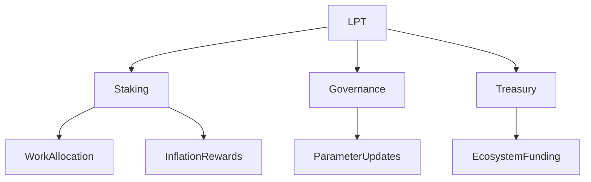

{/* codex-i18n: eyJraW5kIjoiY29kZXgtaTE4biIsInZlcnNpb24iOjEsInNvdXJjZVBhdGgiOiJ2Mi9scHQvYWJvdXQvb3ZlcnZpZXcubWR4Iiwic291cmNlUm91dGUiOiJ2Mi9scHQvYWJvdXQvb3ZlcnZpZXciLCJzb3VyY2VIYXNoIjoiNGQ2ZjU3YmU0ZTZmYjEyOGJkODc5NjdiNzRkYmRjNWYzMDM3Mjg4MThiNDk4YzNlYjE0ZjliMzRlNDkzMWY5NSIsImxhbmd1YWdlIjoiZXMiLCJwcm92aWRlciI6Im9wZW5yb3V0ZXIiLCJtb2RlbCI6Im9wZW5haS9ncHQtb3NzLTIwYjpmcmVlIiwiZ2VuZXJhdGVkQXQiOiIyMDI2LTAzLTAxVDA5OjU2OjEyLjc5MFoifQ== */}
import { MathInline, MathBlock } from '/snippets/components/content/math.jsx'

## Resumen Ejecutivo

El Token Livepeer (LPT) es el activo de capa de protocolo que asegura, gobierna y regula económicamente la red Livepeer. No es un token de pago para el consumo de video, ni una representación de capital corporativo. Su función es estrictamente estructural: convierte el capital vinculado en peso económico medible que asegura la asignación de trabajo, habilita la gobernanza y financia el desarrollo del ecosistema.

El LPT opera exclusivamente en la capa **capa de protocolo (en cadena)** en Arbitrum One.

---

## 1. Definición Formal

Definamos el Protocolo Livepeer como un sistema de coordinación en cadena para asignar trabajo y recompensas entre proveedores de cómputo descentralizados.

LPT se define como:

> Un activo de coordinación ponderado por participación que proporciona seguridad económica, autoridad de gobernanza y control de tesorería dentro del Protocolo Livepeer.

Sus dominios funcionales son:

1. Seguridad de staking
2. Distribución de recompensas basada en inflación
3. Asignación de capital delegada
4. Votación de gobernanza
5. Administración de tesorería

---

## 2. Contexto Arquitectónico

### 2.1 Capa de Protocolo (En Cadena)

LPT interactúa con los contratos inteligentes centrales:

- **BondingManager** - contabilidad de participación
- **Minador** - emisión por inflación
- **Gestor de Rondas** - temporización de recompensas basada en épocas
- **Gobernador** - ejecución de propuestas y votaciones
- **Tesorería** - fondos controlados por la gobernanza

Toda la autoridad del protocolo deriva de los saldos vinculados de LPT.

### 2.2 Capa de Red (Fuera de la Cadena)

La capa de red incluye:

- Software de orquestador
- Ejecución de cómputo GPU
- Canales de transcodificación e inferencia
- APIs de puerta de enlace y enrutamiento

LPT no ejecuta trabajo. Económicamente asegura a los actores que realizan trabajo.

---

## 3. Staking y Peso Económico

Sea:

- <MathInline latex={String.raw`B_i`} /> = participación vinculada del participante <MathInline latex={String.raw`i`} />
- <MathInline latex={String.raw`B_T`} /> = participación total vinculada

Peso económico:

<MathBlock latex={String.raw`W_i = \frac{B_i}{B_T}`} />

La asignación de trabajo y las recompensas por inflación son proporcionales a <MathInline latex={String.raw`W_i`} />.

Esto crea un modelo de resistencia a Sybil respaldado por capital.

---

## 4. Visión general del mecanismo de inflación

Por ronda <MathInline latex={String.raw`t`} />:

<MathBlock latex={String.raw`R_t = S_t \times r_t`} />

Donde:

- <MathInline latex={String.raw`S_t`} /> = suministro de tokens en la ronda <MathInline latex={String.raw`t`} />
- <MathInline latex={String.raw`r_t`} /> = tasa de inflación definida por el protocolo

La inflación se ajusta dinámicamente en función de la tasa de vinculación relativa a la tasa de vinculación objetivo (ver [Tokenómica](./tokenomics) sección para la derivación completa).

---

## 5. Modelo de delegación

Los delegadores vinculan su participación a los orquestadores, aumentando su peso económico sin ejecutar infraestructura.

Participación total de los orquestadores:

<MathBlock latex={String.raw`B_O = B_{self,O} + \sum_D b_{D,O}`} />

La delegación permite eficiencia de capital y mercados competitivos de operadores.

---

## 6. Autoridad de gobernanza

El poder de voto deriva de la participación vinculada:

<MathBlock latex={String.raw`V_i = \frac{B_i}{B_T}`} />

La gobernanza puede modificar:

- Parámetros de inflación
- Implementaciones de contratos
- Asignaciones de tesorería

La autoridad de gobernanza está ponderada por capital y se aplica en cadena.

---

## 7. Modelo de Seguridad

La seguridad del protocolo es proporcional al total de la participación vinculada:

<MathBlock latex={String.raw`\text{Security} \propto B_T`} />

Un atacante debe adquirir una fracción límite de la participación vinculada LPT para influir en la asignación de trabajo o la gobernanza.

---

## 8. Compensaciones Económicas

| Mecanismo | Compensación |
|-----------|----------|
| Emisión de inflación | Arranque vs dilución |
| Delegación | Accesibilidad vs concentración |
| Gobernanza ponderada por capital | Seguridad vs influencia de la riqueza |

Estas compensaciones son decisiones de diseño explícitas.

---

## 9. Diagrama de Interacción del Sistema

---

## 10. Consideraciones Operativas

Los participantes deben comprender:

- Retrasos de vinculación y desvinculación
- Estructuras de comisión
- Ajustes de parámetros de inflación
- Umbrales de quórum de gobernanza

La participación expone el capital a riesgo a nivel de protocolo.

---

## Referencias

- [Livepeer Repositorio de Protocolo](https://github.com/livepeer/protocol)
- [Registro de Contratos](https://docs.livepeer.org/references/contract-addresses)
- [Livepeer Propuestas de Mejora (LIPs)](https://github.com/livepeer/LIPs)
