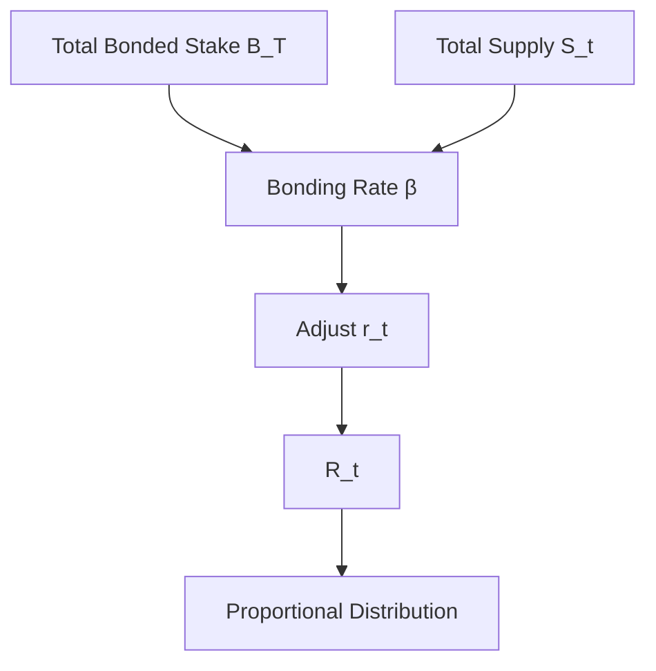

{/* codex-i18n: eyJraW5kIjoiY29kZXgtaTE4biIsInZlcnNpb24iOjEsInNvdXJjZVBhdGgiOiJ2Mi9scHQvYWJvdXQvdG9rZW5vbWljcy5tZHgiLCJzb3VyY2VSb3V0ZSI6InYyL2xwdC9hYm91dC90b2tlbm9taWNzIiwic291cmNlSGFzaCI6IjBiZDJlZmIyODVmZTUwMzIxNGQ0NGY1YjZmNmM5MmIyYTc5OTA2NDAwYjlkNWIwOGYwNDg5ZTAwZjVkNWRkNzMiLCJsYW5ndWFnZSI6ImVzIiwicHJvdmlkZXIiOiJvcGVucm91dGVyIiwibW9kZWwiOiJxd2VuL3F3ZW4tdHVyYm8iLCJnZW5lcmF0ZWRBdCI6IjIwMjYtMDMtMDFUMTA6NDU6MTEuMzQ2WiJ9 */}
import { MathInline, MathBlock } from '/snippets/components/content/math.jsx'

## Resumen Ejecutivo

LPT tokenomics define cómo el Protocolo Livepeer emite nueva oferta, ajusta la inflación en relación con la participación en la seguridad, distribuye recompensas y mantiene un equilibrio de seguridad respaldado por capital.

El modelo de tokenomics se implementa en la**capa de protocolo (en cadena)** mediante el staking, la lógica de ajuste de inflación y la asignación de recompensas determinista.

---

## 1. Variables Formales

Sea:

- <MathInline latex={String.raw`S_t`} /> = suministro total LPT en la ronda <MathInline latex={String.raw`t`} />
- <MathInline latex={String.raw`B_T`} /> = suministro total LPT comprometido
- <MathInline latex={String.raw`B_i`} /> = capital comprometido atribuido al participante <MathInline latex={String.raw`i`} />
- <MathInline latex={String.raw`\beta`} /> = tasa de compromiso = <MathInline latex={String.raw`\frac{B_T}{S_t}`} />
- <MathInline latex={String.raw`\beta^*`} /> = tasa de compromiso objetivo
- <MathInline latex={String.raw`r_t`} /> = tasa de inflación aplicada en el round<MathInline latex={String.raw`t`} />
- <MathInline latex={String.raw`\alpha`} /> = coeficiente de ajuste de inflación
- <MathInline latex={String.raw`c_O`} /> = tasa de comisión establecida por el orchestrator<MathInline latex={String.raw`O`} />

---

## 2. Modelo de Emisión de Inflación

Por round<MathInline latex={String.raw`t`} />, nuevos LPT:

<MathBlock latex={String.raw`R_t = S_t \cdot r_t`} />

Actualización de la oferta:

<MathBlock latex={String.raw`S_{t+1} = S_t + R_t`} />

La inflación, por lo tanto, se compone en relación con la oferta actual.

---

## 3. Mecanismo de retroalimentación de la tasa de vinculación

El protocolo ajusta la inflación según la desviación entre la tasa de vinculación actual y la tasa de vinculación objetivo.

Tasa de vinculación actual:

<MathBlock latex={String.raw`\beta = \frac{B_T}{S_t}`} />

Regla de ajuste:

Si <MathInline latex={String.raw`\beta < \beta^*`} />:

<MathBlock latex={String.raw`r_{t+1} = r_t + \alpha`} />

Si <MathInline latex={String.raw`\beta > \beta^*`} />:

<MathBlock latex={String.raw`r_{t+1} = r_t - \alpha`} />

Esto crea un bucle de control:

- Sistema subcapitalizado → mayor inflación → mayor incentivo para staking
- Sistema sobrecedido → menor inflación → menor dilución

El sistema busca un equilibrio donde <MathInline latex={String.raw`\beta \approx \beta^*`} />.

---

## 4. Distribución de recompensas

Emisión total por ronda <MathInline latex={String.raw`R_t`} /> se distribuye proporcionalmente al peso de la participación.

Definir peso económico:

<MathBlock latex={String.raw`W_i = \frac{B_i}{B_T}`} />

Asignación al orquestador <MathInline latex={String.raw`O`} />:

<MathBlock latex={String.raw`R_O = R_t \cdot \frac{B_O}{B_T}`} />

Delegador <MathInline latex={String.raw`D`} /> vinculado al orquestador <MathInline latex={String.raw`O`} />:

<MathBlock latex={String.raw`R_{D,O} = R_O (1 - c_O) \cdot \frac{b_{D,O}}{B_O}`} />

Esto separa la emisión bruta de los rendimientos ajustados por comisión de los delegadores.

---

## 5. Emisión vs Ingresos por tarifas

Los rendimientos para los participantes vinculados pueden consistir en:

1. Emisión basada en inflación (expansión de la oferta)
2. Ingresos por tarifas de trabajos de video/IA (basado en la demanda)

Recompensa total para el participante<MathInline latex={String.raw`i`} />:

<MathBlock latex={String.raw`Reward_i = Issuance_i + Fees_i`} />

La inflación es determinada por el protocolo; las tarifas son impulsadas por el mercado.

Por lo tanto, la tokenonomía debe evaluarse en dos componentes: dinámicas de emisión y demanda de la red.

---

## 6. Equilibrio de seguridad

El costo de seguridad para el control adversarial escala con el valor comprometido.

Dejar<MathInline latex={String.raw`\theta`} />ser la fracción umbral necesaria para influir en la gobernanza o la asignación.

Capital requerido:

<MathBlock latex={String.raw`Capital_{attack} \geq \theta B_T`} />

Aumentar<MathInline latex={String.raw`B_T`} />aumenta el costo del control.

La ajuste de inflación fomenta un equilibrio alrededor de una tasa estable de participación en seguridad.

---

## 7. Compromisos económicos

| Mecanismo | Compromiso |
|------------|-----------|
| Inflación dinámica | Estabilidad vs respuesta |
| Apostamiento delegado | Accesibilidad vs riesgo de centralización |
| Recompensas ponderadas por capital | Fuerza de seguridad frente a la concentración de riqueza |

---

## 8. Diagrama del sistema

---

## 9. Separación entre Protocolo y Red

**Capa de Protocolo (En cadena):**
- Cálculo de inflación
- Ajuste de la tasa de vinculación
- Contabilidad de la participación
- Emisión de recompensas

**Capa de red (fuera de cadena):**
- Generación de tarifas a partir de cargas de trabajo
- Rendimiento operativo
- Enrutamiento de trabajos

La tokenomics regula la emisión; la actividad de la red regula las tarifas.

---

## Referencias

- [Livepeer Repositorio del protocolo](https://github.com/livepeer/protocol)
- [Registro de contratos](https://docs.livepeer.org/references/contract-addresses)
