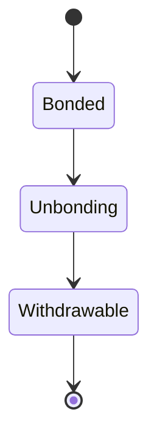
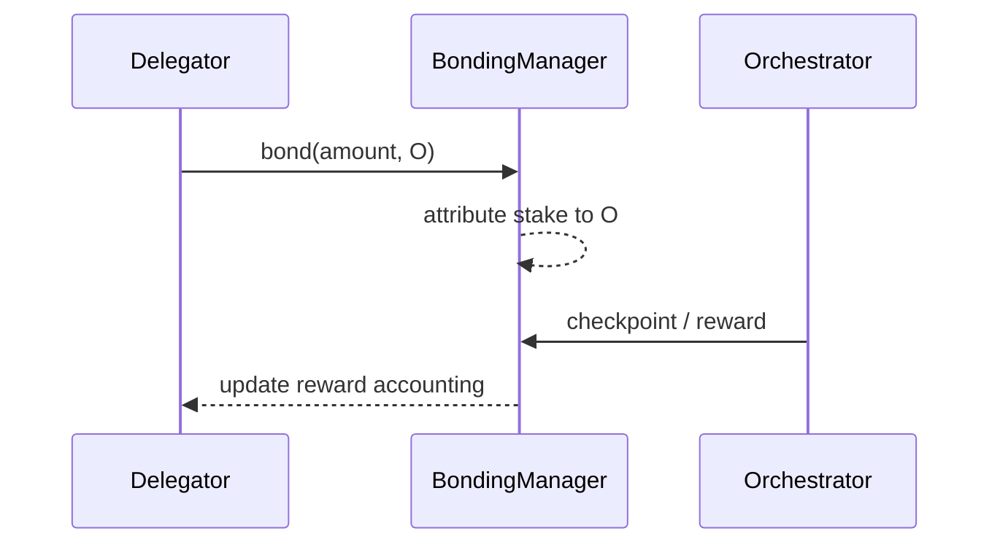

{/* codex-i18n: eyJraW5kIjoiY29kZXgtaTE4biIsInZlcnNpb24iOjEsInNvdXJjZVBhdGgiOiJ2Mi9scHQvZGVsZWdhdGlvbi9vdmVydmlldy5tZHgiLCJzb3VyY2VSb3V0ZSI6InYyL2xwdC9kZWxlZ2F0aW9uL292ZXJ2aWV3Iiwic291cmNlSGFzaCI6IjQ3NTcwM2Y0NDQyNzA1MmY4ZTJjMTFmODlhODk4MDYwZDc3MjcyMzE4ODE3MzA5N2NiYTZhNzI4Y2Y1MGJlMWMiLCJsYW5ndWFnZSI6ImVzIiwicHJvdmlkZXIiOiJvcGVucm91dGVyIiwibW9kZWwiOiJxd2VuL3F3ZW4tdHVyYm8iLCJnZW5lcmF0ZWRBdCI6IjIwMjYtMDMtMDFUMTA6NTk6NDQuODAzWiJ9 */}
import { MathInline, MathBlock } from '/snippets/components/content/math.jsx'

## Resumen Ejecutivo

La delegación es el mecanismo del protocolo mediante el cual un titular de LPT vincula su stake y lo atribuye a un orquestador, aumentando el peso económico de ese orquestador sin que el delegante opere infraestructura.

La delegación es estrictamente una **acción de capa de protocolo (en cadena)** . No ejecuta trabajos, enruta segmentos ni controla la programación de GPUs. En su lugar, modifica resultados ponderados por stake: asignación de recompensas, peso de gobernanza y (donde sea aplicable) asignación de trabajo.

---

## 1. Definición Formal

Sea:

- <MathInline latex={String.raw`D`} /> un delegador
- <MathInline latex={String.raw`O`} /> un orquestador
- <MathInline latex={String.raw`b_{D,O}`} /> sea LPT vinculado por <MathInline latex={String.raw`D`} /> hacia <MathInline latex={String.raw`O`} />
- <MathInline latex={String.raw`B_{self,O}`} /> sea el stake auto-vinculado del orquestador

Stake total atribuido al orchestrator <MathInline latex={String.raw`O`} />:

<MathBlock latex={String.raw`B_O = B_{self,O} + \sum_D b_{D,O}`} />

Stake vinculado total:

<MathBlock latex={String.raw`B_T = \sum_O B_O`} />

La delegación es una regla de atribución sobre el stake vinculado registrado en el estado del contrato del protocolo.

---

## 2. Contexto arquitectónico

### 2.1 Responsabilidades de la capa del protocolo

La delegación se implementa mediante contratos inteligentes del protocolo que:

- Seguimiento del stake vinculado por dirección
- Asignar el stake del delegador a un delegado (orchestrator)
- Asignar proporcionalmente las ganancias de inflación y tarifas
- Imponer retrasos de desvinculación

Direcciones de contratos canónicos: [Registro de contratos](https://docs.livepeer.org/references/contract-addresses)

### 2.2 Responsabilidades de la capa de red

La capa de red:

- Ejecuta el software de orquestador
- Ejecuta trabajos de transcodificación/IA
- Genera tarifas según la demanda del mercado
- Mantiene la disponibilidad y las características de rendimiento

La delegación influye en qué operadores tienen mayor peso económico, pero la ejecución de la red permanece fuera de cadena.

---

## 3. Peso Económico y Seguridad

La delegación aumenta<MathInline latex={String.raw`B_O`} />, aumentando la participación ponderada por stake del orchestrator.

Definir el peso del orchestrator:

<MathBlock latex={String.raw`W_O = \frac{B_O}{B_T}`} />

Implicación de seguridad:

- Aumentar <MathInline latex={String.raw`B_T`} /> aumenta el costo de capital necesario para capturar resultados ponderados por participación.

Por lo tanto:

<MathBlock latex={String.raw`\text{Security} \propto B_T`} />

---

## 4. Asignación de recompensas (emisión)

Por ronda <MathInline latex={String.raw`t`} />, la emisión del protocolo se mints:

<MathBlock latex={String.raw`R_t = S_t \cdot r_t`} />

Asignación de emisión bruta del Orchestrator:

<MathBlock latex={String.raw`R_O = R_t \cdot \frac{B_O}{B_T}`} />

Asignación de emisión neta del Delegator con comisión <MathInline latex={String.raw`c_O`} />:

<MathBlock latex={String.raw`R_{D,O} = R_O (1 - c_O) \cdot \frac{b_{D,O}}{B_O}`} />

Esta fórmula separa:

- Emisión del protocolo (expansión de la oferta)
- Comisión del orquestador
- Parte proporcional del delegador

---

## 5. Ingresos por tarifas (demanda)

Las tarifas son impulsadas por la demanda y pueden acumularse a los accionistas según las reglas de contabilidad del protocolo.

El retorno total del delegador se descompone en:

<MathBlock latex={String.raw`Reward_{D,O} = Issuance_{D,O} + Fees_{D,O}`} />

La emisión es determinada por el protocolo; las tarifas dependen del uso de la red.

---

## 6. Delegación como asignación de capital

La delegación crea un mercado de operadores. Los delegadores asignan su participación basándose en:

- Niveles de comisión
- Confiabilidad de los puntos de verificación
- Reputación de rendimiento
- Preferencias de descentralización

Como el staking puede migrar (sujeto a las restricciones de desvinculación), la delegación funciona como una asignación continua de capital en lugar de una decisión única.

---

## 7. Restricciones de liquidez y desvinculación

La delegación no es inmediatamente reversible.

La desvinculación introduce un retraso medido en rondas del protocolo. Este retraso:

- Reduce los ataques de rotación rápida de staking
- Estabiliza la participación en seguridad
- Introduce restricciones de liquidez para los delegadores

Modelo de estado:

---

## 8. Riesgos y modos de fallo

Los delegadores enfrentan riesgos a nivel de protocolo y operador:

1. **Riesgo de comisión:** <MathInline latex={String.raw`c_O`} /> reduce la participación neta
2. **Riesgo de punto de verificación:**no verificar un punto de verificación reduce la emisión realizada
3. **Exposición a sanciones:**donde esté habilitado, el stake puede reducirse bajo condiciones definidas
4. **Riesgo de concentración:**grande<MathInline latex={String.raw`B_O`} />aumenta la exposición sistémica
5. **Riesgo de liquidez:**la demora de desvinculación restringe la salida

Estos son riesgos económicos inherentes a un protocolo ponderado por capital.

---

## 9. Diagrama de secuencia

---

## 10. Separación entre Protocolo y Red

**Protocolo (En cadena):**
- Asignación de participación
- Fórmulas de emisión y acuñación
- Contabilidad de derechos a recompensas
- Asignación de peso de gobernanza

**Red (Fuera de cadena):**
- Ejecución de trabajos de transcodificación/IA
- Uptime y rendimiento
- Generación de tarifas

La delegación es una acción del protocolo que limita económicamente el comportamiento de la red.

---

## Referencias

- [Livepeer Repositorio del protocolo](https://github.com/livepeer/protocol)
- [Registro de Contratos](https://docs.livepeer.org/references/contract-addresses)
